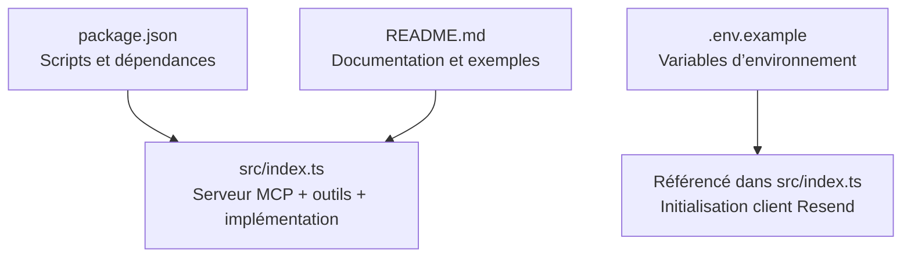
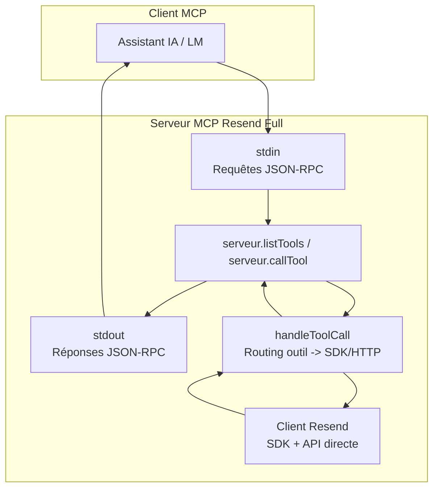
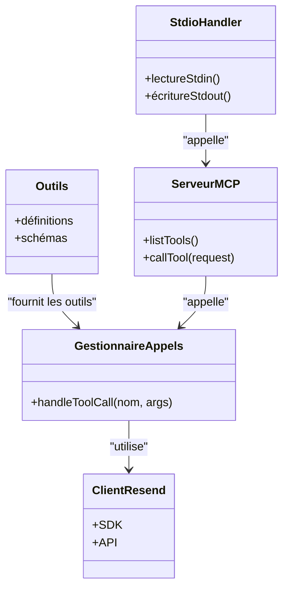
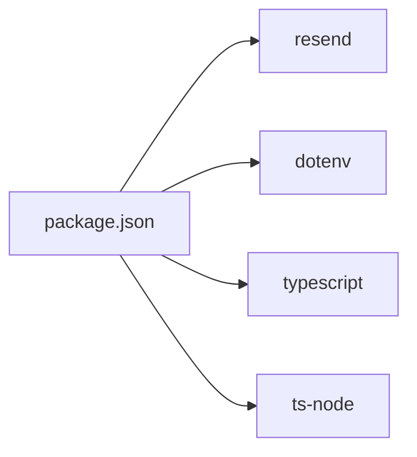
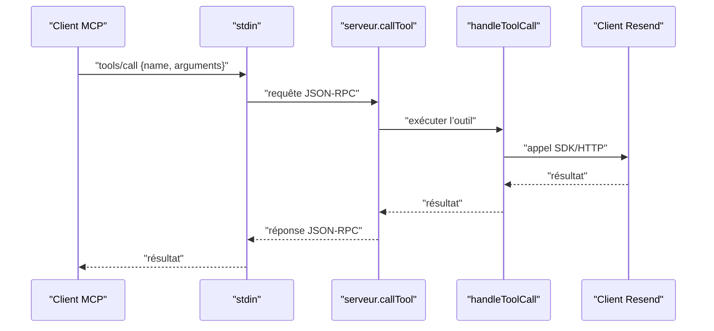
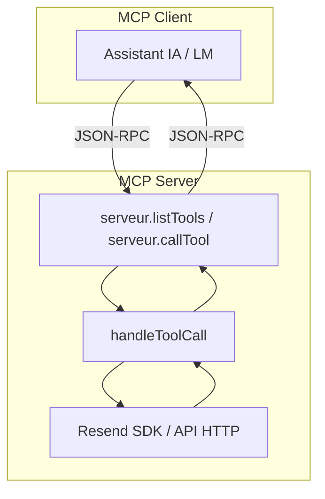

# Architecture Technique

<cite>
**Fichiers référencés dans ce document**
- [README.md](file://README.md)
- [package.json](file://package.json)
- [src/index.ts](file://src/index.ts)
- [.env.example](file://.env.example)
</cite>

## Sommaire
1. [Introduction](#introduction)
2. [Structure du projet](#structure-du-projet)
3. [Composants principaux](#composants-principaux)
4. [Aperçu de l’architecture](#aperçu-de-larchitecture)
5. [Analyse détaillée des composants](#analyse-détaillée-des-composants)
6. [Analyse des dépendances](#analyse-des-dépendances)
7. [Considérations de performance](#considérations-de-performance)
8. [Guide de dépannage](#guide-de-dépannage)
9. [Conclusion](#conclusion)
10. [Annexes](#annexes)

## Introduction
Ce document présente l’architecture technique du serveur MCP Resend Full, un serveur MCP monolithique orienté outils qui expose l’intégralité de l’API Resend via le protocole Model Context Protocol. Le serveur est conçu comme un pont entre les assistants IA/LM et l’infrastructure email Resend, en fournissant plus de 70 outils couvrant tous les modules de l’API Resend (emails, domaines, audiences, contacts, modèles, diffusions, webhooks, segments, thèmes, propriétés de contact, etc.).

Il implémente le protocole MCP en traitant les requêtes JSON-RPC via stdin/stdout, gère les appels d’outils, et intègre le SDK Resend pour exécuter les opérations. Le document explique les patrons de conception utilisés, les relations entre les composants, le flux de données, ainsi que les décisions techniques liées à la scalabilité et à la maintenance.

## Structure du projet
Le projet suit une structure minimale et orientée monolithe :
- Un seul fichier principal d’implémentation TypeScript qui contient toutes les définitions d’outils, les gestionnaires d’appels, le serveur MCP, et le traitement stdin/stdout.
- Des scripts de build, démarrage et développement définis dans le fichier de configuration du projet.
- Un exemple de fichier d’environnement pour stocker la clé API Resend.

**Diagramme sources**
- [package.json](file://package.json#L1-L43)
- [src/index.ts](file://src/index.ts#L1-L1623)
- [.env.example](file://.env.example#L1-L6)

**Section sources**
- [package.json](file://package.json#L1-L43)
- [src/index.ts](file://src/index.ts#L1-L1623)
- [.env.example](file://.env.example#L1-L6)

## Composants principaux
- Définitions des outils MCP : tableau de 70+ outils structurés par module, chacun avec un nom, une description et un schéma d’entrée JSON.
- Gestionnaires d’appels d’outils : fonction centralisée qui route chaque appel d’outil vers l’implémentation Resend ou via des appels HTTP directs pour les endpoints non couverts par le SDK.
- Serveur MCP : objet avec deux méthodes principales : listTools et callTool, conformément au protocole MCP.
- Traitement stdin/stdout : lecture des requêtes JSON-RPC, exécution des méthodes tools/list ou tools/call, et écriture des réponses sur stdout.

**Section sources**
- [src/index.ts](file://src/index.ts#L42-L1002)
- [src/index.ts](file://src/index.ts#L1008-L1565)
- [src/index.ts](file://src/index.ts#L1528-L1623)

## Aperçu de l’architecture
Le serveur MCP Resend Full est un composant monolithique qui expose des outils via le protocole MCP. Le flux de données se fait via stdin/stdout, et chaque appel d’outil est traité de manière asynchrone. Le client Resend est initialisé à partir de la clé API stockée dans les variables d’environnement.

**Diagramme sources**
- [src/index.ts](file://src/index.ts#L1528-L1623)
- [src/index.ts](file://src/index.ts#L1008-L1565)

## Analyse détaillée des composants

### Définitions des outils MCP
- Structure : tableau de définitions d’outils, chacune inclut le nom, la description, et un schéma d’entrée JSON.
- Couverture : 12 modules de l’API Resend avec plus de 70 outils, y compris les opérations de base (envoi, liste, récupération, mise à jour, annulation, pièces jointes) et des fonctionnalités avancées (diffusions, webhooks, audiences, segments, thèmes, propriétés de contact).
- Validation : utilisation de schémas JSON pour valider les arguments des outils.

**Section sources**
- [src/index.ts](file://src/index.ts#L42-L1002)

### Gestionnaires d’appels d’outils
- Implémentation centralisée : fonction handleToolCall qui effectue le routing selon le nom de l’outil.
- Intégration Resend SDK : pour les opérations prises en charge par le SDK, l’appel est effectué directement via le client Resend.
- Appels HTTP directs : pour les endpoints non couverts par le SDK, des appels HTTP sont effectués manuellement à l’API Resend.
- Gestion des erreurs : capture des exceptions et renvoi d’un message d’erreur structuré.

**Section sources**
- [src/index.ts](file://src/index.ts#L1008-L1522)

### Serveur MCP
- Interface listTools : retourne la liste complète des outils définis.
- Interface callTool : exécute un outil spécifique, transforme le résultat en réponse MCP (format texte contenant le JSON).
- Validation : vérifie la présence du nom de l’outil avant exécution.

**Section sources**
- [src/index.ts](file://src/index.ts#L1528-L1565)

### Traitement JSON-RPC via stdin/stdout
- Lecture : écoute des événements sur stdin, parse JSON, exécution de la méthode correspondante.
- Méthodes reconnues : tools/list et tools/call.
- Réponse : écriture de la réponse JSON sur stdout, suivie d’un saut de ligne.
- Gestion des erreurs : en cas d’échec de parsing ou d’exécution, renvoie une erreur structurée.

**Section sources**
- [src/index.ts](file://src/index.ts#L1599-L1623)

### Patrons de conception
- Monolithe orienté outils : tout le système est contenu dans un seul fichier TypeScript, ce qui simplifie le déploiement mais peut limiter la modularité.
- Routing centralisé : le switch-case dans handleToolCall agit comme un routeur d’outils, facilitant l’ajout de nouveaux outils.
- Adaptateur (pattern de conception) : le serveur sert d’adaptateur entre le protocole MCP et l’API Resend, transformant les appels MCP en appels SDK/HTTP.
- Stratégie : le choix entre l’utilisation du SDK Resend ou des appels HTTP directs constitue une stratégie de traitement conditionnelle basée sur la disponibilité de l’opération dans le SDK.

Remarque : bien que ces patrons soient présents dans le code, aucun patron de conception plus complexe (Factory, Strategy, Adapter) n’est implémenté sous forme de classes/interfaces distinctes. L’approche est plutôt fonctionnelle et centrée sur le routage.

**Section sources**
- [src/index.ts](file://src/index.ts#L1008-L1522)
- [src/index.ts](file://src/index.ts#L1528-L1623)

### Relations entre les composants
- src/index.ts : contient toutes les définitions, logique de routage, serveur MCP, et traitement stdin/stdout.
- package.json : déclare les dépendances (resend, dotenv) et les scripts de build/démarrage.
- .env.example : modèle de configuration pour la clé API Resend.

**Diagramme sources**
- [src/index.ts](file://src/index.ts#L42-L1002)
- [src/index.ts](file://src/index.ts#L1008-L1565)
- [src/index.ts](file://src/index.ts#L1528-L1623)

## Analyse des dépendances
- Dépendances principales :
  - resend : SDK Resend pour appeler les endpoints pris en charge.
  - dotenv : chargement des variables d’environnement depuis un fichier .env.
- Scripts de développement et exécution :
  - build : compilation TypeScript.
  - start : exécution du serveur compilé.
  - dev : exécution en mode développement via ts-node.

**Diagramme sources**
- [package.json](file://package.json#L26-L34)

**Section sources**
- [package.json](file://package.json#L1-L43)

## Considérations de performance
- Scalabilité horizontale : le serveur est monolithique et ne gère pas nativement plusieurs instances. Pour une montée en charge, il serait nécessaire de déployer plusieurs instances et de les orchestrer via un proxy ou un load balancer.
- Scalabilité verticale : le serveur peut être exécuté sur des machines plus puissantes, mais cela ne change pas la nature monolithique de l’implémentation.
- Gestion des appels d’outils : le routage centralisé est simple mais pourrait devenir un goulot d’étranglement si le nombre d’outils augmente significativement. Une séparation en modules distincts pourrait améliorer la maintenabilité.
- Gestion des erreurs : le serveur renvoie des messages d’erreur structurés, ce qui facilite le diagnostic, mais ne réduit pas le temps de traitement des appels.
- Utilisation du SDK Resend : l’implémentation privilégie le SDK pour les opérations prises en charge, ce qui optimise les appels et la gestion des erreurs. Pour les opérations non couvertes, des appels HTTP directs sont effectués, ce qui peut introduire des latences supplémentaires.

[Pas de sources nécessaires car cette section fournit des conseils généraux]

## Guide de dépannage
- Erreur : clé API non définie
  - Cause : absence de la variable d’environnement RESEND_API_KEY.
  - Solution : créer un fichier .env avec la clé API Resend.
- Erreur : outil inconnu
  - Cause : nom d’outil incorrect ou non répertorié.
  - Solution : utiliser tools/list pour obtenir la liste des outils disponibles.
- Erreur : échec de l’exécution d’un outil
  - Causes possibles : paramètres invalides, dépassement des limites de frappe, problème réseau.
  - Solution : vérifier les messages d’erreur détaillés et les paramètres fournis.

**Section sources**
- [src/index.ts](file://src/index.ts#L1571-L1577)
- [README.md](file://README.md#L520-L542)

## Conclusion
Le serveur MCP Resend Full est une implémentation monolithique, orientée outils, qui expose l’intégralité de l’API Resend via le protocole MCP. Son architecture repose sur un routage centralisé des appels d’outils, soit via le SDK Resend, soit via des appels HTTP directs. Le traitement JSON-RPC se fait via stdin/stdout, ce qui permet une intégration simple avec les clients MCP. Bien que l’approche soit fonctionnelle et facile à déployer, elle pourrait bénéficier d’une séparation en modules distincts pour améliorer la maintenabilité à long terme. La gestion des erreurs est structurée, et le serveur respecte les limites de frappe de l’API Resend.

[Pas de sources nécessaires car cette section résume sans analyser des fichiers spécifiques]

## Annexes

### Flux de traitement d’un appel d’outil

**Diagramme sources**
- [src/index.ts](file://src/index.ts#L1528-L1623)
- [src/index.ts](file://src/index.ts#L1008-L1522)

### Schéma de l’architecture MCP

**Diagramme sources**
- [src/index.ts](file://src/index.ts#L1528-L1623)
- [src/index.ts](file://src/index.ts#L1008-L1522)