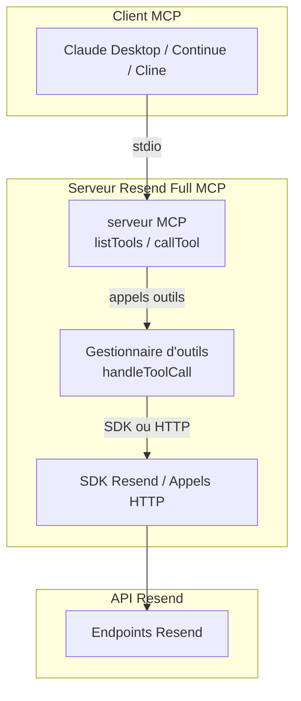

# Démarrage Rapide

<cite>
**Fichiers référencés dans ce document**
- [README.md](file://README.md)
- [package.json](file://package.json)
- [src/index.ts](file://src/index.ts)
- [.env.example](file://.env.example)
- [tsconfig.json](file://tsconfig.json)
</cite>

## Sommaire
1. [Introduction](#introduction)
2. [Prérequis système](#prérequis-système)
3. [Installation](#installation)
4. [Configuration de base](#configuration-de-base)
5. [Connexion d’un client MCP compatible](#connexion-dun-client-mcp-compatible)
6. [Exemples d’interactions](#exemples-dinteractions)
7. [Sécurité](#sécurité)
8. [Architecture globale](#architecture-globale)
9. [Guide de dépannage](#guide-de-dépannage)
10. [Conclusion](#conclusion)

## Introduction
Resend Full MCP est un serveur Model Context Protocol (MCP) qui expose l’intégralité de l’API Resend sous forme d’outils invocables. Il permet aux assistants IA et applications LLM de gérer tout, de l’envoi d’emails transactionnels à la configuration des domaines, des webhooks, des audiences, des contacts, des modèles, des diffusions, des segments, des sujets et des propriétés de contact.

Il couvre 12 modules avec plus de 70 outils, tous accessibles via le protocole MCP.

## Prérequis système
- Node.js 18+ (recommandé : v20 ou supérieur)
- TypeScript 5+
- Une clé API Resend (obtenable depuis le tableau de bord Resend)
- Un client compatible MCP (par exemple Claude Desktop, Continue, Cline, etc.)

**Section sources**
- [README.md](file://README.md#L127-L133)

## Installation
Plusieurs façons de démarrer :

### Avec npm/npx
- Installation globale : npm install -g @qrcommunication/resend-full-mcp
- Exécution directement : npx @qrcommunication/resend-full-mcp

### Avec Python
- Installation depuis PyPI : pip install resend-full-mcp
- Lancement : resend-mcp

### À partir de la source
- Cloner le dépôt : git clone https://github.com/QrCommunication/resend-full-mcp.git
- Se rendre dans le dossier et installer les dépendances : npm install
- Compiler le projet : npm run build
- Démarrer le serveur : npm start
- Mode développement : npm run dev

**Section sources**
- [README.md](file://README.md#L134-L179)
- [package.json](file://package.json#L10-L14)

## Configuration de base
### Variables d’environnement
- Créez un fichier .env à partir de l’exemple fourni : cp .env.example .env
- Ajoutez votre clé API Resend : RESEND_API_KEY=votre_cle_resend
- Optionnel : RESEND_API_BASE_URL=https://api.resend.com, DEBUG=true, RATE_LIMIT=2

> Ne jamais commiter le fichier .env. Il est déjà inclus dans .gitignore.

**Section sources**
- [README.md](file://README.md#L180-L210)
- [.env.example](file://.env.example#L1-L6)

### Configuration TypeScript
- Le projet utilise TypeScript 5+ avec ciblage ES2022, module NodeNext, et génération de fichiers de définitions.

**Section sources**
- [tsconfig.json](file://tsconfig.json#L1-L21)

## Connexion d’un client MCP compatible
Voici comment configurer quelques clients connus pour qu’ils utilisent le serveur Resend Full MCP.

### Claude Desktop
Ajoutez au fichier de configuration de Claude Desktop :
- Nommez le serveur "resend"
- Commande : npx
- Arguments : [-y, "@qrcommunication/resend-full-mcp"]
- Env : inclure RESEND_API_KEY

### Continue.dev
Dans votre config.json, ajoutez un serveur MCP "resend" avec :
- command : npx
- args : [-y, "@qrcommunication/resend-full-mcp"]
- env : inclure RESEND_API_KEY

### Cline
Dans les paramètres MCP, ajoutez une entrée "resend" avec :
- command : npx
- args : [-y, "@qrcommunication/resend-full-mcp"]
- env : inclure RESEND_API_KEY

**Section sources**
- [README.md](file://README.md#L211-L265)

## Exemples d’interactions
Voici quelques cas d’usage concrets illustrant l’utilisation des outils MCP.

### Envoi d’un email
- Outil : send_email
- Exemple d’appel direct : voir [README.md](file://README.md#L279-L294)

### Envoi groupé d’emails
- Outil : send_batch_emails
- Exemple d’appel direct : voir [README.md](file://README.md#L305-L329)

### Gestion des domaines
- Création de domaine : create_domain
- Exemple d’appel direct : voir [README.md](file://README.md#L340-L352)

### Configuration des webhooks
- Création de webhook : create_webhook
- Événements supportés : email.sent, email.delivered, email.delivery_delayed, email.complained, email.bounced, email.opened, email.clicked, email.received
- Exemple d’appel direct : voir [README.md](file://README.md#L363-L375)

### Travailler avec les audiences et contacts
- Création d’une audience : create_audience
- Ajout d’un contact : create_contact
- Exemples d’appels directs : voir [README.md](file://README.md#L377-L406)

### Création et envoi de diffusions
- Création d’une diffusion : create_broadcast
- Exemple d’appel direct : voir [README.md](file://README.md#L417-L433)

### Liste de tous les outils disponibles
- Méthode : tools/list
- Réponse : retourne la liste complète des outils (70+), leurs descriptions et schémas d’entrée

**Section sources**
- [README.md](file://README.md#L266-L444)

## Sécurité
- Stockez votre clé API Resend dans des variables d’environnement
- Ne jamais commiter les clés API
- Utilisez des clés avec permissions restreintes (ex. sending_access)
- Renouvelez régulièrement vos clés
- Limitez les clés à des domaines spécifiques en production
- Pour les webhooks : validez toujours les signatures, utilisez HTTPS, implémentez la validation par secret, limitez les appels, et conservez des logs pour audit
- Respectez la confidentialité des données : ce serveur ne stocke aucun contenu d’email ni données de destinataires, tout est traité en temps réel et envoyé directement à Resend

**Section sources**
- [README.md](file://README.md#L462-L486)

## Architecture globale
Le serveur MCP est composé de :
- Un ensemble d’outils définis dans le code (plus de 70 outils)
- Un gestionnaire d’appels d’outils qui appelle soit le SDK Resend, soit des appels HTTP directs vers l’API Resend
- Une interface MCP basée sur stdin/stdout pour communiquer avec le client

**Diagram sources**
- [src/index.ts](file://src/index.ts#L1528-L1565)
- [src/index.ts](file://src/index.ts#L1008-L1522)
- [src/index.ts](file://src/index.ts#L1599-L1623)

**Section sources**
- [src/index.ts](file://src/index.ts#L1008-L1522)
- [src/index.ts](file://src/index.ts#L1528-L1565)
- [src/index.ts](file://src/index.ts#L1599-L1623)

## Guide de dépannage
- Erreur : "RESEND_API_KEY environment variable is not set"
  - Solution : créez un fichier .env contenant votre clé API Resend
- Erreur : "Tool execution failed"
  - Causes possibles : clé API invalide, paramètres manquants, limite de fréquence atteinte, problèmes réseau
  - Solution : vérifiez le message d’erreur et les paramètres fournis
- Erreur : "Unknown tool"
  - Solution : utilisez la méthode tools/list pour obtenir la liste complète des outils disponibles

**Section sources**
- [README.md](file://README.md#L520-L542)
- [src/index.ts](file://src/index.ts#L1571-L1577)

## Conclusion
Vous êtes maintenant prêt à utiliser Resend Full MCP pour intégrer pleinement Resend dans vos assistants IA et applications LLM. Commencez par installer le serveur, configurez votre clé API, connectez un client MCP compatible, puis explorez les outils pour envoyer des emails, gérer des domaines, configurer des webhooks, et orchestrer des campagnes via des audiences, des contacts, des modèles et des diffusions.