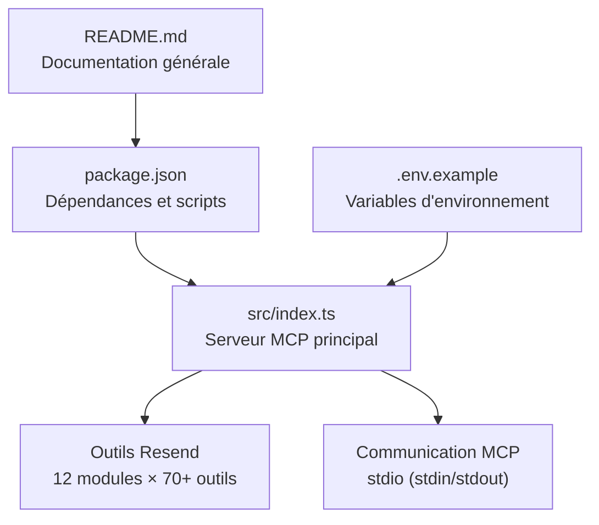

# Déploiement et Maintenance

<cite>
**Fichiers référencés dans ce document**
- [README.md](file://README.md)
- [package.json](file://package.json)
- [src/index.ts](file://src/index.ts)
- [.env.example](file://.env.example)
</cite>

## Sommaire
1. [Introduction](#introduction)
2. [Structure du projet](#structure-du-projet)
3. [Options de déploiement](#options-de-déploiement)
4. [Configuration de production](#configuration-de-production)
5. [Bonnes pratiques de maintenance](#bonnes-pratiques-de-maintenance)
6. [Gestion des versions et mises à jour](#gestion-des-versions-et-mises-à-jour)
7. [Surveillance, journalisation et résolution des problèmes](#surveillance-journalisation-et-résolution-des-problèmes)
8. [Optimisation des performances et gestion des ressources](#optimisation-des-performances-et-gestion-des-ressources)
9. [Conclusion](#conclusion)

## Introduction
Ce document fournit une documentation complète pour le déploiement et la maintenance du serveur MCP Resend Full. Il couvre les options de déploiement (serveur, cloud, conteneurs), la configuration de production, les bonnes pratiques de maintenance, les mises à jour, la gestion des versions, le suivi des changements, les stratégies de mise à jour, ainsi que la surveillance, la journalisation et la résolution des problèmes courants. Des conseils sont également donnés pour optimiser les performances et gérer efficacement les ressources.

## Structure du projet
Le projet est un serveur MCP Node.js qui expose l’ensemble de l’API Resend sous forme d’outils invocables. La structure de base est la suivante :
- src/index.ts : Implémentation principale du serveur MCP, définition des outils, gestion des appels et communication via stdin/stdout.
- package.json : Dépendances, scripts de build et démarrage, ainsi que les métadonnées du paquet.
- .env.example : Exemple de configuration des variables d’environnement.
- README.md : Documentation complète incluant les fonctionnalités, installation, configuration, utilisation, sécurité, taux de limitation, gestion des erreurs et dépannage.

**Diagramme sources**
- [README.md](file://README.md#L446-L460)
- [package.json](file://package.json#L1-L49)
- [src/index.ts](file://src/index.ts#L1-L120)

**Section sources**
- [README.md](file://README.md#L446-L460)
- [package.json](file://package.json#L1-L49)

## Options de déploiement
Le serveur MCP peut être déployé de plusieurs façons selon vos besoins. Voici les options principales :

- Serveur local (npx/npm)
  - Utilisez npx pour exécuter le serveur sans installation permanente.
  - Pour un lancement permanent, installez le paquet globalement ou exécutez-le avec un gestionnaire de processus (PM2, systemd, etc.).

- Cloud (hébergement PaaS)
  - Le serveur MCP s’exécute comme un processus Node.js standard. Vous pouvez le déployer sur des plateformes prenant en charge Node.js (ex. Vercel, Railway, Render, Heroku, etc.) en configurant le point d’entrée et les variables d’environnement.

- Conteneurs (Docker)
  - Créez un conteneur Docker avec Node.js, copiez le code, installez les dépendances, définissez le point d’entrée et les variables d’environnement.
  - Utilisez un fichier .dockerignore pour exclure les fichiers inutiles (ex. .git, node_modules, etc.).

- Applications de bureau ou outils locaux
  - Intégrez le serveur MCP dans des clients compatibles (ex. Claude Desktop, Continue, Cline) en configurant leur configuration respective pour appeler le serveur.

Recommandations de déploiement
- Sécurité : N’utilisez pas de clé API dans le code source. Stockez-la dans des variables d’environnement.
- Isolation : Exécutez le serveur dans un environnement isolé (container, VM, instance cloud).
- Mise à jour : Automatisez les mises à jour via des pipelines CI/CD.
- Surveillance : Activez la journalisation et surveillez les erreurs.

**Section sources**
- [README.md](file://README.md#L134-L180)
- [README.md](file://README.md#L211-L265)

## Configuration de production
La configuration de production repose sur les variables d’environnement et la manière dont le serveur est lancé.

Variables d’environnement
- RESEND_API_KEY : Clé d’API Resend requise.
- RESEND_API_BASE_URL : URL de base de l’API Resend (optionnel, valeur par défaut incluse dans le code).
- DEBUG : Activer le mode debug (optionnel).
- RATE_LIMIT : Limite de requêtes par seconde (optionnel, valeur par défaut incluse dans le code).

Configuration du serveur
- Point d’entrée : Le serveur écoute stdin/stdout pour communiquer via le protocole MCP.
- Authentification : Le serveur utilise la clé API Resend pour toutes les requêtes sortantes.
- Gestion des erreurs : Les erreurs sont retournées au format JSON avec des messages détaillés.

Sécurité
- Ne jamais commiter le fichier .env.
- Utilisez des clés API restreintes (ex. accès envoi uniquement).
- Limitez l’accès réseau au serveur MCP.
- Validez les signatures des webhooks si vous gérez des événements Resend.

**Section sources**
- [.env.example](file://.env.example#L1-L6)
- [README.md](file://README.md#L180-L210)
- [README.md](file://README.md#L462-L486)
- [src/index.ts](file://src/index.ts#L1010-L1016)

## Bonnes pratiques de maintenance
- Sauvegardes de configuration
  - Sauvegardez votre .env et toute configuration personnalisée.
- Tests réguliers
  - Vérifiez le bon fonctionnement des outils critiques (envoi d’emails, webhooks, domaines).
- Audit des permissions
  - Vérifiez régulièrement les clés API et leurs permissions.
- Mises à jour de dépendances
  - Mettez à jour les dépendances de manière contrôlée et testez avant déploiement.
- Nettoyage des logs
  - Mettez en place une rotation de logs pour éviter de saturer le disque.

**Section sources**
- [README.md](file://README.md#L578-L597)
- [README.md](file://README.md#L462-L486)

## Gestion des versions et mises à jour
Version actuelle
- Version du paquet : 1.0.0 (selon package.json).
- Historique des changements : Disponible dans le fichier README.md.

Suivi des changements
- Consultez le fichier README.md pour le journal des modifications (changelog).
- Utilisez les balises Git pour marquer les versions.

Stratégies de mise à jour
- Développement : Utilisez npm run dev pour un redémarrage automatique en développement.
- Production : Effectuez des mises à jour en utilisant npm install -g @qrcommunication/resend-full-mcp ou en déployant depuis la source.
- Tests : Avant de déployer en production, testez les outils critiques.

**Section sources**
- [package.json](file://package.json#L1-L49)
- [README.md](file://README.md#L621-L637)

## Surveillance, journalisation et résolution des problèmes
Journalisation
- Le serveur affiche des messages de démarrage et d’erreurs sur la sortie standard.
- Activez le mode debug via la variable d’environnement DEBUG si nécessaire.

Surveillance
- Surveillez les codes d’erreur de l’API Resend (ex. 429, 500, 503).
- Surveillez les logs d’erreurs du serveur MCP.

Résolution des problèmes courants
- Erreur : La variable d’environnement RESEND_API_KEY n’est pas définie
  - Solution : Créez un fichier .env avec la clé API Resend.
- Erreur : L’appel d’un outil échoue
  - Causes possibles : clé API invalide, paramètres manquants, limite de taux atteinte, problèmes réseau.
  - Solution : Vérifiez le message d’erreur, validez les paramètres et la clé API, puis réessayez.
- Erreur : Outil inconnu
  - Solution : Utilisez la méthode tools/list pour obtenir la liste des outils disponibles.

**Section sources**
- [README.md](file://README.md#L520-L542)
- [README.md](file://README.md#L497-L519)
- [src/index.ts](file://src/index.ts#L1571-L1577)

## Optimisation des performances et gestion des ressources
Taux de limitation
- Le serveur respecte les limites de l’API Resend (par défaut 2 requêtes/seconde, avec des pics autorisés).
- Le code inclut déjà une logique de gestion des taux de requête (en attendant l’implémentation de la mise en cache).

Recommandations
- Gestion des appels en lot : Utilisez send_batch_emails pour envoyer plusieurs emails en une seule requête.
- Pagination : Utilisez les paramètres limit/after/before pour limiter la quantité de données récupérées.
- Réduction de la charge : Limitez le nombre d’appels simultanés et activez des mécanismes de backoff en cas de 429.
- Ressources système : Assurez-vous de disposer de suffisamment de RAM et de CPU pour traiter le volume attendu de requêtes MCP.

**Section sources**
- [README.md](file://README.md#L487-L496)
- [src/index.ts](file://src/index.ts#L1018-L1024)

## Conclusion
Le serveur MCP Resend Full offre une couverture complète de l’API Resend via le protocole MCP. En adoptant les bonnes pratiques de déploiement, de configuration de production, de maintenance, de surveillance et d’optimisation, vous pouvez garantir un déploiement fiable, sécurisé et performant. Suivez les directives de ce document pour assurer la continuité opérationnelle et faciliter les mises à jour futures.