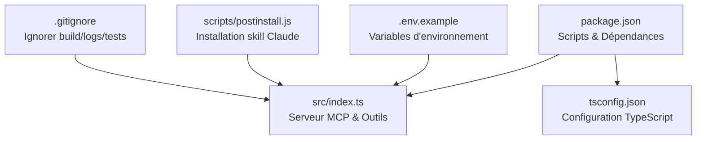
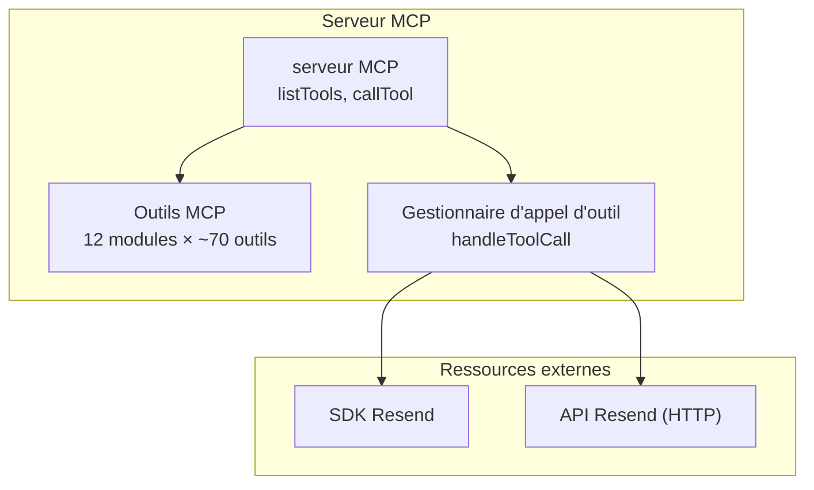
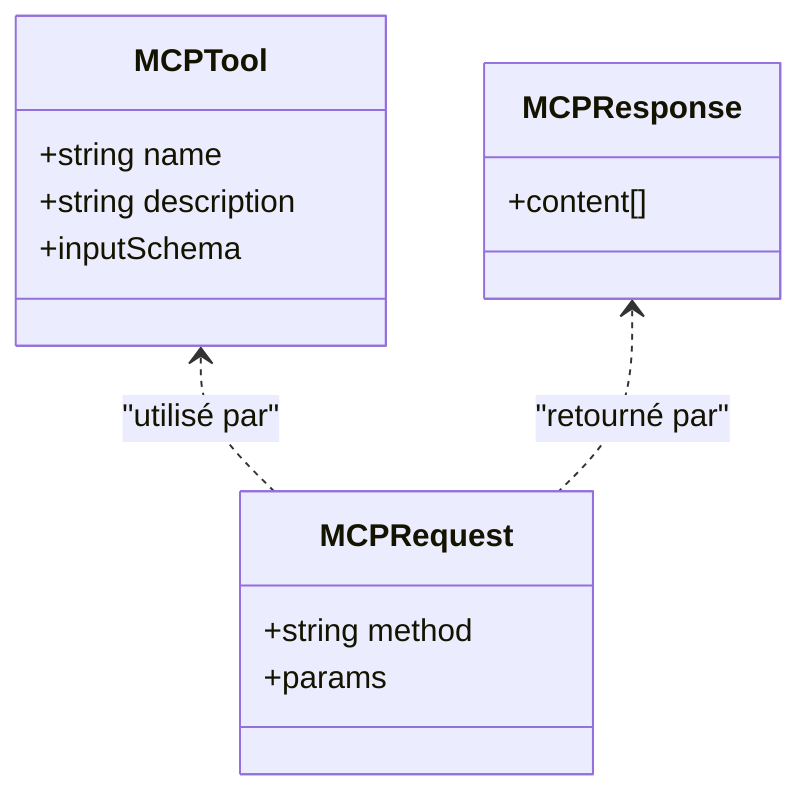
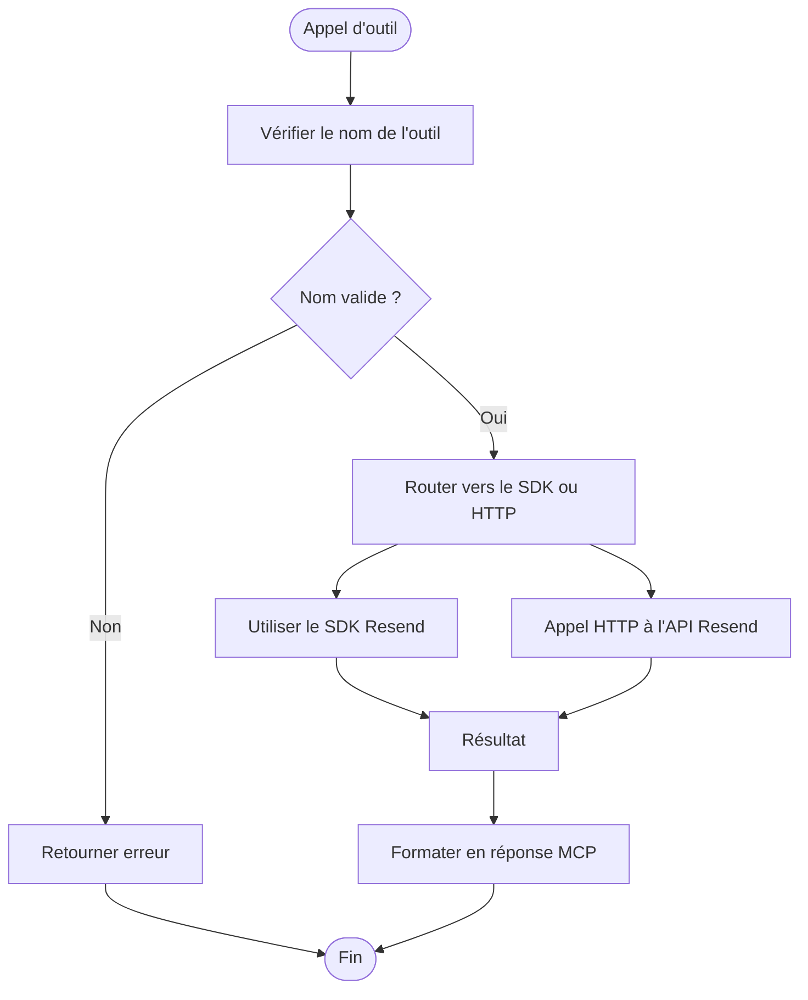
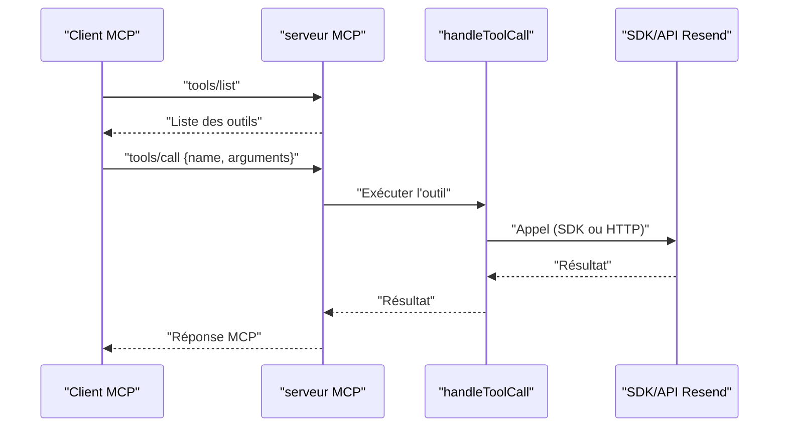
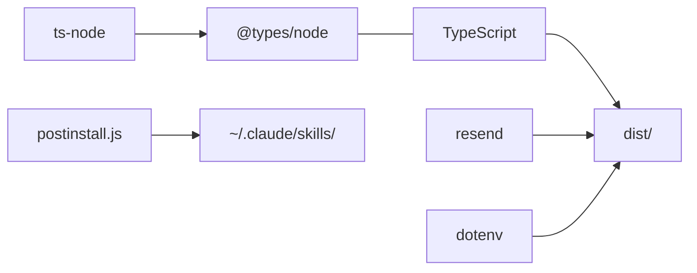

# Développement et Tests

<cite>
**Fichiers référencés dans ce document**
- [package.json](file://package.json)
- [tsconfig.json](file://tsconfig.json)
- [README.md](file://README.md)
- [.env.example](file://.env.example)
- [src/index.ts](file://src/index.ts)
- [scripts/postinstall.js](file://scripts/postinstall.js)
- [.gitignore](file://.gitignore)
</cite>

## Sommaire
1. [Introduction](#introduction)
2. [Structure du projet](#structure-du-projet)
3. [Configuration de développement](#configuration-de-développement)
4. [Scripts de build et exécution](#scripts-de-build-et-exécution)
5. [Outils de qualité](#outils-de-qualité)
6. [Tests unitaires](#tests-unitaires)
7. [Processus de développement local](#processus-de-développement-local)
8. [Outils de débogage](#outils-de-débogage)
9. [Contribution au projet](#contribution-au-projet)
10. [Workflow de développement](#workflow-de-développement)
11. [Maintenance et améliorations continues](#maintenance-et-améliorations-continues)
12. [Architecture globale](#architecture-globale)
13. [Analyse détaillée des composants](#analyse-détaillée-des-composants)
14. [Analyse des dépendances](#analyse-des-dépendances)
15. [Considérations sur les performances](#considérations-sur-les-performances)
16. [Guide de dépannage](#guide-de-dépannage)
17. [Conclusion](#conclusion)

## Introduction
Ce document fournit un guide complet pour le développement et les tests du projet Resend Full MCP Server. Il couvre la configuration de développement, les scripts de build, les outils de qualité, les bonnes pratiques, le processus de développement local, les tests unitaires (ou leur absence), les outils de débogage, les directives de contribution, le workflow de développement, ainsi que les outils de maintenance et les recommandations d’amélioration continue.

## Structure du projet
Le projet est une application Node.js écrite en TypeScript qui expose un serveur Model Context Protocol (MCP) pour interagir avec l’API Resend. La structure principale est la suivante :
- src/index.ts : point d’entrée principal contenant l’implémentation MCP, les définitions des outils, les gestionnaires d’appel d’outil, et le serveur MCP.
- package.json : configuration des scripts, dépendances, métadonnées du paquet.
- tsconfig.json : configuration de compilation TypeScript.
- .env.example : exemple de fichier d’environnement.
- scripts/postinstall.js : script post-installation pour installer automatiquement un skill pour Claude.
- .gitignore : règles d’ignorance pour les fichiers de build, logs, couverture de tests, etc.

**Diagramme sources**
- [package.json](file://package.json#L1-L49)
- [tsconfig.json](file://tsconfig.json#L1-L21)
- [.env.example](file://.env.example#L1-L6)
- [src/index.ts](file://src/index.ts#L1-L50)
- [scripts/postinstall.js](file://scripts/postinstall.js#L1-L108)
- [.gitignore](file://.gitignore#L1-L47)

**Section sources**
- [package.json](file://package.json#L1-L49)
- [tsconfig.json](file://tsconfig.json#L1-L21)
- [.env.example](file://.env.example#L1-L6)
- [src/index.ts](file://src/index.ts#L1-L50)
- [scripts/postinstall.js](file://scripts/postinstall.js#L1-L108)
- [.gitignore](file://.gitignore#L1-L47)

## Configuration de développement
- Version de Node.js requise : >= 18.0.0 (la configuration indique Node >= 18).
- TypeScript : version 5+.
- Dépendances principales :
  - resend : client de l’API Resend.
  - dotenv : chargement des variables d’environnement depuis un fichier .env.
- Scripts de base :
  - build : compilation TypeScript vers dist.
  - start : exécution du serveur compilé.
  - dev : exécution en mode développement avec ts-node.
  - postinstall : installation automatique d’un skill pour Claude.

**Section sources**
- [package.json](file://package.json#L1-L49)
- [README.md](file://README.md#L127-L133)

## Scripts de build et exécution
- Compilation : tsc compile le code source TypeScript en JavaScript dans le répertoire dist.
- Exécution en production : node dist/index.js.
- Exécution en développement : ts-node src/index.ts permet de démarrer le serveur sans compilation préalable.
- Post-installation : le script postinstall.js tente d’installer automatiquement le skill “resend-expert” dans ~/.claude/skills/ s’il existe.

**Section sources**
- [package.json](file://package.json#L10-L14)
- [scripts/postinstall.js](file://scripts/postinstall.js#L1-L108)

## Outils de qualité
Actuellement, aucun outil de linting, de formatage ou de vérification de types n’est configuré dans les scripts de package.json. Le README mentionne des commandes comme lint, format, typecheck, mais elles ne sont pas définies dans le fichier package.json. Pour garantir la qualité du code, il est recommandé d’ajouter :
- Linting : ESLint (par exemple) avec des règles adaptées à TypeScript.
- Formatage : Prettier pour uniformiser le style de code.
- Vérification de types : TypeScript checker (tsc --noEmit) pour valider le typage.
- Tests unitaires : Jest/Mocha si vous souhaitez inclure des tests.

**Section sources**
- [README.md](file://README.md#L565-L576)
- [package.json](file://package.json#L10-L14)

## Tests unitaires
- Aucun script de test n’est défini dans package.json.
- Aucun fichier de test n’est présent dans le dépôt.
- Le README mentionne npm test, mais il n’est pas configuré.
- Pour ajouter des tests unitaires, vous pouvez utiliser Jest ou Mocha, et organiser vos tests dans un dossier spec/test selon votre choix.

**Section sources**
- [package.json](file://package.json#L10-L14)
- [README.md](file://README.md#L554-L556)

## Processus de développement local
- Cloner le dépôt, installer les dépendances, créer un fichier .env basé sur .env.example, puis lancer le serveur en mode développement.
- Le serveur affiche un message de démarrage et liste les modules disponibles (Emails, Domaines, Audiences, Contacts, Templates, Broadcasts, Webhooks, Segments, Topics, Propriétés de contact).
- Le serveur attend les requêtes MCP via stdin et répond via stdout.

**Section sources**
- [README.md](file://README.md#L156-L178)
- [src/index.ts](file://src/index.ts#L1571-L1599)

## Outils de débogage
- Mode développement : npm run dev exécute le serveur avec ts-node, ce qui permet de bénéficier des lignes de code TypeScript dans les traces d’erreur.
- Logging : le serveur affiche des messages de démarrage et des erreurs détaillées lors de l’exécution d’un outil.
- Variables d’environnement : utilisez DEBUG=true pour activer le mode debug si implémenté, et configurez RATE_LIMIT pour ajuster le taux de requêtes.

**Section sources**
- [README.md](file://README.md#L173-L178)
- [src/index.ts](file://src/index.ts#L1571-L1599)
- [.env.example](file://.env.example#L1-L6)

## Contribution au projet
- Fork du dépôt, création d’une branche de fonctionnalité, suivi du style de code existant, écriture de tests pour nouvelles fonctionnalités, mise à jour de la documentation, soumission d’une pull request.
- Étapes de mise en place : cloner, installer, créer .env, exécuter les tests (si configurés), faire ses modifications, s’assurer que tout passe, puis soumettre.

**Section sources**
- [README.md](file://README.md#L578-L596)

## Workflow de développement
- Installer les dépendances.
- Créer le fichier .env avec la clé API Resend.
- Compiler le projet (npm run build).
- Lancer le serveur en production (npm start) ou en développement (npm run dev).
- Pour les changements rapides, utiliser le mode dev.
- Pour les déploiements, utiliser la version compilée.

**Section sources**
- [README.md](file://README.md#L134-L178)
- [package.json](file://package.json#L10-L14)

## Maintenance et améliorations continues
- Ajouter des outils de qualité (lint, format, typecheck) pour maintenir la cohérence du code.
- Introduire des tests unitaires pour couvrir les parties critiques (gestion des appels d’outil, erreurs, logs).
- Mettre à jour régulièrement les dépendances (resend, dotenv, typescript, ts-node).
- Suivre les évolutions de l’API Resend et adapter les outils MCP.
- Améliorer la documentation et les exemples d’utilisation.

**Section sources**
- [README.md](file://README.md#L565-L576)
- [package.json](file://package.json#L32-L40)

## Architecture globale
Le serveur MCP est composé de :
- Des définitions d’outils (tools) regroupés par module (Emails, Domaines, Audiences, Contacts, Templates, Broadcasts, Webhooks, Segments, Topics, Propriétés de contact).
- Une fonction handleToolCall qui exécute les appels d’outil via le SDK Resend ou des appels HTTP directs.
- Une implémentation MCP (server) avec des méthodes listTools et callTool.
- Un point d’entrée principal qui vérifie la présence de la clé API Resend, affiche des informations de démarrage, et gère la communication via stdin/stdout.

**Diagramme sources**
- [src/index.ts](file://src/index.ts#L42-L1002)
- [src/index.ts](file://src/index.ts#L1008-L1522)
- [src/index.ts](file://src/index.ts#L1528-L1565)

**Section sources**
- [src/index.ts](file://src/index.ts#L42-L1002)
- [src/index.ts](file://src/index.ts#L1008-L1522)
- [src/index.ts](file://src/index.ts#L1528-L1565)

## Analyse détaillée des composants

### Définitions des outils MCP
- Structure : chaque outil possède un nom, une description, et un schéma d’entrée JSON.
- Modules : Emails, Receiving Emails, Domaines, API Keys, Audiences, Contacts, Templates, Broadcasts, Webhooks, Segments, Topics, Propriétés de contact.
- Schémas : chacun définit les propriétés attendues, les types, et les champs requis.

**Diagramme sources**
- [src/index.ts](file://src/index.ts#L13-L36)

**Section sources**
- [src/index.ts](file://src/index.ts#L42-L1002)

### Gestionnaire d’appel d’outil
- handleToolCall : route les appels d’outil vers le SDK Resend ou des appels HTTP directs.
- Gestion des erreurs : renvoie un message d’erreur structuré en cas d’échec.
- Base API : https://api.resend.com utilisée pour les endpoints non couverts par le SDK.

**Diagramme sources**
- [src/index.ts](file://src/index.ts#L1008-L1522)

**Section sources**
- [src/index.ts](file://src/index.ts#L1008-L1522)

### Implémentation MCP
- listTools : retourne la liste complète des outils.
- callTool : exécute un outil donné, gère les erreurs, et renvoie une réponse textuelle.

**Diagramme sources**
- [src/index.ts](file://src/index.ts#L1532-L1565)
- [src/index.ts](file://src/index.ts#L1008-L1522)

**Section sources**
- [src/index.ts](file://src/index.ts#L1532-L1565)
- [src/index.ts](file://src/index.ts#L1008-L1522)

## Analyse des dépendances
- Dépendances de production : resend, dotenv.
- Dépendances de développement : @types/node, ts-node, typescript.
- Nœuds de développement : ts-node utilisé pour le mode dev, tsc pour la compilation.
- Post-installation : script postinstall.js copie un skill dans ~/.claude/skills/.

**Diagramme sources**
- [package.json](file://package.json#L32-L40)
- [scripts/postinstall.js](file://scripts/postinstall.js#L1-L108)

**Section sources**
- [package.json](file://package.json#L32-L40)
- [scripts/postinstall.js](file://scripts/postinstall.js#L1-L108)

## Considérations sur les performances
- Taux de requêtes : le README indique un taux par défaut de 2 requêtes/seconde, avec des bursts jusqu’à 10. Le serveur gère cela automatiquement.
- Utilisation de fetch pour certains endpoints : cela peut introduire des latences réseau. Pour améliorer les performances, envisager un cache pour les ressources statiques, ou des appels batch lorsque possible.
- Compilation TypeScript : la génération de declarations et sourcemaps est activée, ce qui facilite le débogage mais augmente légèrement la taille de sortie.

**Section sources**
- [README.md](file://README.md#L487-L495)
- [tsconfig.json](file://tsconfig.json#L13-L16)

## Guide de dépannage
- Erreur : clé API Resend manquante : le serveur s’arrête avec un message d’erreur indiquant comment créer le fichier .env.
- Erreur : outil inconnu : le serveur retourne un message d’erreur avec le nom de l’outil et les arguments.
- Problèmes de paramètres : vérifiez les schémas d’entrée des outils décrits dans src/index.ts.
- Environnement : assurez-vous que DEBUG=true et RATE_LIMIT sont bien définis si vous souhaitez activer le mode debug ou modifier le taux de requêtes.

**Section sources**
- [src/index.ts](file://src/index.ts#L1571-L1577)
- [src/index.ts](file://src/index.ts#L1516-L1522)
- [.env.example](file://.env.example#L1-L6)

## Conclusion
Le projet est une implémentation complète du Model Context Protocol pour l’API Resend, avec plus de 70 outils couvrant tous les modules. La configuration de base est simple : TypeScript + Node.js + dotenv + resend. Pour améliorer le développement, ajoutez des outils de qualité (lint, format, typecheck), des tests unitaires, et documentez davantage les cas d’utilisation. Le workflow de développement est fluide grâce aux scripts npm, et le serveur MCP est prêt à être utilisé avec des clients compatibles.