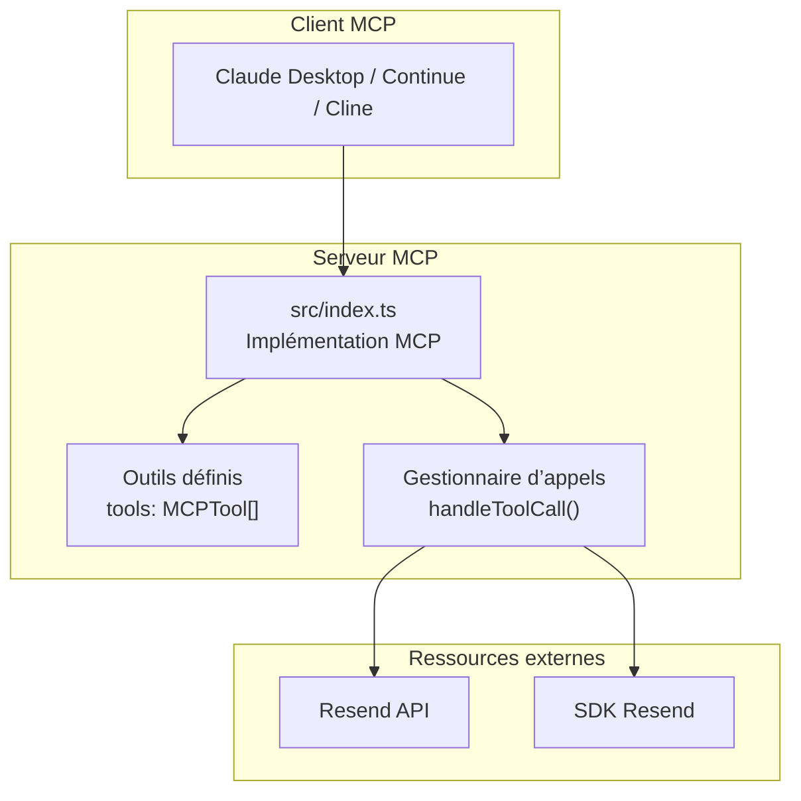
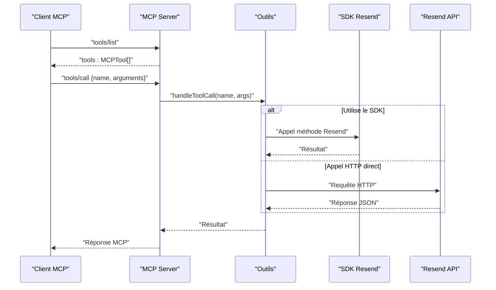
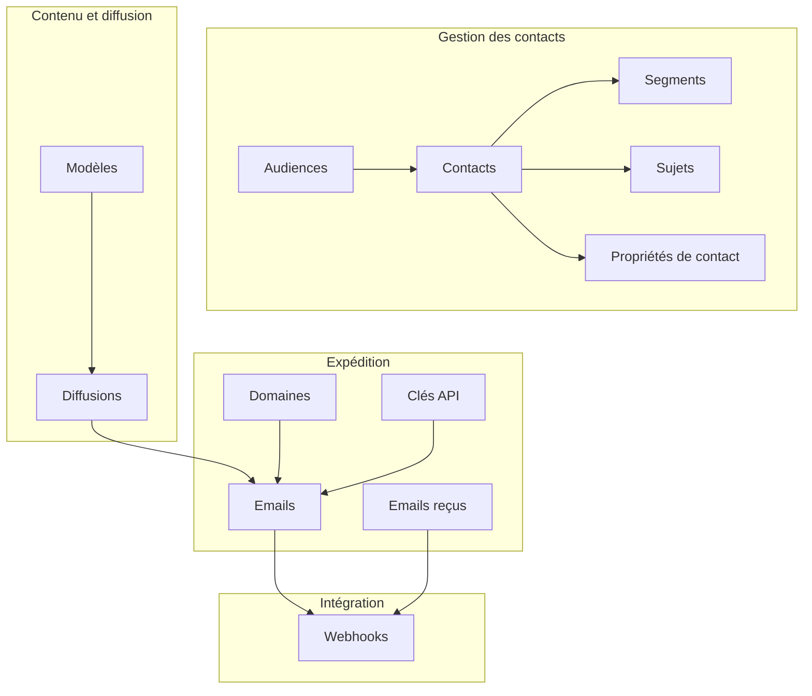

# Fonctionnalités et Modules

<cite>
**Fichiers référencés dans ce document**
- [README.md](file://README.md)
- [package.json](file://package.json)
- [src/index.ts](file://src/index.ts)
</cite>

## Sommaire
1. [Introduction](#introduction)
2. [Structure du projet](#structure-du-projet)
3. [Modules de l’API Resend](#modules-de-lapi-resend)
4. [Architecture globale](#architecture-globale)
5. [Analyse détaillée des modules](#analyse-détaillée-des-modules)
6. [Relations entre les modules](#relations-entre-les-modules)
7. [Considérations sur les performances](#considérations-sur-les-performances)
8. [Guide de dépannage](#guide-de-dépannage)
9. [Conclusion](#conclusion)

## Introduction
Ce document présente une couverture complète des 12 modules de l’API Resend, tels qu’exposés par le serveur Model Context Protocol (MCP) développé dans ce dépôt. Le serveur implémente 70 outils répartis sur 12 modules couvrant l’ensemble des fonctionnalités de l’API Resend : emails, emails reçus, domaines, clés API, audiences, contacts, modèles, diffusions, webhooks, segments, sujets et propriétés de contact. Pour chaque module, nous décrivons les outils associés, leurs paramètres, leurs usages, les schémas de validation JSON, les relations entre modules ainsi que des scénarios d’utilisation typiques.

## Structure du projet
Le projet est un serveur MCP écrit en TypeScript qui expose l’ensemble des outils Resend via stdin/stdout. Il utilise le SDK Resend pour les opérations prises en charge nativement, et effectue des appels HTTP directs pour les endpoints non couverts par le SDK.

**Diagramme sources**
- [src/index.ts](file://src/index.ts#L1008-L1522)

**Section sources**
- [src/index.ts](file://src/index.ts#L1-L1623)
- [package.json](file://package.json#L1-L43)

## Modules de l’API Resend
Voici la liste complète des modules avec le nombre d’outils associés, comme indiqué dans le README.

- **Emails** (8 outils)
  - send_email
  - send_batch_emails
  - list_emails
  - get_email
  - update_email
  - cancel_email
  - list_email_attachments
  - get_email_attachment

- **Emails reçus** (4 outils)
  - list_received_emails
  - get_received_email
  - list_received_email_attachments
  - get_received_email_attachment

- **Domaines** (6 outils)
  - create_domain
  - list_domains
  - get_domain
  - update_domain
  - delete_domain
  - verify_domain

- **Clés API** (3 outils)
  - create_api_key
  - list_api_keys
  - delete_api_key

- **Audiences** (4 outils)
  - create_audience
  - list_audiences
  - get_audience
  - delete_audience

- **Contacts** (13 outils)
  - create_contact
  - list_contacts
  - get_contact_by_email
  - get_contact_by_id
  - update_contact_by_email
  - update_contact_by_id
  - delete_contact_by_email
  - delete_contact_by_id
  - add_contact_to_segment
  - remove_contact_from_segment
  - list_contact_segments
  - get_contact_topics
  - update_contact_topics

- **Modèles** (7 outils)
  - create_template
  - list_templates
  - get_template
  - update_template
  - delete_template
  - publish_template
  - duplicate_template

- **Diffusions** (6 outils)
  - create_broadcast
  - list_broadcasts
  - get_broadcast
  - update_broadcast
  - delete_broadcast
  - send_broadcast

- **Webhooks** (5 outils)
  - create_webhook
  - list_webhooks
  - get_webhook
  - update_webhook
  - delete_webhook

- **Segments** (4 outils)
  - create_segment
  - list_segments
  - get_segment
  - delete_segment

- **Sujets** (5 outils)
  - create_topic
  - list_topics
  - get_topic
  - update_topic
  - delete_topic

- **Propriétés de contact** (5 outils)
  - create_contact_property
  - list_contact_properties
  - get_contact_property
  - update_contact_property
  - delete_contact_property

**Section sources**
- [README.md](file://README.md#L15-L118)
- [src/index.ts](file://src/index.ts#L42-L1002)

## Architecture globale
Le serveur MCP se compose de trois parties principales :
- Définition des outils (tools) avec leurs schémas de validation JSON
- Gestion des appels d’outils (mapping vers le SDK Resend ou appels HTTP)
- Implémentation MCP (listTools, callTool) avec gestion des flux stdin/stdout

**Diagramme sources**
- [src/index.ts](file://src/index.ts#L1008-L1522)

**Section sources**
- [src/index.ts](file://src/index.ts#L1008-L1522)

## Analyse détaillée des modules

### Module Emails
- Outils
  - send_email : Envoi d’un email unique avec HTML/text, pièces jointes, modèles, programmation, en-têtes personnalisés
  - send_batch_emails : Envoi jusqu’à 100 emails en lot
  - list_emails : Liste des emails envoyés avec pagination
  - get_email : Détails d’un email spécifique
  - update_email : Reprogrammer/modifier un email programmé
  - cancel_email : Annuler un email programmé
  - list_email_attachments : Pièces jointes d’un email envoyé
  - get_email_attachment : Télécharger une pièce jointe spécifique

- Schémas de validation
  - send_email : champs requis (from, to, subject), tableaux pour CC/BCC, tableaux d’objets pour pièces jointes et tags, objet pour en-têtes personnalisés
  - send_batch_emails : tableau emails avec objets contenant from, to, subject, html, text
  - list_emails : limit, after, before
  - get_email : email_id
  - update_email : email_id, scheduled_at
  - cancel_email : email_id
  - list_email_attachments : email_id, limit, after, before
  - get_email_attachment : email_id, attachment_id

- Exemples d’appels
  - Envoi simple : [Exemple d’envoi](file://README.md#L279-L294)
  - Envoi par lot : [Exemple de batch](file://README.md#L305-L329)

- Scénarios typiques
  - Envoi de newsletters hebdomadaires
  - Envoi de mails transactionnels avec pièces jointes
  - Programmation de campagnes

**Section sources**
- [src/index.ts](file://src/index.ts#L42-L198)
- [README.md](file://README.md#L15-L23)

### Module Emails reçus
- Outils
  - list_received_emails : Liste des emails reçus
  - get_received_email : Détails d’un email reçu
  - list_received_email_attachments : Pièces jointes d’un email reçu
  - get_received_email_attachment : Télécharger une pièce jointe reçue

- Schémas de validation
  - list_received_emails : limit, after, before
  - get_received_email : email_id
  - list_received_email_attachments : email_id, limit, after, before
  - get_received_email_attachment : email_id, attachment_id

- Scénarios typiques
  - Traitement automatisé des emails de support
  - Archivage des emails reçus

**Section sources**
- [src/index.ts](file://src/index.ts#L200-L249)

### Module Domaines
- Outils
  - create_domain : Ajouter un domaine d’expédition
  - list_domains : Voir tous les domaines
  - get_domain : Détails d’un domaine
  - update_domain : Activer/désactiver le suivi des clics et ouvertures
  - delete_domain : Supprimer un domaine
  - verify_domain : Vérification des enregistrements DNS

- Schémas de validation
  - create_domain : name, region
  - get_domain : domain_id
  - update_domain : domain_id, open_tracking, click_tracking
  - delete_domain : domain_id
  - verify_domain : domain_id

- Scénarios typiques
  - Configuration de domaines pour l’envoi d’emails
  - Mise à jour des paramètres de suivi

**Section sources**
- [src/index.ts](file://src/index.ts#L251-L317)

### Module Clés API
- Outils
  - create_api_key : Créer une nouvelle clé API
  - list_api_keys : Voir toutes les clés
  - delete_api_key : Révoquer une clé

- Schémas de validation
  - create_api_key : name, permission
  - delete_api_key : api_key_id

- Scénarios typiques
  - Création de clés avec permissions restreintes
  - Rotation de clés API

**Section sources**
- [src/index.ts](file://src/index.ts#L319-L350)

### Module Audiences
- Outils
  - create_audience : Créer une audience (liste de diffusion)
  - list_audiences : Voir toutes les audiences
  - get_audience : Détails d’une audience
  - delete_audience : Supprimer une audience

- Schémas de validation
  - create_audience : name
  - get_audience : audience_id
  - delete_audience : audience_id

- Scénarios typiques
  - Création de listes de diffusion pour différents segments
  - Gestion des audiences de newsletter

**Section sources**
- [src/index.ts](file://src/index.ts#L352-L393)

### Module Contacts
- Outils
  - create_contact : Ajouter un contact à une audience
  - list_contacts : Voir tous les contacts d’une audience
  - get_contact_by_email : Obtenir un contact par email
  - get_contact_by_id : Obtenir un contact par ID
  - update_contact_by_email : Mettre à jour un contact par email
  - update_contact_by_id : Mettre à jour un contact par ID
  - delete_contact_by_email : Supprimer un contact par email
  - delete_contact_by_id : Supprimer un contact par ID
  - add_contact_to_segment : Ajouter un contact à un segment
  - remove_contact_from_segment : Retirer un contact d’un segment
  - list_contact_segments : Voir les segments d’un contact
  - get_contact_topics : Voir les abonnements à des sujets
  - update_contact_topics : Mettre à jour les abonnements à des sujets

- Schémas de validation
  - create_contact : audience_id, email, first_name, last_name, unsubscribed
  - list_contacts : audience_id
  - get_contact_by_email : audience_id, email
  - get_contact_by_id : audience_id, contact_id
  - update_contact_by_email : audience_id, email, first_name, last_name, unsubscribed
  - update_contact_by_id : audience_id, contact_id, first_name, last_name, unsubscribed
  - delete_contact_by_email : audience_id, email
  - delete_contact_by_id : audience_id, contact_id
  - add_contact_to_segment : audience_id, contact_id, segment_id
  - remove_contact_from_segment : audience_id, contact_id, segment_id
  - list_contact_segments : audience_id, contact_id, limit, after, before
  - get_contact_topics : audience_id, contact_id, limit, after, before
  - update_contact_topics : audience_id, contact_id, topics

- Exemples d’appels
  - Création d’une audience : [Exemple](file://README.md#L379-L390)
  - Ajout d’un contact : [Exemple](file://README.md#L392-L406)

- Scénarios typiques
  - Gestion des inscriptions à la newsletter
  - Segmenter les contacts par comportement
  - Gérer les préférences de communication

**Section sources**
- [src/index.ts](file://src/index.ts#L395-L577)
- [README.md](file://README.md#L377-L406)

### Module Modèles
- Outils
  - create_template : Créer un modèle
  - list_templates : Voir tous les modèles
  - get_template : Obtenir un modèle par ID/alias
  - update_template : Mettre à jour un modèle
  - delete_template : Supprimer un modèle
  - publish_template : Publier un modèle brouillon
  - duplicate_template : Dupliquer un modèle

- Schémas de validation
  - create_template : name, alias, from, subject, reply_to, html, text, variables
  - get_template : template_id
  - update_template : template_id, name, alias, from, subject, reply_to, html, text
  - delete_template : template_id
  - publish_template : template_id
  - duplicate_template : template_id

- Scénarios typiques
  - Création de modèles réutilisables pour les newsletters
  - Gestion des variables de personnalisation

**Section sources**
- [src/index.ts](file://src/index.ts#L579-L681)

### Module Diffusions
- Outils
  - create_broadcast : Créer une diffusion
  - list_broadcasts : Voir toutes les diffusions
  - get_broadcast : Détails d’une diffusion
  - update_broadcast : Modifier une diffusion
  - delete_broadcast : Supprimer une diffusion
  - send_broadcast : Envoyer ou programmer une diffusion

- Schémas de validation
  - create_broadcast : name, segment_id, from, subject, reply_to, preview_text, html, text, send, scheduled_at
  - get_broadcast : broadcast_id
  - update_broadcast : broadcast_id, name, segment_id, from, subject, reply_to, preview_text, html, text
  - delete_broadcast : broadcast_id
  - send_broadcast : broadcast_id, scheduled_at

- Exemples d’appels
  - Création d’une diffusion : [Exemple](file://README.md#L408-L433)

- Scénarios typiques
  - Envoi de newsletters à des segments ciblés
  - Programmation de campagnes de communication

**Section sources**
- [src/index.ts](file://src/index.ts#L683-L764)
- [README.md](file://README.md#L408-L433)

### Module Webhooks
- Outils
  - create_webhook : Créer un webhook
  - list_webhooks : Voir tous les webhooks
  - get_webhook : Détails d’un webhook
  - update_webhook : Modifier un webhook
  - delete_webhook : Supprimer un webhook

- Événements pris en charge
  - email.sent, email.delivered, email.delivery_delayed, email.complained, email.bounced, email.opened, email.clicked, email.received

- Schémas de validation
  - create_webhook : endpoint, events
  - get_webhook : webhook_id
  - update_webhook : webhook_id, endpoint, events, status
  - delete_webhook : webhook_id

- Exemples d’appels
  - Configuration de webhooks : [Exemple](file://README.md#L354-L375)

- Scénarios typiques
  - Suivre l’état de livraison des emails
  - Mettre à jour des statuts de contacts en temps réel

**Section sources**
- [src/index.ts](file://src/index.ts#L766-L830)
- [README.md](file://README.md#L89-L98)

### Module Segments
- Outils
  - create_segment : Créer un segment
  - list_segments : Voir tous les segments
  - get_segment : Détails d’un segment
  - delete_segment : Supprimer un segment

- Schémas de validation
  - create_segment : name, audience_id, filter
  - get_segment : segment_id
  - delete_segment : segment_id

- Scénarios typiques
  - Création de segments dynamiques basés sur des critères
  - Ciblage précis pour les diffusions

**Section sources**
- [src/index.ts](file://src/index.ts#L832-L879)

### Module Sujets
- Outils
  - create_topic : Créer un sujet d’abonnement
  - list_topics : Voir tous les sujets
  - get_topic : Détails d’un sujet
  - update_topic : Modifier un sujet
  - delete_topic : Supprimer un sujet

- Schémas de validation
  - create_topic : name, audience_id
  - get_topic : topic_id
  - update_topic : topic_id, name
  - delete_topic : topic_id

- Scénarios typiques
  - Gestion des thématiques de communication
  - Personnalisation des abonnements

**Section sources**
- [src/index.ts](file://src/index.ts#L881-L939)

### Module Propriétés de contact
- Outils
  - create_contact_property : Créer une propriété personnalisée
  - list_contact_properties : Voir toutes les propriétés
  - get_contact_property : Détails d’une propriété
  - update_contact_property : Modifier une propriété
  - delete_contact_property : Supprimer une propriété

- Schémas de validation
  - create_contact_property : name, type, description
  - get_contact_property : property_id
  - update_contact_property : property_id, name, description
  - delete_contact_property : property_id

- Scénarios typiques
  - Ajout de données personnalisées (ville, âge, etc.)
  - Amélioration de la segmentation

**Section sources**
- [src/index.ts](file://src/index.ts#L941-L1001)

## Relations entre les modules
Les modules interagissent de manière logique pour structurer un pipeline complet d’envoi d’emails et de gestion des contacts.

**Diagramme sources**
- [src/index.ts](file://src/index.ts#L42-L1002)

## Considérations sur les performances
- Le serveur respecte les limites de taux de l’API Resend (par défaut 2 requêtes/seconde, avec des pics autorisés). Le code gère automatiquement les tentatives de reprise en cas de dépassement temporaire.
- Pour les envois par lot, utiliser send_batch_emails pour envoyer jusqu’à 100 emails en une seule requête.
- Pour les grandes listes de contacts, utiliser les méthodes de pagination (limit, after, before) pour éviter de surcharger les requêtes.

[Section sources non applicable car cette section fournit des conseils généraux]

## Guide de dépannage
- Erreur : La variable d’environnement RESEND_API_KEY n’est pas définie
  - Solution : Créer un fichier .env avec votre clé API Resend
- Erreur : Appel d’outil échoué
  - Causes possibles : clé API invalide, paramètres manquants, dépassement de limite de taux, problèmes réseau
  - Solution : Vérifier le message d’erreur et valider vos paramètres
- Erreur : Outil inconnu
  - Solution : Utiliser tools/list pour afficher tous les outils disponibles

**Section sources**
- [README.md](file://README.md#L520-L542)
- [src/index.ts](file://src/index.ts#L1571-L1577)

## Conclusion
Ce serveur MCP offre une couverture complète des 12 modules de l’API Resend, avec plus de 70 outils pour gérer l’ensemble du cycle de vie des emails : création, envoi, suivi, diffusion, gestion des contacts et des domaines. Grâce à des schémas de validation rigoureux, des relations claires entre modules et des scénarios d’utilisation concrets, il permet aux assistants IA et aux applications LLM de s’intégrer facilement à l’écosystème Resend.