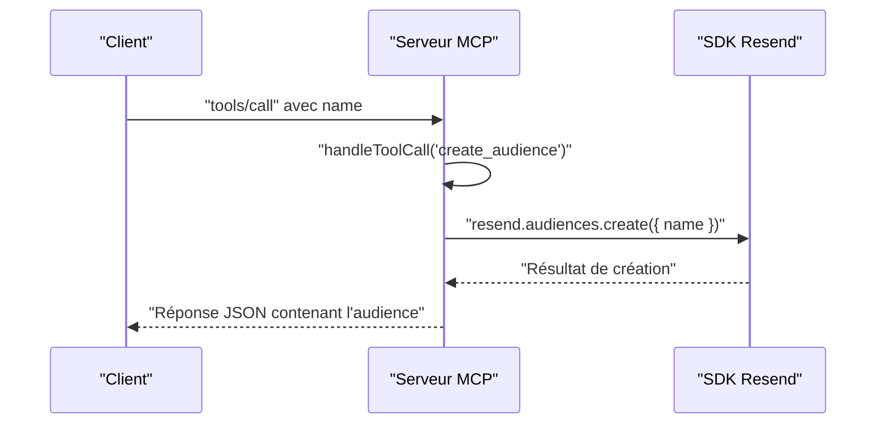

# Création d'une Audience

<cite>
**Fichiers référencés dans ce document**
- [README.md](file://README.md)
- [package.json](file://package.json)
- [src/index.ts](file://src/index.ts)
</cite>

## Sommaire
1. [Introduction](#introduction)
2. [Objectif de l’outil](#objectif-de-loutil)
3. [Paramètres d’entrée](#paramètres-dentrée)
4. [Validation des données](#validation-des-données)
5. [Bonnes pratiques de nommage](#bonnes-pratiques-de-nommage)
6. [Scénarios d’utilisation](#scénarios-dutilisation)
7. [Organisation par segment ou campagne](#organisation-par-segment-ou-campagne)
8. [Flux de création d’une audience](#flux-de-création-dune-audience)
9. [Exemples concrets](#exemples-concrets)
10. [Conclusion](#conclusion)

## Introduction
Cet outil permet de créer de nouvelles audiences (listes de contacts) au sein de la plateforme Resend. Une audience est un regroupement logique de destinataires utilisable pour envoyer des emails ciblés, créer des segments ou gérer des abonnements à des sujets.

## Objectif de l’outil
- Créer une nouvelle audience (liste de contacts) en fournissant un nom significatif.
- Rendre disponible cette audience pour l’ajout de contacts, la segmentation et l’envoi de campagnes.

**Section sources**
- [README.md](file://README.md#L44-L48)
- [src/index.ts](file://src/index.ts#L352-L363)

## Paramètres d’entrée
- name (chaîne de caractères, requis)
  - Description : Nom de l’audience.
  - Contraintes : Doit être fourni obligatoirement.

**Section sources**
- [src/index.ts](file://src/index.ts#L356-L362)

## Validation des données
- Obligatoire : Le champ name est requis.
- Aucune validation supplémentaire n’est effectuée côté serveur (le SDK Resend peut appliquer ses propres règles).
- En cas d’erreur, le serveur renvoie un message d’erreur contenant le nom de l’outil et les arguments fournis.

**Section sources**
- [src/index.ts](file://src/index.ts#L1516-L1522)

## Bonnes pratiques de nommage
- Utilisez un nom clair et descriptif qui indique immédiatement le contenu ou la cible de l’audience.
- Évitez les noms ambigus ou trop génériques.
- Si vous gérez plusieurs campagnes, préférez des noms qui incluent le type de contenu, la période ou le segment cible.
- Exemples de noms pertinents : “Abonnés à la newsletter”, “Clients Premium”, “Utilisateurs de la région PACA”.

[Ce paragraphe ne nécessite pas de source car il s’agit de conseils généraux basés sur l’usage courant des audiences.]

## Scénarios d’utilisation
Voici quelques cas concrets illustrant comment créer des audiences dans des contextes marketing :

- Abonnés à la newsletter
  - Objectif : Envoyer régulièrement des contenus à ceux qui ont souscrit.
  - Nom : “Abonnés à la newsletter”
- Clients actifs
  - Objectif : Proposer des offres spéciales aux clients ayant effectué des achats récents.
  - Nom : “Clients actifs (derniers 30 jours)”
- Utilisateurs de la région PACA
  - Objectif : Diffuser des contenus locaux ou des événements régionaux.
  - Nom : “Utilisateurs de la région PACA”
- Abonnés à un sujet spécifique
  - Objectif : Envoyer des contenus liés à un thème particulier (ex : “Technologie”).
  - Nom : “Abonnés à la rubrique Technologie”

[Ce paragraphe ne nécessite pas de source car il s’agit d’exemples de cas d’usage.]

## Organisation par segment ou campagne
- Une fois l’audience créée, vous pouvez :
  - Ajouter des contacts à cette audience.
  - Créer des segments à partir de cette audience pour affiner le ciblage.
  - Utiliser cette audience comme base pour des campagnes diffusées via des broadcasts.
- Pour organiser vos audiences de manière cohérente, envisagez de structurer les noms selon un schéma comme : “[Type d’audience] – [Segment/Campagne] – [Période]”.

**Section sources**
- [README.md](file://README.md#L44-L48)
- [README.md](file://README.md#L99-L103)
- [README.md](file://README.md#L74-L80)

## Flux de création d’une audience
Le processus se déroule en trois étapes principales :

1. Appel de l’outil create_audience avec le nom de l’audience.
2. Réception de la réponse contenant les détails de l’audience nouvellement créée.
3. Stockage de l’identifiant de l’audience pour les opérations ultérieures (ajout de contacts, création de segments, envoi de campagnes).

**Diagram sources**
- [src/index.ts](file://src/index.ts#L1138-L1139)
- [src/index.ts](file://src/index.ts#L1008-L1015)

**Section sources**
- [src/index.ts](file://src/index.ts#L1138-L1139)
- [src/index.ts](file://src/index.ts#L1008-L1015)

## Exemples concrets
Voici un exemple de requête pour créer une audience, tel qu’illustré dans la documentation du projet :

- Requête
  - Méthode : tools/call
  - Outil : create_audience
  - Arguments : { "name": "Newsletter Subscribers" }

- Réponse attendue
  - Contient les informations de l’audience créée (nom, identifiant, etc.).

**Section sources**
- [README.md](file://README.md#L379-L390)

## Conclusion
Créer une audience est la première étape essentielle pour structurer votre communication marketing. En choisissant un nom clair et en adoptant une organisation cohérente (par segment ou campagne), vous facilitez la gestion des contacts, la segmentation et l’envoi de contenus ciblés.

[Ce paragraphe ne nécessite pas de source.]