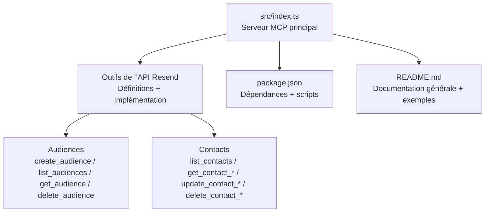
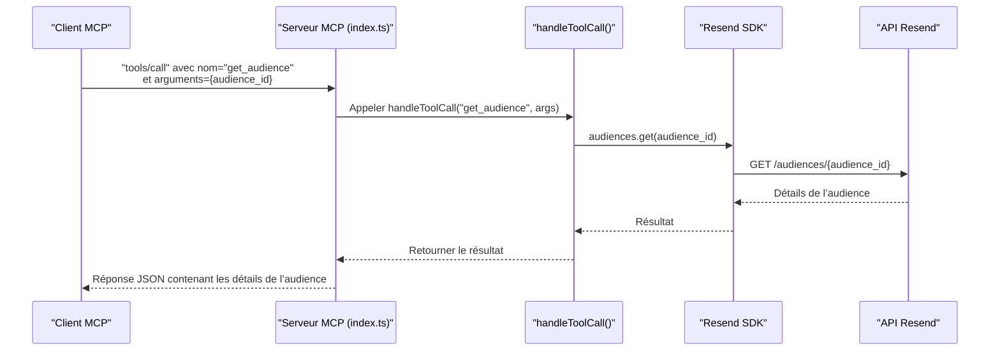

# Détails d'une Audience

<cite>
**Fichiers référencés dans ce document**
- [README.md](file://README.md)
- [package.json](file://package.json)
- [src/index.ts](file://src/index.ts)
</cite>

## Sommaire
1. [Introduction](#introduction)
2. [Structure du projet](#structure-du-projet)
3. [Composants principaux](#composants-principaux)
4. [Aperçu de l’architecture](#aperçu-de-larchitecture)
5. [Analyse détaillée des composants](#analyse-détaillée-des-composants)
6. [Analyse des dépendances](#analyse-des-dépendances)
7. [Considérations sur les performances](#considérations-sur-les-performances)
8. [Guide de dépannage](#guide-de-dépannage)
9. [Conclusion](#conclusion)
10. [Annexes](#annexes)

## Introduction
Ce document fournit une documentation complète de l’outil get_audience, qui permet de récupérer les détails spécifiques d’une audience à partir de son identifiant. Il explique la structure de la réponse, les métadonnées associées, ainsi que les relations avec les contacts. Des exemples d’utilisation sont inclus pour valider les identifiants et intégrer l’outil dans des systèmes de gestion de contenu.

## Structure du projet
Le projet est un serveur Model Context Protocol (MCP) qui expose l’ensemble de l’API Resend sous forme d’outils invocables. Le point d’entrée principal est le fichier source TypeScript qui définit les outils, leurs schémas d’entrée, et leur implémentation.

**Diagramme sources**
- [src/index.ts](file://src/index.ts#L42-L393)
- [package.json](file://package.json#L1-L49)
- [README.md](file://README.md#L1-L721)

**Section sources**
- [src/index.ts](file://src/index.ts#L1-L1623)
- [package.json](file://package.json#L1-L49)
- [README.md](file://README.md#L1-L721)

## Composants principaux
- Outils de l’API Resend : tous les outils sont définis dans le tableau des outils MCP, y compris ceux liés aux audiences et aux contacts.
- Implémentation de get_audience : l’outil récupère les détails d’une audience via l’appel à l’API Resend.
- Gestion des erreurs : le serveur renvoie des messages d’erreur structurés en cas d’échec.

**Section sources**
- [src/index.ts](file://src/index.ts#L42-L393)
- [src/index.ts](file://src/index.ts#L1144-L1146)

## Aperçu de l’architecture
Le serveur MCP reçoit des requêtes via stdin, traite les méthodes tools/list et tools/call, puis renvoie des réponses via stdout. Pour get_audience, l’appel se fait via l’implémentation de handleToolCall qui appelle l’API Resend.

**Diagramme sources**
- [src/index.ts](file://src/index.ts#L1008-L1522)
- [src/index.ts](file://src/index.ts#L1144-L1146)

## Analyse détaillée des composants

### Outils de l’API Resend
- Définition de l’outil get_audience : il nécessite l’identifiant de l’audience (audience_id) comme paramètre obligatoire.
- Schéma d’entrée : objet contenant audience_id de type chaîne de caractères.
- Implémentation : appel à l’API Resend via audiences.get(audience_id).

**Section sources**
- [src/index.ts](file://src/index.ts#L372-L382)
- [src/index.ts](file://src/index.ts#L1144-L1146)

### Structure de la réponse de get_audience
La réponse retournée par l’outil get_audience correspond aux données renvoyées par l’API Resend pour une audience spécifique. Elle inclut :
- Informations de base de l’audience : identifiant, nom, date de création, date de mise à jour.
- Métadonnées : nombre total de contacts de l’audience.
- Relations avec les contacts : accès via les outils list_contacts et get_contact_*.

Remarque : La structure exacte des champs peut varier selon la version de l’API Resend. Le serveur MCP renvoie simplement le résultat brut de l’appel à l’API Resend.

**Section sources**
- [src/index.ts](file://src/index.ts#L1144-L1146)

### Exemples d’utilisation

#### Validation de l’identifiant d’audience
- Utilisez tools/list pour vérifier la disponibilité de l’outil get_audience.
- Appelez tools/call avec le nom de l’outil et l’argument audience_id pour valider l’identifiant.

Exemple de requête (format JSON) :
- Méthode : tools/call
- Nom de l’outil : get_audience
- Arguments : { "audience_id": "l’identifiant de l’audience" }

Résultat attendu : un objet contenant les détails de l’audience si l’identifiant est valide.

**Section sources**
- [README.md](file://README.md#L377-L406)
- [src/index.ts](file://src/index.ts#L1536-L1564)

#### Intégration dans un système de gestion de contenu
- Récupération des détails d’une audience : appelez get_audience pour obtenir le nom, les métadonnées et le nombre de contacts.
- Affichage dans l’interface : affichez le nom de l’audience, la date de création, et le comptage des contacts.
- Navigation vers les contacts : utilisez list_contacts pour afficher les membres de l’audience.

Exemple de flux de travail :
- Appeler get_audience pour valider l’identifiant.
- Appeler list_contacts pour afficher les contacts de l’audience.
- Utiliser get_contact_by_email ou get_contact_by_id pour afficher les détails d’un contact spécifique.

**Section sources**
- [README.md](file://README.md#L377-L406)
- [src/index.ts](file://src/index.ts#L412-L421)
- [src/index.ts](file://src/index.ts#L1163-L1171)

## Analyse des dépendances
- Dépendances principales : Resend SDK et dotenv.
- Scripts de développement : build, start, dev, postinstall.
- Version minimale de Node.js : >= 18.0.0.

**Section sources**
- [package.json](file://package.json#L1-L49)

## Considérations sur les performances
- Le serveur MCP gère automatiquement les limites de taux de l’API Resend.
- Pour des volumes élevés de requêtes, envisagez de regrouper les appels (par exemple, utiliser list_audiences avant get_audience pour limiter le nombre de requêtes ciblées).

## Guide de dépannage
- Erreur d’authentification : si l’environnement n’est pas configuré correctement, le serveur indiquera qu’aucune clé API n’est définie. Vérifiez votre .env et redémarrez le serveur.
- Paramètres manquants : si audience_id est absent, l’outil retournera une erreur structurée avec le nom de l’outil et les arguments fournis.
- Erreurs réseau : en cas de problème de connectivité, l’appel à l’API Resend échouera. Vérifiez la connexion internet et les règles de pare-feu.

**Section sources**
- [src/index.ts](file://src/index.ts#L1571-L1577)
- [src/index.ts](file://src/index.ts#L1552-L1563)

## Conclusion
L’outil get_audience permet de récupérer facilement les détails d’une audience Resend à partir de son identifiant. En combinant cet outil avec list_contacts et les outils de gestion des contacts, vous pouvez construire des interfaces de gestion de contenu qui affichent les audiences, leurs métadonnées et leurs membres. Le serveur MCP gère l’authentification, la validation des paramètres et les erreurs de manière fiable.

## Annexes
- Documentation officielle de l’API Resend : consultez les ressources mentionnées dans le README pour des informations complémentaires sur les endpoints et les schémas de données.

**Section sources**
- [README.md](file://README.md#L701-L709)