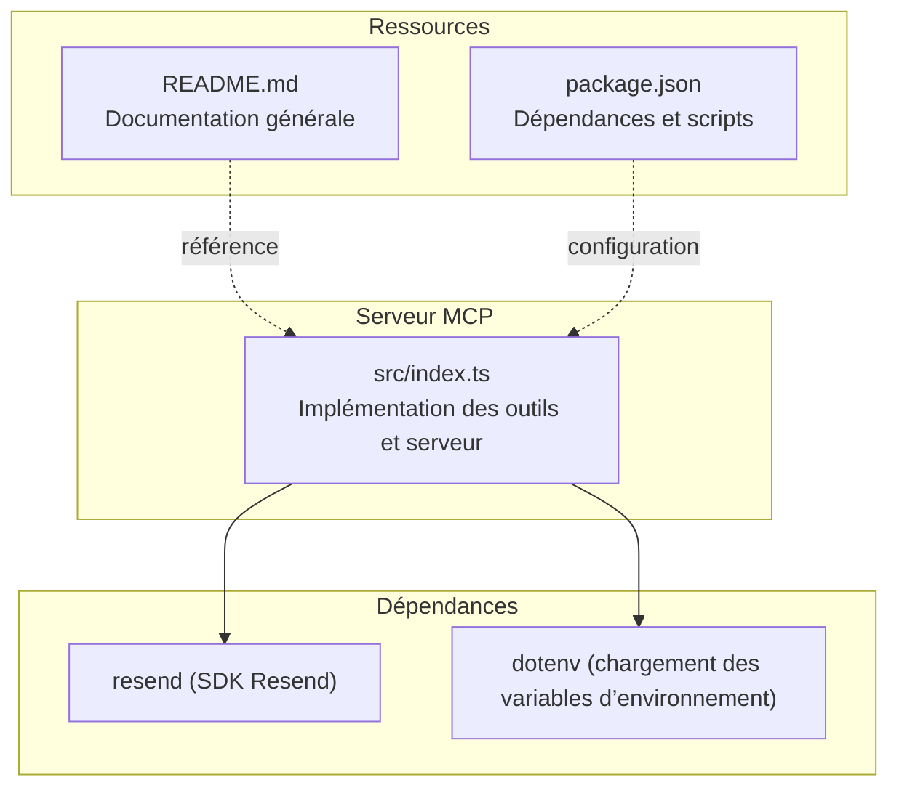
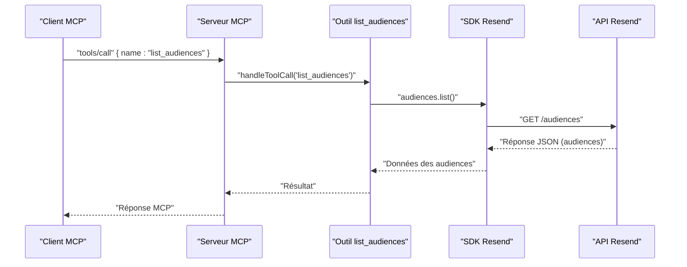
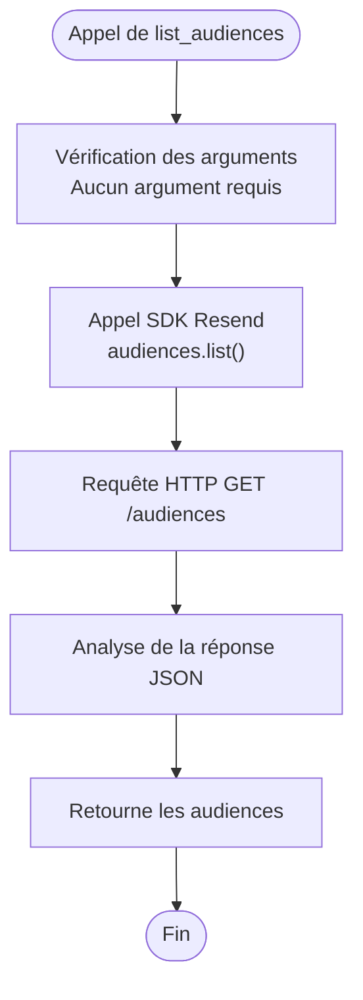
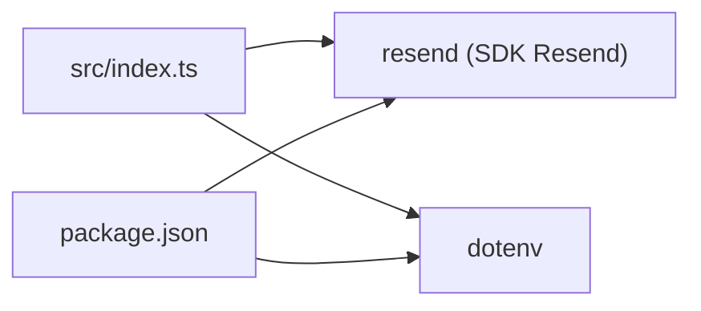

# Liste des Audiences

<cite>
**Fichiers référencés dans ce document**
- [README.md](file://README.md)
- [package.json](file://package.json)
- [src/index.ts](file://src/index.ts)
</cite>

## Sommaire
1. [Introduction](#introduction)
2. [Structure du projet](#structure-du-projet)
3. [Composants principaux](#composants-principaux)
4. [Aperçu de l’architecture](#aperçu-de-larchitecture)
5. [Analyse détaillée des composants](#analyse-détaillée-des-composants)
6. [Analyse des dépendances](#analyse-des-dépendances)
7. [Considérations sur les performances](#considérations-sur-les-performances)
8. [Guide de dépannage](#guide-de-dépannage)
9. [Conclusion](#conclusion)

## Introduction
Ce document fournit une documentation complète de l’outil list_audiences, qui permet de récupérer toutes les audiences de votre compte Resend. Il explique la structure de la réponse, les options de pagination disponibles, ainsi que les bonnes pratiques pour gérer de grandes quantités de données. Des exemples concrets montrent comment explorer vos audiences et les intégrer dans des workflows de gestion de contenu.

## Structure du projet
Le projet est un serveur Model Context Protocol (MCP) qui expose l’intégralité de l’API Resend sous forme d’outils invocables. L’outil list_audiences fait partie de la collection d’outils liés à la gestion des audiences.

**Diagramme sources**
- [src/index.ts](file://src/index.ts#L1-L10)
- [README.md](file://README.md#L1-L721)
- [package.json](file://package.json#L1-L49)

**Section sources**
- [README.md](file://README.md#L472-L491)
- [package.json](file://package.json#L1-L49)

## Composants principaux
- Outils de l’API Resend : Le serveur expose plus de 70 outils couvrant tous les modules de l’API Resend, dont les outils liés aux audiences.
- Implémentation de list_audiences : L’outil list_audiences est défini comme un outil MCP avec un schéma d’entrée vide (aucun paramètre requis), et il appelle l’API Resend pour récupérer la liste des audiences.

**Section sources**
- [README.md](file://README.md#L44-L48)
- [src/index.ts](file://src/index.ts#L365-L371)
- [src/index.ts](file://src/index.ts#L1141-L1142)

## Aperçu de l’architecture
L’architecture du serveur MCP se compose de trois parties principales :
- Définition des outils : chaque outil est décrit par un nom, une description et un schéma d’entrée.
- Gestion des appels d’outils : le serveur route les appels vers les implémentations correspondantes, qui utilisent soit le SDK Resend, soit des appels HTTP directs.
- Communication MCP : le serveur écoute les requêtes via stdin et renvoie les réponses via stdout.

**Diagramme sources**
- [src/index.ts](file://src/index.ts#L1141-L1142)
- [src/index.ts](file://src/index.ts#L1008-L1522)

## Analyse détaillée des composants

### Outil list_audiences
- Nom : list_audiences
- Description : Récupère toutes les audiences de votre compte Resend.
- Schéma d’entrée : Aucun paramètre requis.
- Implémentation : Utilise le SDK Resend pour appeler l’API audiences.list().
- Réponse : Retourne la liste des audiences.

**Diagramme sources**
- [src/index.ts](file://src/index.ts#L365-L371)
- [src/index.ts](file://src/index.ts#L1141-L1142)

**Section sources**
- [README.md](file://README.md#L44-L48)
- [src/index.ts](file://src/index.ts#L365-L371)
- [src/index.ts](file://src/index.ts#L1141-L1142)

### Structure de la réponse
La réponse de l’API Resend pour la liste des audiences contient généralement une liste d’objets représentant les audiences. Chaque audience possède des attributs tels qu’un identifiant unique, un nom, et éventuellement d’autres métadonnées fournies par l’API Resend.

- Structure attendue : Tableau d’audiences.
- Chaque audience : Objet contenant au moins l’identifiant et le nom de l’audience.

**Section sources**
- [src/index.ts](file://src/index.ts#L1141-L1142)

### Options de pagination
L’outil list_audiences ne prend aucun paramètre en entrée. Cependant, d’autres outils de la même catégorie (par exemple, list_emails, list_webhooks, list_templates, list_segments, list_topics, list_contact_properties) utilisent des options de pagination standardisées. Bien que list_audiences ne les prenne pas en charge actuellement, vous pouvez adopter ces mêmes pratiques si vous souhaitez étendre l’outil.

- Paramètres de pagination courants (sur d’autres outils) :
  - limit : Nombre maximum d’éléments à retourner.
  - after : Curseur pour récupérer les éléments suivants.
  - before : Curseur pour récupérer les éléments précédents.

Ces options sont généralement transmises sous forme de paramètres de requête HTTP.

**Section sources**
- [src/index.ts](file://src/index.ts#L1025-L1032)
- [src/index.ts](file://src/index.ts#L1368-L1375)
- [src/index.ts](file://src/index.ts#L1263-L1270)
- [src/index.ts](file://src/index.ts#L1410-L1417)
- [src/index.ts](file://src/index.ts#L1442-L1449)
- [src/index.ts](file://src/index.ts#L1484-L1491)

### Gestion des grandes quantités de données
Pour gérer de grandes quantités de données avec list_audiences, il est recommandé de :
- Itérer sur les résultats en utilisant des curseurs (même si l’outil ne le prend pas en charge actuellement, les autres outils de la même catégorie montrent comment cela fonctionne).
- Limiter le nombre d’éléments retournés par appel (en utilisant limit si disponible).
- Mettre en place un traitement par lots pour éviter de surcharger la mémoire.
- Respecter les limites de taux imposées par l’API Resend.

**Section sources**
- [README.md](file://README.md#L518-L527)
- [src/index.ts](file://src/index.ts#L1025-L1032)

### Exemples d’utilisation
Voici quelques scénarios d’utilisation de list_audiences dans des workflows de gestion de contenu :

- Explorer les audiences pour identifier celles à utiliser dans des campagnes de diffusion.
- Intégrer la liste des audiences dans un système de gestion de contenu pour permettre aux utilisateurs de sélectionner des listes de diffusion lors de la création de contenus.
- Automatiser la synchronisation des audiences entre Resend et un CRM tiers.

Ces exemples illustrent comment list_audiences peut être utilisé comme point d’entrée pour explorer et gérer vos audiences.

**Section sources**
- [README.md](file://README.md#L377-L406)

## Analyse des dépendances
Le serveur MCP dépend de :
- Resend : Pour appeler directement certaines APIs (comme audiences.list()) via le SDK.
- Dotenv : Pour charger les variables d’environnement depuis un fichier .env.

**Diagramme sources**
- [src/index.ts](file://src/index.ts#L1-L4)
- [package.json](file://package.json#L32-L34)

**Section sources**
- [package.json](file://package.json#L32-L34)
- [src/index.ts](file://src/index.ts#L1-L4)

## Considérations sur les performances
- Limites de taux : L’API Resend impose des limites de taux. Le serveur MCP gère automatiquement les tentatives de reprise lorsque nécessaire.
- Pagination : Même si list_audiences ne prend pas de paramètres de pagination, les autres outils montrent comment gérer efficacement les grandes quantités de données.
- Mémoire : Pour éviter de surcharger la mémoire, traitez les résultats par lots et libérez les ressources dès que possible.

**Section sources**
- [README.md](file://README.md#L518-L527)

## Guide de dépannage
- Erreur d’authentification : Si l’environnement n’est pas configuré correctement, le serveur affiche un message d’erreur indiquant que la clé API Resend n’est pas définie. Vérifiez que le fichier .env contient la clé API.
- Erreur d’exécution de l’outil : En cas d’échec de l’appel à l’API Resend, le serveur renvoie un message d’erreur détaillé avec le nom de l’outil et ses arguments.

**Section sources**
- [README.md](file://README.md#L551-L569)
- [src/index.ts](file://src/index.ts#L1516-L1522)
- [src/index.ts](file://src/index.ts#L1571-L1577)

## Conclusion
L’outil list_audiences permet de récupérer facilement toutes les audiences de votre compte Resend. Bien qu’il ne prenne pas de paramètres de pagination, il constitue un point de départ essentiel pour explorer vos audiences et les intégrer dans des workflows de gestion de contenu. En adoptant les bonnes pratiques de pagination et de gestion des performances, vous pouvez traiter de grandes quantités de données de manière fiable et efficace.