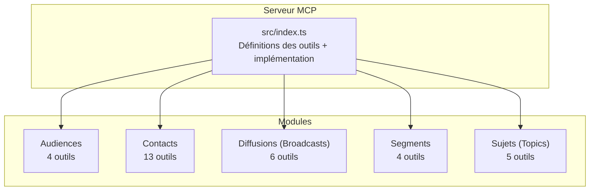
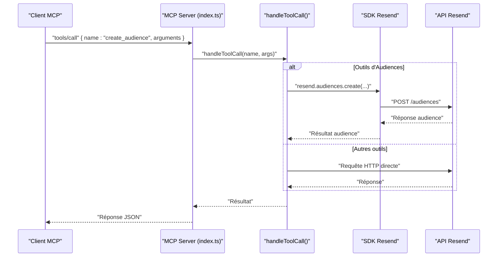
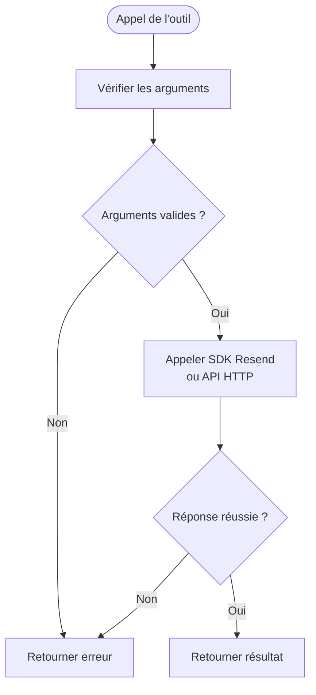
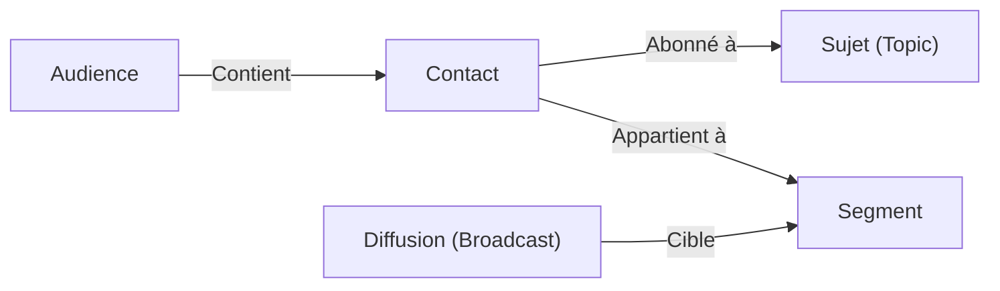
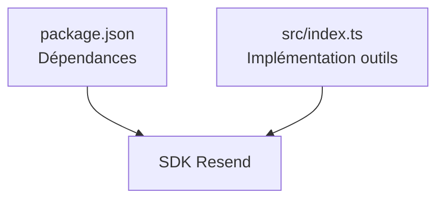

# Module Audiences

<cite>
**Fichiers référencés dans ce document**
- [README.md](file://README.md)
- [package.json](file://package.json)
- [src/index.ts](file://src/index.ts)
</cite>

## Sommaire
1. [Introduction](#introduction)
2. [Structure du projet](#structure-du-projet)
3. [Composants principaux](#composants-principaux)
4. [Aperçu de l’architecture](#aperçu-de-larchitecture)
5. [Analyse détaillée des composants](#analyse-détaillée-des-composants)
6. [Analyse des dépendances](#analyse-des-dépendances)
7. [Considérations sur les performances](#considérations-sur-les-performances)
8. [Guide de dépannage](#guide-de-dépannage)
9. [Conclusion](#conclusion)
10. [Annexes](#annexes)

## Introduction
Le module Audiences de l’API Resend permet de gérer des listes de contacts (audiences) et de structurer ses envois marketing. Ce document documente les quatre outils liés aux audiences : create_audience, list_audiences, get_audience, delete_audience. Il explique également comment ces audiences interagissent avec le module Contacts, ainsi que les bonnes pratiques pour organiser vos audiences au sein de stratégies marketing cohérentes.

## Structure du projet
Le serveur MCP expose l’ensemble de l’API Resend sous forme d’outils invocables. Le module Audiences fait partie des 12 modules couverts, avec 4 outils spécifiques à la gestion des audiences.

**Diagramme sources**
- [src/index.ts](file://src/index.ts#L352-L393)

**Section sources**
- [README.md](file://README.md#L44-L48)
- [src/index.ts](file://src/index.ts#L352-L393)

## Composants principaux
Voici les quatre outils du module Audiences, avec leurs rôles respectifs :

- create_audience : crée une nouvelle audience (liste de contacts).
- list_audiences : liste toutes les audiences de l’espace client.
- get_audience : récupère les détails d’une audience spécifique (y compris le nombre de contacts).
- delete_audience : supprime une audience.

Ces outils sont définis dans le tableau des outils de l’implémentation MCP et sont exécutés via un handler centralisé qui appelle l’SDK Resend ou effectue des requêtes HTTP directes vers l’API Resend.

**Section sources**
- [src/index.ts](file://src/index.ts#L352-L393)
- [src/index.ts](file://src/index.ts#L1137-L1148)

## Aperçu de l’architecture
Le serveur MCP lit les requêtes entrantes, identifie l’outil demandé, puis appelle la fonction correspondante. Pour les outils d’Audiences, l’exécution se fait soit via l’SDK Resend, soit via des appels HTTP directs à l’API Resend.

**Diagramme sources**
- [src/index.ts](file://src/index.ts#L1008-L1522)
- [src/index.ts](file://src/index.ts#L1137-L1148)

## Analyse détaillée des composants

### Outils de gestion des audiences
- create_audience
  - Description : Crée une nouvelle audience (liste de contacts).
  - Entrées attendues : nom de l’audience.
  - Implémentation : appel à l’SDK Resend pour créer l’audience.
  - Résultat : objet audience contenant un identifiant unique.

- list_audiences
  - Description : Liste toutes les audiences de l’espace client.
  - Entrées attendues : aucune.
  - Implémentation : appel à l’SDK Resend pour récupérer la liste.
  - Résultat : tableau d’audiences.

- get_audience
  - Description : Récupère les détails d’une audience spécifique.
  - Entrées attendues : identifiant de l’audience.
  - Implémentation : appel à l’SDK Resend pour obtenir les détails.
  - Résultat : objet audience avec informations comme le nombre de contacts.

- delete_audience
  - Description : Supprime une audience.
  - Entrées attendues : identifiant de l’audience.
  - Implémentation : appel à l’SDK Resend pour supprimer l’audience.
  - Résultat : statut de suppression.

**Diagramme sources**
- [src/index.ts](file://src/index.ts#L1137-L1148)

**Section sources**
- [src/index.ts](file://src/index.ts#L352-L393)
- [src/index.ts](file://src/index.ts#L1137-L1148)

### Relations avec le module Contacts
Les audiences servent de conteneurs logiques pour les contacts. Les outils de Contacts permettent de gérer les individus au sein d’une audience donnée. Voici les relations principales :

- Création d’un contact dans une audience : create_contact nécessite l’identifiant de l’audience.
- Consultation des contacts d’une audience : list_contacts utilise l’identifiant de l’audience.
- Gestion des abonnements et des segments : les outils de Topics et Segments s’appliquent à des audiences et à des contacts.

**Diagramme sources**
- [src/index.ts](file://src/index.ts#L395-L577)
- [src/index.ts](file://src/index.ts#L832-L879)
- [src/index.ts](file://src/index.ts#L881-L939)

**Section sources**
- [src/index.ts](file://src/index.ts#L395-L577)
- [src/index.ts](file://src/index.ts#L832-L879)
- [src/index.ts](file://src/index.ts#L881-L939)

### Bonnes pratiques pour organiser les audiences dans des stratégies marketing
- Nommez clairement vos audiences pour refléter leur objectif (ex. : Clients Actifs, Abonnés Newsletter).
- Utilisez des audiences distinctes selon les segments de votre base (géographie, comportement, etc.).
- Combinez audiences avec des segments et sujets pour cibler précisément vos envois.
- Supprimez régulièrement les audiences inutilisées pour maintenir une organisation propre.
- Intégrez des outils de suppression de contacts (delete_contact_by_email/id) pour gérer les désabonnements.

**Section sources**
- [README.md](file://README.md#L377-L433)
- [src/index.ts](file://src/index.ts#L395-L577)

## Analyse des dépendances
Le serveur MCP repose sur le SDK Resend pour appeler les endpoints de l’API Resend. Les outils d’Audiences utilisent directement l’SDK Resend pour les opérations CRUD sur les audiences.

**Diagramme sources**
- [package.json](file://package.json#L32-L34)
- [src/index.ts](file://src/index.ts#L1-L7)

**Section sources**
- [package.json](file://package.json#L32-L34)
- [src/index.ts](file://src/index.ts#L1-L7)

## Considérations sur les performances
- Le serveur MCP respecte les limites de taux d’appels de l’API Resend. Lorsque des outils sont appelés en série, le serveur gère automatiquement les attentes si nécessaire.
- Pour les opérations de mise à jour de contacts ou de suppression, il est recommandé de limiter les appels massifs et de traiter les données par lots si possible.

[Ce paragraphe fournit des conseils généraux sans analyse de fichiers spécifiques]

## Guide de dépannage
- Erreur d’authentification : vérifiez que la variable d’environnement RESEND_API_KEY est bien définie.
- Erreur d’argument manquant : assurez-vous de fournir tous les champs requis pour chaque outil (par exemple, audience_id pour get_audience).
- Erreur de ressource introuvable : vérifiez que l’identifiant passé existe bien dans l’espace client Resend.
- Erreur de taux limite : si vous dépassez les limites de l’API Resend, patientez avant de relancer des appels.

**Section sources**
- [README.md](file://README.md#L551-L568)
- [src/index.ts](file://src/index.ts#L1571-L1577)

## Conclusion
Le module Audiences offre un cadre essentiel pour structurer vos envois marketing via Resend. En combinant des audiences, des segments, des sujets et des outils de contacts, vous pouvez créer des campagnes ciblées et efficaces. Le serveur MCP expose ces outils de manière uniforme, facilitant leur utilisation depuis des assistants IA ou des clients MCP.

[Ce paragraphe résume sans analyser de fichiers spécifiques]

## Annexes
- Références des outils Audiences dans la documentation du projet : [README.md](file://README.md#L44-L48)
- Définitions complètes des outils Audiences : [src/index.ts](file://src/index.ts#L352-L393)
- Implémentation de l’exécution des outils : [src/index.ts](file://src/index.ts#L1008-L1522)