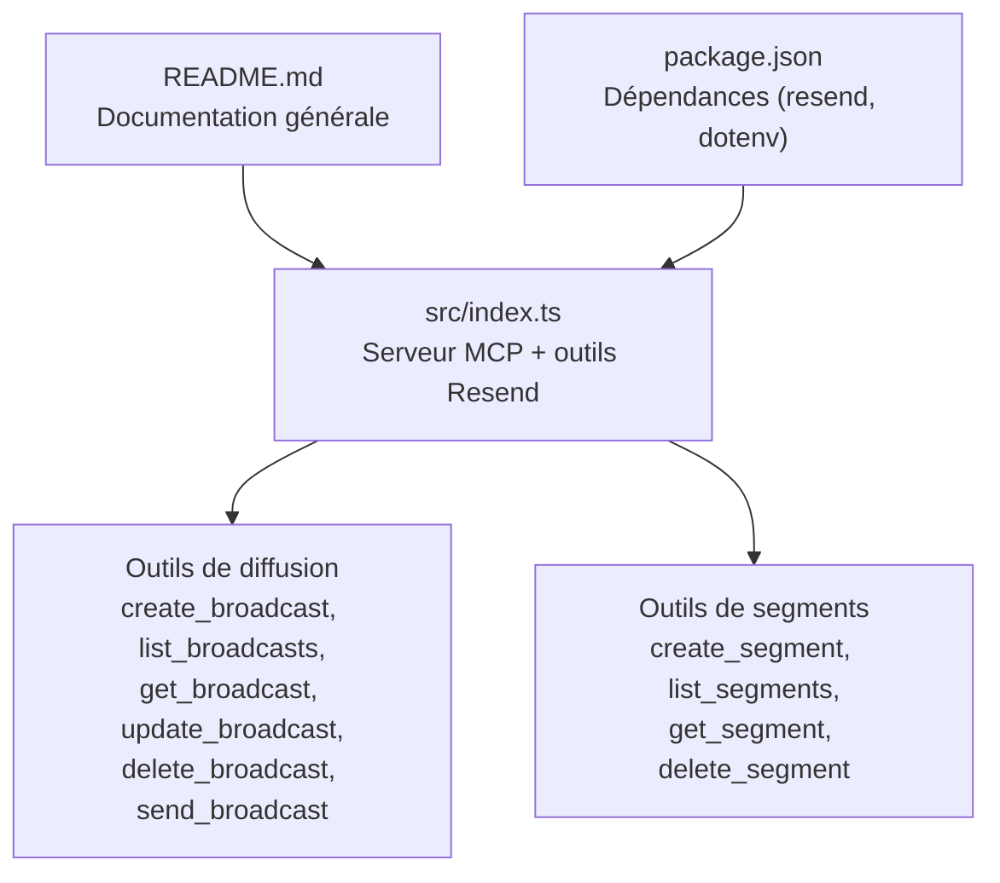
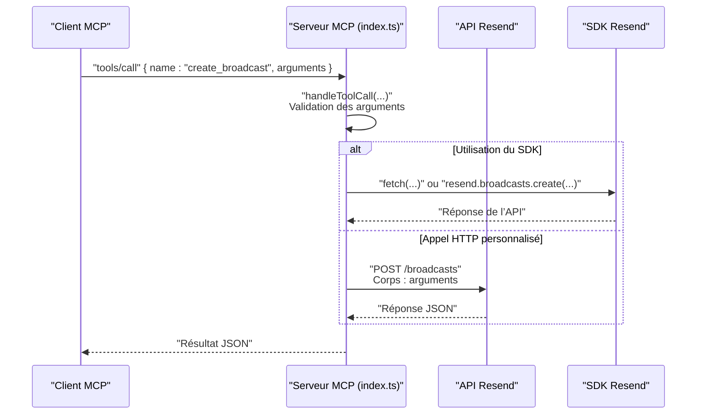
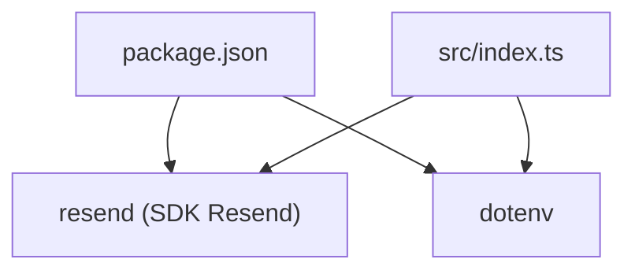

# Création de Broadcast

<cite>
**Fichiers référencés dans ce document**
- [README.md](file://README.md)
- [package.json](file://package.json)
- [src/index.ts](file://src/index.ts)
</cite>

## Sommaire
1. [Introduction](#introduction)
2. [Structure du projet](#structure-du-projet)
3. [Composants principaux](#composants-principaux)
4. [Aperçu de l’architecture](#aperçu-de-l’architecture)
5. [Analyse détaillée des composants](#analyse-détaillée-des-composants)
6. [Analyse des dépendances](#analyse-des-dépendances)
7. [Considérations sur les performances](#considérations-sur-les-performances)
8. [Guide de dépannage](#guide-de-dépannage)
9. [Conclusion](#conclusion)
10. [Annexes](#annexes)

## Introduction
Ce document fournit une documentation complète de l’outil create_broadcast, qui permet de créer des campagnes de diffusion (broadcast) via l’API Resend. Il explique les paramètres requis et optionnels, les bonnes pratiques, les contraintes de validation, et les relations avec les segments de contacts. Des exemples concrets sont inclus pour guider la mise en œuvre de campagnes efficaces.

## Structure du projet
Le projet est un serveur MCP (Model Context Protocol) qui expose l’intégralité de l’API Resend sous forme d’outils invocables. Le point d’entrée principal est le fichier d’implémentation du serveur.

**Diagramme sources**
- [src/index.ts](file://src/index.ts#L683-L764)
- [README.md](file://README.md#L74-L81)

**Section sources**
- [README.md](file://README.md#L472-L491)
- [package.json](file://package.json#L1-L49)

## Composants principaux
- Outils de diffusion : ensemble d’outils pour gérer les campagnes de diffusion (création, mise à jour, suppression, listing, envoi).
- Outils de segments : gestion des segments de contacts (création, listing, récupération, suppression).
- Serveur MCP : interface d’exécution des outils via stdin/stdout, avec validation des arguments et erreurs structurées.

**Section sources**
- [src/index.ts](file://src/index.ts#L683-L764)
- [src/index.ts](file://src/index.ts#L832-L879)

## Aperçu de l’architecture
Le serveur MCP expose les outils de diffusion comme des appels d’outil. Lorsqu’un outil est invoqué, le serveur effectue un appel HTTP à l’API Resend (ou utilise le SDK Resend pour certains outils). Pour create_broadcast, l’appel est effectué via un POST vers l’endpoint /broadcasts.

**Diagramme sources**
- [src/index.ts](file://src/index.ts#L1008-L1522)
- [src/index.ts](file://src/index.ts#L1312-L1319)

## Analyse détaillée des composants

### Outil create_broadcast
- Objectif : créer une nouvelle campagne de diffusion.
- Méthode d’appel : tools/call avec name="create_broadcast".
- Entrées attendues (paramètres) :
  - name : chaîne (optionnel)
  - segment_id : chaîne (requis)
  - from : chaîne (requis)
  - subject : chaîne (requis)
  - reply_to : tableau de chaînes (optionnel)
  - preview_text : chaîne (optionnel)
  - html : chaîne (optionnel)
  - text : chaîne (optionnel)
  - send : booléen (optionnel)
  - scheduled_at : chaîne au format ISO 8601 (optionnel)
- Contraintes de validation :
  - Les champs from, subject, segment_id sont requis.
  - Le champ send contrôle si la diffusion est envoyée immédiatement (true) ou conservée en brouillon (false).
  - scheduled_at permet de programmer l’envoi.
- Sortie : objet représentant la diffusion créée (structure retournée par l’API Resend).

Exemples concrets de création de broadcast (sans contenu de code, mais avec chemins de référence) :

- Création d’une diffusion immédiate à partir d’un segment
  - Références : [create_broadcast](file://src/index.ts#L683-L703), [appel HTTP](file://src/index.ts#L1312-L1319)
- Création d’une diffusion programmée
  - Références : [inputSchema scheduled_at](file://src/index.ts#L699), [send_broadcast](file://src/index.ts#L754-L764), [appel HTTP send](file://src/index.ts#L1349-L1356)

Contraintes de validation et bonnes pratiques :
- Paramètres requis : from, subject, segment_id.
- Utilisez soit html, soit text, soit les deux selon vos besoins.
- Définissez preview_text pour améliorer le taux d’ouverture.
- Utilisez reply_to pour rediriger les réponses si nécessaire.
- Planifiez l’envoi avec scheduled_at si vous souhaitez différer l’expédition.
- Pour envoyer immédiatement, utilisez send=true (ou omettez send, qui est optionnel).
- Pour garder en brouillon, laissez send=false (ou omettez send, qui est optionnel).

Relations avec les segments de contacts :
- Le segment_id identifie le groupe de destinataires.
- Avant de créer une diffusion, assurez-vous qu’un segment existe et contient des contacts.
- Références : [create_segment](file://src/index.ts#L833-L844), [list_segments](file://src/index.ts#L847-L856), [get_segment](file://src/index.ts#L859-L867), [delete_segment](file://src/index.ts#L870-L879).

**Section sources**
- [src/index.ts](file://src/index.ts#L683-L703)
- [src/index.ts](file://src/index.ts#L1312-L1319)
- [src/index.ts](file://src/index.ts#L833-L844)

### Autres outils liés aux broadcasts
- list_broadcasts : récupérer toutes les campagnes.
- get_broadcast : obtenir les détails d’une diffusion spécifique.
- update_broadcast : modifier une diffusion en brouillon.
- delete_broadcast : supprimer une diffusion en brouillon.
- send_broadcast : envoyer ou programmer une diffusion.

Exemples d’utilisation (chemins de référence) :
- [list_broadcasts](file://src/index.ts#L705-L711)
- [get_broadcast](file://src/index.ts#L713-L722)
- [update_broadcast](file://src/index.ts#L724-L741)
- [delete_broadcast](file://src/index.ts#L743-L752)
- [send_broadcast](file://src/index.ts#L754-L764)

**Section sources**
- [src/index.ts](file://src/index.ts#L705-L764)

### Outils de segments associés
- create_segment : créer un segment pour cibler des contacts.
- list_segments : lister les segments.
- get_segment : obtenir les détails d’un segment.
- delete_segment : supprimer un segment.

**Section sources**
- [src/index.ts](file://src/index.ts#L833-L879)

## Analyse des dépendances
- Dépendances principales : Resend SDK (client HTTP pour l’API Resend), dotenv (chargement des variables d’environnement).
- Version minimale de Node.js : >= 18.0.0.
- Scripts de développement et exécution : build, start, dev, postinstall.

**Diagramme sources**
- [package.json](file://package.json#L32-L40)
- [src/index.ts](file://src/index.ts#L1-L7)

**Section sources**
- [package.json](file://package.json#L1-L49)

## Considérations sur les performances
- Le serveur MCP respecte les limites de taux de l’API Resend (par défaut 2 requêtes/seconde). L’implémentation gère automatiquement les tentatives en cas de dépassement.
- Pour les envois massifs, préférez les segments bien ciblés et planifiez les envois pour éviter les pics de trafic.

**Section sources**
- [README.md](file://README.md#L518-L527)

## Guide de dépannage
- Erreur : "RESEND_API_KEY environment variable is not set"
  - Solution : ajoutez votre clé API Resend dans un fichier .env.
  - Référence : [message d’erreur](file://src/index.ts#L1572-L1577)
- Erreur : "Tool execution failed"
  - Causes possibles : clé API invalide, paramètres manquants, dépassement de limite de taux, problèmes réseau.
  - Référence : [gestion des erreurs](file://src/index.ts#L1519-L1522)
- Erreur : "Unknown tool"
  - Solution : vérifiez le nom de l’outil via tools/list.
  - Référence : [switch default](file://src/index.ts#L1516-L1518)

**Section sources**
- [src/index.ts](file://src/index.ts#L1516-L1522)
- [src/index.ts](file://src/index.ts#L1572-L1577)

## Conclusion
L’outil create_broadcast permet de créer facilement des campagnes de diffusion ciblées via des segments de contacts. En respectant les paramètres requis, en planifiant les envois, et en utilisant des contenus HTML/Text adaptés, vous pouvez mener des campagnes efficaces. Le serveur MCP fournit une interface standardisée pour interagir avec l’API Resend, tout en gérant les validations et les erreurs de manière structurée.

## Annexes
- Exemples d’appels directs (chemins de référence) :
  - [Exemple de création de broadcast](file://README.md#L417-L433)
- Configuration de base (variables d’environnement) :
  - [Variables d’environnement](file://README.md#L182-L207)

**Section sources**
- [README.md](file://README.md#L417-L433)
- [README.md](file://README.md#L182-L207)