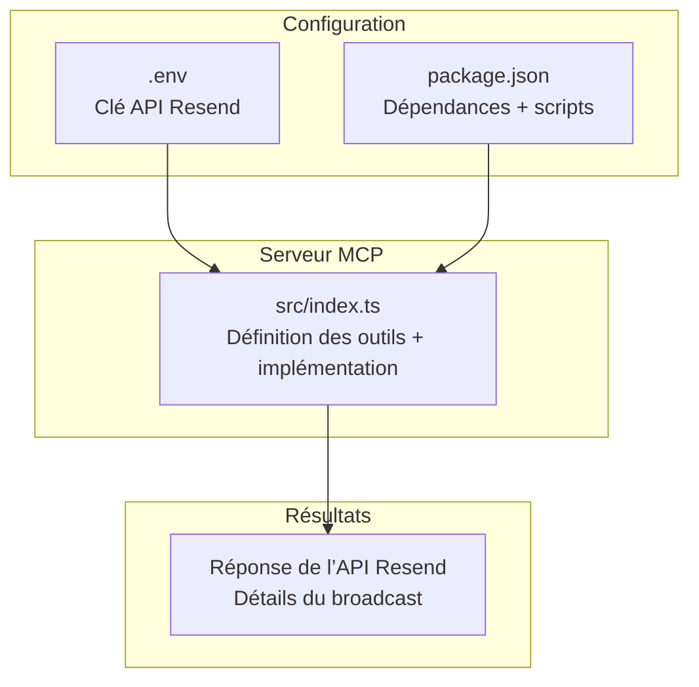
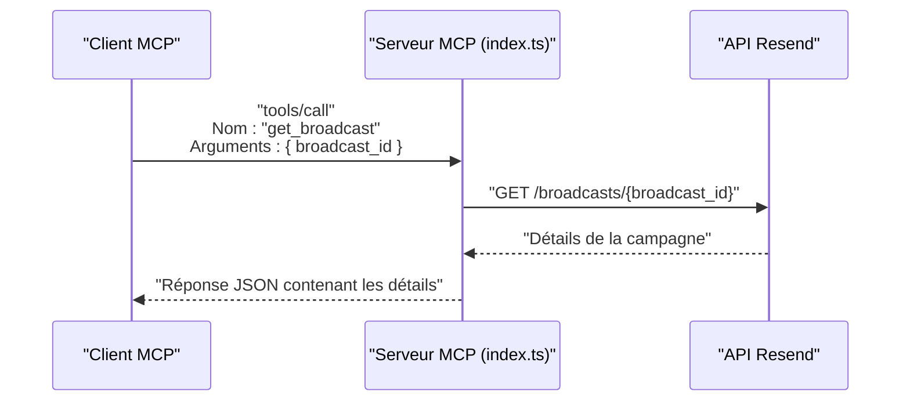
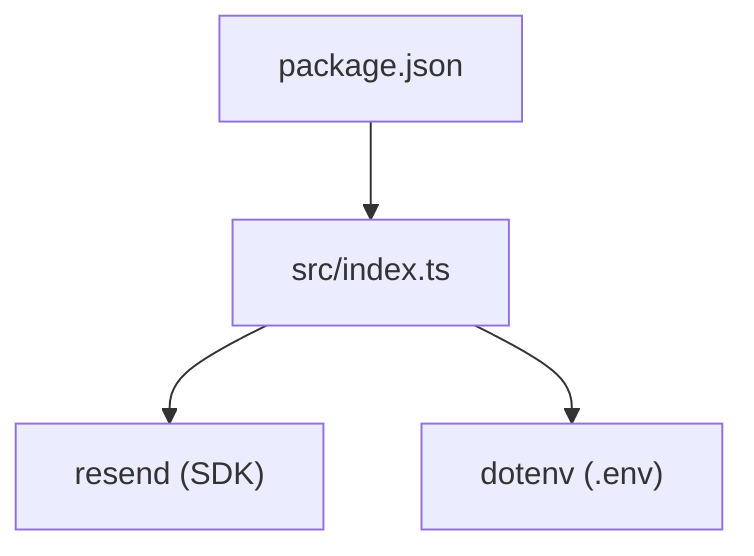

# Détails d'un Broadcast

<cite>
**Fichiers référencés dans ce document**
- [README.md](file://README.md)
- [package.json](file://package.json)
- [src/index.ts](file://src/index.ts)
</cite>

## Sommaire
1. [Introduction](#introduction)
2. [Structure du projet](#structure-du-projet)
3. [Composants principaux](#composants-principaux)
4. [Aperçu de l’architecture](#aperçu-de-l’architecture)
5. [Analyse détaillée des composants](#analyse-détaillée-des-composants)
6. [Analyse des dépendances](#analyse-des-dépendances)
7. [Considérations sur les performances](#considérations-sur-les-performances)
8. [Guide de dépannage](#guide-de-dépannage)
9. [Conclusion](#conclusion)

## Introduction
Ce document fournit une documentation complète de l’outil get_broadcast, qui permet de récupérer les détails complets d’une campagne diffusée (broadcast) à partir de son identifiant unique (broadcast_id). Vous apprendrez à interroger cette information, à comprendre tous les champs retournés (contenu, paramètres d’envoi, statut actuel, métadonnées), et à utiliser ces données pour suivre l’état d’une campagne.

## Structure du projet
Le projet est un serveur MCP (Model Context Protocol) qui expose l’intégralité de l’API Resend sous forme d’outils invocables. Le point d’entrée principal est le fichier source TypeScript qui définit les outils, leurs schémas d’entrée, ainsi que les implémentations des appels vers l’API Resend.

**Diagramme sources**
- [src/index.ts](file://src/index.ts#L1-L120)
- [package.json](file://package.json#L1-L49)

**Section sources**
- [README.md](file://README.md#L1-L120)
- [package.json](file://package.json#L1-L49)

## Composants principaux
- Outil get_broadcast : Récupère les détails d’une campagne diffusée à partir de son broadcast_id.
- Schéma d’entrée : Un seul champ requis : broadcast_id.
- Implémentation : Appel HTTP à l’API Resend pour obtenir les détails de la campagne.

**Section sources**
- [src/index.ts](file://src/index.ts#L712-L722)
- [src/index.ts](file://src/index.ts#L1326-L1329)

## Aperçu de l’architecture
Le serveur MCP reçoit des requêtes via stdin, exécute l’outil demandé, puis renvoie une réponse au format JSON via stdout. Pour get_broadcast, le serveur effectue une requête HTTP GET vers l’API Resend pour récupérer les détails de la campagne.

**Diagramme sources**
- [src/index.ts](file://src/index.ts#L1536-L1565)
- [src/index.ts](file://src/index.ts#L1326-L1329)

## Analyse détaillée des composants

### Outil get_broadcast
- Nom : get_broadcast
- Description : Récupère les détails d’une campagne diffusée.
- Entrées attendues :
  - broadcast_id : Identifiant unique de la campagne (chaîne de caractères, requis).
- Sortie : Réponse JSON contenant les détails de la campagne (structure définie par l’API Resend).
- Implémentation : Appel HTTP GET à l’URL de l’API Resend pour le broadcast spécifié.

Exemple de flux d’appel (représentatif) :
- Méthode : tools/call
- Nom de l’outil : get_broadcast
- Arguments : { broadcast_id: "id_de_la_campagne" }

**Section sources**
- [src/index.ts](file://src/index.ts#L712-L722)
- [src/index.ts](file://src/index.ts#L1326-L1329)

### Champs retournés par get_broadcast
Les champs exacts sont définis par l’API Resend. Voici une vue générale de ce que vous pouvez attendre (les noms réels sont ceux de l’API Resend) :

- Informations de base
  - id : Identifiant unique de la campagne
  - name : Nom de la campagne
  - audience_id : Identifiant de l’audience ou segment ciblé
  - status : Statut courant de la campagne (ex. : draft, scheduled, sent, etc.)
  - created_at : Date de création de la campagne
  - updated_at : Date de dernière mise à jour

- Paramètres d’envoi
  - from : Adresse expéditrice
  - subject : Sujet de l’e-mail
  - reply_to : Adresses de réponse
  - preview_text : Texte d’aperçu (facultatif)
  - html : Contenu HTML
  - text : Contenu texte brut

- Métadonnées
  - segments : Informations sur le segment ciblé
  - tags : Balises associées (si configurées)
  - stats : Statistiques de diffusion (selon l’API Resend)

Remarque : Pour connaître la structure exacte des champs, consultez la documentation officielle de l’API Resend.

**Section sources**
- [README.md](file://README.md#L74-L81)
- [src/index.ts](file://src/index.ts#L684-L764)

### Suivi de l’état d’une campagne
- Utilisez le champ status pour connaître l’état courant de la campagne (ex. : draft, scheduled, sent).
- Pour les statistiques détaillées (ouvraient, cliqués, rebondis, etc.), consultez les événements webhooks ou les outils liés aux statistiques si disponibles dans votre version de l’API Resend.
- Si la campagne est planifiée, le champ scheduled_at indique l’heure prévue d’envoi.

**Section sources**
- [README.md](file://README.md#L89-L98)
- [src/index.ts](file://src/index.ts#L1349-L1356)

### Exemples de réponse (structure indicative)
Voici un exemple de structure de réponse attendue (les champs peuvent varier selon l’API Resend) :

- id : "identifiant_unique"
- name : "Nom de la campagne"
- audience_id : "identifiant_de_l_audience"
- status : "draft | scheduled | sent"
- from : "expediteur@domaine.com"
- subject : "Sujet de l’e-mail"
- reply_to : ["reponse@domaine.com"]
- preview_text : "Texte d’aperçu"
- html : "
Contenu HTML
"
- text : "Contenu texte brut"
- created_at : "YYYY-MM-DDTHH:mm:ssZ"
- updated_at : "YYYY-MM-DDTHH:mm:ssZ"
- segments : { /* informations sur le segment */ }
- tags : [{ name: "tag1", value: "valeur1" }]
- stats : { /* statistiques de diffusion */ }

Remarque : Cette structure est indicative. Reportez-vous à la documentation officielle de l’API Resend pour les champs exacts.

**Section sources**
- [src/index.ts](file://src/index.ts#L684-L764)

## Analyse des dépendances
- Dépendance principale : Package Resend (SDK Node.js) utilisé pour appeler l’API Resend.
- Configuration : La clé API Resend est chargée depuis le fichier .env.
- Scripts : Le projet peut être construit avec TypeScript et démarré via Node.js.

**Diagramme sources**
- [package.json](file://package.json#L32-L35)
- [src/index.ts](file://src/index.ts#L1-L7)

**Section sources**
- [package.json](file://package.json#L1-L49)
- [src/index.ts](file://src/index.ts#L1-L7)

## Considérations sur les performances
- Le serveur respecte les limites de taux d’appels de l’API Resend (par défaut 2 requêtes/seconde).
- En cas de dépassement, le serveur gère automatiquement les tentatives de nouvelle requête.

**Section sources**
- [README.md](file://README.md#L518-L527)

## Guide de dépannage
- Erreur : Clé API manquante
  - Message : "RESEND_API_KEY environment variable is not set"
  - Solution : Créez un fichier .env avec votre clé API Resend.
- Erreur : Outil inconnu
  - Message : "Unknown tool: ..."
  - Solution : Vérifiez le nom de l’outil avec tools/list.
- Erreur : Échec de l’exécution de l’outil
  - Cause possible : Paramètres incorrects, clé API invalide, dépassement de limite de taux.
  - Solution : Vérifiez les logs et corrigez les paramètres.

**Section sources**
- [src/index.ts](file://src/index.ts#L1571-L1577)
- [src/index.ts](file://src/index.ts#L1516-L1522)
- [README.md](file://README.md#L551-L573)

## Conclusion
L’outil get_broadcast permet de récupérer l’ensemble des détails d’une campagne diffusée à partir de son broadcast_id. Grâce aux champs retournés (informations de base, paramètres d’envoi, statut, métadonnées), vous pouvez facilement suivre l’état d’une campagne et prendre des décisions basées sur ses données. Pour des statistiques avancées, utilisez les événements webhooks ou les outils supplémentaires de l’API Resend.