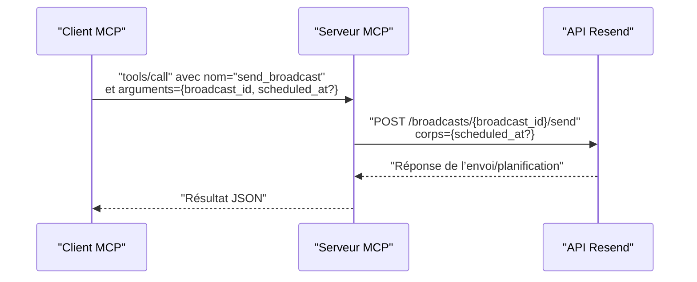

# Envoi d'un Broadcast

<cite>
**Fichiers référencés dans ce document**
- [README.md](file://README.md)
- [package.json](file://package.json)
- [src/index.ts](file://src/index.ts)
</cite>

## Sommaire
1. [Introduction](#introduction)
2. [Prérequis et configuration](#prérequis-et-configuration)
3. [Vue d’ensemble de l’outil send_broadcast](#vue-densemble-de-loutil-send_broadcast)
4. [Options de planification](#options-de-planification)
5. [Différences entre envoi immédiat et programmé](#différences-entre-envoi-immédiat-et-programmé)
6. [Vérifications préalables](#vérifications-préalables)
7. [Exemples d’utilisation](#exemples-dutilisation)
8. [Gestion des erreurs](#gestion-des-erreurs)
9. [Architecture technique](#architecture-technique)
10. [Conclusion](#conclusion)

## Introduction
Cet outil permet d’envoyer immédiatement ou de programmer l’envoi d’une campagne de diffusion (broadcast) à partir de son identifiant unique (broadcast_id). Il s’agit de l’outil send_broadcast, qui fait partie de l’ensemble des outils de diffusion fournis par le serveur MCP Resend. Ce document explique comment l’utiliser, comment planifier un envoi, les différences entre envoi immédiat et programmé, les vérifications préalables, ainsi que la gestion des erreurs.

## Prérequis et configuration
- Une clé API Resend valide est requise. Elle doit être définie dans une variable d’environnement RESEND_API_KEY.
- Le serveur MCP est exécutable via npx ou npm, et peut être utilisé depuis des clients compatibles MCP (comme Claude Desktop, Continue, Cline, etc.).

**Section sources**
- [README.md](file://README.md#L127-L210)
- [package.json](file://package.json#L1-L49)

## Vue d’ensemble de l’outil send_broadcast
L’outil send_broadcast permet de :
- Envoyer immédiatement une campagne de diffusion (envoi immédiat).
- Programmer l’envoi d’une campagne de diffusion à une date et heure précises (envoi programmé).

Il prend en entrée l’identifiant unique de la campagne (broadcast_id) et, optionnellement, une date de planification au format ISO 8601 (scheduled_at). Si scheduled_at n’est pas fourni, l’envoi est effectué immédiatement.

**Section sources**
- [src/index.ts](file://src/index.ts#L754-L764)

## Options de planification
- broadcast_id : identifiant unique de la campagne de diffusion à envoyer.
- scheduled_at (optionnel) : date et heure de planification de l’envoi au format ISO 8601. Si cette valeur est absente, l’envoi est immédiat.

**Section sources**
- [src/index.ts](file://src/index.ts#L754-L764)

## Différences entre envoi immédiat et programmé
- Envoi immédiat : l’envoi est déclenché immédiatement si le broadcast existe et est prêt. Aucune date de planification n’est requise.
- Envoi programmé : l’envoi est différé jusqu’à la date spécifiée via scheduled_at. La date doit être au format ISO 8601.

**Section sources**
- [src/index.ts](file://src/index.ts#L754-L764)

## Vérifications préalables
Avant d’appeler send_broadcast, il est recommandé de :
- Vérifier que le broadcast_id est valide et correspond à une campagne existante.
- Pour un envoi programmé, s’assurer que la date scheduled_at est au format ISO 8601 et qu’elle est postérieure à l’instant présent.
- S’assurer que le serveur MCP est démarré et que la clé API RESEND_API_KEY est correctement configurée.

**Section sources**
- [README.md](file://README.md#L127-L210)
- [src/index.ts](file://src/index.ts#L754-L764)

## Exemples d’utilisation
Voici des scénarios typiques illustrant l’utilisation de l’outil send_broadcast :

- Envoi immédiat
  - Utiliser l’outil send_broadcast avec broadcast_id uniquement.
  - Le serveur enverra la campagne immédiatement.

- Planification future
  - Utiliser l’outil send_broadcast avec broadcast_id et scheduled_at (au format ISO 8601).
  - Le serveur planifie l’envoi à la date indiquée.

- Création d’un broadcast avant envoi
  - Avant d’envoyer, créer la campagne avec l’outil create_broadcast, puis récupérer son broadcast_id.
  - Ensuite, appeler send_broadcast avec ce broadcast_id.

Remarque : Les appels directs à l’outil sont effectués via le protocole MCP. Pour plus d’exemples d’appel d’outils, reportez-vous à la documentation du projet.

**Section sources**
- [README.md](file://README.md#L408-L444)
- [src/index.ts](file://src/index.ts#L684-L764)

## Gestion des erreurs
Le serveur MCP renvoie des messages d’erreur détaillés en cas d’échec de l’opération. Voici quelques cas fréquents :
- Erreur d’authentification : clé API manquante ou invalide.
- Erreur de validation : paramètres incorrects (par exemple, broadcast_id inexistant, format de date incorrect).
- Erreur de ressource : la campagne n’existe pas.
- Erreur de taux de requêtes : dépassement de la limite de requêtes autorisée.
- Erreur de serveur : problème temporaire du service Resend.

Pour chaque erreur, le serveur retourne un message contenant l’erreur, le nom de l’outil et les arguments fournis.

**Section sources**
- [README.md](file://README.md#L528-L568)
- [src/index.ts](file://src/index.ts#L1516-L1522)

## Architecture technique
Le serveur MCP Resend expose tous les outils Resend sous forme d’invocations. L’outil send_broadcast est implémenté comme suit :
- Définition de l’outil : schéma d’entrée incluant broadcast_id et scheduled_at.
- Implémentation de l’appel : requête HTTP POST vers l’API Resend pour envoyer ou planifier la diffusion.
- Gestion des erreurs : capture des exceptions et renvoi d’un message d’erreur structuré.

**Diagram sources**
- [src/index.ts](file://src/index.ts#L754-L764)
- [src/index.ts](file://src/index.ts#L1349-L1356)

**Section sources**
- [src/index.ts](file://src/index.ts#L1008-L1522)

## Conclusion
L’outil send_broadcast permet de gérer à la fois l’envoi immédiat et la planification de campagnes de diffusion. Pour garantir un bon fonctionnement, veillez à fournir un broadcast_id valide, à respecter le format ISO 8601 pour scheduled_at si vous planifiez, et à disposer d’une configuration correcte de la clé API. En cas d’erreur, consultez les messages retournés par le serveur MCP pour diagnostiquer la cause.