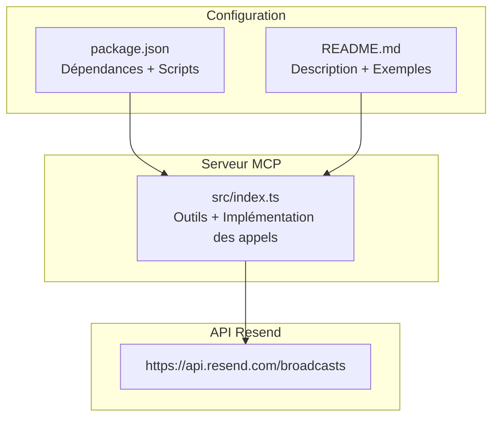
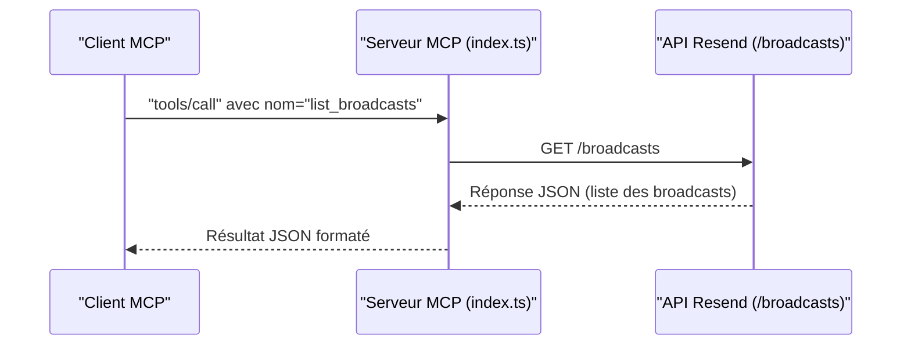
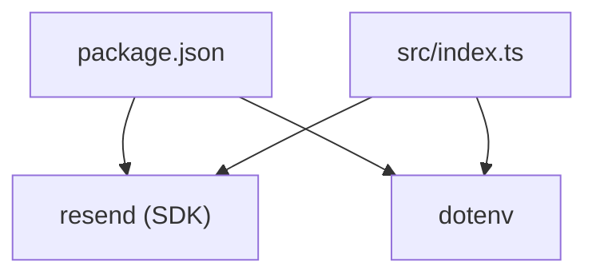

# Liste des Broadcasts

<cite>
**Fichiers référencés dans ce document**
- [README.md](file://README.md)
- [package.json](file://package.json)
- [src/index.ts](file://src/index.ts)
</cite>

## Sommaire
1. [Introduction](#introduction)
2. [Structure du projet](#structure-du-projet)
3. [Composants principaux](#composants-principaux)
4. [Aperçu de l’architecture](#aperçu-de-larchitecture)
5. [Analyse détaillée des composants](#analyse-détaillée-des-composants)
6. [Analyse des dépendances](#analyse-des-dépendances)
7. [Considérations sur les performances](#considérations-sur-les-performances)
8. [Guide de dépannage](#guide-de-dépannage)
9. [Conclusion](#conclusion)
10. [Annexes](#annexes)

## Introduction
Ce document fournit une documentation complète de l’outil list_broadcasts, qui permet de récupérer toutes les campagnes de diffusion (broadcasts) de votre compte Resend. Il explique comment utiliser les options de pagination (limit, after, before), comment interpréter les différents statuts des broadcasts (draft, scheduled, sent), et propose des exemples de requêtes pour filtrer par statut et trier les résultats.

## Structure du projet
Le projet est un serveur MCP (Model Context Protocol) qui expose l’intégralité de l’API Resend sous forme d’outils invocables. Le cœur de l’implémentation se trouve dans le fichier principal, où sont définis les outils, leurs schémas d’entrée, ainsi que les implémentations des appels à l’API Resend.

**Diagramme sources**
- [src/index.ts](file://src/index.ts#L1008-L1522)
- [package.json](file://package.json#L1-L49)
- [README.md](file://README.md#L1-L721)

**Section sources**
- [README.md](file://README.md#L1-L721)
- [package.json](file://package.json#L1-L49)
- [src/index.ts](file://src/index.ts#L1008-L1522)

## Composants principaux
- Outil list_broadcasts : Permet de récupérer toutes les campagnes de diffusion de votre compte.
- Pagination : Utilise les paramètres limit, after, before pour contrôler le nombre d’éléments retournés et naviguer dans les résultats.
- Statuts des broadcasts : draft, scheduled, sent (selon la documentation Resend).
- Implémentation : Appel HTTP à l’API Resend pour la liste des broadcasts.

**Section sources**
- [src/index.ts](file://src/index.ts#L704-L711)
- [src/index.ts](file://src/index.ts#L1321-L1324)

## Aperçu de l’architecture
L’outil list_broadcasts est exposé comme un outil MCP. Lorsqu’un client MCP appelle cet outil, le serveur exécute le handler correspondant, qui effectue un appel HTTP à l’API Resend pour récupérer la liste des broadcasts.

**Diagramme sources**
- [src/index.ts](file://src/index.ts#L1536-L1564)
- [src/index.ts](file://src/index.ts#L1321-L1324)

## Analyse détaillée des composants

### Outil list_broadcasts
- Nom : list_broadcasts
- Description : Récupère toutes les campagnes de diffusion de votre compte.
- Schéma d’entrée : Aucun paramètre requis. Pourtant, l’implémentation actuelle ne traite pas de paramètres de pagination (limit, after, before) dans le handler de cet outil. Cela signifie que la pagination n’est pas prise en compte actuellement pour cette requête.

Implémentation actuelle de l’appel :
- Méthode : GET
- Endpoint : /broadcasts
- Headers : Authorization + Content-Type
- Retour : Réponse JSON contenant la liste des broadcasts

**Section sources**
- [src/index.ts](file://src/index.ts#L704-L711)
- [src/index.ts](file://src/index.ts#L1321-L1324)

### Pagination
- Paramètres attendus selon la documentation Resend : limit, after, before
- Implémentation actuelle : L’outil list_broadcasts ne construit pas de requête paginée. Pour bénéficier de la pagination, il faudrait modifier le handler pour ajouter ces paramètres à la requête.

Exemple de requête paginée (conceptuel) :
- GET /broadcasts?limit={N}&after={cursor}&before={cursor}

**Section sources**
- [src/index.ts](file://src/index.ts#L1321-L1324)

### Statuts des broadcasts
- draft : Campagne créée mais non envoyée.
- scheduled : Campagne planifiée pour une date donnée.
- sent : Campagne envoyée.

Ces statuts proviennent de la documentation Resend. Ils peuvent être présents dans les données retournées par l’API Resend lors de la récupération des broadcasts.

**Section sources**
- [README.md](file://README.md#L74-L81)

### Interprétation des résultats
- La réponse est au format JSON. Elle contient la liste des broadcasts avec leurs propriétés (nom, statut, dates, etc.).
- Pour filtrer ou trier, vous pouvez :
  - Filtrer par statut : Ajouter un filtre côté client sur le champ statut.
  - Trier : Effectuer un tri sur le tableau des résultats retournés.

**Section sources**
- [src/index.ts](file://src/index.ts#L1321-L1324)

### Exemples de requêtes
Voici des exemples de requêtes que vous pouvez envoyer via un client MCP pour interagir avec l’outil list_broadcasts. Remplacez simplement les valeurs entre accolades par celles de votre choix.

- Récupérer tous les broadcasts (sans pagination) :
  - Méthode : tools/call
  - Nom de l’outil : list_broadcasts
  - Arguments : aucun

- Récupérer les broadcasts avec pagination (conceptuel, implémentation actuelle ne prend pas en compte limit/after/before) :
  - Méthode : tools/call
  - Nom de l’outil : list_broadcasts
  - Arguments : { limit: N, after: "cursor", before: "cursor" }

- Filtrer par statut (conceptuel, à faire côté client) :
  - Récupérer tous les broadcasts
  - Filtrer le tableau retourné pour ne garder que les éléments dont le statut est "sent", "scheduled" ou "draft"

- Trier les résultats (conceptuel, à faire côté client) :
  - Trier le tableau retourné par date de création ou par statut

Remarque : Les deux derniers exemples sont des usages conceptuels car l’implémentation actuelle de l’outil list_broadcasts ne traite pas les paramètres de pagination. Pour bénéficier de la pagination, il faudrait modifier le handler de l’outil.

**Section sources**
- [src/index.ts](file://src/index.ts#L704-L711)
- [src/index.ts](file://src/index.ts#L1321-L1324)

## Analyse des dépendances
- Dépendance principale : Package Resend (SDK Node.js) utilisé pour appeler l’API Resend.
- Autres dépendances : dotenv pour gérer les variables d’environnement.
- Scripts : build, start, dev, postinstall.

**Diagramme sources**
- [package.json](file://package.json#L32-L40)
- [src/index.ts](file://src/index.ts#L1-L7)

**Section sources**
- [package.json](file://package.json#L32-L40)
- [src/index.ts](file://src/index.ts#L1-L7)

## Considérations sur les performances
- Le serveur MCP respecte les limites de taux de l’API Resend (par défaut 2 requêtes/seconde). Cela signifie qu’il peut limiter la fréquence des appels si nécessaire.
- Pour des volumes élevés de données, utilisez la pagination (limit, after, before) pour limiter la taille des réponses et améliorer la rapidité de traitement.

**Section sources**
- [README.md](file://README.md#L518-L527)

## Guide de dépannage
- Erreur d’authentification : Si l’environnement n’est pas configuré correctement, le serveur indiquera que la clé API Resend n’est pas définie. Vérifiez votre fichier .env.
- Erreur d’exécution de l’outil : Si l’outil n’est pas reconnu ou si une erreur survient lors de l’appel, le serveur renverra un message d’erreur détaillé. Vérifiez le nom de l’outil et ses arguments.

**Section sources**
- [src/index.ts](file://src/index.ts#L1571-L1577)
- [src/index.ts](file://src/index.ts#L1552-L1563)

## Conclusion
L’outil list_broadcasts permet de récupérer toutes les campagnes de diffusion de votre compte Resend. Actuellement, il ne prend pas en charge la pagination (limit, after, before). Pour bénéficier de cette fonctionnalité, il faudrait modifier l’implémentation du handler de l’outil. En attendant, vous pouvez filtrer et trier les résultats côté client après récupération de la liste complète.

## Annexes
- Documentation officielle Resend : [https://resend.com/docs](https://resend.com/docs)
- Référence de l’API Resend : [https://resend.com/docs/api-reference](https://resend.com/docs/api-reference)