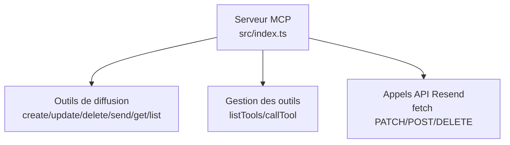
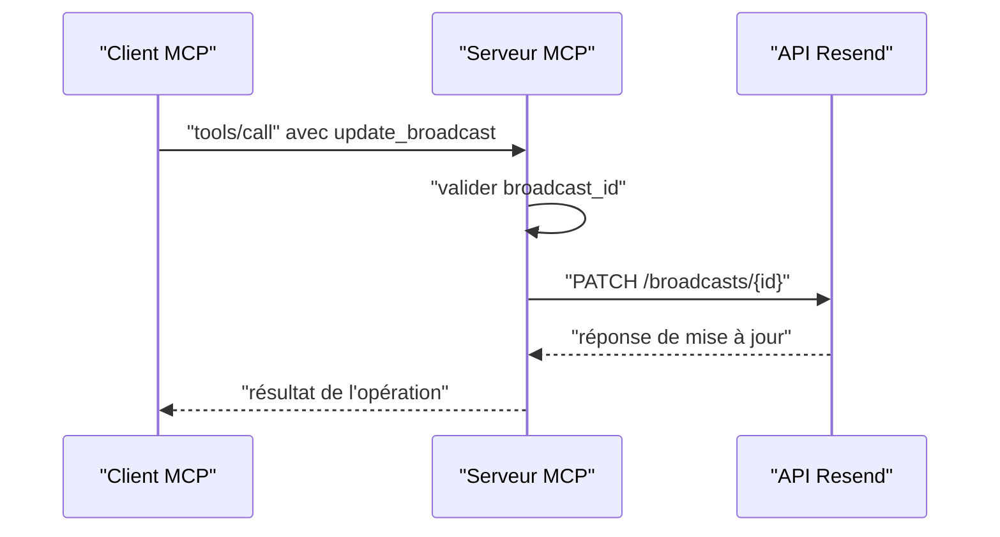

# Mise à Jour d'un Broadcast

<cite>
**Fichiers référencés dans ce document**
- [README.md](file://README.md)
- [index.ts](file://src/index.ts)
- [package.json](file://package.json)
</cite>

## Sommaire
1. [Introduction](#introduction)
2. [Objectif de la documentation](#objectif-de-la-documentation)
3. [Contexte technique](#contexte-technique)
4. [Structure du projet](#structure-du-projet)
5. [Outils de diffusion](#outils-de-diffusion)
6. [Mise à jour d’un broadcast](#mise-à-jour-dun-broadcast)
7. [Champs modifiables](#champs-modifiables)
8. [Restrictions et limitations](#restrictions-et-limitations)
9. [Exemples de mises à jour](#exemples-de-mises-à-jour)
10. [Flux de mise à jour](#flux-de-mise-à-jour)
11. [Bonnes pratiques](#bonnes-pratiques)
12. [Conclusion](#conclusion)

## Introduction
Cette documentation explique comment modifier une campagne de diffusion au format brouillon à l’aide de l’outil update_broadcast. Elle détaille les champs pouvant être mis à jour, les limitations selon le statut de la campagne, et fournit des exemples concrets de mises à jour partielles et complètes.

## Objectif de la documentation
- Comprendre comment utiliser l’outil update_broadcast pour modifier un brouillon de diffusion
- Identifier les champs modifiables et leurs contraintes
- Savoir comment gérer les erreurs et les limitations liées au statut de la campagne
- Appliquer des mises à jour partielles ou complètes de manière sécurisée

## Contexte technique
Le projet expose un serveur Model Context Protocol (MCP) qui fournit l’intégralité de l’API Resend sous forme d’outils invocables. L’outil update_broadcast permet de modifier les propriétés d’une campagne de diffusion enregistrée en tant que brouillon.

**Section sources**
- [README.md](file://README.md#L74-L81)
- [index.ts](file://src/index.ts#L683-L765)

## Structure du projet
Le serveur MCP est implémenté dans un seul fichier TypeScript principal. Il définit l’ensemble des outils (y compris update_broadcast) ainsi que leur schéma d’entrée, puis exécute les appels vers l’API Resend.

**Diagramme sources**
- [index.ts](file://src/index.ts#L1008-L1522)

**Section sources**
- [index.ts](file://src/index.ts#L1-L1002)
- [package.json](file://package.json#L1-L49)

## Outils de diffusion
Voici les outils liés aux campagnes de diffusion disponibles dans le serveur MCP :

- create_broadcast : créer une nouvelle campagne de diffusion
- list_broadcasts : lister toutes les campagnes
- get_broadcast : récupérer les détails d’une campagne
- update_broadcast : modifier un brouillon de diffusion
- delete_broadcast : supprimer un brouillon
- send_broadcast : envoyer ou programmer une campagne

**Section sources**
- [README.md](file://README.md#L74-L81)
- [index.ts](file://src/index.ts#L683-L765)

## Mise à jour d’un broadcast
L’outil update_broadcast permet de modifier un brouillon de diffusion. Le schéma d’entrée définit les champs pouvant être mis à jour, ainsi qu’un champ obligatoire pour identifier la ressource à modifier.

### Schéma d’entrée de update_broadcast
- broadcast_id : identifiant de la campagne (obligatoire)
- name : nom de la campagne
- segment_id : identifiant du segment cible
- from : adresse expéditrice
- subject : sujet de l’e-mail
- reply_to : adresses de réponse
- preview_text : texte d’aperçu
- html : contenu HTML
- text : contenu texte

Remarque : tous les champs sont optionnels sauf broadcast_id.

**Section sources**
- [index.ts](file://src/index.ts#L724-L741)

## Champs modifiables
Voici les champs pouvant être mis à jour lors d’une modification de brouillon de diffusion :

- name : nom de la campagne
- segment_id : identifiant du segment cible
- from : adresse expéditrice
- subject : sujet de l’e-mail
- reply_to : adresses de réponse
- preview_text : texte d’aperçu
- html : contenu HTML
- text : contenu texte

Ces champs peuvent être fournis de manière partielle pour effectuer des mises à jour ciblées.

**Section sources**
- [index.ts](file://src/index.ts#L724-L741)

## Restrictions et limitations
- Statut de la campagne : l’outil update_broadcast ne peut être utilisé que pour les campagnes enregistrées en tant que brouillon. Si la campagne a déjà été envoyée ou programmée, les modifications seront soumises aux règles de l’API Resend.
- Champ obligatoire : broadcast_id est requis pour identifier la ressource à mettre à jour.
- Mise à jour partielle : seuls les champs fournis seront modifiés, les autres restent inchangés.
- Gestion des erreurs : toute erreur d’exécution est renvoyée avec un message d’erreur détaillé.

**Section sources**
- [index.ts](file://src/index.ts#L1331-L1339)

## Exemples de mises à jour
Voici des exemples de mises à jour de brouillon de diffusion, illustrant des scénarios courants.

### Exemple 1 : Mise à jour partielle (modification du sujet et du contenu HTML)
- Objectif : changer uniquement le sujet et le contenu HTML
- Champs fournis : broadcast_id, subject, html
- Résultat : seul le sujet et le contenu HTML sont mis à jour

### Exemple 2 : Mise à jour complète (tous les champs)
- Objectif : modifier entièrement le brouillon
- Champs fournis : broadcast_id, name, segment_id, from, subject, reply_to, preview_text, html, text
- Résultat : tous les champs sont mis à jour

### Exemple 3 : Modification de l’expéditeur et des adresses de réponse
- Objectif : changer l’adresse expéditrice et ajouter des adresses de réponse
- Champs fournis : broadcast_id, from, reply_to
- Résultat : l’expéditeur et les adresses de réponse sont mis à jour

Remarque : ces exemples illustrent la manière d’appeler l’outil update_broadcast. Pour chaque appel, vous devez fournir broadcast_id ainsi que les champs que vous souhaitez modifier.

**Section sources**
- [index.ts](file://src/index.ts#L724-L741)

## Flux de mise à jour
Le flux de mise à jour suit cette séquence :

**Diagramme sources**
- [index.ts](file://src/index.ts#L1331-L1339)

**Section sources**
- [index.ts](file://src/index.ts#L1008-L1522)

## Bonnes pratiques
- Utilisez toujours broadcast_id pour cibler la bonne campagne.
- Effectuez des mises à jour partielles pour éviter de réinitialiser des champs non désirés.
- Validez les données avant l’appel (par exemple, vérifiez la validité de l’adresse from).
- Gérez les erreurs renvoyées par le serveur MCP pour diagnostiquer rapidement les problèmes.
- Ne modifiez pas les campagnes déjà envoyées ou programmées via update_broadcast ; utilisez plutôt send_broadcast pour programmer un nouvel envoi.

## Conclusion
L’outil update_broadcast permet de modifier facilement un brouillon de diffusion en fournissant un sous-ensemble des champs nécessaires. En respectant les contraintes liées au statut de la campagne et en utilisant des mises à jour partielles, vous pouvez optimiser votre flux de travail de création de contenus de diffusion.