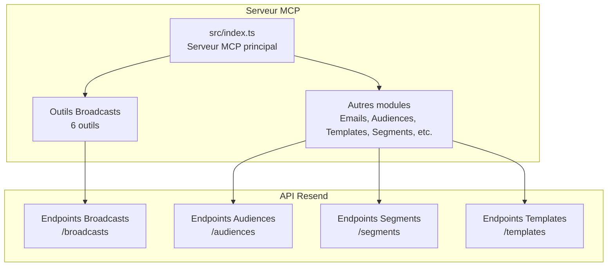
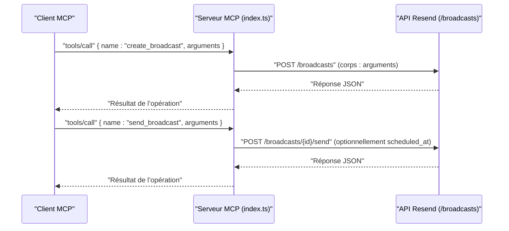
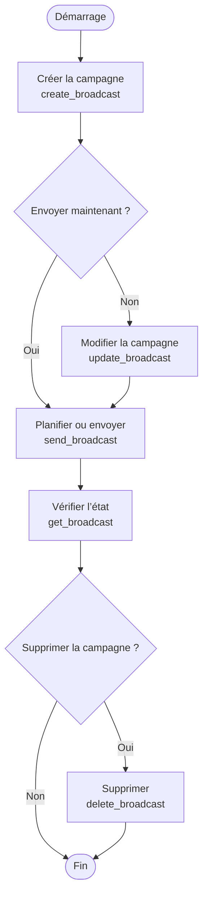

# Module Broadcasts

<cite>
**Fichiers référencés dans ce document**
- [README.md](file://README.md)
- [package.json](file://package.json)
- [src/index.ts](file://src/index.ts)
</cite>

## Sommaire
1. [Introduction](#introduction)
2. [Structure du projet](#structure-du-projet)
3. [Composants principaux](#composants-principaux)
4. [Aperçu de l’architecture](#aperçu-de-larchitecture)
5. [Analyse détaillée des composants](#analyse-détaillée-des-composants)
6. [Analyse des dépendances](#analyse-des-dépendances)
7. [Considérations sur les performances](#considérations-sur-les-performances)
8. [Guide de dépannage](#guide-de-dépannage)
9. [Conclusion](#conclusion)

## Introduction
Le module Broadcasts de l’API Resend permet de gérer des campagnes de diffusion à grande échelle. Ce document documente les six outils associés : create_broadcast, list_broadcasts, get_broadcast, update_broadcast, delete_broadcast, send_broadcast. Il explique comment créer, planifier, envoyer et supprimer des campagnes de diffusion, ainsi que leurs relations avec les segments, les modèles et les bonnes pratiques marketing.

## Structure du projet
Le projet est un serveur Model Context Protocol (MCP) qui expose l’intégralité de l’API Resend sous forme d’outils invocables. Le module Broadcasts fait partie des 12 modules couverts, chacun avec ses propres outils.

**Diagramme sources**
- [src/index.ts](file://src/index.ts#L1311-L1356)
- [src/index.ts](file://src/index.ts#L1528-L1565)

**Section sources**
- [README.md](file://README.md#L74-L80)
- [src/index.ts](file://src/index.ts#L1311-L1356)

## Composants principaux
Le module Broadcasts comprend six outils qui exposent les opérations CRUD sur les campagnes de diffusion, avec possibilité de planification et d’envoi immédiat.

- create_broadcast : crée une nouvelle campagne de diffusion.
- list_broadcasts : liste toutes les campagnes.
- get_broadcast : récupère les détails d’une campagne spécifique.
- update_broadcast : modifie une campagne en brouillon.
- delete_broadcast : supprime une campagne en brouillon.
- send_broadcast : exécute ou planifie l’envoi d’une campagne.

Chaque outil possède un schéma d’entrée défini, incluant les champs requis et optionnels nécessaires à l’opération.

**Section sources**
- [src/index.ts](file://src/index.ts#L683-L764)

## Aperçu de l’architecture
Le serveur MCP reçoit des appels d’outils, les route vers les implémentations correspondantes, puis appelle directement l’API Resend via des requêtes HTTP. Pour le module Broadcasts, cela se traduit par des appels aux endpoints /broadcasts.

**Diagramme sources**
- [src/index.ts](file://src/index.ts#L1311-L1356)
- [src/index.ts](file://src/index.ts#L1536-L1564)

## Analyse détaillée des composants

### Outils Broadcasts : schémas d’entrée
Chaque outil Broadcasts dispose d’un schéma d’entrée précis. Voici les champs clés pour chaque outil :

- create_broadcast
  - Champs requis : from, subject, segment_id
  - Champs courants : name, reply_to, preview_text, html, text, send, scheduled_at
- list_broadcasts
  - Aucun champ requis
- get_broadcast
  - Champs requis : broadcast_id
- update_broadcast
  - Champs requis : broadcast_id
  - Champs modifiables : name, segment_id, from, subject, reply_to, preview_text, html, text
- delete_broadcast
  - Champs requis : broadcast_id
- send_broadcast
  - Champs requis : broadcast_id
  - Champs optionnels : scheduled_at (planification)

Ces schémas garantissent la validation des paramètres avant appel de l’API Resend.

**Section sources**
- [src/index.ts](file://src/index.ts#L683-L764)

### Implémentation côté serveur
Le serveur MCP route les appels d’outils vers des implémentations spécifiques. Pour Broadcasts, les appels sont effectués via des requêtes HTTP à l’API Resend.

- create_broadcast : POST /broadcasts
- list_broadcasts : GET /broadcasts
- get_broadcast : GET /broadcasts/{broadcast_id}
- update_broadcast : PATCH /broadcasts/{broadcast_id}
- delete_broadcast : DELETE /broadcasts/{broadcast_id}
- send_broadcast : POST /broadcasts/{broadcast_id}/send

La méthode handleToolCall gère ces routes, construit les en-têtes (Authorization, Content-Type), et renvoie la réponse au format attendu.

**Section sources**
- [src/index.ts](file://src/index.ts#L1311-L1356)
- [src/index.ts](file://src/index.ts#L1008-L1522)

### Flux de travail : création, planification, envoi, suppression
Voici un flux typique pour gérer une campagne de diffusion :

**Diagramme sources**
- [src/index.ts](file://src/index.ts#L683-L764)
- [src/index.ts](file://src/index.ts#L1311-L1356)

### Relations avec les segments, les modèles et les bonnes pratiques
- Segments : La création d’une diffusion nécessite un segment_id. Les segments permettent de cibler précisément les destinataires. Ils sont gérés par les outils de Segments.
- Modèles : Bien que les outils Broadcasts ne prennent pas directement un modèle, ils peuvent utiliser des contenus HTML/text similaires à ceux des modèles. Les outils Templates permettent de créer, publier et dupliquer des modèles réutilisables.
- Bonnes pratiques :
  - Utiliser des sujets clairs et pertinents.
  - Tester le contenu avec un petit segment avant l’envoi massif.
  - Respecter les préférences d’abonnement des contacts.
  - Planifier les envois selon les habitudes de lecture de votre audience.
  - Utiliser des liens de désabonnement visibles.

**Section sources**
- [README.md](file://README.md#L99-L118)
- [README.md](file://README.md#L65-L73)

## Analyse des dépendances
Le serveur MCP repose sur deux dépendances principales :
- resend : SDK officiel Resend pour simplifier certaines opérations (par exemple, emails.send, batch.send, audiences, contacts, domains, apiKeys, templates).
- dotenv : chargement des variables d’environnement depuis un fichier .env.

Pour le module Broadcasts, le code utilise des appels HTTP directs à l’API Resend car le SDK ne fournit pas encore de wrapper pour les endpoints /broadcasts. Cela permet de bénéficier de l’ensemble des fonctionnalités sans attendre une mise à jour du SDK.

**Section sources**
- [package.json](file://package.json#L32-L34)
- [src/index.ts](file://src/index.ts#L1008-L1522)

## Considérations sur les performances
- Taux de requêtes : Le serveur MCP respecte les limites de taux de l’API Resend. Le README indique un taux par défaut de 2 requêtes/seconde, avec des tentatives de retry appropriées.
- Planification : Utilisez send_broadcast avec scheduled_at pour éviter les pics d’envoi et améliorer la livraison.
- Pagination : Pour list_broadcasts, utilisez les paramètres limit, after, before pour gérer les grands volumes de données.

**Section sources**
- [README.md](file://README.md#L518-L526)

## Guide de dépannage
- Erreur d’authentification : Vérifiez que la variable d’environnement RESEND_API_KEY est définie. Le serveur affiche un message d’erreur si elle est manquante.
- Paramètres manquants : Les outils Broadcasts définissent des champs requis. Par exemple, create_broadcast nécessite from, subject, segment_id. Assurez-vous de fournir tous les champs requis.
- Erreurs de validation : Si vous recevez des erreurs 400/422, vérifiez les types et la syntaxe des paramètres selon les schémas d’entrée.
- Erreurs de ressource : 404 Not Found peut indiquer un broadcast_id incorrect. 409 Conflict peut survenir lors de conflits de ressources.
- Limite de taux : 429 Too Many Requests signale que vous dépassez le taux autorisé. Attendez quelques secondes avant de retenter.

**Section sources**
- [README.md](file://README.md#L528-L549)
- [src/index.ts](file://src/index.ts#L1571-L1577)

## Conclusion
Le module Broadcasts offre un ensemble complet d’outils pour créer, gérer et envoyer des campagnes de diffusion via l’API Resend. Grâce à la combinaison de segments, de modèles et de bonnes pratiques marketing, il permet de concevoir des campagnes efficaces et bien ciblées. Le serveur MCP expose ces outils de manière uniforme, tout en maintenant une compatibilité directe avec l’API Resend.