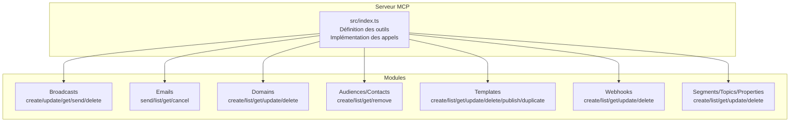
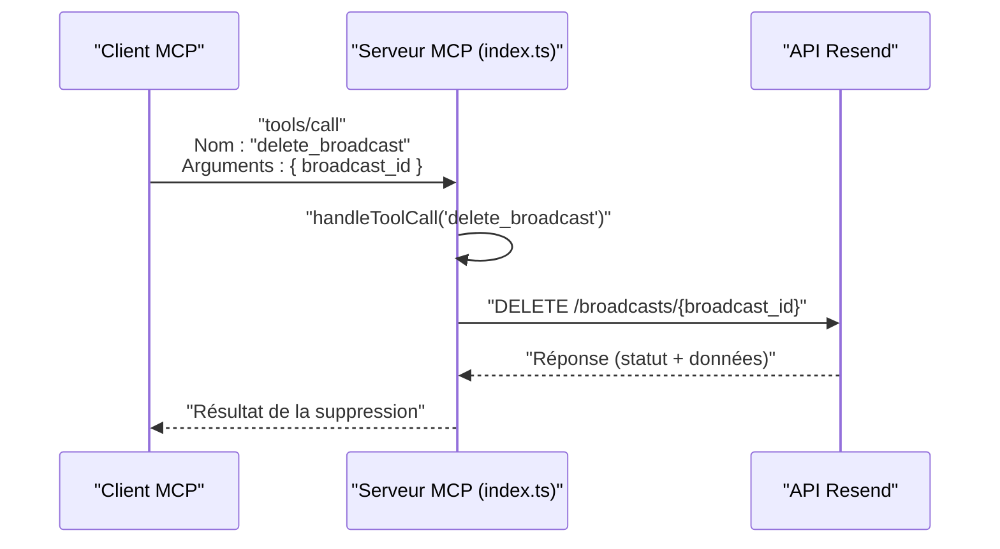

# Suppression d'un Broadcast

<cite>
**Fichiers référencés dans ce document**
- [README.md](file://README.md)
- [package.json](file://package.json)
- [src/index.ts](file://src/index.ts)
</cite>

## Sommaire
1. [Introduction](#introduction)
2. [Objectif de la suppression](#objectif-de-la-suppression)
3. [Prérequis et configuration](#prérequis-et-configuration)
4. [Structure du projet](#structure-du-projet)
5. [Composants clés](#composants-clés)
6. [Architecture de l’outil delete_broadcast](#architecture-de-l-outil-delete_broadcast)
7. [Implémentation technique](#implémentation-technique)
8. [Exemples de suppression sécurisée](#exemples-de-suppression-sécurisée)
9. [Vérifications avant suppression](#vérifications-avant-suppression)
10. [Implications et limitations](#implications-et-limitations)
11. [Bonnes pratiques](#bonnes-pratiques)
12. [Gestion des erreurs](#gestion-des-erreurs)
13. [Conclusion](#conclusion)

## Introduction
Cet outil permet de supprimer une campagne de diffusion au format brouillon en utilisant son identifiant unique (broadcast_id). La suppression est disponible dans le module Broadcast Operations, qui fait partie des 12 modules de l’API Resend couverts par le serveur MCP. Cette documentation explique comment utiliser l’outil delete_broadcast, ses implications, ses limitations, ainsi que les bonnes pratiques pour gérer en toute sécurité les campagnes de diffusion.

## Objectif de la suppression
L’objectif de cet outil est de supprimer un broadcast au format brouillon. Une fois qu’un broadcast a été envoyé, il ne peut plus être supprimé via cette méthode. La suppression est utile pour annuler une campagne non encore diffusée, libérer des ressources et éviter des coûts inutiles.

## Prérequis et configuration
- Une clé API Resend valide configurée via la variable d’environnement RESEND_API_KEY.
- Un client compatible MCP (par exemple Claude Desktop, Continue, Cline) pour appeler les outils.
- Le serveur démarré avec le binaire ou via l’exécutable Node.js fourni.

**Section sources**
- [README.md](file://README.md#L180-L210)
- [package.json](file://package.json#L10-L14)

## Structure du projet
Le projet est un serveur MCP qui expose toutes les fonctionnalités de l’API Resend sous forme d’outils invocables. Le point d’entrée principal est le fichier src/index.ts, qui définit les outils, leurs schémas d’entrée, et leur implémentation.

**Diagram sources**
- [src/index.ts](file://src/index.ts#L42-L1002)

**Section sources**
- [README.md](file://README.md#L472-L491)
- [src/index.ts](file://src/index.ts#L42-L1002)

## Composants clés
- Outils de broadcast : create_broadcast, list_broadcasts, get_broadcast, update_broadcast, delete_broadcast, send_broadcast.
- Schéma d’entrée de delete_broadcast : broadcast_id obligatoire.
- Implémentation de l’appel HTTP DELETE vers l’API Resend.

**Section sources**
- [README.md](file://README.md#L74-L81)
- [src/index.ts](file://src/index.ts#L683-L765)

## Architecture de l’outil delete_broadcast
L’outil delete_broadcast est exposé comme un outil MCP. Lors de l’appel, le serveur effectue un appel HTTP DELETE vers l’API Resend pour supprimer le broadcast spécifié.

**Diagram sources**
- [src/index.ts](file://src/index.ts#L1341-L1347)

## Implémentation technique
- Définition de l’outil : nom, description, schéma d’entrée (broadcast_id requis).
- Implémentation de l’appel : requête HTTP DELETE sur l’URL de l’API Resend.
- Gestion des erreurs : renvoi d’un message d’erreur structuré si l’appel échoue.

**Section sources**
- [src/index.ts](file://src/index.ts#L742-L752)
- [src/index.ts](file://src/index.ts#L1341-L1347)

## Exemples de suppression sécurisée
Voici des scénarios de suppression sécurisée à suivre avant d’appeler l’outil delete_broadcast.

### Scénario 1 : Suppression d’un brouillon non envoyé
- Vérifier que le broadcast existe et est bien au format brouillon.
- S’assurer qu’aucun envoi n’a été planifié.
- Effectuer la suppression via l’outil delete_broadcast.

### Scénario 2 : Suppression après mise à jour
- Mettre à jour le brouillon avec update_broadcast si nécessaire.
- Confirmer l’état du brouillon.
- Supprimer le brouillon via delete_broadcast.

### Scénario 3 : Suppression en cascade (si applicable)
- Si le brouillon est lié à des ressources externes (templates, audiences), les gérer avant suppression.
- Supprimer le brouillon via delete_broadcast.

**Section sources**
- [README.md](file://README.md#L408-L433)
- [src/index.ts](file://src/index.ts#L723-L741)

## Vérifications avant suppression
Avant de supprimer un broadcast, effectuez ces vérifications pour éviter les erreurs et garantir la cohérence des données.

- Vérifier l’état du broadcast
  - Utiliser get_broadcast pour confirmer que le statut est bien brouillon.
  - Vérifier qu’aucune action d’envoi n’a été entreprise.

- Vérifier l’identifiant
  - S’assurer que broadcast_id est correctement fourni.
  - Valider le format de l’identifiant (UUID ou identifiant Resend).

- Vérifier les droits
  - S’assurer que la clé API utilisée dispose des permissions nécessaires.

- Vérifier l’absence d’effets de bord
  - Confirmer qu’aucune ressource liée (audience, template) n’est utilisée par d’autres broadcasts.

**Section sources**
- [src/index.ts](file://src/index.ts#L713-L722)
- [src/index.ts](file://src/index.ts#L742-L752)

## Implications et limitations
- Limitation : impossible de supprimer un broadcast déjà envoyé
  - L’outil delete_broadcast ne peut être utilisé que pour les brouillons. Une fois qu’un broadcast est envoyé, il ne peut plus être supprimé via cette méthode.
- Implication : suppression immédiate
  - La suppression est immédiate et irréversible. Assurez-vous de la décision avant d’appeler l’outil.
- Implication : impact sur les ressources
  - La suppression libère les ressources associées au brouillon (contenu, audience, etc.).

**Section sources**
- [README.md](file://README.md#L74-L81)

## Bonnes pratiques
- Ne jamais supprimer un broadcast envoyé
  - Utilisez plutôt des outils de gestion des emails (annulation, statistiques) si nécessaire.
- Sauvegarder les contenus critiques
  - Avant suppression, sauvegarder le contenu HTML/text si vous souhaitez le réutiliser.
- Utiliser des environnements distincts
  - Effectuez des suppressions de test dans un environnement de développement avant de supprimer en production.
- Automatiser les vérifications
  - Intégrez des vérifications de statut et d’identifiant dans vos flux automatisés.
- Logging et audit
  - Enregistrez les suppressions effectuées pour traçabilité.

## Gestion des erreurs
Le serveur renvoie un message d’erreur structuré en cas d’échec de l’outil delete_broadcast. Les erreurs courantes incluent :
- Erreur d’authentification : clé API invalide ou manquante.
- Erreur de validation : paramètre broadcast_id manquant ou incorrect.
- Erreur de ressource : broadcast introuvable ou non supprimable.
- Erreur de taux limite : dépassement des limites de l’API Resend.

**Section sources**
- [README.md](file://README.md#L528-L549)
- [src/index.ts](file://src/index.ts#L1516-L1522)

## Conclusion
L’outil delete_broadcast permet de supprimer en toute sécurité un brouillon de diffusion. Respectez les limitations (impossible de supprimer des broadcasts envoyés), effectuez les vérifications avant suppression, et suivez les bonnes pratiques pour éviter les erreurs et maintenir la cohérence de vos campagnes.