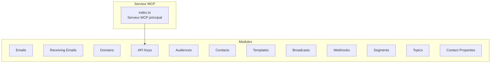
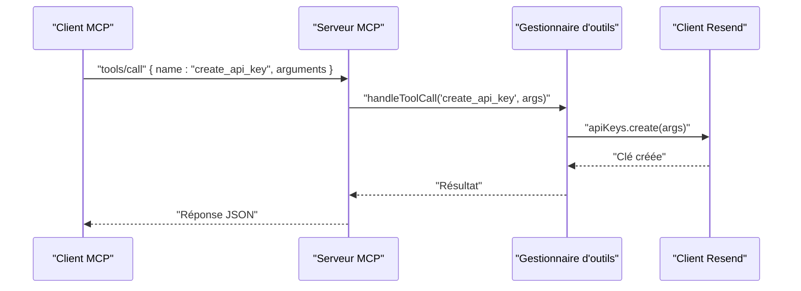
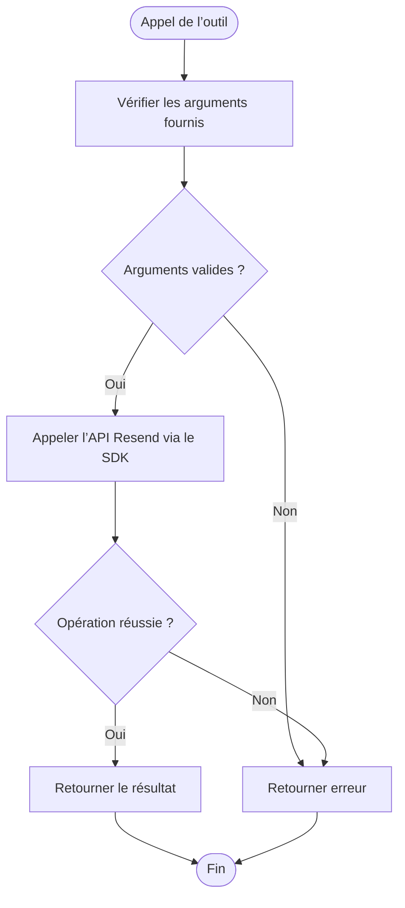

# Module Clés API

<cite>
**Fichiers référencés dans ce document**
- [README.md](file://README.md)
- [package.json](file://package.json)
- [src/index.ts](file://src/index.ts)
</cite>

## Sommaire
1. [Introduction](#introduction)
2. [Structure du projet](#structure-du-projet)
3. [Composants principaux](#composants-principaux)
4. [Aperçu de l’architecture](#aperçu-de-larchitecture)
5. [Analyse détaillée des composants](#analyse-détaillée-des-composants)
6. [Analyse des dépendances](#analyse-des-dépendances)
7. [Considérations sur les performances](#considérations-sur-les-performances)
8. [Guide de dépannage](#guide-de-dépannage)
9. [Conclusion](#conclusion)

## Introduction
Ce document présente le module Clés API de l’API Resend tel qu’exposé via le serveur MCP. Il documente les trois outils liés à la gestion des clés API : create_api_key, list_api_keys, delete_api_key. Vous y trouverez également des explications sur la gestion des permissions (full_access, sending_access), la sécurité associée, les bonnes pratiques de rotation des clés, la gestion des permissions, ainsi que des scénarios d’utilisation adaptés à différents types d’applications.

## Structure du projet
Le projet est un serveur MCP qui expose l’ensemble de l’API Resend sous forme d’outils invocables. Le module Clés API fait partie des 12 modules couverts, avec 3 outils spécifiques à la gestion des clés API.

**Diagramme sources**
- [src/index.ts](file://src/index.ts#L42-L350)

**Section sources**
- [README.md](file://README.md#L39-L42)
- [src/index.ts](file://src/index.ts#L42-L350)

## Composants principaux
Le module Clés API comprend trois outils :

- create_api_key : création d’une nouvelle clé API avec nom et niveau de permission
- list_api_keys : liste toutes les clés API de votre compte
- delete_api_key : révocation d’une clé API spécifique

Ces outils sont définis dans la liste des outils du serveur MCP et implémentés dans la fonction de gestion des appels d’outil.

**Section sources**
- [src/index.ts](file://src/index.ts#L319-L350)
- [src/index.ts](file://src/index.ts#L1127-L1136)

## Aperçu de l’architecture
Le serveur MCP charge les outils, reçoit les requêtes via stdin, exécute l’outil correspondant, puis renvoie une réponse via stdout. Pour le module Clés API, les appels sont transmis au client Resend, qui interagit avec l’API Resend.

**Diagramme sources**
- [src/index.ts](file://src/index.ts#L1008-L1522)
- [src/index.ts](file://src/index.ts#L1127-L1136)

## Analyse détaillée des composants

### Outils de gestion des clés API
- create_api_key
  - Description : créer une nouvelle clé API
  - Entrées attendues : name (chaîne), permission (chaîne) — permission peut être full_access ou sending_access
  - Sortie : objet représentant la clé créée
  - Implémentation : appel à resend.apiKeys.create

- list_api_keys
  - Description : lister toutes les clés API de votre compte
  - Entrées attendues : aucune
  - Sortie : tableau de clés API
  - Implémentation : appel à resend.apiKeys.list

- delete_api_key
  - Description : révoquer une clé API
  - Entrées attendues : api_key_id (identifiant de la clé)
  - Sortie : résultat de suppression
  - Implémentation : appel à resend.apiKeys.remove

**Section sources**
- [src/index.ts](file://src/index.ts#L319-L350)
- [src/index.ts](file://src/index.ts#L1127-L1136)

### Schéma des entrées des outils
Voici les schémas d’entrée pour chaque outil du module Clés API :

- create_api_key
  - name : chaîne, requis
  - permission : chaîne, optionnel (valeurs possibles : full_access, sending_access)

- list_api_keys
  - aucun champ requis

- delete_api_key
  - api_key_id : chaîne, requis

Ces schémas sont définis dans la liste des outils du serveur MCP.

**Section sources**
- [src/index.ts](file://src/index.ts#L319-L350)

### Flux de traitement des outils
Le flux de traitement suit cette séquence pour tous les outils du module Clés API :

**Diagramme sources**
- [src/index.ts](file://src/index.ts#L1008-L1522)

## Analyse des dépendances
- Dépendance principale : le client Resend est utilisé pour interagir avec l’API Resend. Les appels pour le module Clés API sont effectués via resend.apiKeys.create, resend.apiKeys.list et resend.apiKeys.remove.
- Configuration de l’environnement : l’API key est chargée depuis la variable d’environnement RESEND_API_KEY.

**Section sources**
- [package.json](file://package.json#L32-L34)
- [src/index.ts](file://src/index.ts#L7-L7)
- [src/index.ts](file://src/index.ts#L1012-L1015)

## Considérations sur les performances
- Le serveur MCP traite les requêtes de manière synchrone via stdin/stdout. La complexité des opérations pour le module Clés API est faible, car elles reposent sur des appels simples au SDK Resend.
- Aucun traitement particulier n’est implémenté pour accélérer les opérations de clés API ; l’optimisation se fait côté SDK Resend.

[Pas de sources supplémentaires nécessaires car cette section ne contient pas d’analyse de fichiers spécifiques]

## Guide de dépannage
- Erreur : clé API manquante
  - Symptôme : message d’erreur indiquant que la variable d’environnement RESEND_API_KEY n’est pas définie
  - Solution : ajoutez votre clé API dans le fichier .env

- Erreur : outil inconnu
  - Symptôme : erreur "Unknown tool" lors de l’appel
  - Solution : vérifiez le nom de l’outil avec tools/list

- Erreur : permission insuffisante
  - Symptôme : erreur d’autorisation lors de la création ou de la suppression de clés
  - Solution : utilisez une clé API avec full_access si vous devez créer ou supprimer des clés

**Section sources**
- [README.md](file://README.md#L553-L568)
- [src/index.ts](file://src/index.ts#L1571-L1577)

## Bonnes pratiques de gestion des clés API
- Niveau de permission
  - full_access : permet de gérer toutes les clés API (création, suppression, listage)
  - sending_access : autorise uniquement l’envoi d’emails, mais ne permet pas de gérer les clés API

- Rotation des clés
  - Créez régulièrement de nouvelles clés API pour limiter la durée de validité des accès
  - Supprimez les anciennes clés API après avoir migré les environnements

- Sécurité
  - Stockez toujours les clés API dans des variables d’environnement
  - Limitez l’accès aux clés API aux seuls environnements nécessaires
  - Utilisez des clés à portée restreinte (sending_access) pour les services d’envoi d’emails

- Gestion des permissions
  - Utilisez des clés distinctes pour des environnements différents (développement, staging, production)
  - Limitez les permissions des clés utilisées dans des environnements sensibles

[Pas de sources supplémentaires nécessaires car cette section ne contient pas d’analyse de fichiers spécifiques]

## Scénarios d’utilisation
- Application backend d’envoi d’emails
  - Utiliser une clé API avec sending_access pour envoyer des emails
  - Ne pas utiliser de clé full_access dans ce contexte

- Service de gestion de clés
  - Utiliser une clé API avec full_access pour créer, lister et supprimer des clés
  - Automatiser la rotation des clés pour les environnements de développement

- Intégration CI/CD
  - Créer des clés API temporaires pour les jobs de déploiement
  - Supprimer ces clés après utilisation

[Pas de sources supplémentaires nécessaires car cette section ne contient pas d’analyse de fichiers spécifiques]

## Conclusion
Le module Clés API du serveur MCP Resend offre une interface simple et sécurisée pour gérer les clés d’accès à l’API Resend. En adoptant des bonnes pratiques de gestion des permissions et de rotation des clés, vous pouvez assurer la sécurité de vos environnements tout en maintenant une opération fluide de création, de listage et de suppression de clés API.

[Pas de sources supplémentaires nécessaires car cette section ne contient pas d’analyse de fichiers spécifiques]