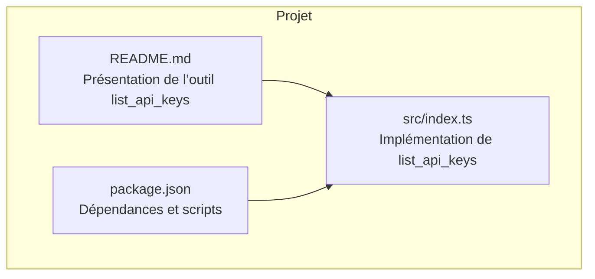
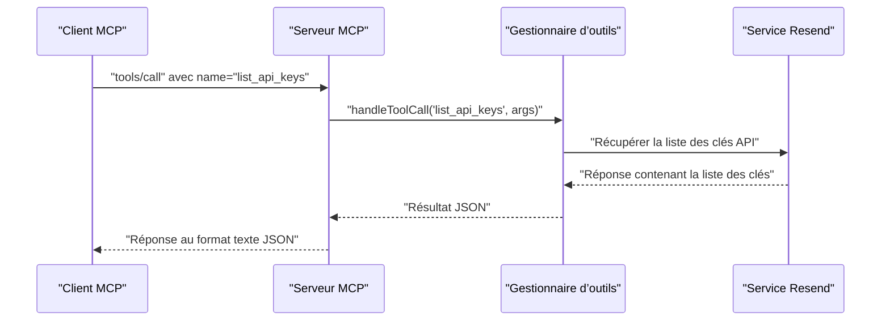
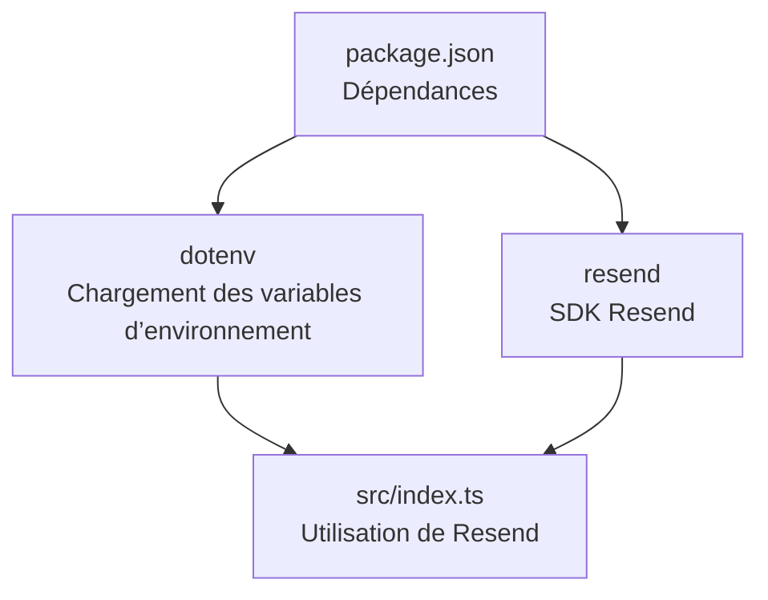

# Outil Liste des Clés API

<cite>
**Fichiers référencés dans ce document**
- [README.md](file://README.md)
- [package.json](file://package.json)
- [src/index.ts](file://src/index.ts)
</cite>

## Sommaire
1. [Introduction](#introduction)
2. [Structure du projet](#structure-du-projet)
3. [Composants principaux](#composants-principaux)
4. [Aperçu de l’architecture](#aperçu-de-larchitecture)
5. [Analyse détaillée des composants](#analyse-détaillée-des-composants)
6. [Analyse des dépendances](#analyse-des-dépendances)
7. [Considérations sur les performances](#considérations-sur-les-performances)
8. [Guide de dépannage](#guide-de-dépannage)
9. [Conclusion](#conclusion)

## Introduction
Cet outil permet de récupérer toutes les clés API associées à un compte Resend. Il s’agit de l’outil list_api_keys, qui expose la liste complète des clés API configurées sur le compte. Le document décrit comment l’utiliser, comment interpréter la réponse, et comment gérer les clés existantes.

## Structure du projet
Le projet est un serveur MCP (Model Context Protocol) qui fournit un ensemble complet d’outils pour l’API Resend. L’outil list_api_keys fait partie de la section API Key Management, qui comprend également create_api_key et delete_api_key.



**Diagramme sources**
- [README.md](file://README.md#L39-L42)
- [package.json](file://package.json#L32-L34)
- [src/index.ts](file://src/index.ts#L319-L350)

**Section sources**
- [README.md](file://README.md#L39-L42)
- [package.json](file://package.json#L32-L34)
- [src/index.ts](file://src/index.ts#L319-L350)

## Composants principaux
- Définition de l’outil list_api_keys : nom, description, schéma d’entrée.
- Implémentation de l’appel au service Resend pour récupérer la liste des clés API.
- Gestion des erreurs et retour de résultats au format texte JSON.

**Section sources**
- [src/index.ts](file://src/index.ts#L332-L339)
- [src/index.ts](file://src/index.ts#L1131-L1132)

## Aperçu de l’architecture
L’outil list_api_keys est intégré dans le serveur MCP. Lorsqu’un client MCP appelle l’outil, le serveur exécute la fonction correspondante qui effectue un appel au service Resend pour récupérer la liste des clés API.



**Diagramme sources**
- [src/index.ts](file://src/index.ts#L1008-L1522)
- [src/index.ts](file://src/index.ts#L1131-L1132)

## Analyse détaillée des composants

### Définition de l’outil list_api_keys
- Nom : list_api_keys
- Description : Récupère toutes les clés API de votre compte.
- Schéma d’entrée : objet vide (aucun paramètre requis).
- Module : API Key Management (3 outils)

**Section sources**
- [src/index.ts](file://src/index.ts#L332-L339)
- [README.md](file://README.md#L39-L42)

### Implémentation de l’appel
- L’appel est effectué via le SDK Resend : resend.apiKeys.list().
- Le serveur MCP renvoie la réponse sous forme de texte JSON.

**Section sources**
- [src/index.ts](file://src/index.ts#L1131-L1132)
- [src/index.ts](file://src/index.ts#L1544-L1551)

### Structure de la réponse
La réponse retournée par l’outil list_api_keys est un tableau d’objets représentant les clés API. Chaque objet contient généralement :
- Identifiant de la clé API
- Nom de la clé
- Niveau de permission
- Date de création
- Statut

Remarque : La structure exacte peut varier selon la documentation officielle de l’API Resend. Pour des détails précis, reportez-vous à la documentation officielle de l’API Resend.

**Section sources**
- [src/index.ts](file://src/index.ts#L1131-L1132)

### Exemples de réponse
Voici un exemple de réponse typique (format示意) :

```json
[
  {
    "id": "clé_api_id_1",
    "name": "Nom de la clé 1",
    "permission": "full_access",
    "created_at": "2025-01-01T00:00:00Z",
    "status": "active"
  },
  {
    "id": "clé_api_id_2",
    "name": "Nom de la clé 2",
    "permission": "sending_access",
    "created_at": "2025-01-02T00:00:00Z",
    "status": "inactive"
  }
]
```

Interprétation des champs :
- id : identifiant unique de la clé API
- name : nom donné à la clé
- permission : niveau de permission (ex. full_access, sending_access)
- created_at : date de création au format ISO 8601
- status : statut de la clé (ex. active, inactive)

**Section sources**
- [src/index.ts](file://src/index.ts#L1131-L1132)

### Comment interpréter les informations
- Identifiants des clés : utilisez l’id pour identifier chaque clé dans les opérations ultérieures (par exemple, suppression).
- Noms : ces libellés vous aident à retrouver rapidement la destination ou l’utilisation de la clé.
- Permissions : vérifiez que la clé dispose des droits nécessaires (ex. full_access pour toutes les opérations, sending_access pour l’envoi uniquement).
- Dates de création : utile pour tracer l’historique des clés.
- Statuts : active/inactive vous indique si la clé est utilisable.

**Section sources**
- [src/index.ts](file://src/index.ts#L1131-L1132)

### Gestion des clés existantes
- Pour supprimer une clé existante, utilisez l’outil delete_api_key en fournissant l’id de la clé.
- Pour créer une nouvelle clé, utilisez l’outil create_api_key en spécifiant le nom et le niveau de permission.

**Section sources**
- [src/index.ts](file://src/index.ts#L340-L350)
- [src/index.ts](file://src/index.ts#L320-L331)

## Analyse des dépendances
- Dépendance principale : le SDK Resend pour Node.js.
- Utilisation de dotenv pour charger la clé API depuis le fichier .env.
- Scripts de build et démarrage du serveur.



**Diagramme sources**
- [package.json](file://package.json#L32-L34)
- [src/index.ts](file://src/index.ts#L1-L7)

**Section sources**
- [package.json](file://package.json#L32-L34)
- [src/index.ts](file://src/index.ts#L1-L7)

## Considérations sur les performances
- Le serveur MCP traite les requêtes via stdin/stdout, ce qui est léger.
- Les appels à l’API Resend sont effectués de manière synchrone dans le gestionnaire d’outils.
- Aucune mise en cache spécifique n’est implémentée pour list_api_keys.

[Ce paragraphe ne nécessite pas de sources car il fournit des conseils généraux]

## Guide de dépannage
- Erreur : clé API manquante
  - Vérifiez que la variable d’environnement RESEND_API_KEY est définie.
  - Créez un fichier .env avec votre clé Resend.
- Erreur : outil inconnu
  - Utilisez tools/list pour afficher tous les outils disponibles.
- Erreur : échec de l’exécution de l’outil
  - Vérifiez les logs et les messages d’erreur renvoyés par le serveur.

**Section sources**
- [src/index.ts](file://src/index.ts#L1571-L1577)
- [src/index.ts](file://src/index.ts#L1516-L1522)

## Conclusion
L’outil list_api_keys permet de récupérer facilement la liste complète des clés API associées à un compte Resend. En comprenant la structure de la réponse et en interprétant correctement les champs (identifiants, noms, permissions, dates de création, statuts), vous pouvez gérer efficacement vos clés API existantes. Pour des opérations complémentaires, utilisez create_api_key pour créer de nouvelles clés et delete_api_key pour les supprimer.