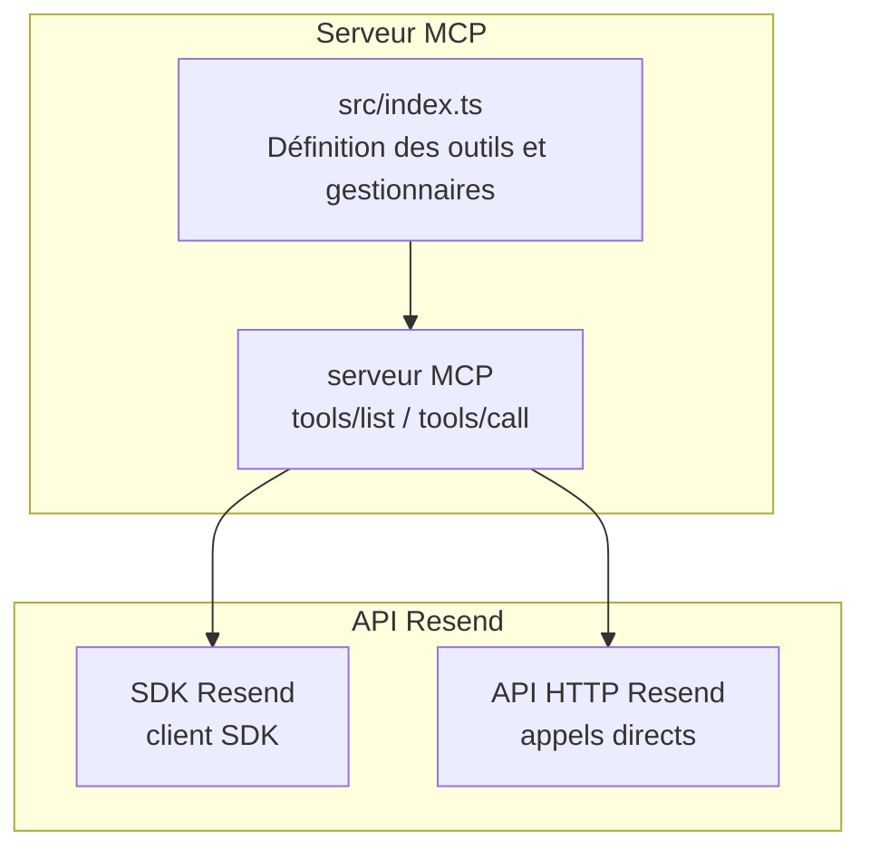
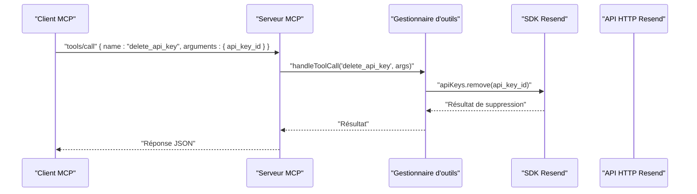
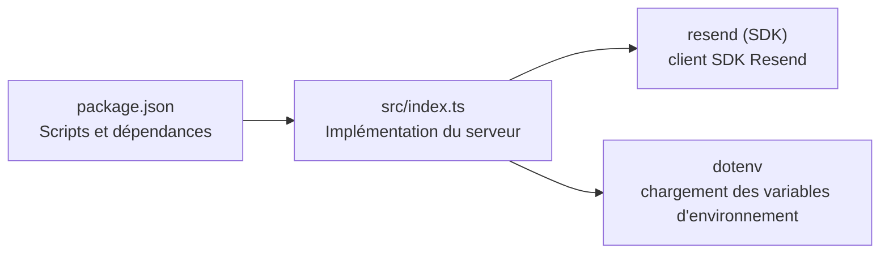

# Outil Suppression de Clé API

<cite>
**Fichiers référencés dans ce document**
- [README.md](file://README.md)
- [package.json](file://package.json)
- [src/index.ts](file://src/index.ts)
</cite>

## Sommaire
1. [Introduction](#introduction)
2. [Structure du projet](#structure-du-projet)
3. [Composants principaux](#composants-principaux)
4. [Aperçu de l’architecture](#aperçu-de-larchitecture)
5. [Analyse détaillée des composants](#analyse-détaillée-des-composants)
6. [Analyse des dépendances](#analyse-des-dépendances)
7. [Considérations sur les performances](#considérations-sur-les-performances)
8. [Guide de dépannage](#guide-de-dépannage)
9. [Conclusion](#conclusion)
10. [Annexes](#annexes)

## Introduction
Cet outil permet de supprimer une clé API existante en utilisant son identifiant. La suppression est effectuée via un appel au module de gestion des clés API de l’API Resend, qui est exposé comme un outil MCP (Model Context Protocol). Ce document explique comment utiliser cet outil, ses implications immédiates, ses effets sur les applications qui l’utilisent, ainsi que les bonnes pratiques de rotation des clés. Il inclut également des exemples de suppression sécurisée et des mesures de précaution à prendre avant de supprimer une clé utilisée en production.

## Structure du projet
Le projet est un serveur MCP complet qui expose l’ensemble de l’API Resend sous forme d’outils invocables. Le cœur de l’application se trouve dans le fichier principal, qui définit les outils, gère les appels, et communique avec l’API Resend.

**Diagramme sources**
- [src/index.ts](file://src/index.ts#L1008-L1565)

**Section sources**
- [README.md](file://README.md#L472-L491)
- [package.json](file://package.json#L1-L49)

## Composants principaux
- Définition de l’outil delete_api_key : l’outil est décrit dans la liste des outils MCP avec son schéma d’entrée, y compris le champ obligatoire api_key_id.
- Gestionnaire de l’outil : le gestionnaire effectue l’appel à l’API Resend pour supprimer la clé.
- Serveur MCP : implémente les méthodes standards tools/list et tools/call pour exposer les outils et exécuter les appels.

**Section sources**
- [src/index.ts](file://src/index.ts#L340-L350)
- [src/index.ts](file://src/index.ts#L1134-L1135)
- [src/index.ts](file://src/index.ts#L1532-L1565)

## Aperçu de l’architecture
L’architecture du serveur MCP repose sur un ensemble d’outils définis statiquement, un gestionnaire centralisé qui route les appels vers l’API Resend (via le SDK ou des appels HTTP directs), et un protocole de communication standardisé via stdin/stdout.

**Diagramme sources**
- [src/index.ts](file://src/index.ts#L1008-L1565)
- [src/index.ts](file://src/index.ts#L1134-L1135)

## Analyse détaillée des composants

### Outil delete_api_key
- Nom : delete_api_key
- Description : Révoquer une clé API.
- Schéma d’entrée :
  - api_key_id : chaîne de caractères, obligatoire. Identifiant de la clé API à supprimer.
- Implémentation : Le gestionnaire appelle directement l’API Resend pour supprimer la clé.

Implications immédiates de la suppression
- L’accès à l’API Resend est immédiatement révoqué pour toutes les applications ou services qui utilisaient cette clé.
- Toute tentative d’appel à l’API avec cette clé échouera avec une erreur d’authentification.
- Les applications doivent être mises à jour pour utiliser une autre clé valide.

Effets sur les applications utilisant cette clé
- Applications en cours d’exécution : elles cessent de fonctionner si elles tentent de communiquer avec l’API Resend.
- Applications en attente : elles ne peuvent pas envoyer d’emails ni accéder aux ressources protégées par cette clé.
- Applications configurées avec cette clé : elles doivent être reconfigurées avec une nouvelle clé.

Bonnes pratiques de rotation des clés
- Créer une nouvelle clé avant de supprimer l’ancienne.
- Mettre à jour tous les environnements (développement, staging, production) avec la nouvelle clé.
- Tester l’accès avec la nouvelle clé avant de supprimer l’ancienne.
- Supprimer l’ancienne clé uniquement après confirmation de la suppression complète des accès.

Exemples de suppression sécurisée
- Étape 1 : créer une nouvelle clé API.
- Étape 2 : mettre à jour les configurations de toutes les applications.
- Étape 3 : tester l’accès avec la nouvelle clé.
- Étape 4 : supprimer l’ancienne clé via l’outil delete_api_key.
- Étape 5 : valider qu’aucune application n’utilise plus l’ancienne clé.

Mesures de précaution avant suppression en production
- Identifier toutes les applications et services qui utilisent la clé.
- Planifier la suppression pendant une fenêtre de maintenance minimale.
- Effectuer des sauvegardes des configurations actuelles.
- Mettre en place des alertes pour détecter les tentatives d’accès avec l’ancienne clé.
- Documenter l’opération pour traçabilité.

**Section sources**
- [src/index.ts](file://src/index.ts#L340-L350)
- [src/index.ts](file://src/index.ts#L1134-L1135)

### Sécurité et erreurs liées à l’outil
- Authentification : Le serveur MCP utilise l’environnement RESEND_API_KEY pour s’authentifier auprès de l’API Resend.
- Erreurs fréquentes : 401 Non autorisé (clé invalide), 403 Interdit (permissions insuffisantes), 404 Non trouvé (clé inexistante), 429 Trop de requêtes (limite de débit).
- Bonnes pratiques de sécurité : ne jamais stocker les clés API dans le code source, limiter les permissions des clés, et limiter leur portée (par domaine, par exemple).

**Section sources**
- [README.md](file://README.md#L528-L549)
- [README.md](file://README.md#L493-L510)
- [src/index.ts](file://src/index.ts#L1571-L1577)

## Analyse des dépendances
- Dépendance principale : le SDK Resend est utilisé pour interagir avec l’API Resend.
- Scripts de build et démarrage : le projet est configuré pour compiler TypeScript et exécuter le serveur Node.js.
- Outils MCP : le serveur expose des outils via tools/list et tools/call.

**Diagramme sources**
- [package.json](file://package.json#L1-L49)
- [src/index.ts](file://src/index.ts#L1-L7)

**Section sources**
- [package.json](file://package.json#L32-L35)
- [src/index.ts](file://src/index.ts#L1-L7)

## Considérations sur les performances
- Le serveur MCP gère les appels de manière synchrone via stdin/stdout, ce qui convient pour des usages interactifs.
- Pour des charges élevées, il est recommandé de limiter les appels simultanés et de respecter les limites de débit de l’API Resend.

## Guide de dépannage
- Erreur : "RESEND_API_KEY environment variable is not set"
  - Solution : créer un fichier .env contenant la clé API Resend.
- Erreur : "Tool execution failed"
  - Causes possibles : clé API invalide, paramètres manquants, dépassement de limite de débit, problèmes réseau.
  - Solution : vérifier le message d’erreur, valider la clé API et les paramètres fournis.
- Erreur : "Unknown tool"
  - Solution : utiliser tools/list pour afficher la liste des outils disponibles.

**Section sources**
- [README.md](file://README.md#L551-L573)
- [src/index.ts](file://src/index.ts#L1571-L1577)

## Conclusion
L’outil delete_api_key permet de supprimer immédiatement l’accès à l’API Resend pour une clé donnée. Sa suppression impacte immédiatement toutes les applications qui l’utilisaient. Pour éviter les interruptions de service, il est essentiel de suivre une rotation de clés sécurisée : créer une nouvelle clé, la déployer partout, la tester, puis supprimer l’ancienne. En production, planifier cette opération avec soin, identifier tous les usages de la clé, et surveiller les accès pour confirmer la suppression complète.

## Annexes
- Exemple de suppression sécurisée (sans code) : créer une nouvelle clé, mettre à jour toutes les applications, tester la nouvelle clé, supprimer l’ancienne, et valider l’absence d’accès restant.
- Bonnes pratiques de rotation : création avant suppression, mise à jour de tous les environnements, tests avant suppression, documentation de l’opération.