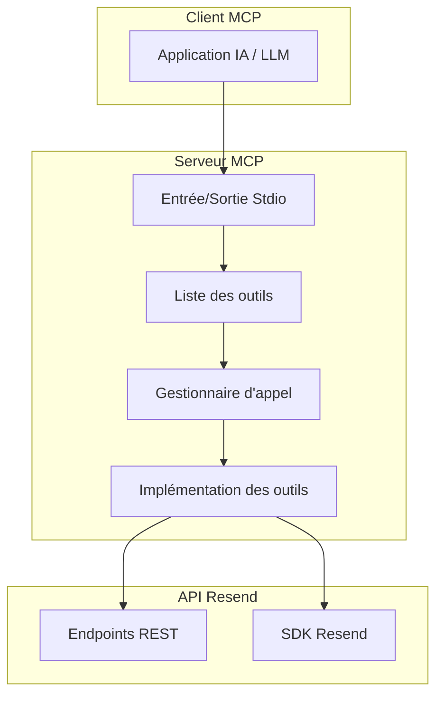
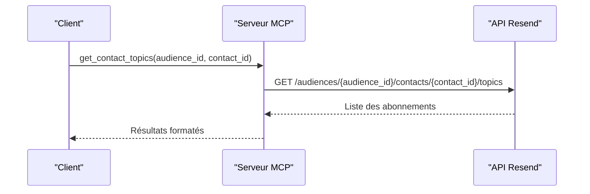
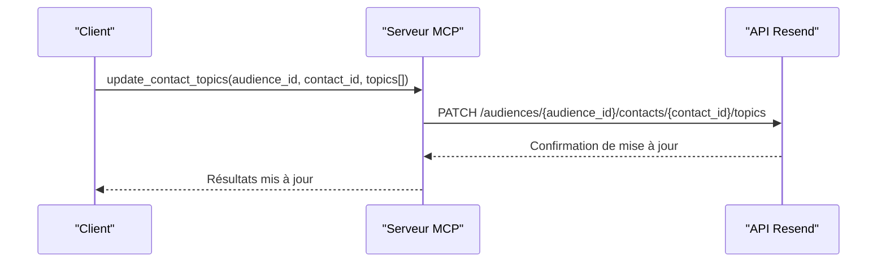
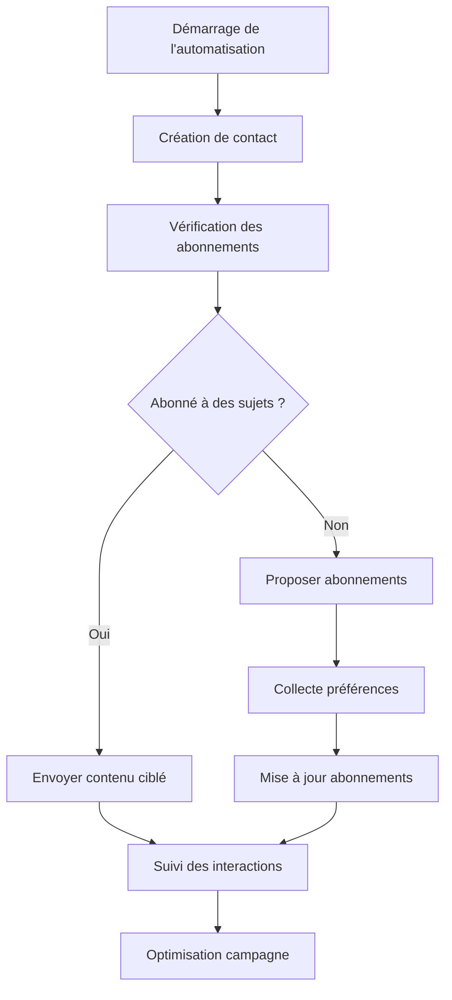

# Abonnements aux Sujets

<cite>
**Fichiers référencés dans ce document**
- [README.md](file://README.md)
- [package.json](file://package.json)
- [src/index.ts](file://src/index.ts)
</cite>

## Sommaire
1. [Introduction](#introduction)
2. [Contexte et objectifs](#contexte-et-objectifs)
3. [Architecture générale](#architecture-générale)
4. [Composants clés](#composants-clés)
5. [Gestion des abonnements aux sujets](#gestion-des-abonnements-aux-sujets)
6. [Exemples d'utilisation](#exemples-dutilisation)
7. [Intégration dans les stratégies de marketing automatisé](#intégration-dans-les-stratégies-de-marketing-automatisé)
8. [Bonnes pratiques](#bonnes-pratiques)
9. [Conclusion](#conclusion)

## Introduction
Ce document fournit une documentation complète sur la gestion des abonnements aux sujets de contact au sein de l'infrastructure Resend, exposée via un serveur Model Context Protocol (MCP). Il se concentre spécifiquement sur deux outils essentiels : `get_contact_topics` et `update_contact_topics`. Ces outils permettent de gérer les préférences de communication des contacts en fonction de sujets spécifiques, facilitant ainsi la personnalisation du contenu envoyé et l'intégration dans des stratégies de marketing automatisé.

## Contexte et objectifs
Le projet est un serveur MCP complet couvrant l'ensemble de l'API Resend, incluant 70+ outils répartis sur 12 modules. Parmi ceux-ci, le module "Contacts" propose des outils pour gérer les abonnements aux sujets de communication. L'objectif de cette documentation est de :
- Expliquer comment gérer les abonnements aux sujets de communication
- Détail des opérations de lecture et de mise à jour des préférences de sujet pour chaque contact
- Fournir des exemples concrets d'utilisation pour personnaliser le contenu envoyé
- Montrer comment intégrer ces abonnements dans des stratégies de marketing automatisé

**Section sources**
- [README.md](file://README.md#L1-L721)

## Architecture générale
Le serveur MCP est implémenté comme un service qui expose des outils Resend via stdin/stdout, conformément au protocole MCP. L'architecture se compose de :

**Diagram sources**
- [src/index.ts](file://src/index.ts#L1528-L1623)

**Section sources**
- [src/index.ts](file://src/index.ts#L1528-L1623)

## Composants clés
Le serveur expose plus de 70 outils, organisés en modules. Pour les abonnements aux sujets, les composants clés sont :

- **Outils de contact** : Gestion des contacts et de leurs préférences
- **Outils de sujets** : Création et gestion des sujets d'abonnement
- **Gestionnaire d'appel** : Routeur des appels d'outils vers les implémentations

**Section sources**
- [README.md](file://README.md#L50-L118)
- [src/index.ts](file://src/index.ts#L42-L1002)

## Gestion des abonnements aux sujets

### Vue d'ensemble
Les abonnements aux sujets permettent de segmenter les communications selon les intérêts ou préférences des contacts. Chaque contact peut être abonné ou désabonné à différents sujets, ce qui influence le contenu qu'ils reçoivent.

### Outils de gestion

#### get_contact_topics
Cet outil permet de récupérer les abonnements actuels d'un contact à des sujets spécifiques.

**Paramètres d'entrée :**
- `audience_id` : Identifiant de l'audience contenant le contact
- `contact_id` : Identifiant du contact concerné
- `limit` : Nombre maximum de résultats à retourner
- `after` : Curseur pour la pagination
- `before` : Curseur pour la pagination

**Résultats attendus :**
- Liste des sujets auxquels le contact est abonné
- État d'abonnement pour chaque sujet
- Pagination si nécessaire

**Section sources**
- [src/index.ts](file://src/index.ts#L542-L555)

#### update_contact_topics
Cet outil permet de mettre à jour les abonnements d'un contact à des sujets spécifiques.

**Paramètres d'entrée :**
- `audience_id` : Identifiant de l'audience contenant le contact
- `contact_id` : Identifiant du contact concerné
- `topics` : Tableau d'objets définissant les mises à jour
  - `id` : Identifiant du sujet
  - `subscribed` : Booléen indiquant l'état de l'abonnement

**Résultats attendus :**
- Confirmation de la mise à jour
- État mis à jour des abonnements
- Informations sur les sujets concernés

**Section sources**
- [src/index.ts](file://src/index.ts#L557-L577)

### Flux de traitement

#### Lecture des abonnements

**Diagram sources**
- [src/index.ts](file://src/index.ts#L1235-L1242)

#### Mise à jour des abonnements

**Diagram sources**
- [src/index.ts](file://src/index.ts#L1244-L1251)

### Gestion des données
Les abonnements sont stockés et gérés côté API Resend. Le serveur MCP agit comme un proxy, transmettant les requêtes et les réponses entre le client MCP et l'API Resend.

**Section sources**
- [src/index.ts](file://src/index.ts#L1235-L1251)

## Exemples d'utilisation

### Personnalisation du contenu envoyé
Voici comment utiliser les abonnements pour personnaliser le contenu envoyé aux contacts :

1. **Récupération des préférences :**
   - Utiliser `get_contact_topics` pour connaître les sujets auxquels le contact est abonné
   - Adapter le contenu en fonction des préférences identifiées

2. **Mise à jour des préférences :**
   - Utiliser `update_contact_topics` pour modifier les abonnements
   - Mettre à jour automatiquement les préférences lors des interactions

3. **Création de contenus ciblés :**
   - Développer des templates personnalisés pour chaque sujet
   - Filtrer les envois en fonction des abonnements

### Gestion des préférences de communication
Les abonnements permettent de gérer les préférences de communication de manière fine :

- **Catégorisation des contenus :** Marketing, produits, actualités, support
- **Niveau de détail :** Abonnement global vs abonnements spécifiques
- **Mise à jour dynamique :** Adaptation en temps réel aux changements de préférences

### Intégration dans des campagnes
Les abonnements peuvent être intégrés dans des campagnes de communication :

- **Segmentation ciblée :** Envoyer uniquement aux contacts abonnés
- **Personnalisation dynamique :** Adapter le contenu selon les sujets
- **Suivi des performances :** Mesurer l'engagement par sujet

## Intégration dans les stratégies de marketing automatisé

### Automatisation des abonnements
Les abonnements peuvent être gérés automatiquement dans des flux de marketing :

### Stratégies de segmentation
Les abonnements permettent plusieurs stratégies de segmentation :

- **Segmentation par intérêt :** Basée sur les sujets d'abonnement
- **Segmentation par comportement :** En fonction des interactions
- **Segmentation hybride :** Combinaison de sujets et de comportements

### Personnalisation avancée
L'utilisation des abonnements permet des niveaux de personnalisation avancés :

- **Contenu dynamique :** Adaptation en fonction des préférences
- **Fréquence d'envoi :** Ajustement selon l'engagement
- **Canal de communication :** Choix du canal selon les préférences

## Bonnes pratiques

### Gestion des abonnements
- **Transparence :** Informer les contacts de leur abonnement
- **Facilité de désabonnement :** Fournir des liens de désabonnement faciles
- **Mises à jour fréquentes :** Adapter les abonnements en fonction des interactions

### Optimisation des contenus
- **Qualité du contenu :** Assurer la valeur pour chaque sujet
- **Personnalisation :** Adapter le contenu aux préférences identifiées
- **Tests A/B :** Optimiser les contenus par sujet

### Suivi et analyse
- **Mesures d'engagement :** Suivre l'interaction par sujet
- **Analyse des tendances :** Identifier les sujets populaires
- **Révision périodique :** Mettre à jour les sujets et abonnements

## Conclusion
La gestion des abonnements aux sujets de contact constitue un pilier essentiel pour une communication efficace et personnalisée. Grâce aux outils `get_contact_topics` et `update_contact_topics`, il est possible de :

- **Personnaliser le contenu** en fonction des préférences des contacts
- **Gérer les abonnements** de manière dynamique et automatisée
- **Intégrer dans des stratégies de marketing** pour maximiser l'engagement
- **Optimiser les campagnes** grâce à des données d'abonnement précises

Cette approche permet de construire des relations durables avec les contacts tout en respectant leurs préférences de communication.