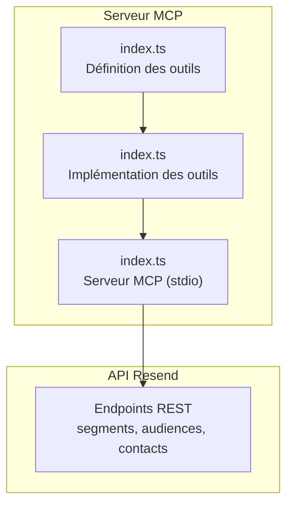
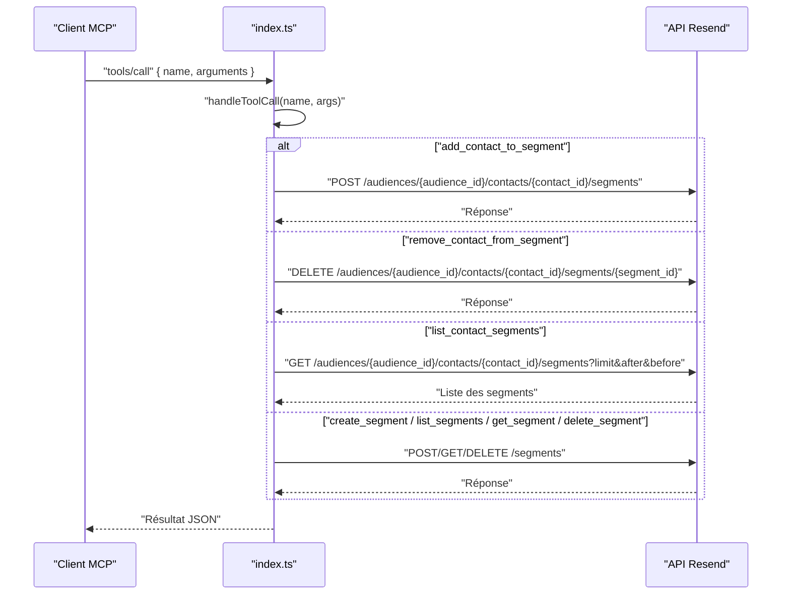
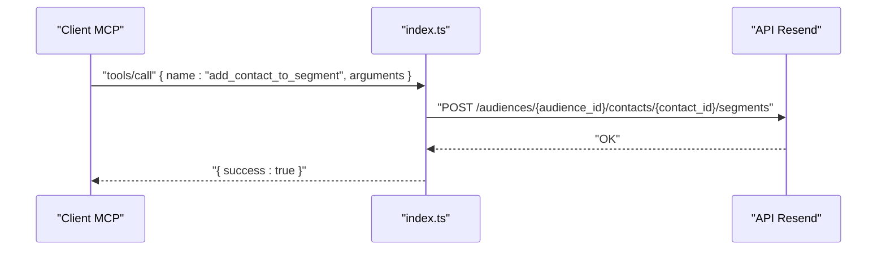
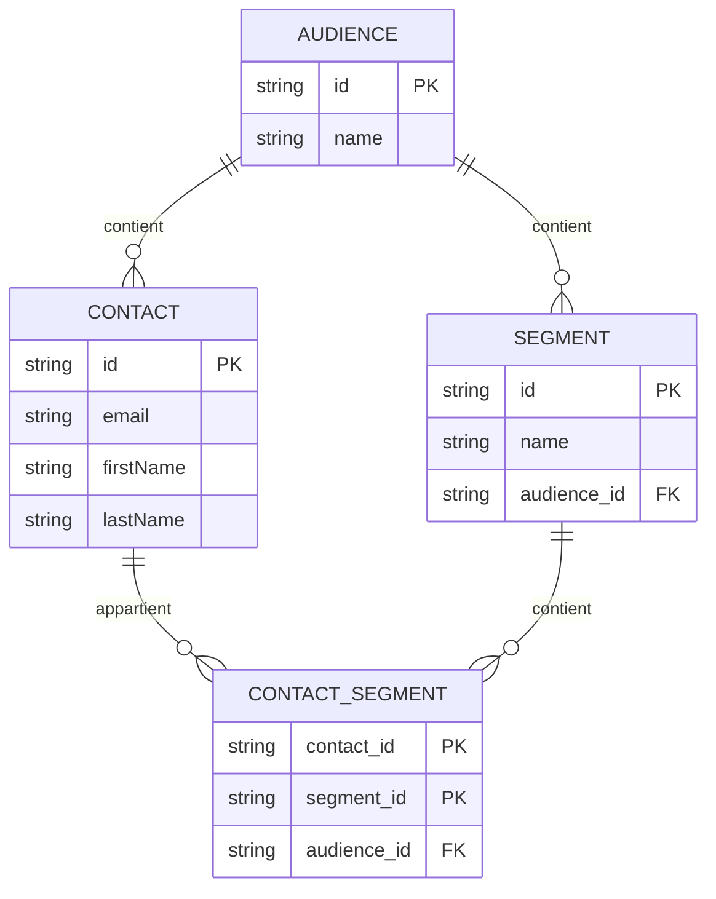
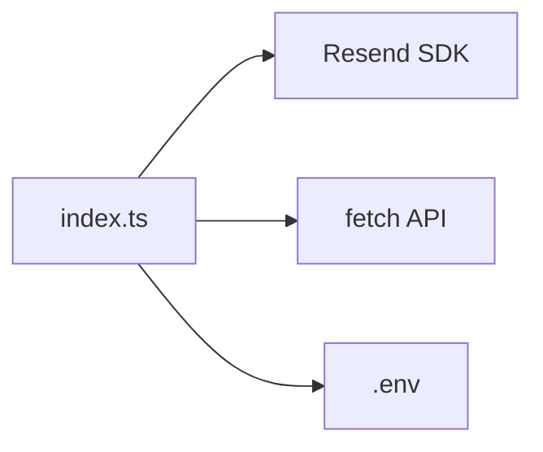

# Gestion des Segments

<cite>
**Fichiers référencés dans ce document**
- [README.md](file://README.md)
- [package.json](file://package.json)
- [src/index.ts](file://src/index.ts)
</cite>

## Sommaire
1. [Introduction](#introduction)
2. [Structure du projet](#structure-du-projet)
3. [Composants principaux](#composants-principaux)
4. [Aperçu de l’architecture](#aperçu-de-larchitecture)
5. [Analyse détaillée des composants](#analyse-détaillée-des-composants)
6. [Analyse des dépendances](#analyse-des-dépendances)
7. [Considérations sur les performances](#considérations-sur-les-performances)
8. [Guide de dépannage](#guide-de-dépannage)
9. [Conclusion](#conclusion)
10. [Annexes](#annexes)

## Introduction
Ce document fournit une documentation complète pour la gestion des segments de contacts au sein du serveur MCP Resend. Il explique trois outils clés : add_contact_to_segment, remove_contact_from_segment, list_contact_segments. Vous y trouverez également des explications sur la création et la gestion des segments, les relations entre contacts et segments, les opérations d’ajout/suppression, ainsi que la liste des segments auxquels appartient un contact. Des exemples de segmentation avancée, des bonnes pratiques pour organiser vos audiences, et la gestion des segments dans le contexte des campagnes d’envoi sont inclus.

## Structure du projet
Le projet est un serveur MCP qui expose l’ensemble de l’API Resend sous forme d’outils invocables. La logique métier se trouve dans le fichier principal, où sont définis :
- La liste des outils (y compris les outils de segmentation)
- Les implémentations des appels API pour chaque outil
- Le serveur MCP lui-même (écoute stdin/stdout)

**Diagramme sources**
- [src/index.ts](file://src/index.ts#L42-L1002)
- [src/index.ts](file://src/index.ts#L1008-L1565)
- [src/index.ts](file://src/index.ts#L1571-L1623)

**Section sources**
- [README.md](file://README.md#L472-L491)
- [package.json](file://package.json#L1-L49)
- [src/index.ts](file://src/index.ts#L1-L1623)

## Composants principaux
Les outils de segmentation sont regroupés dans la section “Segments” de la définition des outils. Ils permettent de créer, lister, récupérer et supprimer des segments, ainsi que de gérer les relations entre contacts et segments.

- Outils de segmentation
  - create_segment : Créer un segment
  - list_segments : Lister tous les segments
  - get_segment : Obtenir les détails d’un segment
  - delete_segment : Supprimer un segment
- Outils de gestion des contacts liés aux segments
  - add_contact_to_segment : Ajouter un contact à un segment
  - remove_contact_from_segment : Retirer un contact d’un segment
  - list_contact_segments : Lister les segments d’un contact

Ces outils utilisent des endpoints REST de l’API Resend pour effectuer les opérations.

**Section sources**
- [src/index.ts](file://src/index.ts#L832-L879)
- [src/index.ts](file://src/index.ts#L500-L540)

## Aperçu de l’architecture
Le serveur MCP reçoit des requêtes via stdin, identifie l’outil demandé, exécute la fonction associée, puis renvoie une réponse via stdout. Pour les outils de segmentation, l’exécution consiste à appeler les endpoints REST correspondants avec les paramètres fournis.

**Diagramme sources**
- [src/index.ts](file://src/index.ts#L1008-L1565)
- [src/index.ts](file://src/index.ts#L1209-L1233)
- [src/index.ts](file://src/index.ts#L1400-L1430)

## Analyse détaillée des composants

### Outils de segmentation
- create_segment
  - Description : Créer un segment au sein d’une audience
  - Paramètres : nom, audience_id, filtre (optionnel)
  - Résultat : objet représentant le segment créé
  - Implémentation : appel POST à /segments
- list_segments
  - Description : Lister tous les segments
  - Paramètres : limit, after, before (pagination)
  - Résultat : collection de segments
  - Implémentation : appel GET à /segments
- get_segment
  - Description : Obtenir les détails d’un segment
  - Paramètres : segment_id
  - Résultat : détail du segment
  - Implémentation : appel GET à /segments/{segment_id}
- delete_segment
  - Description : Supprimer un segment
  - Paramètres : segment_id
  - Résultat : suppression confirmée
  - Implémentation : appel DELETE à /segments/{segment_id}

**Section sources**
- [src/index.ts](file://src/index.ts#L832-L879)
- [src/index.ts](file://src/index.ts#L1400-L1430)

### Outils de gestion des relations contact-segment
- add_contact_to_segment
  - Description : Ajouter un contact à un segment spécifique
  - Paramètres : audience_id, contact_id, segment_id
  - Résultat : réponse de l’API
  - Implémentation : appel POST à /audiences/{audience_id}/contacts/{contact_id}/segments
- remove_contact_from_segment
  - Description : Retirer un contact d’un segment
  - Paramètres : audience_id, contact_id, segment_id
  - Résultat : réponse de l’API
  - Implémentation : appel DELETE à /audiences/{audience_id}/contacts/{contact_id}/segments/{segment_id}
- list_contact_segments
  - Description : Lister les segments auxquels appartient un contact
  - Paramètres : audience_id, contact_id, limit, after, before (pagination)
  - Résultat : collection des segments
  - Implémentation : appel GET à /audiences/{audience_id}/contacts/{contact_id}/segments

**Diagramme sources**
- [src/index.ts](file://src/index.ts#L1209-L1216)

**Section sources**
- [src/index.ts](file://src/index.ts#L500-L540)
- [src/index.ts](file://src/index.ts#L1209-L1233)

### Relations entre contacts, audiences et segments
- Un segment appartient à une audience (audience_id)
- Un contact appartient à une audience (audience_id)
- Une relation contact-segment est créée via l’outil add_contact_to_segment
- La suppression de la relation se fait via remove_contact_from_segment
- La liste des segments d’un contact est obtenue via list_contact_segments

**Diagramme sources**
- [src/index.ts](file://src/index.ts#L832-L879)
- [src/index.ts](file://src/index.ts#L500-L540)

## Analyse des dépendances
- Dépendance principale : bibliothèque Resend (SDK Node.js)
- Utilisation de l’environnement : .env pour stocker la clé API
- Implémentation des outils : appels directs à l’API REST de Resend via fetch
- Pagination : les outils list_* utilisent des paramètres limit, after, before

**Diagramme sources**
- [src/index.ts](file://src/index.ts#L1-L7)
- [src/index.ts](file://src/index.ts#L1008-L1565)
- [package.json](file://package.json#L32-L34)

**Section sources**
- [package.json](file://package.json#L32-L34)
- [src/index.ts](file://src/index.ts#L1-L7)

## Considérations sur les performances
- Taux de requêtes : le serveur respecte les limites de l’API Resend (par défaut 2 requêtes/seconde). L’implémentation gère automatiquement les retours en cas de dépassement.
- Pagination : utiliser limit, after, before pour limiter la charge lors des listes de segments et de contacts.
- Batch : pour de grandes opérations, privilégier des appels de type batch si disponibles (par exemple, en utilisant les outils de diffusion).

[Pas de sources supplémentaires car cette section ne contient pas d’analyse de fichiers spécifiques]

## Guide de dépannage
- Erreur d’authentification
  - Message : clé API manquante ou invalide
  - Solution : vérifier la présence de RESEND_API_KEY dans le fichier .env
- Erreur de paramètres
  - Message : paramètres requis manquants
  - Solution : s’assurer de fournir audience_id, contact_id, segment_id selon l’outil utilisé
- Erreur de ressource
  - Message : audience/contact/segment introuvable
  - Solution : vérifier les identifiants fournis
- Erreur de taux limite
  - Message : trop de requêtes
  - Solution : attendre avant de relancer, ou réduire le volume de requêtes

**Section sources**
- [README.md](file://README.md#L528-L549)
- [src/index.ts](file://src/index.ts#L1571-L1577)

## Conclusion
La gestion des segments de contacts repose sur trois outils essentiels : ajouter un contact à un segment, retirer un contact d’un segment, et lister les segments d’un contact. Ces outils s’appuient sur des endpoints REST de l’API Resend et sont intégrés au serveur MCP via des appels directs. En combinant ces outils avec la gestion des audiences et des contacts, vous pouvez structurer efficacement vos audiences, automatiser la segmentation et piloter vos campagnes d’envoi de manière ciblée.

[Pas de sources supplémentaires car cette section ne contient pas d’analyse de fichiers spécifiques]

## Annexes

### Exemples pratiques de segmentation avancée
- Créer un segment dynamique basé sur des critères de contact (par exemple, géolocalisation, comportement)
  - Utiliser create_segment avec un filtre adapté
- Segmenter par événements (abonnés à un sujet, ayant cliqué, ayant ouvert)
  - Utiliser list_contact_segments pour identifier les segments d’un contact
- Automatiser l’ajout/suppression de contacts lors de mises à jour de données
  - Utiliser add_contact_to_segment/remove_contact_from_segment pour maintenir les segments synchronisés

[Pas de sources supplémentaires car cette section ne contient pas d’analyse de fichiers spécifiques]

### Bonnes pratiques pour organiser ses audiences
- Nommer les segments de manière descriptive
- Limiter la taille des segments pour améliorer la rapidité des opérations
- Utiliser des filtres précis pour éviter les chevauchements inutiles
- Mettre à jour régulièrement les segments en fonction des données de contact

[Pas de sources supplémentaires car cette section ne contient pas d’analyse de fichiers spécifiques]

### Gestion des segments dans le contexte des campagnes d’envoi
- Utiliser un segment comme cible pour envoyer des diffusions
- Vérifier la composition du segment avant l’envoi via list_contact_segments
- Éviter d’envoyer à des segments désactivés ou à des contacts non conformes

[Pas de sources supplémentaires car cette section ne contient pas d’analyse de fichiers spécifiques]