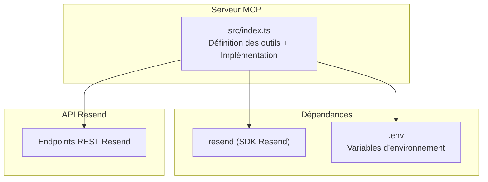
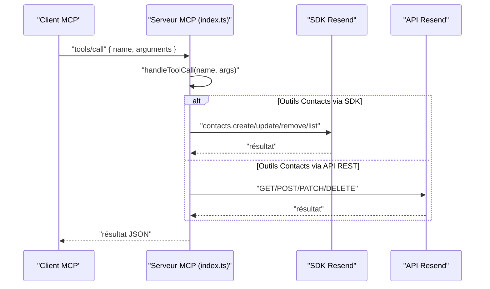
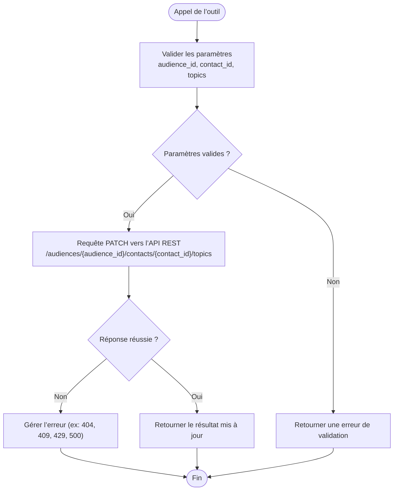
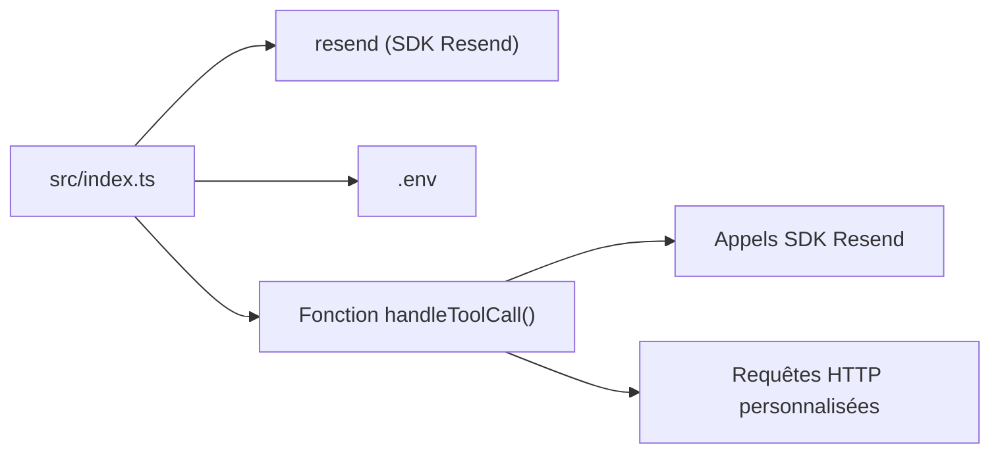

# Module Contacts

<cite>
**Fichiers référencés dans ce document**
- [README.md](file://README.md)
- [package.json](file://package.json)
- [src/index.ts](file://src/index.ts)
</cite>

## Sommaire
1. [Introduction](#introduction)
2. [Structure du projet](#structure-du-projet)
3. [Composants principaux](#composants-principaux)
4. [Aperçu de l’architecture](#aperçu-de-l’architecture)
5. [Analyse détaillée des outils](#analyse-détaillée-des-outils)
6. [Analyse des dépendances](#analyse-des-dépendances)
7. [Considérations sur les performances](#considérations-sur-les-performances)
8. [Guide de dépannage](#guide-de-dépannage)
9. [Conclusion](#conclusion)

## Introduction
Le module Contacts de l’API Resend est un ensemble de 13 outils qui permettent de gérer entièrement la base de données de contacts au sein d’une audience. Ces outils couvrent les opérations CRUD de base (création, lecture, mise à jour, suppression), la gestion des segments (regroupement de contacts), les abonnements aux sujets (thèmes de communication), ainsi que les mises à jour avancées de souscription. Le serveur MCP expose ces outils de manière standardisée pour être utilisés par des assistants IA ou des applications compatibles avec le Model Context Protocol.

## Structure du projet
Le projet est une implémentation Node.js d’un serveur MCP qui encapsule l’ensemble de l’API Resend. Le cœur de l’application se trouve dans le fichier principal qui définit les outils, leurs schémas d’entrée, et leur implémentation via des appels directs à l’API Resend ou via des requêtes HTTP personnalisées.

**Diagramme sources**
- [src/index.ts](file://src/index.ts#L1-L100)
- [package.json](file://package.json#L32-L34)

**Section sources**
- [README.md](file://README.md#L1-L721)
- [package.json](file://package.json#L1-L49)
- [src/index.ts](file://src/index.ts#L1-L100)

## Composants principaux
Le module Contacts est défini dans le tableau des outils MCP. Chaque outil possède :
- Un nom unique
- Une description
- Un schéma d’entrée (inputSchema) précisant les paramètres attendus

Voici les 13 outils du module Contacts, avec leurs rôles respectifs :
- create_contact : ajouter un nouveau contact à une audience
- list_contacts : récupérer tous les contacts d’une audience
- get_contact_by_email : obtenir un contact par son adresse email
- get_contact_by_id : obtenir un contact par son identifiant
- update_contact_by_email : mettre à jour un contact par son email
- update_contact_by_id : mettre à jour un contact par son identifiant
- delete_contact_by_email : supprimer un contact par son email
- delete_contact_by_id : supprimer un contact par son identifiant
- add_contact_to_segment : ajouter un contact à un segment
- remove_contact_from_segment : retirer un contact d’un segment
- list_contact_segments : lister les segments d’un contact
- get_contact_topics : récupérer les abonnements aux sujets d’un contact
- update_contact_topics : modifier les abonnements aux sujets d’un contact

Chacun de ces outils est décrit dans le tableau des outils MCP, avec un schéma d’entrée détaillé.

**Section sources**
- [README.md](file://README.md#L50-L63)
- [src/index.ts](file://src/index.ts#L395-L577)

## Aperçu de l’architecture
Le serveur MCP reçoit des requêtes via stdin, traite les méthodes tools/list et tools/call, puis exécute les outils correspondants. Pour les outils du module Contacts, l’exécution se fait soit via le SDK Resend (lorsque disponible), soit via des appels HTTP personnalisés vers les endpoints REST de Resend.

**Diagramme sources**
- [src/index.ts](file://src/index.ts#L1008-L1522)

## Analyse détaillée des outils

### Création de contact
- Nom : create_contact
- Description : ajoute un nouveau contact à une audience
- Paramètres attendus : audience_id, email, first_name, last_name, unsubscribed
- Implémentation : utilisation du SDK Resend pour créer le contact

**Section sources**
- [src/index.ts](file://src/index.ts#L397-L410)
- [src/index.ts](file://src/index.ts#L1151-L1158)

### Liste des contacts
- Nom : list_contacts
- Description : récupère tous les contacts d’une audience
- Paramètres attendus : audience_id
- Implémentation : appel au SDK Resend pour lister les contacts

**Section sources**
- [src/index.ts](file://src/index.ts#L412-L421)
- [src/index.ts](file://src/index.ts#L1160-L1161)

### Récupération d’un contact par email
- Nom : get_contact_by_email
- Description : obtient un contact spécifique par son adresse email
- Paramètres attendus : audience_id, email
- Implémentation : requête GET personnalisée vers l’API REST

**Section sources**
- [src/index.ts](file://src/index.ts#L423-L432)
- [src/index.ts](file://src/index.ts#L1163-L1166)

### Récupération d’un contact par ID
- Nom : get_contact_by_id
- Description : obtient un contact spécifique par son identifiant
- Paramètres attendus : audience_id, contact_id
- Implémentation : requête GET personnalisée vers l’API REST

**Section sources**
- [src/index.ts](file://src/index.ts#L435-L444)
- [src/index.ts](file://src/index.ts#L1168-L1171)

### Mise à jour d’un contact par email
- Nom : update_contact_by_email
- Description : met à jour un contact par son adresse email
- Paramètres attendus : audience_id, email, first_name, last_name, unsubscribed
- Implémentation : requête PATCH personnalisée vers l’API REST

**Section sources**
- [src/index.ts](file://src/index.ts#L447-L459)
- [src/index.ts](file://src/index.ts#L1173-L1183)

### Mise à jour d’un contact par ID
- Nom : update_contact_by_id
- Description : met à jour un contact par son identifiant
- Paramètres attendus : audience_id, contact_id, first_name, last_name, unsubscribed
- Implémentation : utilisation du SDK Resend pour mettre à jour le contact

**Section sources**
- [src/index.ts](file://src/index.ts#L462-L474)
- [src/index.ts](file://src/index.ts#L1186-L1193)

### Suppression d’un contact par email
- Nom : delete_contact_by_email
- Description : supprime un contact par son adresse email
- Paramètres attendus : audience_id, email
- Implémentation : requête DELETE personnalisée vers l’API REST

**Section sources**
- [src/index.ts](file://src/index.ts#L477-L486)
- [src/index.ts](file://src/index.ts#L1195-L1200)

### Suppression d’un contact par ID
- Nom : delete_contact_by_id
- Description : supprime un contact par son identifiant
- Paramètres attendus : audience_id, contact_id
- Implémentation : utilisation du SDK Resend pour supprimer le contact

**Section sources**
- [src/index.ts](file://src/index.ts#L489-L498)
- [src/index.ts](file://src/index.ts#L1203-L1207)

### Ajout d’un contact à un segment
- Nom : add_contact_to_segment
- Description : ajoute un contact à un segment spécifique
- Paramètres attendus : audience_id, contact_id, segment_id
- Implémentation : requête POST personnalisée vers l’API REST

**Section sources**
- [src/index.ts](file://src/index.ts#L501-L511)
- [src/index.ts](file://src/index.ts#L1209-L1215)

### Retrait d’un contact d’un segment
- Nom : remove_contact_from_segment
- Description : retire un contact d’un segment
- Paramètres attendus : audience_id, contact_id, segment_id
- Implémentation : requête DELETE personnalisée vers l’API REST

**Section sources**
- [src/index.ts](file://src/index.ts#L514-L524)
- [src/index.ts](file://src/index.ts#L1218-L1223)

### Liste des segments d’un contact
- Nom : list_contact_segments
- Description : liste tous les segments auxquels appartient un contact
- Paramètres attendus : audience_id, contact_id, limit, after, before
- Implémentation : requête GET personnalisée vers l’API REST avec pagination

**Section sources**
- [src/index.ts](file://src/index.ts#L527-L539)
- [src/index.ts](file://src/index.ts#L1226-L1233)

### Abonnements aux sujets d’un contact
- Nom : get_contact_topics
- Description : récupère les abonnements aux sujets d’un contact
- Paramètres attendus : audience_id, contact_id, limit, after, before
- Implémentation : requête GET personnalisée vers l’API REST avec pagination

**Section sources**
- [src/index.ts](file://src/index.ts#L542-L554)
- [src/index.ts](file://src/index.ts#L1235-L1242)

### Mise à jour des abonnements aux sujets d’un contact
- Nom : update_contact_topics
- Description : modifie les abonnements aux sujets d’un contact
- Paramètres attendus : audience_id, contact_id, topics (tableau d’objets contenant id et subscribed)
- Implémentation : requête PATCH personnalisée vers l’API REST

**Section sources**
- [src/index.ts](file://src/index.ts#L557-L576)
- [src/index.ts](file://src/index.ts#L1244-L1250)

### Flux de mise à jour des abonnements aux sujets

**Diagramme sources**
- [src/index.ts](file://src/index.ts#L557-L576)
- [src/index.ts](file://src/index.ts#L1244-L1250)

## Analyse des dépendances
Le serveur MCP repose sur plusieurs composants clés :
- Dépendance principale : le SDK Resend pour appeler les endpoints pris en charge par le SDK
- Gestion des variables d’environnement : .env pour stocker la clé API
- Implémentation des outils : tous les outils du module Contacts sont définis dans le tableau des outils et implémentés dans la fonction handleToolCall

**Diagramme sources**
- [package.json](file://package.json#L32-L34)
- [src/index.ts](file://src/index.ts#L1008-L1522)

**Section sources**
- [package.json](file://package.json#L32-L34)
- [src/index.ts](file://src/index.ts#L1008-L1522)

## Considérations sur les performances
- Gestion des limites de taux : le serveur MCP respecte les limites de taux de l’API Resend (par défaut 2 requêtes/seconde). L’implémentation actuelle ne contient pas de logique de limitation de taux interne, mais le SDK Resend et l’API peuvent renvoyer des erreurs de type 429 si les limites sont dépassées.
- Pagination : plusieurs outils prennent en charge la pagination (limit, after, before), ce qui permet de traiter de grandes quantités de données de manière incrémentale.
- Utilisation du SDK : pour les outils qui utilisent le SDK Resend, l’exécution est plus rapide car elle évite les appels HTTP personnalisés.

[Pas de sources supplémentaires car cette section fournit des conseils généraux sans analyser des fichiers spécifiques]

## Guide de dépannage
- Erreur d’authentification : si la clé API n’est pas définie, le serveur affiche un message d’erreur indiquant qu’il faut créer un fichier .env avec la clé API.
- Erreurs de validation : les erreurs 400, 422, 404, 409, 429, 500 sont gérées par le serveur MCP et retournées sous forme de réponse JSON avec le détail de l’erreur.
- Outils inconnus : si un nom d’outil est incorrect, le serveur retourne une erreur précise.

**Section sources**
- [src/index.ts](file://src/index.ts#L1571-L1577)
- [src/index.ts](file://src/index.ts#L1519-L1522)
- [src/index.ts](file://src/index.ts#L1516-L1518)

## Conclusion
Le module Contacts de l’API Resend, exposé via le serveur MCP, offre une couverture complète des besoins de gestion des contacts : opérations CRUD de base, segmentation avancée, et gestion des abonnements aux sujets. La structure du code est clairement organisée autour de définitions d’outils et d’une implémentation centralisée, permettant une intégration fluide avec des assistants IA et des clients MCP compatibles. Grâce à la combinaison du SDK Resend et de requêtes HTTP personnalisées, le serveur MCP garantit une couverture maximale des fonctionnalités de l’API Resend.