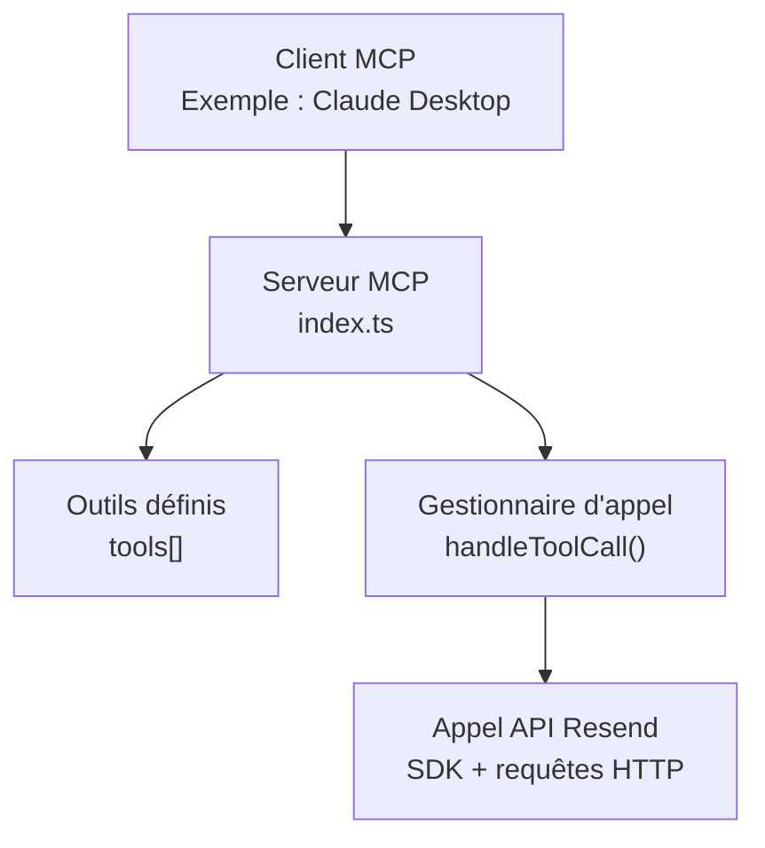
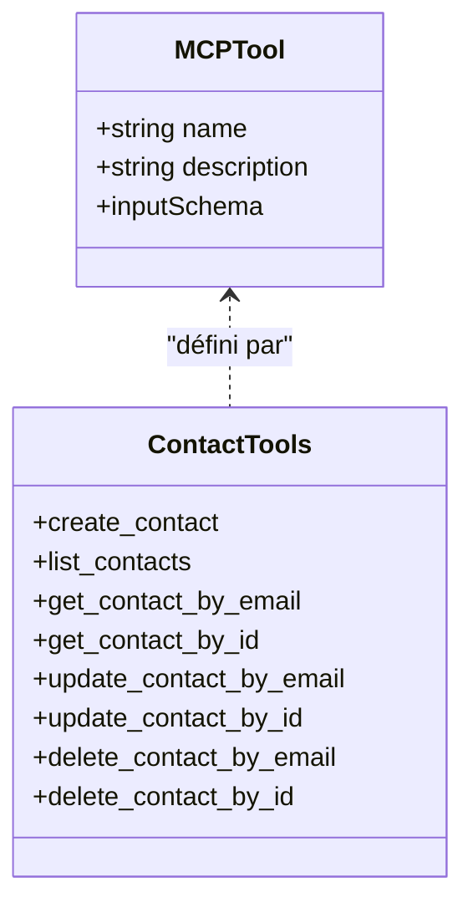

# Opérations CRUD de Base

<cite>
**Fichiers référencés dans ce document**
- [src/index.ts](file://src/index.ts)
- [README.md](file://README.md)
- [package.json](file://package.json)
</cite>

## Sommaire
1. [Introduction](#introduction)
2. [Projet](#projet)
3. [Architecture de l’application](#architecture-de-lapplication)
4. [Composants principaux](#composants-principaux)
5. [Architecture de l’outil](#architecture-de-loutil)
6. [Analyse détaillée des opérations CRUD](#analyse-detaillee-des-operatons-crud)
7. [Gestion des erreurs](#gestion-des-erreurs)
8. [Validation des données](#validation-des-donnees)
9. [Cas d’utilisation typiques](#cas-dutilisation-typiques)
10. [Conclusion](#conclusion)

## Introduction
Ce document fournit une documentation complète des opérations CRUD de base pour la gestion des contacts au sein de l’application. Il couvre les huit outils principaux : create_contact, list_contacts, get_contact_by_email, get_contact_by_id, update_contact_by_email, update_contact_by_id, delete_contact_by_email, delete_contact_by_id. Pour chacun, vous trouverez les paramètres d’entrée, les schémas JSON, des exemples concrets d’utilisation, ainsi que les différences entre les méthodes par email et par ID. Des cas d’utilisation typiques, des validations de données et des recommandations de gestion des erreurs sont également inclus.

## Projet
L’application est un serveur MCP (Model Context Protocol) qui expose l’intégralité de l’API Resend sous forme d’outils invocables. Elle permet aux assistants IA de gérer des audiences, des contacts, des diffusions, des modèles, des domaines, des clés API, des webhooks, des segments, des sujets et des propriétés de contact.

- Langage : TypeScript
- Dépendances principales : Resend SDK, dotenv
- Serveur MCP : exécution via stdin/stdout

**Section sources**
- [package.json](file://package.json#L1-L49)
- [README.md](file://README.md#L1-L721)

## Architecture de l’application
Le serveur MCP est composé de :
- Une définition des outils (tools) avec leurs schémas d’entrée
- Un gestionnaire centralisé des appels d’outils (handleToolCall)
- Une implémentation MCP complète (listTools, callTool)

**Diagram sources**
- [src/index.ts](file://src/index.ts#L1008-L1522)

**Section sources**
- [src/index.ts](file://src/index.ts#L1008-L1522)

## Composants principaux
- Définition des outils : chaque outil possède un nom, une description et un inputSchema JSON Schema.
- Gestionnaire d’appel : route les appels d’outils vers les implémentations Resend ou via des appels HTTP directs.
- Serveur MCP : expose les méthodes tools/list et tools/call.

**Section sources**
- [src/index.ts](file://src/index.ts#L13-L36)
- [src/index.ts](file://src/index.ts#L1008-L1522)

## Architecture de l’outil
Chaque outil est décrit par un objet MCPTool comprenant :
- name : nom de l’outil
- description : brève description
- inputSchema : JSON Schema décrivant les paramètres requis et optionnels

Les outils CRUD pour les contacts sont définis entre les lignes 395 et 500 du fichier principal.

**Diagram sources**
- [src/index.ts](file://src/index.ts#L395-L500)

**Section sources**
- [src/index.ts](file://src/index.ts#L395-L500)

## Analyse détaillée des opérations CRUD

### create_contact
- Description : Ajoute un nouveau contact à une audience.
- Paramètres d’entrée (inputSchema) :
  - audience_id : chaîne, requis
  - email : chaîne, requis
  - first_name : chaîne, optionnel
  - last_name : chaîne, optionnel
  - unsubscribed : booléen, optionnel
- Exemple d’utilisation (JSON) :
  - Nom de l’outil : create_contact
  - Arguments : audience_id, email, first_name, last_name, unsubscribed
- Implémentation : Utilise le SDK Resend pour créer le contact.

**Section sources**
- [src/index.ts](file://src/index.ts#L397-L410)
- [src/index.ts](file://src/index.ts#L1151-L1158)

### list_contacts
- Description : Récupère tous les contacts d’une audience.
- Paramètres d’entrée (inputSchema) :
  - audience_id : chaîne, requis
- Exemple d’utilisation (JSON) :
  - Nom de l’outil : list_contacts
  - Arguments : audience_id
- Implémentation : Utilise le SDK Resend pour lister les contacts.

**Section sources**
- [src/index.ts](file://src/index.ts#L412-L421)
- [src/index.ts](file://src/index.ts#L1160-L1161)

### get_contact_by_email
- Description : Récupère un contact par son adresse email.
- Paramètres d’entrée (inputSchema) :
  - audience_id : chaîne, requis
  - email : chaîne, requis
- Exemple d’utilisation (JSON) :
  - Nom de l’outil : get_contact_by_email
  - Arguments : audience_id, email
- Implémentation : Appel HTTP GET à l’API Resend pour obtenir le contact par email.

**Section sources**
- [src/index.ts](file://src/index.ts#L423-L432)
- [src/index.ts](file://src/index.ts#L1163-L1166)

### get_contact_by_id
- Description : Récupère un contact par son identifiant.
- Paramètres d’entrée (inputSchema) :
  - audience_id : chaîne, requis
  - contact_id : chaîne, requis
- Exemple d’utilisation (JSON) :
  - Nom de l’outil : get_contact_by_id
  - Arguments : audience_id, contact_id
- Implémentation : Appel HTTP GET à l’API Resend pour obtenir le contact par ID.

**Section sources**
- [src/index.ts](file://src/index.ts#L435-L444)
- [src/index.ts](file://src/index.ts#L1168-L1171)

### update_contact_by_email
- Description : Met à jour un contact par son adresse email.
- Paramètres d’entrée (inputSchema) :
  - audience_id : chaîne, requis
  - email : chaîne, requis
  - first_name : chaîne, optionnel
  - last_name : chaîne, optionnel
  - unsubscribed : booléen, optionnel
- Exemple d’utilisation (JSON) :
  - Nom de l’outil : update_contact_by_email
  - Arguments : audience_id, email, first_name, last_name, unsubscribed
- Implémentation : Appel HTTP PATCH à l’API Resend pour mettre à jour le contact par email.

**Section sources**
- [src/index.ts](file://src/index.ts#L447-L459)
- [src/index.ts](file://src/index.ts#L1173-L1183)

### update_contact_by_id
- Description : Met à jour un contact par son identifiant.
- Paramètres d’entrée (inputSchema) :
  - audience_id : chaîne, requis
  - contact_id : chaîne, requis
  - first_name : chaîne, optionnel
  - last_name : chaîne, optionnel
  - unsubscribed : booléen, optionnel
- Exemple d’utilisation (JSON) :
  - Nom de l’outil : update_contact_by_id
  - Arguments : audience_id, contact_id, first_name, last_name, unsubscribed
- Implémentation : Utilise le SDK Resend pour mettre à jour le contact par ID.

**Section sources**
- [src/index.ts](file://src/index.ts#L462-L474)
- [src/index.ts](file://src/index.ts#L1186-L1193)

### delete_contact_by_email
- Description : Supprime un contact par son adresse email.
- Paramètres d’entrée (inputSchema) :
  - audience_id : chaîne, requis
  - email : chaîne, requis
- Exemple d’utilisation (JSON) :
  - Nom de l’outil : delete_contact_by_email
  - Arguments : audience_id, email
- Implémentation : Appel HTTP DELETE à l’API Resend pour supprimer le contact par email.

**Section sources**
- [src/index.ts](file://src/index.ts#L477-L486)
- [src/index.ts](file://src/index.ts#L1195-L1201)

### delete_contact_by_id
- Description : Supprime un contact par son identifiant.
- Paramètres d’entrée (inputSchema) :
  - audience_id : chaîne, requis
  - contact_id : chaîne, requis
- Exemple d’utilisation (JSON) :
  - Nom de l’outil : delete_contact_by_id
  - Arguments : audience_id, contact_id
- Implémentation : Utilise le SDK Resend pour supprimer le contact par ID.

**Section sources**
- [src/index.ts](file://src/index.ts#L489-L498)
- [src/index.ts](file://src/index.ts#L1203-L1207)

## Différences entre les méthodes par email et par ID
- Accès : get_contact_by_email et update_contact_by_email/delete_contact_by_email utilisent l’adresse email comme identifiant, tandis que get_contact_by_id, update_contact_by_id et delete_contact_by_id utilisent l’identifiant technique du contact.
- Implémentation : Les méthodes par email utilisent des appels HTTP directement à l’API Resend, tandis que les méthodes par ID utilisent le SDK Resend.
- Sécurité : L’accès par email peut être plus vulnérable si l’email est mal formé, tandis que l’ID technique est plus robuste mais nécessite de disposer de l’ID.

**Section sources**
- [src/index.ts](file://src/index.ts#L1163-L1166)
- [src/index.ts](file://src/index.ts#L1168-L1171)
- [src/index.ts](file://src/index.ts#L1173-L1183)
- [src/index.ts](file://src/index.ts#L1186-L1193)
- [src/index.ts](file://src/index.ts#L1195-L1201)
- [src/index.ts](file://src/index.ts#L1203-L1207)

## Gestion des erreurs
Le serveur MCP encapsule les appels d’outils dans un try/catch. En cas d’échec, il renvoie un message d’erreur contenant le nom de l’outil, les arguments fournis et le message d’erreur technique.

- Erreurs fréquentes selon la documentation du projet :
  - 401 Unauthorized : clé API invalide ou manquante
  - 403 Forbidden : permissions insuffisantes
  - 400 Bad Request : paramètres invalides ou champs requis manquants
  - 422 Unprocessable Entity : syntaxe valide mais données invalides
  - 404 Not Found : ressource inexistante
  - 409 Conflict : conflit ou ressource déjà existante
  - 429 Too Many Requests : dépassement de limite de fréquence
  - 500 Internal Server Error : problème côté service Resend
  - 503 Service Unavailable : indisponibilité temporaire

**Section sources**
- [src/index.ts](file://src/index.ts#L1519-L1522)
- [README.md](file://README.md#L528-L549)

## Validation des données
- Schémas JSON : Chaque outil dispose d’un inputSchema qui décrit les champs requis et optionnels. Par exemple, create_contact exige audience_id et email.
- Types attendus : string pour les identifiants et adresses email, boolean pour l’état de désabonnement.
- Validation côté client : les clients MCP peuvent valider les arguments avant l’appel.

**Section sources**
- [src/index.ts](file://src/index.ts#L397-L410)
- [src/index.ts](file://src/index.ts#L412-L421)
- [src/index.ts](file://src/index.ts#L423-L432)
- [src/index.ts](file://src/index.ts#L435-L444)
- [src/index.ts](file://src/index.ts#L447-L459)
- [src/index.ts](file://src/index.ts#L462-L474)
- [src/index.ts](file://src/index.ts#L477-L486)
- [src/index.ts](file://src/index.ts#L489-L498)

## Cas d’utilisation typiques
- Création de contact : Ajouter un abonné à une audience avec nom, prénom et statut de désabonnement.
- Mise à jour de contact : Modifier le prénom, le nom ou le statut de désabonnement d’un contact.
- Recherche de contact : Trouver un contact soit par email, soit par ID technique.
- Suppression de contact : Retirer un contact d’une audience par email ou par ID.

Ces cas sont illustrés par les schémas JSON des outils et par les exemples d’appel fournis dans la documentation du projet.

**Section sources**
- [README.md](file://README.md#L377-L406)

## Conclusion
Les opérations CRUD de base pour les contacts sont bien définies et exposées via des outils MCP avec des schémas JSON précis. Le serveur gère à la fois les accès par email et par ID, avec des implémentations variées (SDK Resend ou appels HTTP). La documentation fournit des directives claires pour la validation des données, la gestion des erreurs et des cas d’utilisation courants.