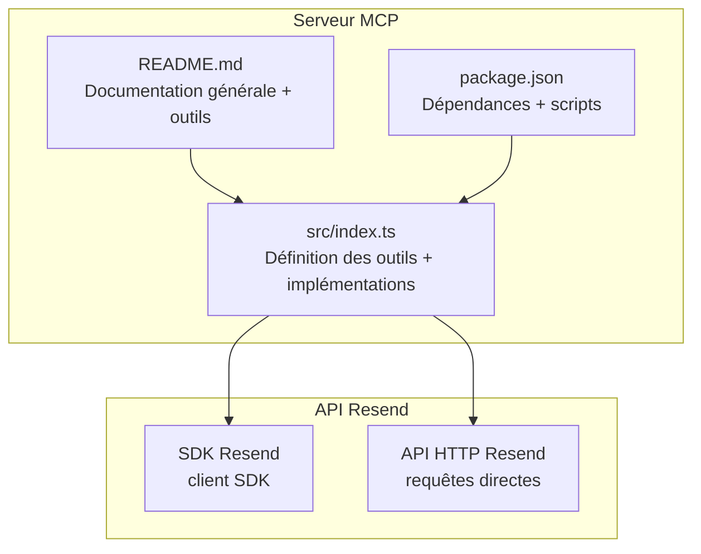
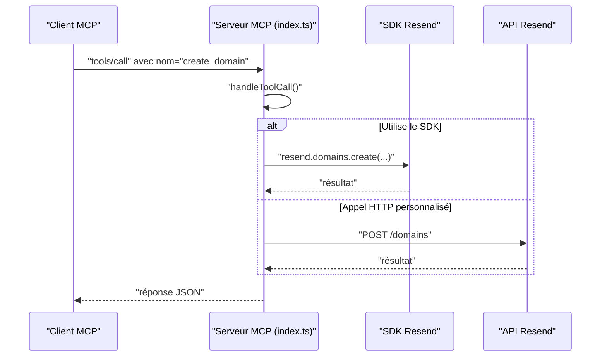
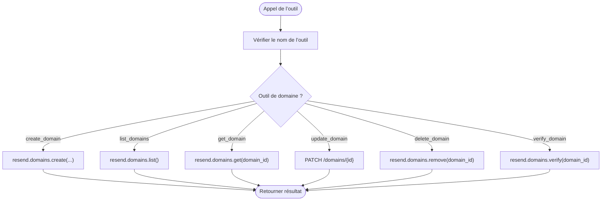
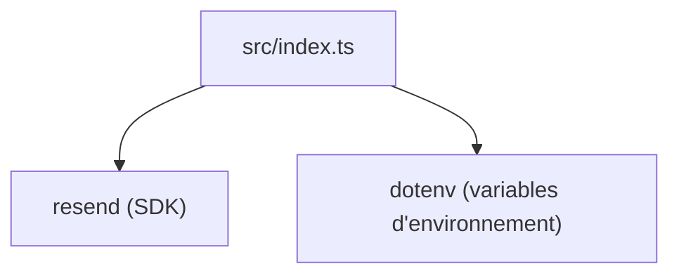

# Module Domaines

<cite>
**Fichiers référencés dans ce document**
- [README.md](file://README.md)
- [package.json](file://package.json)
- [src/index.ts](file://src/index.ts)
</cite>

## Sommaire
1. [Introduction](#introduction)
2. [Structure du projet](#structure-du-projet)
3. [Composants principaux](#composants-principaux)
4. [Aperçu de l’architecture](#aperçu-de-larchitecture)
5. [Analyse détaillée des outils de domaine](#analyse-détaillée-des-outils-de-domaine)
6. [Analyse des dépendances](#analyse-des-dépendances)
7. [Considérations sur les performances](#considérations-sur-les-performances)
8. [Guide de dépannage](#guide-de-dépannage)
9. [Conclusion](#conclusion)
10. [Annexes](#annexes)

## Introduction
Le module Domaines de l’API Resend est un ensemble de 6 outils qui permettent de gérer entièrement les domaines d’envoi depuis un assistant IA ou un client MCP. Ces outils couvrent la création, la vérification DNS, la mise à jour des paramètres de suivi, la récupération des informations, la suppression, ainsi que la liste des domaines configurés. Le présent document explique comment ces outils fonctionnent, leurs paramètres, leur intégration dans le serveur MCP, et fournit des bonnes pratiques de sécurité et de configuration pour des environnements de production.

## Structure du projet
Le projet est un serveur Model Context Protocol (MCP) qui expose l’ensemble de l’API Resend sous forme d’outils invocables. Le cœur de l’implémentation se trouve dans le fichier principal de l’application, qui définit les outils, leurs schémas d’entrée, et leurs implémentations.

**Diagramme sources**
- [src/index.ts](file://src/index.ts#L1-L1623)
- [README.md](file://README.md#L1-L721)
- [package.json](file://package.json#L1-L49)

**Section sources**
- [README.md](file://README.md#L1-L721)
- [package.json](file://package.json#L1-L49)
- [src/index.ts](file://src/index.ts#L1-L1623)

## Composants principaux
Le module Domaines est composé de six outils définis dans le tableau des outils MCP. Chacun possède un nom, une description, et un schéma d’entrée précis. Les implémentations sont soit des appels directs au SDK Resend, soit des requêtes HTTP personnalisées vers l’API Resend.

- create_domain : ajoute un nouveau domaine à votre compte Resend.
- list_domains : récupère tous les domaines de votre compte.
- get_domain : récupère les détails d’un domaine spécifique.
- update_domain : modifie les paramètres de suivi (ouverture et clics).
- delete_domain : supprime un domaine de votre compte.
- verify_domain : vérifie les enregistrements DNS du domaine.

Ces outils sont définis dans le tableau des outils et implémentés dans la fonction de gestion des appels d’outil.

**Section sources**
- [src/index.ts](file://src/index.ts#L251-L317)
- [src/index.ts](file://src/index.ts#L1100-L1126)

## Aperçu de l’architecture
Le serveur MCP reçoit des requêtes via stdin, identifie la méthode (tools/list ou tools/call), puis exécute l’outil correspondant. Pour les outils de domaine, l’exécution peut utiliser soit le SDK Resend, soit des appels HTTP directs à l’API Resend.

**Diagramme sources**
- [src/index.ts](file://src/index.ts#L1008-L1522)
- [src/index.ts](file://src/index.ts#L1100-L1126)

## Analyse détaillée des outils de domaine

### Schéma des outils de domaine
Chaque outil de domaine dispose d’un schéma d’entrée qui précise les champs requis et optionnels. Voici un résumé des schémas pour chaque outil.

- create_domain
  - Propriétés : name (chaîne, requis), region (chaîne, optionnel)
  - Description : Ajouter un nouveau domaine à votre compte Resend.
- list_domains
  - Propriétés : aucun champ requis
  - Description : Récupérer tous les domaines de votre compte.
- get_domain
  - Propriétés : domain_id (chaîne, requis)
  - Description : Récupérer les détails d’un domaine spécifique.
- update_domain
  - Propriétés : domain_id (chaîne, requis), open_tracking (booléen, optionnel), click_tracking (booléen, optionnel)
  - Description : Mettre à jour les paramètres de suivi (ouverture et clics).
- delete_domain
  - Propriétés : domain_id (chaîne, requis)
  - Description : Supprimer un domaine de votre compte.
- verify_domain
  - Propriétés : domain_id (chaîne, requis)
  - Description : Vérifier les enregistrements DNS du domaine.

**Section sources**
- [src/index.ts](file://src/index.ts#L251-L317)

### Implémentation des outils de domaine
Les implémentations des outils de domaine se trouvent dans la fonction de gestion des appels d’outil. Elles utilisent soit le SDK Resend, soit des appels HTTP directs.

- create_domain
  - Implémentation : appel au SDK Resend pour créer un domaine.
  - Entrées attendues : name, region.
- list_domains
  - Implémentation : appel au SDK Resend pour lister les domaines.
- get_domain
  - Implémentation : appel au SDK Resend pour récupérer un domaine spécifique.
- update_domain
  - Implémentation : requête HTTP PATCH personnalisée pour mettre à jour open_tracking et click_tracking.
- delete_domain
  - Implémentation : appel au SDK Resend pour supprimer un domaine.
- verify_domain
  - Implémentation : appel au SDK Resend pour vérifier le domaine.

**Diagramme sources**
- [src/index.ts](file://src/index.ts#L1100-L1126)

**Section sources**
- [src/index.ts](file://src/index.ts#L1100-L1126)

### Gestion DNS et vérification
La vérification DNS est un processus essentiel pour valider la propriété d’un domaine et activer l’authentification d’expéditeur (SPF, DKIM, DMARC). Le module propose un outil de vérification qui interroge l’état des enregistrements DNS configurés pour le domaine.

- Utilisation recommandée : après avoir créé un domaine, appelez verify_domain pour obtenir les enregistrements nécessaires et les vérifier.
- Résultats : le système retourne les enregistrements DNS à configurer (par exemple, des enregistrements TXT, CNAME, MX) selon la configuration demandée.

**Section sources**
- [src/index.ts](file://src/index.ts#L307-L317)
- [src/index.ts](file://src/index.ts#L1124-L1126)

### Paramètres de domaine
Les paramètres de domaine incluent :
- open_tracking : activation/désactivation du suivi des ouvertures.
- click_tracking : activation/désactivation du suivi des clics.

Ces paramètres peuvent être mis à jour via l’outil update_domain. Ils influencent la collecte de données sur l’engagement des emails envoyés depuis ce domaine.

**Section sources**
- [src/index.ts](file://src/index.ts#L283-L295)
- [src/index.ts](file://src/index.ts#L1109-L1119)

### Configuration régionale
Lors de la création d’un domaine, vous pouvez spécifier une région. Cela permet de choisir le point de présence géographique de vos envois pour des raisons de conformité ou de performance.

- Exemple de région : us-east-1, eu-west-1, sa-east-1.
- Cette information est transmise lors de la création du domaine.

**Section sources**
- [src/index.ts](file://src/index.ts#L255-L262)
- [README.md](file://README.md#L331-L352)

### Permissions et sécurité
- Clé API : l’accès aux outils de domaine nécessite une clé API valide configurée dans les variables d’environnement.
- Permissions : il est recommandé d’utiliser des clés API à accès restreint (par exemple, envoi uniquement) pour limiter les risques.
- Sécurité : ne jamais stocker les clés API dans le code source ni dans des fichiers versionnés.

**Section sources**
- [README.md](file://README.md#L180-L210)
- [README.md](file://README.md#L493-L517)

### Bonnes pratiques de gestion des domaines
- Créer un domaine par environnement (développement, staging, production) pour éviter les conflits de configuration.
- Configurer SPF, DKIM, DMARC avant d’envoyer des emails en production.
- Utiliser verify_domain régulièrement pour s’assurer que les enregistrements DNS sont toujours corrects.
- Limiter les permissions des clés API utilisées pour gérer les domaines.
- Surveiller les erreurs de vérification DNS et corriger rapidement les enregistrements manquants.

**Section sources**
- [README.md](file://README.md#L493-L517)
- [README.md](file://README.md#L518-L550)

## Analyse des dépendances
Le serveur MCP repose sur plusieurs dépendances pour fonctionner correctement.

**Diagramme sources**
- [src/index.ts](file://src/index.ts#L1-L4)
- [package.json](file://package.json#L32-L34)

**Section sources**
- [package.json](file://package.json#L32-L34)
- [src/index.ts](file://src/index.ts#L1-L4)

## Considérations sur les performances
- Taux de limitation : le serveur respecte les limites de l’API Resend. En cas de dépassement, les requêtes seront automatiquement gérées (reprise, attente).
- Utilisation optimale : regroupez les opérations de mise à jour de domaine si vous devez modifier plusieurs paramètres en même temps.
- Réduction des appels : utilisez list_domains pour obtenir la liste des domaines avant d’appeler get_domain pour un domaine spécifique.

**Section sources**
- [README.md](file://README.md#L518-L527)

## Guide de dépannage
Voici quelques cas fréquents liés aux outils de domaine et comment les résoudre.

- Erreur d’authentification
  - Symptôme : erreur 401/403 lors de l’appel d’un outil de domaine.
  - Cause probable : clé API manquante ou incorrecte.
  - Solution : vérifiez la variable d’environnement RESEND_API_KEY et redémarrez le serveur.
- Paramètres manquants
  - Symptôme : erreur 400/422 sur create_domain ou update_domain.
  - Cause probable : champ requis manquant (par exemple domain_id, name).
  - Solution : assurez-vous de fournir tous les champs requis dans le schéma de l’outil.
- Ressource introuvable
  - Symptôme : erreur 404 sur get_domain ou delete_domain.
  - Cause probable : l’identifiant de domaine est incorrect ou inexistant.
  - Solution : vérifiez l’identifiant fourni et utilisez list_domains pour le retrouver.
- Dépassement de limite de taux
  - Symptôme : erreur 429 Too Many Requests.
  - Cause probable : trop de requêtes envoyées en peu de temps.
  - Solution : attendez quelques secondes entre les appels ou réduisez le nombre de requêtes.
- Erreur inattendue
  - Symptôme : message d’erreur générique.
  - Cause probable : problème réseau ou erreur interne.
  - Solution : vérifiez la connectivité réseau, réessayez plus tard, et consultez les logs.

**Section sources**
- [README.md](file://README.md#L528-L550)
- [src/index.ts](file://src/index.ts#L1516-L1522)

## Conclusion
Le module Domaines de l’API Resend, exposé via le serveur MCP, offre un ensemble complet d’outils pour gérer les domaines d’envoi. Grâce à des schémas d’entrée clairs, à des implémentations fiables (SDK ou appels HTTP), et à des bonnes pratiques de sécurité, vous pouvez automatiser la création, la vérification DNS, la mise à jour des paramètres, et la suppression de domaines de manière sécurisée et efficace. Pour des environnements de production, veillez à configurer correctement SPF, DKIM, DMARC, à limiter les permissions des clés API, et à surveiller régulièrement l’état des enregistrements DNS.

## Annexes
- Exemples d’utilisation de l’outil create_domain
  - Description : Ajouter un domaine à votre compte Resend.
  - Exemple de requête : tools/call avec name=create_domain et arguments contenant name et region.
  - Résultat : réponse contenant les détails du domaine nouvellement créé.

**Section sources**
- [README.md](file://README.md#L331-L352)
- [src/index.ts](file://src/index.ts#L251-L263)