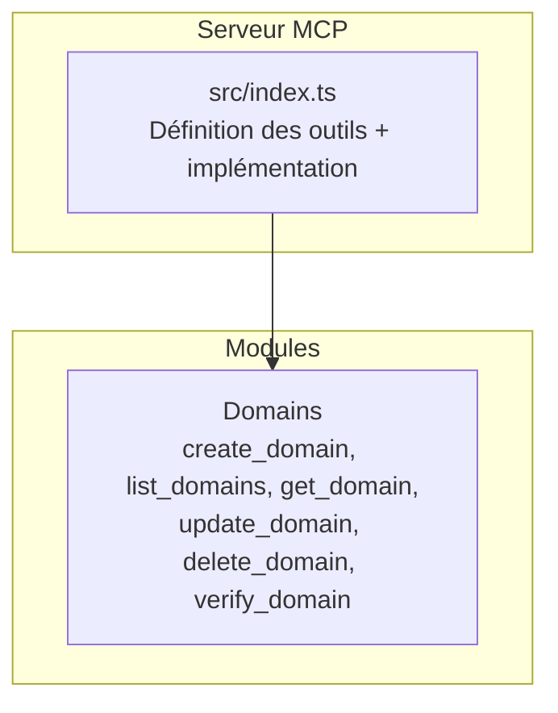
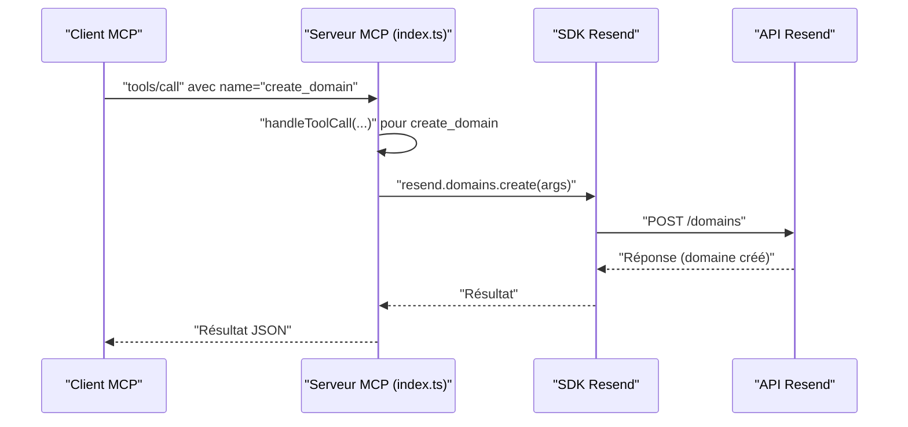

# Outil create_domain

<cite>
**Fichiers référencés dans ce document**
- [src/index.ts](file://src/index.ts)
- [README.md](file://README.md)
- [package.json](file://package.json)
</cite>

## Sommaire
1. [Introduction](#introduction)
2. [Structure du projet](#structure-du-projet)
3. [Composants principaux](#composants-principaux)
4. [Aperçu de l’architecture](#aperçu-de-larchitecture)
5. [Analyse détaillée des composants](#analyse-détaillée-des-composants)
6. [Analyse des dépendances](#analyse-des-dépendances)
7. [Considérations sur les performances](#considérations-sur-les-performances)
8. [Guide de dépannage](#guide-de-dépannage)
9. [Conclusion](#conclusion)

## Introduction
Cet outil permet de créer un nouveau domaine dans votre compte Resend à travers le protocole Model Context Protocol (MCP). Il s’agit de l’un des outils de gestion des domaines offerts par le serveur MCP complet de Resend, couvrant l’ensemble des fonctionnalités de l’API Resend. Ce document explique comment utiliser l’outil create_domain, ses paramètres requis, les options de configuration disponibles, les bonnes pratiques, les régions prises en charge, ainsi que le processus de vérification DNS initial après la création du domaine.

## Structure du projet
Le projet est un serveur MCP qui expose toutes les fonctionnalités de l’API Resend sous forme d’outils invocables. Le cœur de l’application se trouve dans le fichier principal, où sont définis les outils (y compris create_domain) et leur implémentation.

**Diagramme sources**
- [src/index.ts](file://src/index.ts#L251-L317)

**Section sources**
- [src/index.ts](file://src/index.ts#L1-L100)
- [README.md](file://README.md#L1-L100)

## Composants principaux
- Définition de l’outil create_domain : nom, description, schéma d’entrée (paramètres), et champs requis.
- Implémentation de l’appel à l’API Resend via le SDK ou des appels HTTP directs pour les outils non couverts par le SDK.

**Section sources**
- [src/index.ts](file://src/index.ts#L251-L263)
- [src/index.ts](file://src/index.ts#L1100-L1101)

## Aperçu de l’architecture
Le serveur MCP expose une interface standardisée pour interagir avec Resend. Lorsqu’un client MCP appelle l’outil create_domain, le serveur exécute l’opération en utilisant soit le SDK Resend, soit des appels HTTP directs si nécessaire.

**Diagramme sources**
- [src/index.ts](file://src/index.ts#L1100-L1101)
- [src/index.ts](file://src/index.ts#L1008-L1522)

## Analyse détaillée des composants

### Outil create_domain
- Nom : create_domain
- Description : Ajouter un nouveau domaine à votre compte Resend.
- Schéma d’entrée :
  - name : chaîne de caractères (obligatoire). Exemple : "example.com".
  - region : chaîne de caractères (optionnel). Valeurs autorisées : us-east-1, eu-west-1, sa-east-1.
- Régions disponibles et implications :
  - us-east-1 : États-Unis (ouest). Bonne latence pour les clients américains.
  - eu-west-1 : Europe (ouest). Bonne latence pour les clients européens.
  - sa-east-1 : Amérique du Sud (est). Bonne latence pour les clients sud-américains.
- Paramètres requis : name.
- Options de configuration : aucune autre option spécifique au moment de la création (la région est optionnelle, mais peut influencer la localisation des serveurs de livraison).

Validation effectuée côté serveur :
- Vérification de la présence du champ name.
- Utilisation du SDK Resend pour valider le reste des contraintes (nom de domaine valide, unicité, etc.).

Messages d’erreur possibles (issues du SDK Resend) :
- Erreurs d’authentification : clé API invalide ou manquante.
- Erreurs de validation : nom de domaine incorrect, déjà utilisé, ou non conforme.
- Erreurs de ressource : conflit (domaine déjà existant), introuvable si vous faites référence à un identifiant erroné.
- Erreurs de taux limite : dépassement de la limite de requêtes.
- Erreurs serveur : problèmes temporaires du service Resend.

Bonne pratique pour la création de domaines :
- Sélectionnez la région la plus proche de vos destinataires pour optimiser la livraison.
- Vérifiez que le nom de domaine est correctement configuré dans votre DNS avant de tenter la création.
- Utilisez des noms de domaine uniques et évitez les caractères spéciaux non supportés.

Exemples d’appels API (représentation schématique) :
- Création d’un domaine avec région spécifiée : { name: "example.com", region: "us-east-1" }.
- Création d’un domaine sans région (utilise la région par défaut du compte) : { name: "example.com" }.

Processus de vérification DNS initial après la création du domaine :
- Après la création, Resend génère des enregistrements DNS à configurer dans votre zone DNS (SPF, DKIM, DMARC).
- Vous pouvez utiliser l’outil verify_domain pour forcer une nouvelle vérification des enregistrements DNS.
- Une fois les enregistrements configurés, Resend valide leur conformité et met à jour l’état du domaine.

**Section sources**
- [src/index.ts](file://src/index.ts#L251-L263)
- [src/index.ts](file://src/index.ts#L1100-L1101)
- [README.md](file://README.md#L31-L37)

### Autres outils liés aux domaines
- list_domains : récupérer tous les domaines de votre compte.
- get_domain : obtenir les détails d’un domaine spécifique.
- update_domain : modifier les paramètres de suivi (open_tracking, click_tracking).
- delete_domain : supprimer un domaine de votre compte.
- verify_domain : forcer la vérification des enregistrements DNS.

Implémentation associée :
- list_domains : appel au SDK Resend.
- get_domain : appel au SDK Resend.
- update_domain : appel HTTP PATCH vers /domains/{domain_id}.
- delete_domain : appel au SDK Resend.
- verify_domain : appel au SDK Resend.

**Section sources**
- [src/index.ts](file://src/index.ts#L1103-L1104)
- [src/index.ts](file://src/index.ts#L1106-L1107)
- [src/index.ts](file://src/index.ts#L1109-L1119)
- [src/index.ts](file://src/index.ts#L1121-L1122)
- [src/index.ts](file://src/index.ts#L1124-L1125)

## Analyse des dépendances
- Dépendance principale : le SDK Resend pour gérer les opérations de domaine.
- Gestion de l’environnement : lecture de la clé API depuis les variables d’environnement.
- Implémentation MCP : utilisation de stdio pour communiquer avec le client MCP.

**Section sources**
- [package.json](file://package.json#L32-L34)
- [src/index.ts](file://src/index.ts#L1-L7)
- [src/index.ts](file://src/index.ts#L1571-L1577)

## Considérations sur les performances
- Le serveur MCP respecte les limites de taux de l’API Resend (par défaut 2 requêtes/seconde).
- Pour des opérations massives, planifiez les appels en conséquence et gérez les retours d’erreur (erreurs 429 Too Many Requests).
- La mise en place de la vérification DNS peut prendre quelques minutes à plusieurs heures selon la propagation DNS.

## Guide de dépannage
- Erreur : clé API non définie
  - Cause : variable d’environnement manquante.
  - Solution : ajoutez RESEND_API_KEY dans votre fichier .env.
- Erreur : domaine déjà existant
  - Cause : conflit de nom de domaine.
  - Solution : utilisez un nom de domaine unique.
- Erreur : validation DNS échouée
  - Cause : enregistrements DNS non configurés ou incorrects.
  - Solution : configurez SPF, DKIM, DMARC comme indiqué par Resend, puis exécutez verify_domain.
- Erreur : outil inconnu
  - Cause : mauvais nom d’outil.
  - Solution : utilisez tools/list pour obtenir la liste des outils disponibles.

**Section sources**
- [README.md](file://README.md#L551-L573)
- [src/index.ts](file://src/index.ts#L1571-L1577)

## Conclusion
L’outil create_domain permet de créer facilement un domaine Resend à partir d’un client MCP. En choisissant la bonne région, en respectant les règles de validation et en configurant correctement les enregistrements DNS, vous garantissez une livraison fiable et sécurisée. Utilisez verify_domain pour confirmer la bonne configuration des enregistrements DNS après la création.