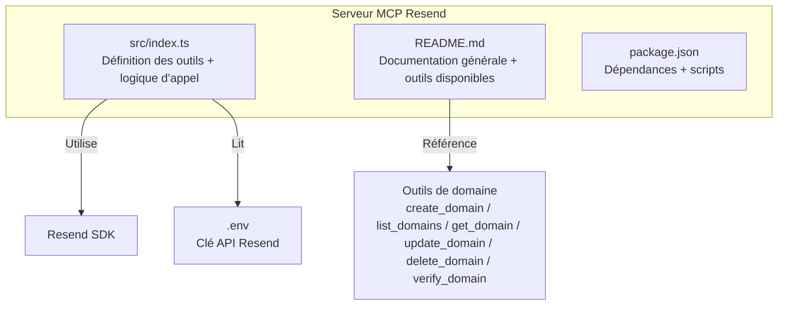
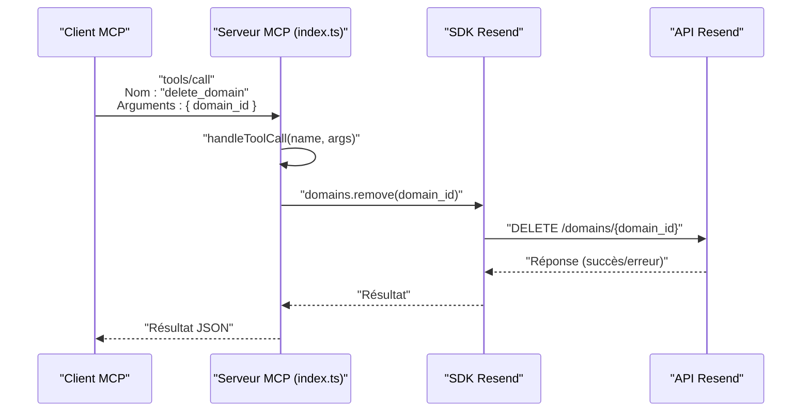
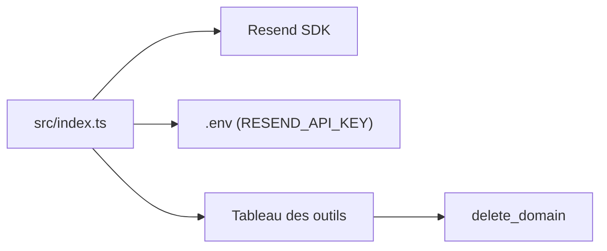

# Outil delete_domain

<cite>
**Fichiers référencés dans ce document**
- [README.md](file://README.md)
- [package.json](file://package.json)
- [src/index.ts](file://src/index.ts)
</cite>

## Sommaire
1. [Introduction](#introduction)
2. [Structure du projet](#structure-du-projet)
3. [Composants principaux](#composants-principaux)
4. [Aperçu de l’architecture](#aperçu-de-larchitecture)
5. [Analyse détaillée des composants](#analyse-détaillée-des-composants)
6. [Analyse des dépendances](#analyse-des-dépendances)
7. [Considérations sur les performances](#considérations-sur-les-performances)
8. [Guide de dépannage](#guide-de-dépannage)
9. [Conclusion](#conclusion)

## Introduction
Cet outil permet de supprimer un domaine de votre compte Resend. Il fait partie de l’ensemble des outils de gestion des domaines fournis par le serveur MCP complet de Resend. La suppression d’un domaine est irréversible et impacte les envois d’emails utilisant ce domaine. Ce document explique comment utiliser l’outil delete_domain, ses implications, les validations effectuées, les messages d’erreur possibles, ainsi que les alternatives comme la désactivation.

## Structure du projet
Le projet est un serveur MCP qui expose l’ensemble de l’API Resend sous forme d’outils invocables. Le code principal se trouve dans le fichier source principal, qui définit tous les outils (y compris delete_domain) ainsi que leur schéma d’entrée, et implémente le traitement des appels d’outils.

**Diagramme sources**
- [src/index.ts](file://src/index.ts#L1-L100)
- [README.md](file://README.md#L31-L37)
- [package.json](file://package.json#L32-L34)

**Section sources**
- [README.md](file://README.md#L31-L37)
- [package.json](file://package.json#L1-L49)
- [src/index.ts](file://src/index.ts#L1-L100)

## Composants principaux
- Définition de l’outil delete_domain : nom, description, schéma d’entrée (paramètre obligatoire : identifiant du domaine).
- Implémentation de l’appel de l’outil : suppression via le SDK Resend.
- Gestion des erreurs : renvoi d’un message structuré en cas d’échec.

**Section sources**
- [src/index.ts](file://src/index.ts#L296-L306)
- [src/index.ts](file://src/index.ts#L1121-L1122)

## Aperçu de l’architecture
L’outil delete_domain est exécuté via le protocole MCP. Le serveur reçoit une requête contenant le nom de l’outil et ses arguments, puis appelle la fonction correspondante qui effectue l’appel au SDK Resend.

**Diagramme sources**
- [src/index.ts](file://src/index.ts#L1536-L1564)
- [src/index.ts](file://src/index.ts#L1121-L1122)

## Analyse détaillée des composants

### Schéma d’entrée de l’outil delete_domain
- Nom de l’outil : delete_domain
- Description : Supprime un domaine de votre compte Resend.
- Paramètres :
  - domain_id : identifiant unique du domaine à supprimer (obligatoire)

Validation effectuée côté serveur
- Le schéma d’entrée impose l’obligation du paramètre domain_id.
- En cas d’absence de ce paramètre, l’appel échouera avec un message d’erreur structuré.

**Section sources**
- [src/index.ts](file://src/index.ts#L296-L306)

### Implémentation de l’appel de l’outil
- L’appel de l’outil est géré par la fonction handleToolCall.
- Pour delete_domain, l’exécution consiste à appeler la méthode remove du module domains du SDK Resend avec le domain_id fourni.

**Section sources**
- [src/index.ts](file://src/index.ts#L1121-L1122)
- [src/index.ts](file://src/index.ts#L1008-L1522)

### Messages d’erreur possibles
- Erreur d’exécution de l’outil : le serveur renvoie un message structuré contenant l’erreur, le nom de l’outil et les arguments transmis.
- Erreurs spécifiques liées à l’identifiant du domaine (non trouvé, invalide) seront renvoyées par le SDK Resend et remontées au client.

Exemples de scénarios d’erreurs attendus
- Domaine introuvable : erreur de type 404 Not Found.
- Identifiant manquant ou incorrect : erreur de validation (400/422 selon le cas).
- Problèmes d’autorisation : erreur 403 Forbidden.
- Trop de requêtes : erreur 429 Too Many Requests.

**Section sources**
- [README.md](file://README.md#L528-L549)
- [src/index.ts](file://src/index.ts#L1519-L1521)

### Implications de la suppression
- Suppression irréversible : le domaine est retiré de votre compte Resend.
- Impact sur les envois : toute tentative d’envoi d’emails depuis ce domaine échouera si le domaine n’est plus configuré.
- Aucune suppression de données liées aux envois ou aux contacts : seul le domaine est supprimé.

**Section sources**
- [README.md](file://README.md#L31-L37)

### Alternatives à la suppression
- Désactivation temporaire : vous pouvez mettre à jour les paramètres du domaine (par exemple, désactiver le suivi) via l’outil update_domain pour limiter l’activité sans supprimer le domaine.
- Vérification DNS : avant de supprimer, vous pouvez vérifier l’état de la vérification via l’outil verify_domain.

**Section sources**
- [src/index.ts](file://src/index.ts#L283-L295)
- [src/index.ts](file://src/index.ts#L307-L317)

### Précautions avant la suppression
- Vérifiez que le domaine n’est plus utilisé pour envoyer des emails.
- Mettez à jour vos configurations applicatives pour éviter les envois vers ce domaine.
- Si vous souhaitez conserver l’historique des envois, assurez-vous qu’il n’est pas lié à ce domaine.
- Envisagez de désactiver le domaine temporairement avant la suppression.

**Section sources**
- [README.md](file://README.md#L528-L549)

### Gestion des emails envoyés avec ce domaine
- Avant suppression, arrêtez toute activité d’envoi depuis ce domaine.
- Vérifiez les campagnes actives (broadcasts) qui pourraient utiliser ce domaine et annulez ou modifiez leur configuration.
- Assurez-vous que vos templates et configurations pointent vers des domaines valides.

**Section sources**
- [README.md](file://README.md#L74-L80)

## Analyse des dépendances
- Dépendance principale : le SDK Resend est utilisé pour interagir avec l’API Resend.
- Le serveur lit la clé API depuis les variables d’environnement (.env).
- Le schéma d’entrée de l’outil est défini dans le tableau des outils.

**Diagramme sources**
- [src/index.ts](file://src/index.ts#L1-L100)
- [src/index.ts](file://src/index.ts#L1008-L1522)
- [package.json](file://package.json#L32-L34)

**Section sources**
- [package.json](file://package.json#L32-L34)
- [src/index.ts](file://src/index.ts#L1-L100)

## Considérations sur les performances
- Le serveur MCP traite chaque appel d’outil de manière synchrone via stdin/stdout.
- Aucune logique de mise en cache spécifique n’est implémentée pour delete_domain.
- Respect des limites de taux de l’API Resend : le SDK s’occupe de la gestion des limites.

[Ce paragraphe fournit des généralités sans analyse de fichiers spécifiques]

## Guide de dépannage
- Clé API manquante : le serveur affiche un message d’erreur indiquant que la variable d’environnement RESEND_API_KEY n’est pas définie.
- Erreur d’exécution de l’outil : le serveur renvoie un message structuré avec l’erreur, le nom de l’outil et les arguments.
- Erreurs standards de l’API Resend : 401/403/404/409/422/429/500/503.

**Section sources**
- [src/index.ts](file://src/index.ts#L1571-L1577)
- [src/index.ts](file://src/index.ts#L1552-L1563)
- [README.md](file://README.md#L528-L549)

## Conclusion
L’outil delete_domain permet de supprimer un domaine de votre compte Resend de manière simple et sécurisée. Avant de procéder à la suppression, il est essentiel de valider que le domaine n’est plus utilisé, de mettre à jour vos configurations applicatives, et de vérifier l’état des envois et des campagnes actives. En cas de besoin, vous pouvez utiliser l’outil update_domain pour désactiver temporairement le domaine.