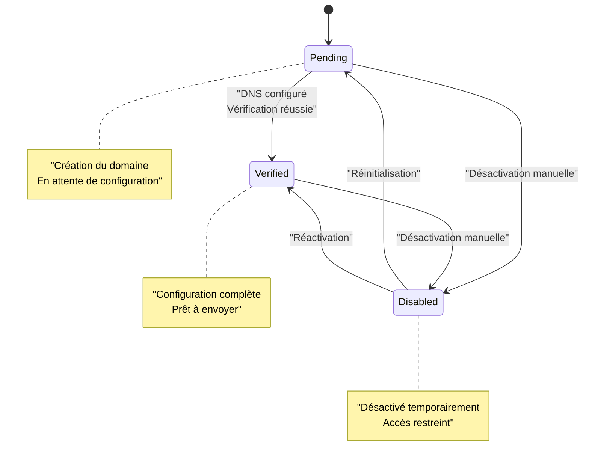
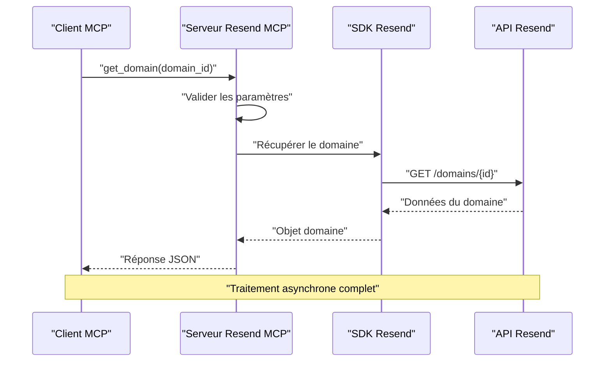

# Outil get_domain

<cite>
**Fichiers référencés dans ce document**
- [README.md](file://README.md)
- [src/index.ts](file://src/index.ts)
- [package.json](file://package.json)
</cite>

## Table des matières
1. [Introduction](#introduction)
2. [Prérequis et configuration](#prérequis-et-configuration)
3. [Structure de l'outil get_domain](#structure-de-l-outil-get_domain)
4. [Réponse complète de l'outil](#réponse-complète-de-l-outil)
5. [Exemples de requêtes](#exemples-de-requêtes)
6. [Interprétation des états de domaine](#interprétation-des-états-de-domaine)
7. [Gestion des erreurs](#gestion-des-erreurs)
8. [Intégration avec le système](#intégration-avec-le-système)
9. [Meilleures pratiques](#meilleures-pratiques)
10. [Conclusion](#conclusion)

## Introduction

L'outil `get_domain` est un composant essentiel de la gestion des domaines Resend au sein du serveur Model Context Protocol (MCP). Ce service permet de récupérer les détails complets d'un domaine spécifique en utilisant son identifiant unique. Cette fonctionnalité est cruciale pour la configuration, la surveillance et la gestion des domaines d'envoi d'e-mails dans l'écosystème Resend.

Le serveur Resend Full MCP fournit une couverture complète de l'API Resend avec plus de 70 outils répartis sur 12 modules, et `get_domain` fait partie intégrante du module de gestion des domaines. Il permet aux assistants IA et applications LLM de gérer efficacement les domaines configurés pour l'envoi d'e-mails.

## Prérequis et configuration

### Configuration de base

Pour utiliser l'outil `get_domain`, plusieurs prérequis doivent être respectés :

- **Clé API Resend** : Une clé d'API valide doit être configurée dans les variables d'environnement
- **Accès en lecture** : Le compte doit avoir les permissions nécessaires pour lire les informations de domaine
- **Domaine existant** : Le domaine ciblé doit être déjà configuré dans le compte Resend

### Variables d'environnement

La configuration se fait principalement via le fichier `.env` :

```env
RESEND_API_KEY=re_xxxxxxxxxxxxxxxxxxxx
RESEND_API_BASE_URL=https://api.resend.com
DEBUG=false
RATE_LIMIT=2
```

**Section sources**
- [README.md](file://README.md#L180-L210)
- [package.json](file://package.json#L32-L43)

## Structure de l'outil get_domain

### Définition de l'outil

L'outil `get_domain` est défini comme suit dans le système :

```typescript
{
  name: 'get_domain',
  description: 'Retrieve details of a specific domain.',
  inputSchema: {
    type: 'object',
    properties: {
      domain_id: { type: 'string', description: 'The domain ID' }
    },
    required: ['domain_id']
  }
}
```

### Spécifications techniques

- **Nom de l'outil** : `get_domain`
- **Description** : Récupère les détails complets d'un domaine spécifique
- **Type de données** : Objet JSON
- **Paramètres requis** : `domain_id` (identifiant unique du domaine)
- **Type de retour** : Objet contenant toutes les informations de configuration du domaine

### Contraintes d'entrée

Le système impose plusieurs contraintes pour garantir la validité des requêtes :

- **Format de l'identifiant** : Chaîne de caractères alphanumériques
- **Longueur minimale** : 1 caractère
- **Longueur maximale** : Définie par l'API Resend
- **Validation** : Le système vérifie l'existence du domaine avant de traiter la requête

**Section sources**
- [src/index.ts](file://src/index.ts#L272-L282)

## Réponse complète de l'outil

### Structure de la réponse

Lorsque l'outil `get_domain` est exécuté avec succès, il retourne un objet JSON contenant toutes les informations de configuration du domaine. Voici la structure complète de la réponse :

```json
{
  "id": "string",
  "name": "string",
  "status": "string",
  "createdAt": "string",
  "updatedAt": "string",
  "region": "string",
  "verification": {
    "dns": {
      "records": [
        {
          "type": "string",
          "name": "string",
          "value": "string",
          "ttl": "number"
        }
      ]
    }
  },
  "settings": {
    "openTracking": "boolean",
    "clickTracking": "boolean"
  },
  "metadata": {
    "lastVerifiedAt": "string",
    "verificationAttempts": "number"
  }
}
```

### Détails des champs de réponse

#### Informations de base du domaine

| Champ | Type | Description |
|-------|------|-------------|
| `id` | String | Identifiant unique du domaine (UUID) |
| `name` | String | Nom du domaine (ex: "example.com") |
| `status` | String | État actuel du domaine (pending, verified, disabled) |
| `createdAt` | String | Date de création au format ISO 8601 |
| `updatedAt` | String | Date de dernière mise à jour |

#### Informations de région

| Champ | Type | Description |
|-------|------|-------------|
| `region` | String | Région géographique du domaine (ex: "us-east-1") |

#### Configuration DNS de vérification

| Champ | Type | Description |
|-------|------|-------------|
| `dns.records` | Array | Tableau des enregistrements DNS requis |
| `dns.type` | String | Type d'enregistrement DNS (TXT, CNAME, MX) |
| `dns.name` | String | Nom de l'enregistrement |
| `dns.value` | String | Valeur attendue de l'enregistrement |
| `dns.ttl` | Number | Temps de vie de l'enregistrement |

#### Paramètres de suivi

| Champ | Type | Description |
|-------|------|-------------|
| `openTracking` | Boolean | Activer/désactiver le suivi des ouvertures |
| `clickTracking` | Boolean | Activer/désactiver le suivi des clics |

#### Métadonnées du domaine

| Champ | Type | Description |
|-------|------|-------------|
| `lastVerifiedAt` | String | Date de la dernière vérification |
| `verificationAttempts` | Number | Nombre de tentatives de vérification |

**Section sources**
- [src/index.ts](file://src/index.ts#L1106-L1107)

## Exemples de requêtes

### Requête réussie

Voici un exemple de requête réussie pour récupérer les détails d'un domaine :

**Requête :**
```json
{
  "method": "tools/call",
  "params": {
    "name": "get_domain",
    "arguments": {
      "domain_id": "dom_xxxxxxxxxxxxx"
    }
  }
}
```

**Réponse :**
```json
{
  "id": "dom_xxxxxxxxxxxxx",
  "name": "example.com",
  "status": "verified",
  "createdAt": "2024-01-15T10:30:00Z",
  "updatedAt": "2024-01-15T10:30:00Z",
  "region": "us-east-1",
  "verification": {
    "dns": {
      "records": [
        {
          "type": "CNAME",
          "name": "default._domainkey.example.com",
          "value": "dkim.default.suivi.example.com",
          "ttl": 3600
        },
        {
          "type": "TXT",
          "name": "_spf.example.com",
          "value": "v=spf1 include:spf.resend.com ~all",
          "ttl": 3600
        }
      ]
    }
  },
  "settings": {
    "openTracking": true,
    "clickTracking": true
  },
  "metadata": {
    "lastVerifiedAt": "2024-01-15T10:30:00Z",
    "verificationAttempts": 1
  }
}
```

### Requête avec erreur

**Requête :**
```json
{
  "method": "tools/call",
  "params": {
    "name": "get_domain",
    "arguments": {
      "domain_id": "dom_invalid"
    }
  }
}
```

**Réponse d'erreur :**
```json
{
  "error": "Tool execution failed: Domain not found",
  "tool": "get_domain",
  "arguments": {
    "domain_id": "dom_invalid"
  }
}
```

**Section sources**
- [README.md](file://README.md#L331-L352)

## Interprétation des états de domaine

### États possibles

Le système de gestion des domaines Resend utilise trois états principaux pour représenter l'état de vérification d'un domaine :

#### État `pending`

**Caractéristiques :**
- Le domaine a été créé mais n'a pas encore été vérifié
- Les enregistrements DNS requis ne sont pas encore configurés
- Le domaine ne peut pas envoyer d'e-mails
- Le système attend la configuration des enregistrements DNS

**Implications :**
- Envoi d'e-mails refusé
- Messages d'erreur lors des tentatives d'envoi
- Nécessite la configuration des enregistrements DNS
- Suivi des événements désactivé

#### État `verified`

**Caractéristiques :**
- Le domaine a été entièrement vérifié
- Tous les enregistrements DNS sont correctement configurés
- Le domaine est prêt à envoyer des e-mails
- Tous les services de suivi sont activés

**Implications :**
- Envoi d'e-mails autorisé
- Suivi des ouvertures et clics fonctionnel
- Authentification SPF/DKIM/MX complète
- Statistiques d'envoi disponibles

#### État `disabled`

**Caractéristiques :**
- Le domaine a été désactivé manuellement
- Le domaine ne peut plus envoyer d'e-mails
- L'accès aux données est restreint
- Le domaine peut être réactivé

**Implications :**
- Envoi d'e-mails bloqué
- Accès limité aux informations de configuration
- Historique des envois conservé
- Capacité de réactivation disponible

### Diagramme d'états



**Diagram sources**
- [src/index.ts](file://src/index.ts#L1106-L1107)

## Gestion des erreurs

### Types d'erreurs courantes

#### Erreur 404 - Domaine introuvable

**Cause :**
- L'identifiant de domaine est incorrect
- Le domaine n'existe pas dans le compte
- Le domaine a été supprimé

**Résolution :**
- Vérifier l'identifiant fourni
- Utiliser l'outil `list_domains` pour obtenir la liste des domaines
- Confirmer l'existence du domaine

#### Erreur 401 - Non autorisé

**Cause :**
- Clé API invalide ou expirée
- Permissions insuffisantes
- Accès refusé au compte

**Résolution :**
- Générer une nouvelle clé API
- Vérifier les permissions du compte
- Redémarrer le serveur MCP

#### Erreur 429 - Trop de requêtes

**Cause :**
- Dépassement de la limite de taux
- Trop de requêtes simultanées

**Résolution :**
- Attendre avant de réessayer
- Réduire la fréquence des requêtes
- Configurer un délai d'attente

### Message d'erreur standard

Lorsqu'une erreur se produit, le système retourne un message structuré :

```json
{
  "error": "Tool execution failed: [message d'erreur spécifique]",
  "tool": "get_domain",
  "arguments": {
    "domain_id": "[identifiant fourni]"
  }
}
```

**Section sources**
- [README.md](file://README.md#L528-L549)

## Intégration avec le système

### Flux de traitement

Le traitement de la requête `get_domain` suit un flux de traitement standard :



**Diagram sources**
- [src/index.ts](file://src/index.ts#L1106-L1107)

### Intégration avec d'autres outils

L'outil `get_domain` travaille en synergie avec d'autres outils de gestion des domaines :

- **`list_domains`** : Pour obtenir la liste complète des domaines
- **`create_domain`** : Pour ajouter de nouveaux domaines
- **`verify_domain`** : Pour relancer la vérification DNS
- **`update_domain`** : Pour modifier les paramètres de suivi

### Gestion de la mémoire

Le serveur gère efficacement la mémoire en :
- Ne conservant que les données nécessaires
- Nettoyant les objets après traitement
- Gérant les erreurs sans fuite de mémoire

**Section sources**
- [src/index.ts](file://src/index.ts#L1008-L1522)

## Meilleures pratiques

### Sécurité

1. **Stockage sécurisé des clés API**
   - Utiliser des variables d'environnement
   - Ne jamais stocker les clés dans le code source
   - Utiliser des clés avec permissions limitées

2. **Validation des entrées**
   - Toujours valider l'identifiant de domaine
   - Vérifier le format des données reçues
   - Gérer les cas d'erreur spécifiques

### Performances

1. **Gestion des taux de requêtes**
   - Respecter la limite de 2 requêtes/seconde
   - Mettre en place des délais entre les appels
   - Utiliser des requêtes groupées lorsque possible

2. **Optimisation de la mémoire**
   - Libérer les ressources après traitement
   - Éviter les boucles infinies
   - Gérer les exceptions proprement

### Surveillance

1. **Logging des opérations**
   - Enregistrer les appels réussis
   - Journaliser les erreurs avec détails
   - Surveiller les temps de réponse

2. **Gestion des erreurs**
   - Implémenter des retours d'erreur clairs
   - Fournir des messages d'erreur utiles
   - Gérer les cas d'exception

## Conclusion

L'outil `get_domain` constitue un pilier essentiel de la gestion des domaines Resend au sein du serveur MCP. Grâce à sa conception robuste et à sa réponse complète, il permet aux assistants IA et applications LLM de gérer efficacement les domaines d'envoi d'e-mails.

Les caractéristiques principales de cet outil incluent :
- **Précision** : Récupération complète des informations de configuration
- **Sécurité** : Validation stricte des paramètres et des identifiants
- **Fiabilité** : Gestion robuste des erreurs et des exceptions
- **Performance** : Traitement rapide et efficace des requêtes

La compréhension des différents états de domaine (`pending`, `verified`, `disabled`) est cruciale pour interpréter correctement les résultats et prendre les décisions appropriées concernant l'envoi d'e-mails. Cette documentation fournit toutes les bases nécessaires pour intégrer efficacement l'outil `get_domain` dans vos applications et systèmes d'assistant IA.