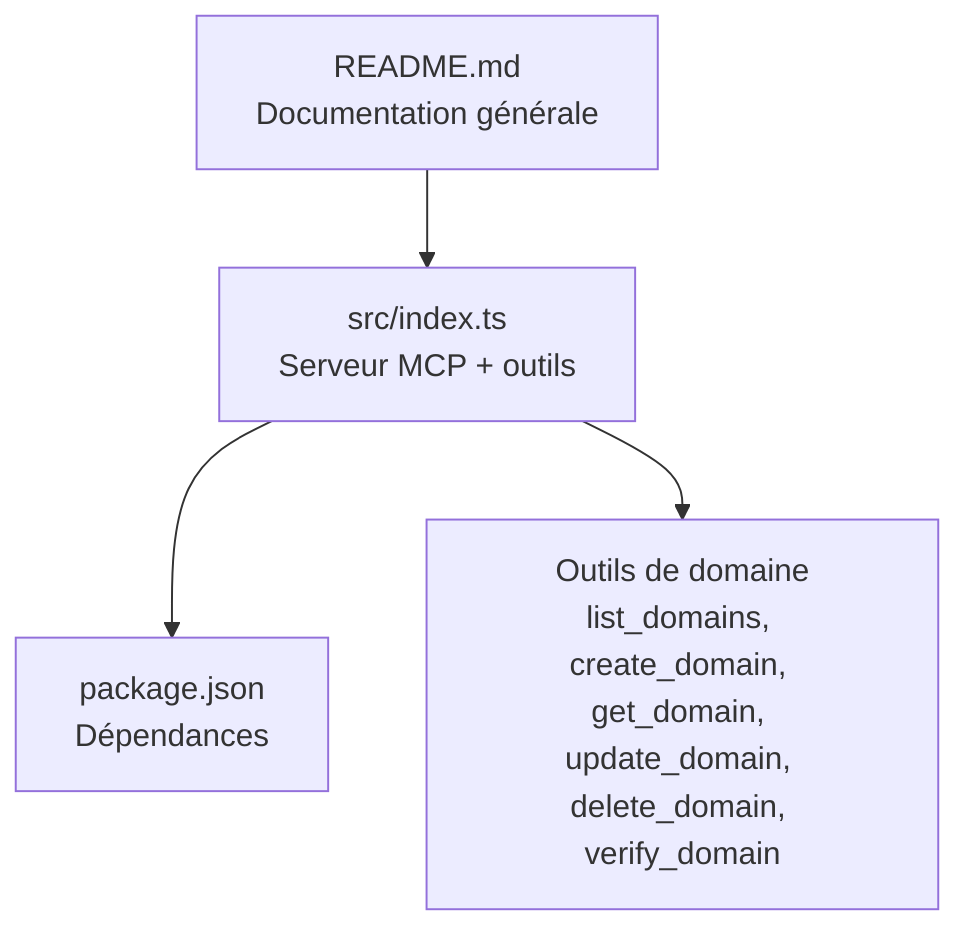
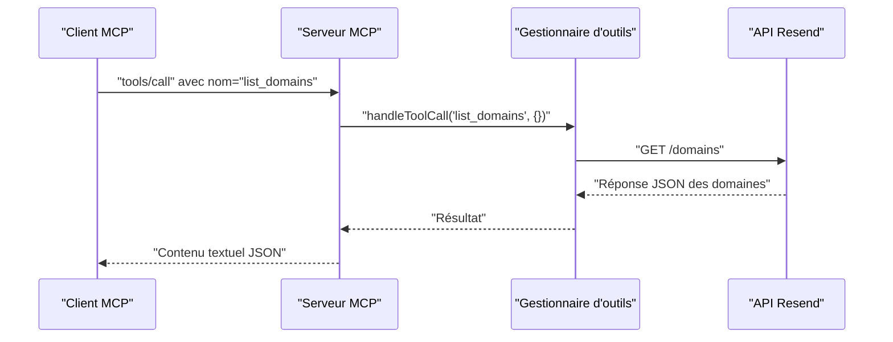
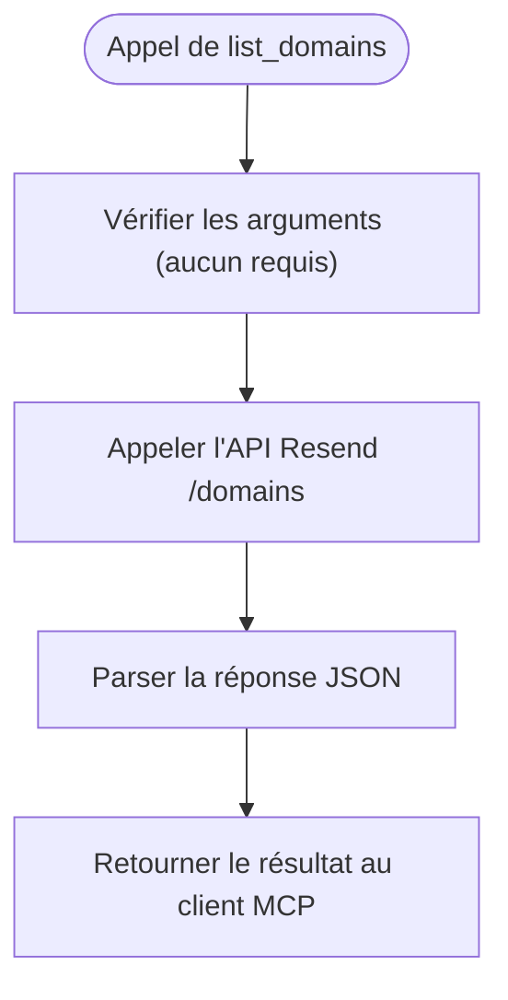
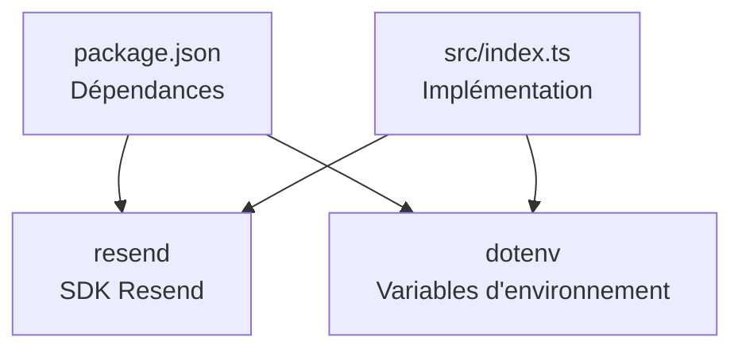

# Outil list_domains

<cite>
**Fichiers référencés dans ce document**
- [README.md](file://README.md)
- [src/index.ts](file://src/index.ts)
- [package.json](file://package.json)
</cite>

## Sommaire
1. [Introduction](#introduction)
2. [Structure du projet](#structure-du-projet)
3. [Composants principaux](#composants-principaux)
4. [Aperçu de l’architecture](#aperçu-de-l’architecture)
5. [Analyse détaillée des composants](#analyse-détaillée-des-composants)
6. [Analyse des dépendances](#analyse-des-dépendances)
7. [Considérations sur les performances](#considérations-sur-les-performances)
8. [Guide de dépannage](#guide-de-dépannage)
9. [Conclusion](#conclusion)

## Introduction
Cet outil permet de récupérer la liste complète de tous les domaines associés à un compte Resend. Il s’agit d’un composant de la couche Domain Management de l’API Resend, exposé via le protocole Model Context Protocol (MCP). Le serveur MCP fournit un ensemble d’outils permettant d’interagir avec l’ensemble des fonctionnalités de l’API Resend, y compris la gestion des domaines.

L’outil list_domains est conçu pour retourner l’ensemble des domaines configurés dans le compte Resend. Bien que l’implémentation actuelle de l’outil ne prenne pas de paramètres d’entrée (limit, after, before), il est important de noter que l’API Resend peut supporter des mécanismes de pagination pour d’autres outils de type list_*. Pour list_domains, l’approche actuelle consiste à appeler directement l’API Resend pour obtenir la liste complète des domaines.

## Structure du projet
Le projet est un serveur MCP qui expose toutes les fonctionnalités de l’API Resend. La structure clé est la suivante :
- src/index.ts : Implémentation principale du serveur MCP, incluant la définition des outils et leur exécution.
- README.md : Documentation générale du projet, incluant la liste des outils de chaque module.
- package.json : Dépendances et scripts du projet.

**Diagramme sources**
- [README.md](file://README.md#L31-L37)
- [src/index.ts](file://src/index.ts#L251-L317)
- [package.json](file://package.json#L32-L35)

**Section sources**
- [README.md](file://README.md#L472-L491)
- [src/index.ts](file://src/index.ts#L1-L10)
- [package.json](file://package.json#L1-L49)

## Composants principaux
- Outils de domaine : L’outil list_domains fait partie du module Domain Management. Ce module inclut six outils : create_domain, list_domains, get_domain, update_domain, delete_domain, verify_domain.
- Implémentation de list_domains : L’implémentation de l’outil list_domains se trouve dans la section des outils de domaine de l’index.ts. Elle effectue un appel à l’API Resend pour récupérer la liste des domaines.

**Section sources**
- [README.md](file://README.md#L31-L37)
- [src/index.ts](file://src/index.ts#L251-L317)

## Aperçu de l’architecture
L’architecture du serveur MCP repose sur un ensemble d’outils définis dans un tableau centralisé. Lorsqu’un client MCP appelle un outil, le serveur le route vers la fonction correspondante. Pour list_domains, l’appel est redirigé vers l’exécuteur d’outils, qui effectue un appel à l’API Resend pour récupérer la liste des domaines.

**Diagramme sources**
- [src/index.ts](file://src/index.ts#L1008-L1522)
- [src/index.ts](file://src/index.ts#L1103-L1104)

## Analyse détaillée des composants

### Outils de domaine
- list_domains : Récupère tous les domaines configurés dans le compte Resend. L’implémentation actuelle ne prend aucun paramètre d’entrée, mais l’API Resend peut prendre des paramètres de pagination pour d’autres outils de type list_*. Pour list_domains, l’approche actuelle est de faire un appel direct à l’API Resend sans paramètres de pagination.

- Autres outils de domaine : create_domain, get_domain, update_domain, delete_domain, verify_domain sont également implémentés dans le même module.

**Section sources**
- [src/index.ts](file://src/index.ts#L251-L317)
- [src/index.ts](file://src/index.ts#L1103-L1125)

### Implémentation de list_domains
- Définition de l’outil : L’outil list_domains est défini dans le tableau des outils avec un schéma d’entrée vide, indiquant qu’il ne prend aucun paramètre.
- Exécution de l’outil : Lorsque l’outil est invoqué, le gestionnaire d’outils appelle directement l’API Resend pour récupérer la liste des domaines.

**Diagramme sources**
- [src/index.ts](file://src/index.ts#L265-L270)
- [src/index.ts](file://src/index.ts#L1103-L1104)

**Section sources**
- [src/index.ts](file://src/index.ts#L265-L270)
- [src/index.ts](file://src/index.ts#L1103-L1104)

### Pagination et filtres
- Paramètres de pagination : Pour d’autres outils de type list_*, l’API Resend prend en charge des paramètres de pagination tels que limit, after, before. Cependant, l’implémentation de list_domains ne prend pas de paramètres d’entrée.
- Stratégie actuelle : L’approche actuelle consiste à appeler directement l’API Resend pour obtenir la liste complète des domaines sans pagination.

**Section sources**
- [src/index.ts](file://src/index.ts#L265-L270)
- [src/index.ts](file://src/index.ts#L1103-L1104)

### Structure de réponse attendue
- Format de réponse : La réponse de l’API Resend pour list_domains est un objet JSON contenant la liste des domaines. Le serveur MCP renvoie cette réponse sous forme de texte JSON au client MCP.
- Structure typique : La structure de la réponse suit le format de l’API Resend, incluant les informations de chaque domaine (identifiant, nom, statut de vérification, région, etc.).

**Section sources**
- [src/index.ts](file://src/index.ts#L1103-L1104)

### Exemples de requêtes et de réponses
- Requête directe à l’API Resend : GET /domains
- Réponse JSON : Un tableau de domaines avec leurs propriétés respectives.

Remarque : Les exemples de requêtes et de réponses JSON ne sont pas inclus ici pour éviter de reproduire le contenu exact de l’API. Reportez-vous à la documentation officielle de l’API Resend pour les détails complets.

### Gestion des grands jeux de données
- Approche actuelle : L’outil list_domains ne prend pas de paramètres de pagination. Pour gérer de grands jeux de données, il serait pertinent de :
  - Implémenter des paramètres de pagination (limit, after, before) si l’API Resend le permet.
  - Itérer sur les résultats en utilisant des curseurs pour éviter de surcharger la mémoire.
  - Mettre en place des pauses entre les appels pour respecter les limites de taux.

**Section sources**
- [src/index.ts](file://src/index.ts#L1103-L1104)

### Limitations de l’API et meilleures pratiques
- Limites de l’API Resend : Le serveur MCP respecte les limites de taux de l’API Resend. Le README indique des limites par défaut de 2 requêtes/seconde, avec des possibilités de montée en charge sur des plans payants.
- Meilleures pratiques pour production :
  - Utiliser des clés API restreintes aux seules opérations nécessaires.
  - Mettre en place un système de mise en cache local pour réduire les appels fréquents.
  - Respecter les limites de taux et ajouter des stratégies de retry avec backoff exponentiel.
  - Valider les réponses de l’API avant de les traiter.

**Section sources**
- [README.md](file://README.md#L518-L526)
- [README.md](file://README.md#L495-L501)

## Analyse des dépendances
- Dépendances principales : Le projet dépend de la bibliothèque Resend pour interagir avec l’API Resend et de dotenv pour gérer les variables d’environnement.
- Scripts de build et démarrage : Le projet utilise TypeScript pour la compilation, Node.js pour l’exécution, et un script postinstall pour installer automatiquement le skill Claude.

**Diagramme sources**
- [package.json](file://package.json#L32-L35)
- [src/index.ts](file://src/index.ts#L1-L7)

**Section sources**
- [package.json](file://package.json#L32-L35)
- [src/index.ts](file://src/index.ts#L1-L7)

## Considérations sur les performances
- Limites de taux : Le serveur MCP gère automatiquement les limites de taux de l’API Resend. Pour list_domains, l’approche actuelle est de récupérer tous les domaines en un seul appel.
- Optimisation potentielle : Si le nombre de domaines augmente, envisager l’ajout de paramètres de pagination pour réduire la taille des réponses et améliorer la latence.

**Section sources**
- [README.md](file://README.md#L518-L526)
- [src/index.ts](file://src/index.ts#L1103-L1104)

## Guide de dépannage
- Erreur d’authentification : Si la variable d’environnement RESEND_API_KEY n’est pas définie, le serveur MCP affiche un message d’erreur. Vérifiez que le fichier .env est présent et contient la bonne clé API.
- Erreur d’exécution de l’outil : En cas d’échec de l’outil, le serveur renvoie un message d’erreur contenant le nom de l’outil et ses arguments. Vérifiez la validité des arguments et la connectivité réseau.

**Section sources**
- [README.md](file://README.md#L553-L568)
- [src/index.ts](file://src/index.ts#L1571-L1577)
- [src/index.ts](file://src/index.ts#L1552-L1563)

## Conclusion
L’outil list_domains permet de récupérer la liste complète des domaines associés à un compte Resend. Bien qu’il ne prenne pas de paramètres de pagination dans son implémentation actuelle, il constitue un point d’entrée essentiel pour la gestion des domaines via le protocole MCP. Pour des environnements de production, il est recommandé de respecter les limites de taux de l’API Resend, d’utiliser des clés API restreintes, et de mettre en place des stratégies de mise en cache et de retry pour garantir une utilisation fiable de cette fonctionnalité.