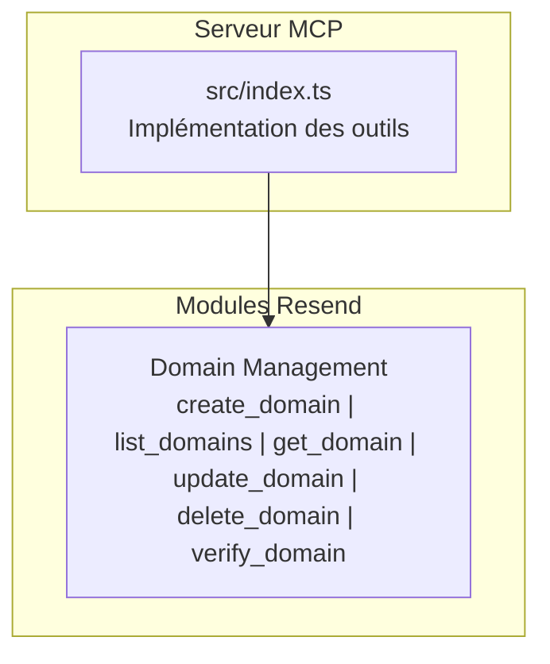
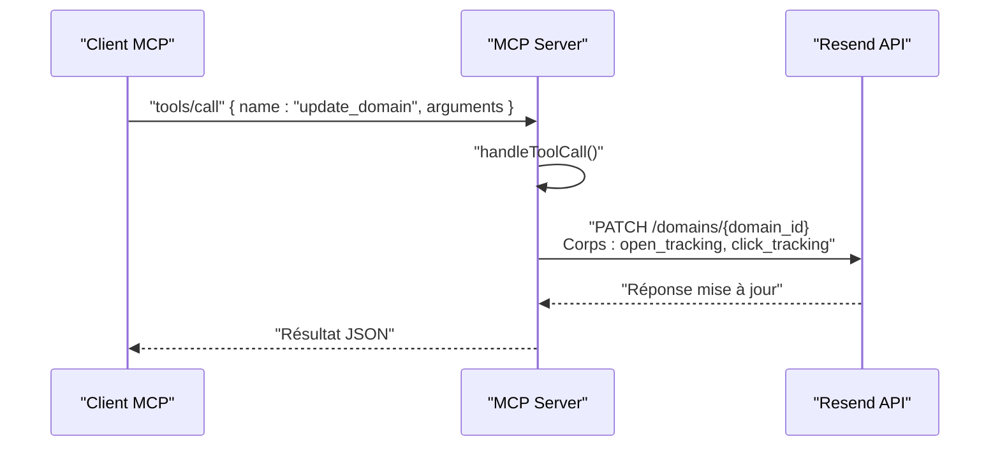
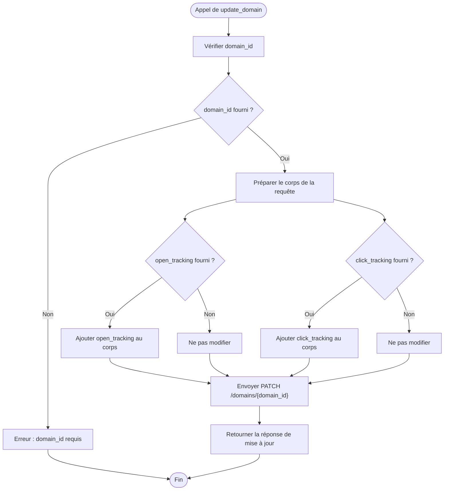
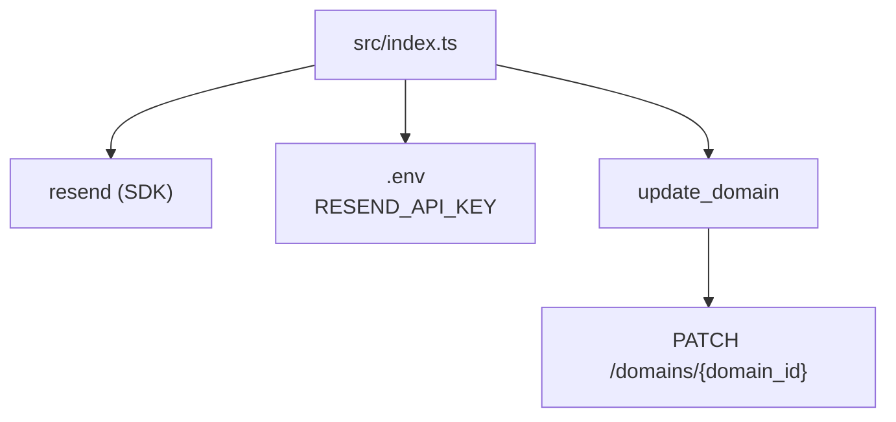

# Outil update_domain

<cite>
**Fichiers référencés dans ce document**
- [README.md](file://README.md)
- [src/index.ts](file://src/index.ts)
- [package.json](file://package.json)
</cite>

## Sommaire
1. [Introduction](#introduction)
2. [Structure du projet](#structure-du-projet)
3. [Composants principaux](#composants-principaux)
4. [Aperçu de l’architecture](#aperçu-de-larchitecture)
5. [Analyse détaillée des composants](#analyse-détaillée-des-composants)
6. [Analyse des dépendances](#analyse-des-dépendances)
7. [Considérations sur les performances](#considérations-sur-les-performances)
8. [Guide de dépannage](#guide-de-dépannage)
9. [Conclusion](#conclusion)

## Introduction
Cet outil permet de modifier les paramètres d’un domaine existant dans la plateforme Resend, notamment l’activation ou la désactivation du suivi des ouvertures et des clics. Il s’agit d’un composant de la suite d’outils MCP (Model Context Protocol) qui expose l’ensemble de l’API Resend sous forme d’outils invocables. Le présent document explique comment utiliser l’outil update_domain, quels sont ses paramètres, les validations effectuées, les implications immédiates des modifications, ainsi que les bonnes pratiques pour gérer ces paramètres dans des environnements de production sécurisés.

## Structure du projet
Le projet est un serveur MCP complet qui expose 70+ outils couvrant tous les modules de l’API Resend. L’outil update_domain fait partie de la section Domain Management, qui inclut également create_domain, list_domains, get_domain, delete_domain et verify_domain.

**Diagramme sources**
- [src/index.ts](file://src/index.ts#L251-L317)

**Section sources**
- [README.md](file://README.md#L31-L37)
- [src/index.ts](file://src/index.ts#L251-L317)

## Composants principaux
- update_domain : Permet de mettre à jour les paramètres de suivi d’un domaine (ouverture et clics).
- Autres outils liés aux domaines : create_domain, list_domains, get_domain, delete_domain, verify_domain.

**Section sources**
- [README.md](file://README.md#L31-L37)
- [src/index.ts](file://src/index.ts#L283-L295)

## Aperçu de l’architecture
Le serveur MCP reçoit des requêtes via stdin, identifie l’outil demandé, exécute la logique associée, puis renvoie une réponse via stdout. Pour update_domain, l’appel se traduit par une requête PATCH vers l’API Resend avec les paramètres de suivi fournis.

**Diagramme sources**
- [src/index.ts](file://src/index.ts#L1109-L1119)

## Analyse détaillée des composants

### Mise à jour d’un domaine (update_domain)
- Description : Met à jour les paramètres de suivi d’un domaine (ouverture et clics).
- Paramètres modifiables :
  - domain_id : Identifiant unique du domaine (obligatoire).
  - open_tracking : Booléen pour activer/désactiver le suivi des ouvertures.
  - click_tracking : Booléen pour activer/désactiver le suivi des clics.
- Validation :
  - Le champ domain_id est requis.
  - open_tracking et click_tracking sont optionnels ; si non fournis, ils ne sont pas modifiés.
- Implications immédiates :
  - Lorsque l’un des deux paramètres est modifié, les emails envoyés à partir de ce domaine seront affectés immédiatement.
  - Le suivi des ouvertures ajoute des pixels de suivi dans le corps HTML des emails.
  - Le suivi des clics remplace les liens par des redirections intermédiaires pour enregistrer les clics.
- Exemples d’utilisation (extrait de l’entrée de l’outil) :
  - Activer le suivi des ouvertures : envoyer open_tracking=true.
  - Désactiver le suivi des clics : envoyer click_tracking=false.
  - Activer les deux : envoyer open_tracking=true et click_tracking=true.
  - Ne rien changer : ne pas fournir les champs open_tracking ni click_tracking.

**Diagramme sources**
- [src/index.ts](file://src/index.ts#L283-L295)
- [src/index.ts](file://src/index.ts#L1109-L1119)

**Section sources**
- [src/index.ts](file://src/index.ts#L283-L295)
- [src/index.ts](file://src/index.ts#L1109-L1119)

### Implémentation technique
- Schéma d’entrée de l’outil update_domain :
  - name : "update_domain"
  - inputSchema : propriétés définissant domain_id (requis), open_tracking (optionnel), click_tracking (optionnel).
- Gestion de l’appel :
  - L’implémentation utilise handleToolCall pour router vers le cas spécifique.
  - Envoi d’une requête PATCH vers l’API Resend avec le corps contenant les champs open_tracking et click_tracking.
  - Retour de la réponse brute de l’API.

**Section sources**
- [src/index.ts](file://src/index.ts#L283-L295)
- [src/index.ts](file://src/index.ts#L1109-L1119)

### Bonnes pratiques pour la production
- Sécurité :
  - Utiliser des clés API à accès restreint (par exemple, sending_access) lorsqu’elles ne sont pas nécessaires pour gérer les domaines.
  - Limiter l’accès aux outils de gestion des domaines à des comptes ou rôles ayant besoin de ces droits.
- Audit et traçabilité :
  - Conserver un journal des modifications apportées aux paramètres de suivi des domaines.
  - Identifier les impacts sur les campagnes email avant de basculer des paramètres critiques.
- Tests et validation :
  - Effectuer des tests en environnement de staging avant de modifier des domaines en production.
  - Vérifier que les liens et pixels de suivi fonctionnent comme attendu après la mise à jour.
- Conformité :
  - Respecter les exigences de confidentialité (RGPD, CCPA) en matière de suivi des ouvertures et clics.
  - Informer les utilisateurs concernant le suivi des données via les politiques de confidentialité.

[Consultez la section “Sécurité” du README pour des conseils généraux sur la gestion des clés API, les webhooks, et la conformité.]

**Section sources**
- [README.md](file://README.md#L493-L517)

## Analyse des dépendances
- Dépendance principale : La bibliothèque Resend (SDK Node.js) est utilisée pour appeler l’API Resend.
- Configuration : Le serveur lit la clé API depuis les variables d’environnement (.env).
- Modules liés : update_domain dépend de l’existence du domaine (domain_id) et de la vérification DNS (verify_domain) pour garantir la bonne configuration avant d’activer le suivi.

**Diagramme sources**
- [package.json](file://package.json#L32-L35)
- [src/index.ts](file://src/index.ts#L1-L7)
- [src/index.ts](file://src/index.ts#L1109-L1119)

**Section sources**
- [package.json](file://package.json#L32-L35)
- [src/index.ts](file://src/index.ts#L1-L7)
- [src/index.ts](file://src/index.ts#L1109-L1119)

## Considérations sur les performances
- Le serveur MCP gère les appels de manière synchrone via stdin/stdout. Les performances dépendent de la latence réseau et de la disponibilité de l’API Resend.
- Pour éviter les surcharges, respectez les limites de taux imposées par Resend (par défaut 2 requêtes/seconde) et gérez les tentatives de nouvelle exécution en cas d’erreur temporaire.

**Section sources**
- [README.md](file://README.md#L518-L527)

## Guide de dépannage
- Erreur : Clé API manquante
  - Message : “RESEND_API_KEY environment variable is not set”
  - Solution : Créez un fichier .env avec votre clé API Resend.
- Erreur : Outil inconnu
  - Message : “Unknown tool: update_domain”
  - Solution : Vérifiez que vous appelez bien tools/call avec le nom de l’outil correct.
- Erreur : Paramètre requis manquant
  - Message : “domain_id is required”
  - Solution : Fournissez le domain_id obligatoire.
- Erreur : Requête échouée
  - Message : “Tool execution failed”
  - Solution : Vérifiez la clé API, les paramètres fournis, et la connectivité réseau.

**Section sources**
- [src/index.ts](file://src/index.ts#L1571-L1577)
- [src/index.ts](file://src/index.ts#L1516-L1522)
- [src/index.ts](file://src/index.ts#L1544-L1564)

## Conclusion
L’outil update_domain permet de contrôler en toute simplicité l’activation ou la désactivation du suivi des ouvertures et des clics pour un domaine Resend. Grâce à son schéma d’entrée clair, il est possible de modifier ces paramètres de manière ciblée et immédiate. Pour des environnements de production sécurisés, il est essentiel de suivre les bonnes pratiques en matière de sécurité, d’audit, de tests et de conformité, tout en respectant les limites de taux d’appels de l’API Resend.