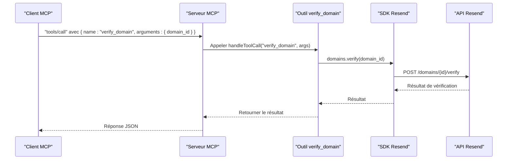

# Outil verify_domain

<cite>
**Fichiers référencés dans ce document**
- [README.md](file://README.md)
- [package.json](file://package.json)
- [src/index.ts](file://src/index.ts)
</cite>

## Sommaire
1. [Introduction](#introduction)
2. [Contexte technique](#contexte-technique)
3. [Objectif de l’outil verify_domain](#objectif-de-loutil-verify_domain)
4. [Architecture de l’outil](#architecture-de-loutil)
5. [Processus de vérification DNS](#processus-de-vérification-dns)
6. [Types d’enregistrements DNS requis](#types-denregistrements-dns-requis)
7. [Interprétation des résultats de vérification](#interprétation-des-résultats-de-vérification)
8. [Exemples de vérifications réussies et échouées](#exemples-de-vérifications-réussies-et-échouées)
9. [Erreurs courantes et dépannage](#erreurs-courantes-et-dépannage)
10. [Délais de vérification et mises à jour de statut](#délais-de-vérification-et-mises-à-jour-de-statut)
11. [Conclusion](#conclusion)

## Introduction
L’outil verify_domain fait partie de la suite d’outils de gestion des domaines fournis par Resend. Son rôle est de valider que les enregistrements DNS nécessaires à l’authentification de l’expéditeur sont correctement configurés sur le domaine. Une fois ces enregistrements vérifiés, Resend peut garantir l’intégrité et l’authenticité des emails envoyés depuis ce domaine.

## Contexte technique
Le projet expose un serveur Model Context Protocol (MCP) qui expose l’ensemble de l’API Resend sous forme d’outils invocables. L’outil verify_domain est défini comme un outil de type “Domain Management” et est implémenté comme un appel direct à l’API Resend via le SDK officiel.

**Section sources**
- [README.md](file://README.md#L31-L37)
- [src/index.ts](file://src/index.ts#L251-L317)
- [src/index.ts](file://src/index.ts#L1124-L1125)

## Objectif de l’outil verify_domain
- Permettre de forcer la relecture des enregistrements DNS d’un domaine configuré dans Resend.
- Déclencher le processus de validation des enregistrements SPF, DKIM et DMARC.
- Mettre à jour le statut de vérification du domaine dans Resend.

Cet outil ne modifie pas les enregistrements DNS, mais force Resend à les relire et à recalculer l’état de vérification.

**Section sources**
- [src/index.ts](file://src/index.ts#L308-L317)
- [src/index.ts](file://src/index.ts#L1124-L1125)

## Architecture de l’outil
L’outil verify_domain est intégré au serveur MCP comme suit :
- Définition de l’outil : nom, description, schéma d’entrée.
- Implémentation de l’appel : exécution de l’opération via le SDK Resend.
- Gestion des erreurs : renvoi d’un message d’erreur structuré si l’exécution échoue.

**Diagram sources**
- [src/index.ts](file://src/index.ts#L1124-L1125)
- [src/index.ts](file://src/index.ts#L1008-L1522)

**Section sources**
- [src/index.ts](file://src/index.ts#L308-L317)
- [src/index.ts](file://src/index.ts#L1008-L1522)

## Processus de vérification DNS
Le processus de vérification se déroule en plusieurs étapes côté Resend :
1. Lecture des enregistrements DNS actuels du domaine.
2. Vérification de la présence et de la validité des enregistrements requis (SPF, DKIM, DMARC).
3. Calcul de l’état de vérification global (par exemple, “pending”, “verified”, “failed”).
4. Mise à jour de l’état du domaine dans Resend.

Ce processus est déclenché par l’appel de l’outil verify_domain, qui force Resend à relire les enregistrements DNS.

**Section sources**
- [src/index.ts](file://src/index.ts#L1124-L1125)

## Types d’enregistrements DNS requis
Pour qu’un domaine soit pleinement authentifié, Resend attend généralement les trois types d’enregistrements suivants :

- Enregistrement SPF : permet de spécifier les serveurs autorisés à envoyer des emails pour le domaine.
- Enregistrement DKIM : fournit une signature cryptographique pour authentifier l’intégrité de l’email.
- Enregistrement DMARC : indique comment les emails non conformes doivent être traités et active la politique de validation.

Ces enregistrements sont créés ou mis à jour dans votre zone DNS (via votre registrar ou fournisseur DNS). Le processus de vérification consiste à s’assurer qu’ils sont présents, bien formés et pointent vers les valeurs attendues par Resend.

**Section sources**
- [README.md](file://README.md#L460-L461)

## Interprétation des résultats de vérification
Lorsque vous appelez l’outil verify_domain, le SDK Resend retourne un objet contenant l’état de vérification du domaine. Les champs clés incluent souvent :
- L’identifiant du domaine.
- L’état de vérification (par exemple, “pending”, “verified”, “failed”).
- Des détails sur chaque enregistrement (SPF, DKIM, DMARC) avec leur statut respectif.

La signification de ces états est gérée par Resend. En général :
- “pending” : la vérification est en cours ou en attente de mise à jour DNS.
- “verified” : tous les enregistrements sont présents et valides.
- “failed” : au moins un enregistrement est manquant ou incorrect.

**Section sources**
- [src/index.ts](file://src/index.ts#L1124-L1125)

## Exemples de vérifications réussies et échouées
Voici des scénarios typiques illustrant ce à quoi ressemblent les résultats attendus.

- Vérification réussie
  - État : “verified”
  - Détails : tous les enregistrements SPF, DKIM et DMARC sont présents et valides.
  - Résultat : le domaine peut envoyer des emails avec authentification forte.

- Vérification échouée
  - État : “failed”
  - Détails : un ou plusieurs enregistrements sont manquants ou mal configurés.
  - Résultat : l’envoi d’emails depuis ce domaine peut être marqué comme non fiable.

- Vérification en attente
  - État : “pending”
  - Détails : les enregistrements ont été récemment modifiés, Resend lit les nouveaux enregistrements.
  - Résultat : patientez quelques minutes avant de relancer la vérification.

Remarque : les messages exacts et la structure des résultats sont retournés par l’API Resend. Ils peuvent varier légèrement selon les versions de l’API.

**Section sources**
- [src/index.ts](file://src/index.ts#L1124-L1125)

## Erreurs courantes et dépannage
Voici les erreurs fréquentes rencontrées lors de l’utilisation de l’outil verify_domain et les actions à entreprendre.

- Domaine introuvable
  - Cause : identifiant de domaine incorrect ou domaine non créé.
  - Action : vérifiez l’identifiant du domaine et assurez-vous qu’il existe dans votre compte Resend.

- Accès refusé
  - Cause : clé API invalide ou permissions insuffisantes.
  - Action : vérifiez votre clé API et ses permissions, puis redémarrez le serveur MCP.

- Paramètres manquants
  - Cause : argument “domain_id” non fourni.
  - Action : incluez l’identifiant du domaine dans les arguments de l’appel.

- Erreur réseau ou service indisponible
  - Cause : problème temporaire de l’API Resend.
  - Action : patientez quelques minutes et relancez la vérification.

- Enregistrements DNS non encore propagés
  - Cause : changements récents dans la zone DNS.
  - Action : patientez quelques minutes à quelques heures selon le TTL, puis relancez la vérification.

**Section sources**
- [src/index.ts](file://src/index.ts#L1516-L1522)
- [README.md](file://README.md#L551-L568)

## Délais de vérification et mises à jour de statut
- Propagation DNS : après avoir mis à jour vos enregistrements DNS, il faut attendre que la propagation se termine. Cela peut prendre quelques minutes à plusieurs heures selon le TTL et le fournisseur DNS.
- Nouvelle tentative : si la vérification est “pending” ou “failed”, patientez quelques minutes avant de relancer l’outil verify_domain.
- Statut dynamique : l’état du domaine peut passer de “pending” à “verified” une fois que Resend a lu les enregistrements mis à jour.

**Section sources**
- [src/index.ts](file://src/index.ts#L1124-L1125)

## Conclusion
L’outil verify_domain permet de forcer Resend à relire et à recalculer l’état de vérification de vos enregistrements DNS. Pour qu’il fonctionne correctement, assurez-vous que vos enregistrements SPF, DKIM et DMARC sont correctement configurés et propagés, puis exécutez l’outil verify_domain. En cas d’échec, corrigez les enregistrements DNS, patientez la propagation, et relancez la vérification.