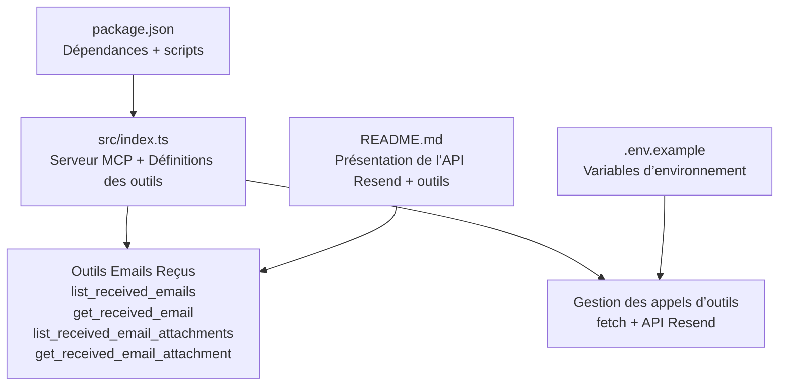
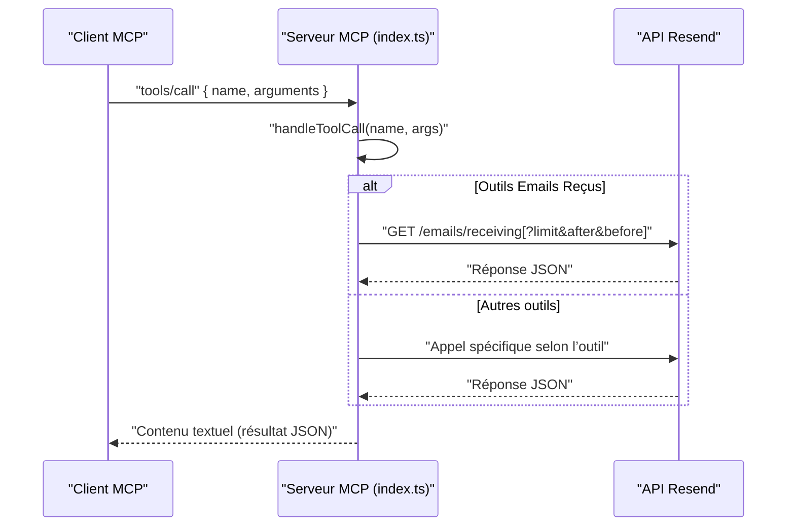
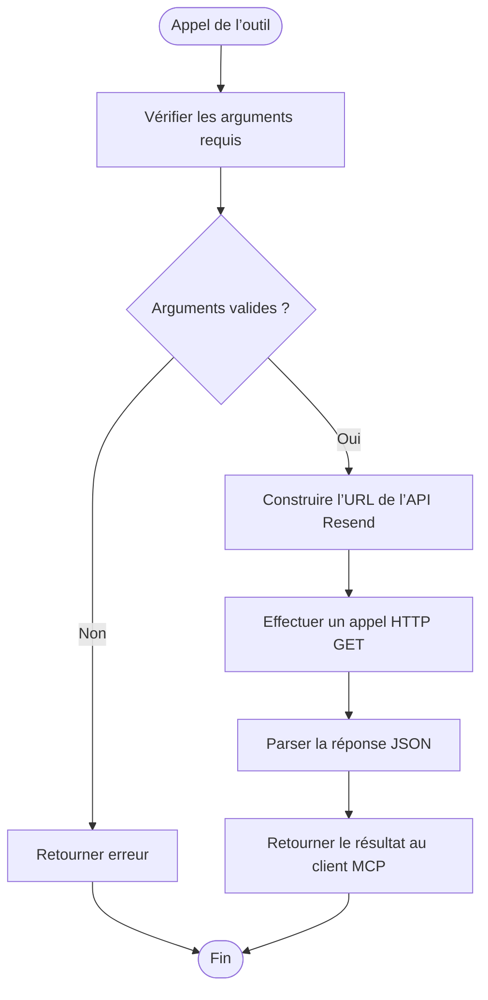
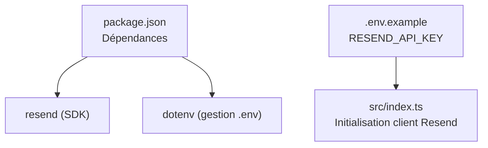

# Module Emails Reçus

<cite>
**Fichiers référencés dans ce document**
- [README.md](file://README.md)
- [package.json](file://package.json)
- [src/index.ts](file://src/index.ts)
- [.env.example](file://.env.example)
</cite>

## Sommaire
1. [Introduction](#introduction)
2. [Structure du projet](#structure-du-projet)
3. [Composants principaux](#composants-principaux)
4. [Aperçu de l’architecture](#aperçu-de-larchitecture)
5. [Analyse détaillée des outils](#analyse-détaillée-des-outils)
6. [Analyse des dépendances](#analyse-des-dépendances)
7. [Considérations sur les performances](#considérations-sur-les-performances)
8. [Guide de dépannage](#guide-de-dépannage)
9. [Conclusion](#conclusion)
10. [Annexes](#annexes)

## Introduction
Ce document fournit une documentation complète du module “Emails Reçus” de l’API Resend, tel qu’exposé via le serveur MCP. Il couvre les quatre outils associés :  
- list_received_emails  
- get_received_email  
- list_received_email_attachments  
- get_received_email_attachment  

Il explique comment récupérer et gérer les emails reçus, les pièces jointes associées, et les opérations de consultation détaillée. Des schémas JSON, des exemples d’utilisation et des bonnes pratiques sont inclus pour une intégration aisée dans des applications IA.

## Structure du projet
Le projet est un serveur MCP qui expose l’ensemble de l’API Resend sous forme d’outils invocables. Le cœur de l’implémentation se trouve dans le fichier principal de l’application.

**Diagramme sources**
- [src/index.ts](file://src/index.ts#L200-L249)
- [README.md](file://README.md#L25-L29)
- [.env.example](file://.env.example#L1-L6)
- [package.json](file://package.json#L1-L49)

**Section sources**
- [README.md](file://README.md#L1-L721)
- [package.json](file://package.json#L1-L49)
- [src/index.ts](file://src/index.ts#L1-L1623)
- [.env.example](file://.env.example#L1-L6)

## Composants principaux
- Définitions des outils : chaque outil est décrit par un nom, une description et un schéma d’entrée (JSON Schema).
- Gestion des appels d’outils : implémentation de la logique métier via des appels HTTP directs à l’API Resend.
- Serveur MCP : interface de communication via stdin/stdout avec un client MCP compatible.

**Section sources**
- [src/index.ts](file://src/index.ts#L200-L249)
- [src/index.ts](file://src/index.ts#L1008-L1097)
- [src/index.ts](file://src/index.ts#L1528-L1623)

## Aperçu de l’architecture
Le serveur MCP expose les outils définis dans le tableau des outils. Lorsqu’un outil est invoqué, le gestionnaire effectue un appel HTTP à l’API Resend correspondante, puis renvoie le résultat au client MCP.

**Diagramme sources**
- [src/index.ts](file://src/index.ts#L1008-L1097)
- [src/index.ts](file://src/index.ts#L1536-L1565)

## Analyse détaillée des outils

### 1) list_received_emails
- Description : Récupère une liste paginée des emails reçus.
- Entrées attendues (JSON Schema) :
  - limit : nombre maximum d’éléments à retourner
  - after : curseur pour obtenir les éléments après cette valeur
  - before : curseur pour obtenir les éléments avant cette valeur
- Sortie : Réponse JSON contenant la liste des emails reçus et les curseurs de pagination.
- Exemple d’appel (représentatif) :  
  - Méthode : tools/call  
  - Nom : list_received_emails  
  - Arguments : { "limit": 20, "after": "cursor_value" }

**Section sources**
- [src/index.ts](file://src/index.ts#L200-L212)
- [src/index.ts](file://src/index.ts#L1071-L1078)

### 2) get_received_email
- Description : Récupère les détails complets d’un email reçu identifié par son ID.
- Entrées attendues (JSON Schema) :
  - email_id : identifiant de l’email reçu
- Sortie : Réponse JSON contenant les détails de l’email reçu.
- Exemple d’appel (représentatif) :  
  - Méthode : tools/call  
  - Nom : get_received_email  
  - Arguments : { "email_id": "id_de_l_email" }

**Section sources**
- [src/index.ts](file://src/index.ts#L213-L223)
- [src/index.ts](file://src/index.ts#L1080-L1083)

### 3) list_received_email_attachments
- Description : Liste les pièces jointes associées à un email reçu.
- Entrées attendues (JSON Schema) :
  - email_id : identifiant de l’email reçu
  - limit : nombre maximum de pièces jointes à retourner
  - after : curseur pour pagination
  - before : curseur pour pagination
- Sortie : Réponse JSON contenant la liste des pièces jointes.
- Exemple d’appel (représentatif) :  
  - Méthode : tools/call  
  - Nom : list_received_email_attachments  
  - Arguments : { "email_id": "id_de_l_email", "limit": 10 }

**Section sources**
- [src/index.ts](file://src/index.ts#L224-L237)
- [src/index.ts](file://src/index.ts#L1085-L1092)

### 4) get_received_email_attachment
- Description : Récupère une pièce jointe spécifique d’un email reçu.
- Entrées attendues (JSON Schema) :
  - email_id : identifiant de l’email reçu
  - attachment_id : identifiant de la pièce jointe
- Sortie : Réponse JSON contenant les détails de la pièce jointe.
- Exemple d’appel (représentatif) :  
  - Méthode : tools/call  
  - Nom : get_received_email_attachment  
  - Arguments : { "email_id": "id_de_l_email", "attachment_id": "id_piece_jointe" }

**Section sources**
- [src/index.ts](file://src/index.ts#L238-L249)
- [src/index.ts](file://src/index.ts#L1094-L1097)

### Schémas JSON des outils
Voici les schémas d’entrée pour chaque outil, extraits de la définition des outils :

- list_received_emails
  - type : object
  - propriétés : limit (number), after (string), before (string)
  - Schéma complet : [src/index.ts](file://src/index.ts#L204-L211)

- get_received_email
  - type : object
  - propriétés : email_id (string)
  - requis : ["email_id"]
  - Schéma complet : [src/index.ts](file://src/index.ts#L216-L222)

- list_received_email_attachments
  - type : object
  - propriétés : email_id (string), limit (number), after (string), before (string)
  - requis : ["email_id"]
  - Schéma complet : [src/index.ts](file://src/index.ts#L227-L236)

- get_received_email_attachment
  - type : object
  - propriétés : email_id (string), attachment_id (string)
  - requis : ["email_id", "attachment_id"]
  - Schéma complet : [src/index.ts](file://src/index.ts#L241-L248)

**Section sources**
- [src/index.ts](file://src/index.ts#L200-L249)

### Flux de traitement des outils
Chaque outil est traité dans la fonction de gestion des appels d’outils. Pour les outils “Emails Reçus”, l’implémentation effectue des appels HTTP à l’API Resend avec les paramètres de requête nécessaires.

**Diagramme sources**
- [src/index.ts](file://src/index.ts#L1008-L1097)

## Analyse des dépendances
- Dépendance principale : bibliothèque Resend (SDK Node.js) pour l’authentification et l’accès à l’API.
- Variables d’environnement : clé API Resend obligatoire.
- Scripts de développement et exécution : TypeScript, Node.js, compilation et démarrage du serveur.

**Diagramme sources**
- [package.json](file://package.json#L32-L34)
- [.env.example](file://.env.example#L3-L5)
- [src/index.ts](file://src/index.ts#L1-L7)

**Section sources**
- [package.json](file://package.json#L1-L49)
- [.env.example](file://.env.example#L1-L6)
- [src/index.ts](file://src/index.ts#L1-L7)

## Considérations sur les performances
- Pagination : Utilisez les curseurs after/before pour limiter la charge et améliorer la réactivité.
- Limite de résultats : Le paramètre limit permet de contrôler le volume de données retournées.
- Gestion des taux de requêtes : Le serveur MCP respecte les limites de l’API Resend (par exemple, 2 requêtes/seconde par défaut). Planifiez vos appels en conséquence.

[Consultez la documentation officielle de Resend pour les limites exactes](https://resend.com/docs/rate-limits).

## Guide de dépannage
- Erreur : Clé API manquante
  - Message : “RESEND_API_KEY environment variable is not set”
  - Solution : Créez un fichier .env avec votre clé API Resend.
  - Référence : [src/index.ts](file://src/index.ts#L1572-L1577), [.env.example](file://.env.example#L3-L5)

- Erreur : Outil inconnu
  - Cause : Nom d’outil incorrect ou non répertorié
  - Solution : Vérifiez la liste des outils via tools/list.
  - Référence : [src/index.ts](file://src/index.ts#L1516-L1518)

- Erreur : Paramètres manquants
  - Cause : Arguments requis non fournis (ex. email_id)
  - Solution : Ajoutez les champs requis selon le schéma de chaque outil.
  - Référence : [src/index.ts](file://src/index.ts#L216-L222), [src/index.ts](file://src/index.ts#L241-L248)

- Erreur : Accès refusé ou ressource introuvable
  - Causes : Accès non autorisé, mauvais ID, ressource supprimée
  - Solution : Vérifiez les permissions, l’identifiant de l’email et l’état de l’objet.
  - Références : [README.md](file://README.md#L528-L549)

## Bonnes pratiques pour les applications IA
- Sécurité
  - Stockez toujours la clé API Resend dans des variables d’environnement.
  - N’exposez pas les clés dans le code ni dans les logs.
  - Révoquez régulièrement les clés et limitez leurs permissions.

- Gestion des données sensibles
  - Ne stockez pas le contenu des emails reçus localement.
  - Traitez les données de manière conforme à la réglementation applicable (ex. RGPD).

- Optimisation
  - Utilisez la pagination pour éviter de surcharger les requêtes.
  - Mettez en place des mécanismes de mise en cache si pertinent (selon les règles de mise à jour de l’API).

- Fiabilité
  - Implémentez des tentatives (retry) avec backoff exponentiel pour les erreurs temporaires.
  - Validez les réponses de l’API avant de les traiter.

- Audit
  - Enregistrez les événements liés aux emails reçus pour traçabilité (sans stocker le contenu).
  - Surveillez les codes d’erreur et les seuils de taux de requêtes.

## Conclusion
Le module “Emails Reçus” de l’API Resend, exposé via le serveur MCP, permet de gérer efficacement les emails reçus et leurs pièces jointes. Grâce aux quatre outils décrits ici, vous pouvez lister, consulter, et télécharger les pièces jointes des emails reçus. Respectez les bonnes pratiques de sécurité, de performance et de fiabilité pour intégrer ces outils de manière robuste dans des applications IA.

## Annexes

### Résumé des outils
- list_received_emails : Liste les emails reçus avec pagination.
- get_received_email : Détails d’un email reçu.
- list_received_email_attachments : Pièces jointes d’un email reçu.
- get_received_email_attachment : Téléchargement d’une pièce jointe spécifique.

**Section sources**
- [README.md](file://README.md#L25-L29)
- [src/index.ts](file://src/index.ts#L200-L249)