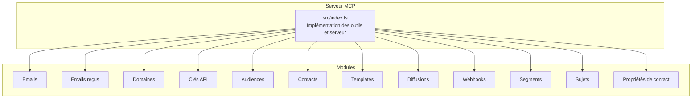
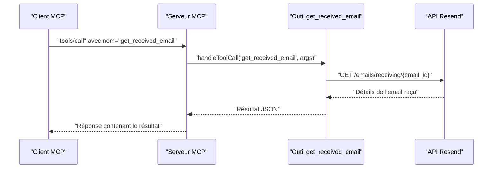
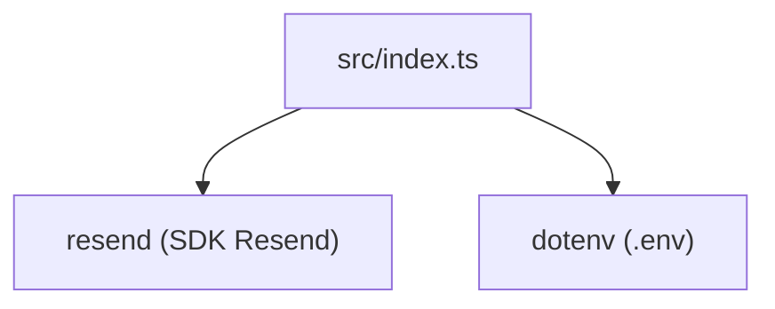

# Outil get_received_email

<cite>
**Fichiers référencés dans ce document**
- [README.md](file://README.md)
- [package.json](file://package.json)
- [src/index.ts](file://src/index.ts)
</cite>

## Sommaire
1. [Introduction](#introduction)
2. [Structure du projet](#structure-du-projet)
3. [Composants principaux](#composants-principaux)
4. [Aperçu de l’architecture](#aperçu-de-l’architecture)
5. [Analyse détaillée des composants](#analyse-détaillée-des-composants)
6. [Analyse des dépendances](#analyse-des-dépendances)
7. [Considérations sur les performances](#considérations-sur-les-performances)
8. [Guide de dépannage](#guide-de-dépannage)
9. [Conclusion](#conclusion)

## Introduction
Cet outil permet de récupérer les détails d’un email reçu spécifique à partir de son identifiant unique. Il fait partie de l’ensemble des outils de gestion des emails reçus fournis par le serveur MCP Resend, qui expose l’intégralité de l’API Resend sous forme d’outils invocables.

## Structure du projet
Le projet est un serveur MCP écrit en TypeScript, utilisant le SDK Resend pour interagir avec l’API Resend. Le serveur expose plus de 70 outils couvrant tous les modules de l’API Resend, dont les outils liés aux emails reçus.

**Diagramme sources**
- [src/index.ts](file://src/index.ts#L42-L249)

**Section sources**
- [README.md](file://README.md#L1-L721)
- [package.json](file://package.json#L1-L49)

## Composants principaux
- Outils de gestion des emails reçus : lister, récupérer un email reçu, lister les pièces jointes, récupérer une pièce jointe.
- Implémentation de l’outil get_received_email : récupération des détails d’un email reçu par son identifiant.

**Section sources**
- [src/index.ts](file://src/index.ts#L200-L249)

## Aperçu de l’architecture
Le serveur MCP expose un ensemble d’outils via des appels standards. Pour l’outil get_received_email, le flux de traitement se déroule comme suit :
- Validation des paramètres fournis (identifiant de l'email reçu).
- Appel à l’API Resend pour récupérer les détails de l’email reçu.
- Retour de la réponse au format JSON.

**Diagramme sources**
- [src/index.ts](file://src/index.ts#L1080-L1083)

## Analyse détaillée des composants

### Outil get_received_email
- Nom de l’outil : get_received_email
- Description : Récupère les détails d’un email reçu spécifique par son identifiant.
- Paramètres requis :
  - email_id : Identifiant unique de l’email reçu (chaîne de caractères).
- Schéma JSON attendu pour les arguments :
  - type : objet
  - propriétés : email_id (chaîne de caractères)
  - requis : email_id
- Réponse attendue : Objet contenant les détails de l’email reçu (structure fournie par l’API Resend).
- Erreurs possibles :
  - Erreur d’exécution de l’outil : inclut le nom de l’outil et les arguments fournis.
  - Erreur d’authentification : si la clé API est manquante ou invalide.
  - Erreur de ressource : si l’email reçu n’existe pas.
  - Erreur de taux limite : si les limites de l’API sont dépassées.
- Bonnes pratiques :
  - Toujours fournir l’identifiant email_id requis.
  - Vérifier que l’email existe avant d’appeler cet outil.
  - Respecter les limites de taux imposées par l’API Resend.

**Section sources**
- [src/index.ts](file://src/index.ts#L214-L223)
- [src/index.ts](file://src/index.ts#L1080-L1083)
- [README.md](file://README.md#L25-L29)

### Exemples d’utilisation
Voici un exemple de requête pour appeler l’outil get_received_email via le protocole MCP :

- Méthode : tools/call
- Nom de l’outil : get_received_email
- Arguments :
  - email_id : Identifiant de l’email reçu à récupérer

La réponse sera au format JSON contenant les détails de l’email reçu.

**Section sources**
- [src/index.ts](file://src/index.ts#L1080-L1083)

### Informations retournées
- Structure de la réponse : objet JSON contenant les détails de l’email reçu (par exemple, expéditeur, destinataire, sujet, date, contenu, pièces jointes, etc.). La structure exacte est définie par l’API Resend et est renvoyée telle quelle par le serveur.

**Section sources**
- [src/index.ts](file://src/index.ts#L1080-L1083)

### Erreurs possibles
- Erreur d’exécution de l’outil : message d’erreur contenant le nom de l’outil et les arguments fournis.
- Erreurs d’authentification : clé API manquante ou invalide.
- Erreurs de ressource : email reçu introuvable.
- Erreurs de taux limite : dépassement des limites de requêtes autorisées.

**Section sources**
- [src/index.ts](file://src/index.ts#L1519-L1522)
- [README.md](file://README.md#L528-L549)

### Bonnes pratiques
- Utiliser l’outil list_received_emails pour obtenir la liste des emails reçus et identifier l’email_id avant d’appeler get_received_email.
- Respecter les limites de taux imposées par l’API Resend.
- Stocker la clé API de manière sécurisée via les variables d’environnement.
- Valider les arguments fournis avant d’appeler l’outil.

**Section sources**
- [README.md](file://README.md#L180-L210)
- [README.md](file://README.md#L518-L527)

## Analyse des dépendances
- Dépendance principale : SDK Resend pour l’authentification et l’appel à l’API.
- Variables d’environnement : RESEND_API_KEY pour l’authentification.
- Modules associés : outils de gestion des emails reçus (list_received_emails, get_received_email, list_received_email_attachments, get_received_email_attachment).

**Diagramme sources**
- [src/index.ts](file://src/index.ts#L1-L7)
- [package.json](file://package.json#L32-L34)

**Section sources**
- [package.json](file://package.json#L32-L34)
- [src/index.ts](file://src/index.ts#L1-L7)

## Considérations sur les performances
- Le serveur MCP gère automatiquement les limites de taux imposées par l’API Resend.
- Pour éviter les erreurs dues aux limites de taux, il est recommandé de limiter le nombre de requêtes simultanées et de respecter les intervalles entre les appels.

**Section sources**
- [README.md](file://README.md#L518-L527)

## Guide de dépannage
- Erreur : "RESEND_API_KEY environment variable is not set"
  - Solution : créer un fichier .env avec votre clé API Resend.
- Erreur : "Tool execution failed"
  - Causes possibles : clé API invalide, paramètres manquants, dépassement des limites de taux, problèmes réseau.
  - Solution : vérifier le message d’erreur et valider votre clé API ainsi que les paramètres fournis.
- Erreur : "Unknown tool"
  - Solution : utiliser tools/list pour afficher tous les outils disponibles.

**Section sources**
- [README.md](file://README.md#L551-L573)
- [src/index.ts](file://src/index.ts#L1571-L1577)

## Conclusion
L’outil get_received_email permet de récupérer facilement les détails d’un email reçu spécifique via son identifiant. En respectant les bonnes pratiques d’utilisation et en gérant les erreurs possibles, vous pouvez intégrer cette fonctionnalité de manière fiable dans vos applications MCP.