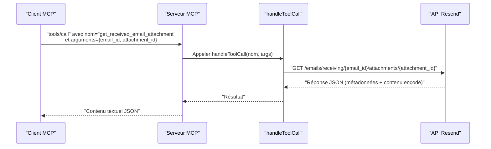

# Outil get_received_email_attachment

<cite>
**Fichiers référencés dans ce document**
- [README.md](file://README.md)
- [src/index.ts](file://src/index.ts)
- [package.json](file://package.json)
</cite>

## Sommaire
1. [Introduction](#introduction)
2. [Objectif de l’outil](#objectif-de-loutil)
3. [Paramètres requis](#paramètres-requis)
4. [Schémas JSON](#schémas-json)
5. [Exemples d’utilisation](#exemples-dutilisation)
6. [Téléchargement des pièces jointes](#téléchargement-des-pièces-jointes)
7. [Formats supportés](#formats-supportés)
8. [Bonnes pratiques de gestion des fichiers joints](#bonnes-pratiques-de-gestion-des-fichiers-joints)
9. [Architecture et flux de traitement](#architecture-et-flux-de-traitement)
10. [Conclusion](#conclusion)

## Introduction
Cet outil permet de récupérer une pièce jointe spécifique à partir d’un email reçu via l’API Resend, exposée via le Model Context Protocol (MCP). Il fait partie d’un serveur MCP complet couvrant l’intégralité de l’API Resend, incluant notamment les opérations liées aux emails reçus, leur listing, leurs détails, ainsi que la gestion de leurs pièces jointes.

## Objectif de l’outil
Récupérer un fichier joint spécifique d’un email reçu en utilisant son identifiant d’email et l’identifiant de la pièce jointe. L’outil renvoie les métadonnées de la pièce jointe (nom, type MIME, taille, etc.) et fournit un accès au contenu encodé (par exemple en base64) pour un téléchargement ultérieur.

## Paramètres requis
- email_id : Identifiant de l'email reçu contenant la pièce jointe.
- attachment_id : Identifiant de la pièce jointe à télécharger.

Ces deux paramètres sont obligatoires pour appeler l’outil.

**Section sources**
- [src/index.ts](file://src/index.ts#L239-L249)

## Schémas JSON
Voici le schéma attendu pour l’appel de l’outil :

- Nom de l’outil : get_received_email_attachment
- Méthode : tools/call
- Arguments attendus :
  - email_id : chaîne de caractères (obligatoire)
  - attachment_id : chaîne de caractères (obligatoire)

Le schéma JSON correspondant est disponible dans la définition de l’outil.

**Section sources**
- [src/index.ts](file://src/index.ts#L239-L249)

## Exemples d’utilisation
Voici un exemple de requête MCP pour appeler l’outil, avec les arguments requis :

- Méthode : tools/call
- Nom de l’outil : get_received_email_attachment
- Arguments : { "email_id": "<id_de_l_email>", "attachment_id": "<id_de_la_piece_jointe>" }

Ce type d’appel peut être effectué depuis un client MCP compatible (par exemple Claude Desktop, Continue, Cline, etc.).

**Section sources**
- [README.md](file://README.md#L266-L444)
- [src/index.ts](file://src/index.ts#L1094-L1097)

## Téléchargement des pièces jointes
L’outil retourne les métadonnées de la pièce jointe ainsi qu’un contenu encodé (par exemple en base64). Pour télécharger le fichier réel, vous devez :

1. Récupérer la réponse de l’outil, qui contient les métadonnées de la pièce jointe.
2. Extraire le contenu encodé fourni par l’outil.
3. Décoder le contenu (selon le format fourni) pour obtenir le fichier binaire.
4. Écrire le fichier binaire sur le disque ou le traiter comme nécessaire.

Remarque : Le serveur MCP renvoie la réponse sous forme de texte JSON. Si le contenu de la pièce jointe est fourni encodé, il vous incombe de gérer le décodage selon le format fourni (par exemple base64) avant d’écrire le fichier.

**Section sources**
- [src/index.ts](file://src/index.ts#L1094-L1097)

## Formats supportés
L’outil ne spécifie pas explicitement les formats de fichiers pris en charge. En pratique, cela dépend de l’API Resend et de la nature de la pièce jointe associée à l’email reçu. Pour connaître les formats autorisés, reportez-vous à la documentation officielle de l’API Resend.

**Section sources**
- [README.md](file://README.md#L1-L721)

## Bonnes pratiques de gestion des fichiers joints
- Valider les identifiants : Vérifiez que email_id et attachment_id sont bien présents et valides avant d’appeler l’outil.
- Gérer les erreurs : Prévoyez des traitements d’erreur pour les cas où l’email ou la pièce jointe n’existe pas, ou si l’accès est refusé.
- Sécurité : Ne stockez jamais les données sensibles sans chiffrement. Utilisez des chemins temporaires ou sécurisés lors du traitement.
- Taille des fichiers : Soyez attentif à la taille des pièces jointes pour éviter les surcharges mémoire.
- Encodage : Si le contenu est encodé (par exemple base64), assurez-vous de le décoder correctement avant écriture.
- Nettoyage : Supprimez les fichiers temporaires après utilisation.

## Architecture et flux de traitement
Le serveur MCP expose l’outil get_received_email_attachment comme suit :

- Définition de l’outil : L’outil est défini dans la liste des outils MCP avec ses paramètres d’entrée (email_id, attachment_id).
- Appel de l’outil : Lorsqu’un client MCP appelle tools/call avec le nom de l’outil, le serveur exécute la fonction handleToolCall.
- Traitement : La fonction handleToolCall effectue une requête HTTP vers l’API Resend pour récupérer la pièce jointe demandée.
- Réponse : Le serveur renvoie la réponse sous forme de texte JSON contenant les métadonnées de la pièce jointe et éventuellement le contenu encodé.

**Diagram sources**
- [src/index.ts](file://src/index.ts#L1094-L1097)
- [src/index.ts](file://src/index.ts#L1536-L1564)

## Conclusion
L’outil get_received_email_attachment permet de récupérer une pièce jointe spécifique d’un email reçu en utilisant l’API Resend via le protocole MCP. Il nécessite deux identifiants : celui de l’email reçu et celui de la pièce jointe. La réponse contient les métadonnées de la pièce jointe et, selon l’implémentation de l’API Resend, un contenu encodé que vous devrez décoder pour obtenir le fichier binaire. Respectez les bonnes pratiques de sécurité et de gestion des fichiers pour garantir un traitement fiable et sécurisé.