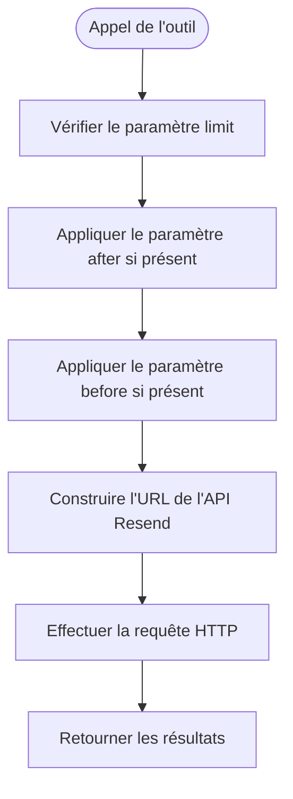
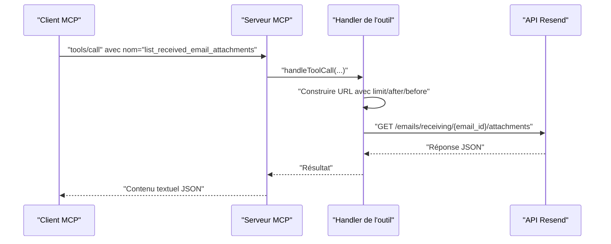

# Outil list_received_email_attachments

<cite>
**Fichiers référencés dans ce document**
- [README.md](file://README.md)
- [package.json](file://package.json)
- [src/index.ts](file://src/index.ts)
</cite>

## Sommaire
1. [Introduction](#introduction)
2. [Objectif de l’outil](#objectif-de-loutil)
3. [Paramètres d’entrée](#paramètres-dentrée)
4. [Schémas JSON](#schémas-json)
5. [Exemples d’utilisation](#exemples-dutilisation)
6. [Pagination des pièces jointes](#pagination-des-pièces-jointes)
7. [Gestion des pièces jointes](#gestion-des-pièces-jointes)
8. [Architecture de l’outil](#architecture-de-loutil)
9. [Conclusion](#conclusion)

## Introduction
Cet outil permet de récupérer la liste des pièces jointes associées à un email reçu. Il fait partie de la suite d’outils MCP (Model Context Protocol) qui expose l’intégralité de l’API Resend, y compris la gestion des emails reçus et leurs pièces jointes.

## Objectif de l’outil
Récupérer la liste des pièces jointes d’un email reçu en utilisant son identifiant, avec possibilité de filtrage et de pagination.

## Paramètres d’entrée
- email_id (obligatoire)
  - Type : chaîne de caractères
  - Description : Identifiant de l'email reçu dont on souhaite lister les pièces jointes
- limit (optionnel)
  - Type : nombre entier
  - Description : Nombre maximal de pièces jointes à retourner
  - Valeur par défaut : dépend de l’implémentation de l’API Resend
- after (optionnel)
  - Type : chaîne de caractères
  - Description : Curseur pour récupérer les éléments suivants (pagination)
- before (optionnel)
  - Type : chaîne de caractères
  - Description : Curseur pour récupérer les éléments précédents (pagination)

**Section sources**
- [src/index.ts](file://src/index.ts#L224-L237)

## Schémas JSON
Le schéma de l’outil est défini comme suit :

- Nom : list_received_email_attachments
- Description : Récupère la liste des pièces jointes d’un email reçu
- Entrées attendues :
  - email_id : chaîne de caractères (obligatoire)
  - limit : nombre (optionnel)
  - after : chaîne de caractères (optionnel)
  - before : chaîne de caractères (optionnel)

**Section sources**
- [src/index.ts](file://src/index.ts#L224-L237)

## Exemples d’utilisation
Voici quelques exemples d’appels à l’outil via le protocole MCP (format JSON) :

- Obtenir les 10 premières pièces jointes d’un email reçu
  - Méthode : tools/call
  - Nom de l’outil : list_received_email_attachments
  - Arguments : { "email_id": "id_de_l_email_reçu", "limit": 10 }

- Obtenir les pièces jointes suivantes après un curseur spécifique
  - Méthode : tools/call
  - Nom de l’outil : list_received_email_attachments
  - Arguments : { "email_id": "id_de_l_email_reçu", "after": "curseur_suivant" }

- Obtenir les pièces jointes précédentes avant un curseur spécifique
  - Méthode : tools/call
  - Nom de l’outil : list_received_email_attachments
  - Arguments : { "email_id": "id_de_l_email_reçu", "before": "curseur_précédent" }

- Obtenir les 50 premières pièces jointes avec pagination
  - Méthode : tools/call
  - Nom de l’outil : list_received_email_attachments
  - Arguments : { "email_id": "id_de_l_email_reçu", "limit": 50 }

Remarque : Pour connaître la structure exacte de la réponse, consultez la documentation officielle de l’API Resend.

**Section sources**
- [src/index.ts](file://src/index.ts#L1085-L1092)

## Pagination des pièces jointes
L’outil prend en charge la pagination via les paramètres after et before. Voici comment cela fonctionne :

- Utilisez le paramètre limit pour limiter le nombre de résultats retournés.
- Utilisez after pour obtenir les éléments suivants (pagination vers le futur).
- Utilisez before pour obtenir les éléments précédents (pagination vers le passé).
- Le serveur MCP construit dynamiquement la requête HTTP en ajoutant ces paramètres à l’URL de l’API Resend.

Flux de pagination illustré :

**Diagram sources**
- [src/index.ts](file://src/index.ts#L1085-L1092)

**Section sources**
- [src/index.ts](file://src/index.ts#L1085-L1092)

## Gestion des pièces jointes
- Récupération de la liste : L’outil appelle l’API Resend pour obtenir la liste des pièces jointes associées à l’email reçu.
- Accès aux pièces jointes : Une fois la liste obtenue, vous pouvez utiliser l’outil get_received_email_attachment pour télécharger un fichier spécifique.
- Bonnes pratiques :
  - Limitez le nombre de résultats avec limit pour éviter de surcharger la mémoire.
  - Utilisez after et before pour itérer progressivement sur les pièces jointes.
  - Stockez temporairement les identifiants des pièces jointes pour un traitement ultérieur.
  - Respectez les quotas de l’API Resend et gérez les erreurs (codes 429, 503, etc.).

**Section sources**
- [src/index.ts](file://src/index.ts#L1085-L1092)

## Architecture de l’outil
L’outil fait partie de la collection complète des outils MCP exposés par le serveur. Voici comment il s’intègre dans l’architecture générale :

- Définition de l’outil : Le schéma de l’outil est déclaré dans la liste des outils disponibles.
- Gestion de l’appel : Lorsqu’un client MCP appelle l’outil, le serveur le route vers le handler correspondant.
- Appel API : Le handler construit la requête HTTP vers l’API Resend avec les paramètres fournis.
- Réponse : La réponse de l’API Resend est renvoyée au client MCP sous forme de texte JSON.

**Diagram sources**
- [src/index.ts](file://src/index.ts#L1085-L1092)

**Section sources**
- [src/index.ts](file://src/index.ts#L1085-L1092)

## Conclusion
L’outil list_received_email_attachments permet de récupérer de manière paginée la liste des pièces jointes d’un email reçu. Grâce à ses paramètres limit, after et before, il offre une flexibilité optimale pour gérer les grandes quantités de données. En combinaison avec l’outil get_received_email_attachment, il constitue un ensemble complet pour explorer et traiter les pièces jointes des emails reçus.