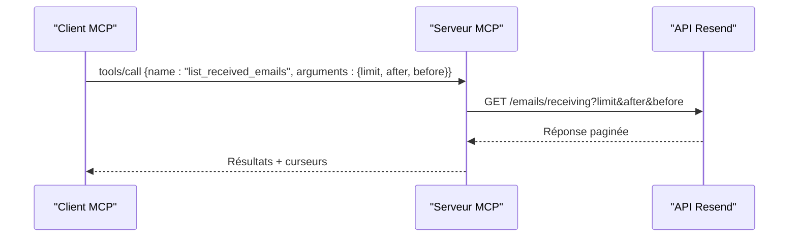

# Outil list_received_emails

<cite>
**Fichiers référencés dans ce document**
- [README.md](file://README.md)
- [package.json](file://package.json)
- [src/index.ts](file://src/index.ts)
</cite>

## Sommaire
1. [Introduction](#introduction)
2. [Objectif de l’outil](#objectif-de-loutil)
3. [Paramètres d’entrée](#paramètres-dentrée)
4. [Schémas JSON](#schémas-json)
5. [Exemples d’utilisation](#exemples-dutilisation)
6. [Gestion de la pagination](#gestion-de-la-pagination)
7. [Cas d’utilisation courants dans les applications IA](#cas-dutilisation-courants-dans-les-applications-ia)
8. [Architecture technique](#architecture-technique)
9. [Bonnes pratiques](#bonnes-pratiques)
10. [Conclusion](#conclusion)

## Introduction
Cet outil permet de récupérer la liste des emails reçus via l’API Resend, avec un support complet de la pagination. Il fait partie de l’ensemble des 70+ outils fournis par le serveur MCP Resend, qui expose toutes les fonctionnalités de l’API Resend sous forme d’outils invocables depuis des assistants IA ou des clients compatibles MCP.

## Objectif de l’outil
L’outil list_received_emails permet de :
- Récupérer une liste paginée des emails reçus
- Limiter le nombre d’éléments retournés
- Naviguer entre les pages à l’aide de curseurs (after, before)

Il s’agit d’un outil de lecture (non destructif) qui ne modifie aucun email.

**Section sources**
- [README.md](file://README.md#L25-L29)
- [src/index.ts](file://src/index.ts#L200-L212)

## Paramètres d’entrée
L’outil accepte les paramètres suivants (tous optionnels) :

- limit : nombre maximal d’emails à retourner (entier)
- after : curseur pour obtenir les éléments après ce point
- before : curseur pour obtenir les éléments avant ce point

Remarques importantes :
- Les deux curseurs ne peuvent pas être utilisés ensemble dans la même requête
- Le paramètre limit est généralement utilisé en combinaison avec l’un des curseurs

**Section sources**
- [src/index.ts](file://src/index.ts#L204-L211)

## Schémas JSON
Voici le schéma d’appel attendu pour l’outil list_received_emails :

- Méthode : tools/call
- Nom de l’outil : list_received_emails
- Arguments (facultatifs) : limit, after, before

Exemple de structure JSON pour appeler l’outil (sans préciser les arguments si vous souhaitez utiliser les valeurs par défaut) :

```json
{
  "method": "tools/call",
  "params": {
    "name": "list_received_emails",
    "arguments": {
      "limit": 25,
      "after": "cursor_valeur"
    }
  }
}
```

**Section sources**
- [src/index.ts](file://src/index.ts#L200-L212)

## Exemples d’utilisation
Voici quelques scénarios concrets illustrant l’utilisation de l’outil list_received_emails :

- Obtenir les 50 derniers emails reçus
  - Utiliser limit=50
  - Si vous avez besoin de plus de résultats, utilisez le curseur fourni dans la réponse

- Obtenir les emails reçus avant une date spécifique
  - Utiliser before=un_curseur_valable
  - Le curseur est généralement fourni dans la réponse précédente

- Obtenir les emails reçus après un événement particulier
  - Utiliser after=un_curseur_valable
  - Utile pour l’actualisation continue des données

- Explorer progressivement les emails reçus
  - Appeler sans curseur pour obtenir les plus récents
  - Utiliser le curseur de la réponse pour aller vers le passé

**Section sources**
- [src/index.ts](file://src/index.ts#L1071-L1078)

## Gestion de la pagination
Le système de pagination repose sur des curseurs (after/before) plutôt que sur des numéros de page. Voici comment cela fonctionne en pratique :

- Première requête : appelez l’outil sans curseur pour obtenir les éléments les plus récents
- Réponse : elle contient un curseur (typiquement dans un champ de pagination) que vous pouvez utiliser pour demander les éléments suivants
- Navigation vers le passé : utilisez le curseur comme valeur pour after
- Navigation vers le futur : utilisez le curseur comme valeur pour before

Exemple de flux typique :
1. Appel initial : limit=25
2. Réception de la liste + curseur
3. Pour les suivants : utiliser after=curseur_reçu
4. Pour les précédents : utiliser before=curseur_reçu

**Section sources**
- [src/index.ts](file://src/index.ts#L1071-L1078)

## Cas d’utilisation courants dans les applications IA
Voici quelques scénarios fréquents où cet outil peut être utilisé dans des applications IA :

- Assistant de support client
  - Récupérer les derniers emails reçus pour alimenter un chatbot de support
  - Filtrer les emails selon des critères spécifiques (expéditeur, sujet)

- Système de suivi des réponses
  - Surveiller les réponses aux formulaires de contact
  - Mettre à jour des bases de connaissances à partir des nouveaux emails

- Analyse de tendance
  - Extraire des données à partir des emails reçus pour des analyses
  - Identifier des motifs dans les communications

- Automatisation de flux
  - Déclencher des actions basées sur le contenu des emails reçus
  - Intégrer des données provenant de la boîte de réception dans des outils tiers

**Section sources**
- [README.md](file://README.md#L25-L29)

## Architecture technique
L’outil list_received_emails est implémenté comme suit dans le serveur MCP Resend :

- Définition de l’outil : dans la liste des outils, l’outil est décrit avec son nom, sa description et son schéma d’entrée
- Implémentation de l’appel : le handler effectue une requête HTTP GET vers l’API Resend pour les emails reçus
- Pagination : les paramètres limit, after et before sont transmis sous forme de query parameters
- Retour de données : la réponse de l’API Resend est renvoyée telle quelle au client MCP



**Diagram sources**
- [src/index.ts](file://src/index.ts#L1071-L1078)

**Section sources**
- [src/index.ts](file://src/index.ts#L200-L212)
- [src/index.ts](file://src/index.ts#L1071-L1078)

## Bonnes pratiques
Voici les recommandations pour une utilisation efficace de l’outil list_received_emails :

- Utilisez toujours limit pour limiter le volume de données retournées
- Ne combinez pas after et before dans la même requête
- Stockez les curseurs pour naviguer de manière incrémentale
- Traitez les erreurs de manière appropriée (clé API invalide, limites de taux, etc.)
- Respectez les limites de taux imposées par l’API Resend
- Effectuez des appels ciblés plutôt que de récupérer tous les emails à chaque fois

**Section sources**
- [README.md](file://README.md#L518-L526)
- [src/index.ts](file://src/index.ts#L1071-L1078)

## Conclusion
L’outil list_received_emails est un composant essentiel pour les applications IA qui doivent accéder à la liste des emails reçus de manière paginée. Grâce à son interface simple et à son support complet de la pagination par curseurs, il permet d’intégrer facilement des flux d’emails reçus dans des systèmes d’IA, des assistants de support, des outils d’analyse et des automatisations.