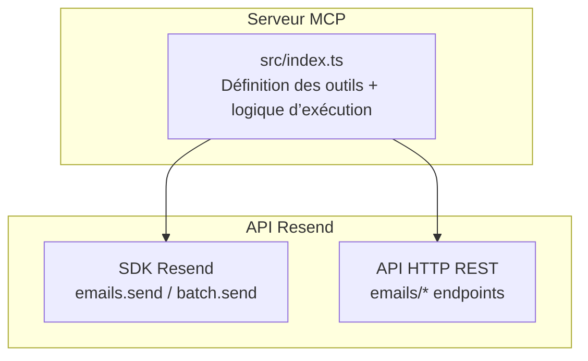
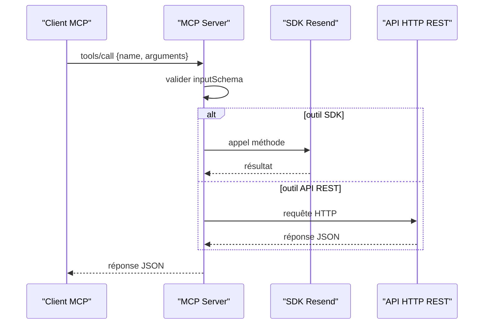
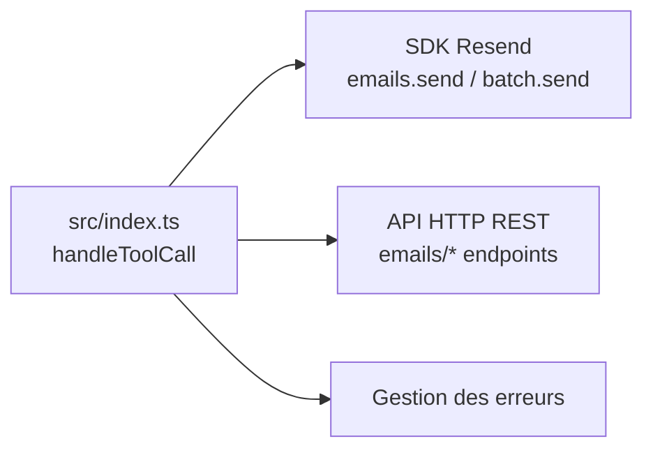

# Module Emails

<cite>
**Fichiers référencés dans ce document**
- [README.md](file://README.md)
- [package.json](file://package.json)
- [src/index.ts](file://src/index.ts)
</cite>

## Sommaire
1. [Introduction](#introduction)
2. [Structure du projet](#structure-du-projet)
3. [Composants principaux](#composants-principaux)
4. [Aperçu de l’architecture](#aperçu-de-larchitecture)
5. [Analyse détaillée des outils](#analyse-détaillée-des-outils)
6. [Analyse des dépendances](#analyse-des-dépendances)
7. [Considérations sur les performances](#considérations-sur-les-performances)
8. [Guide de dépannage](#guide-de-dépannage)
9. [Conclusion](#conclusion)
10. [Annexes](#annexes)

## Introduction
Ce document documente le module Emails de l’API Resend exposé via le serveur MCP. Le module comprend 8 outils liés à la gestion des emails : envoyer un email unique, envoyer plusieurs emails en lot, lister les emails envoyés, récupérer un email spécifique, mettre à jour un email planifié, annuler un email planifié, lister les pièces jointes d’un email envoyé, et télécharger une pièce jointe. Pour chacun de ces outils, nous décrivons les paramètres d’entrée, les schémas de validation, des exemples concrets d’appel, les retours attendus, ainsi que des cas d’utilisation typiques. Nous expliquons également les fonctionnalités avancées telles que l’envoi en lot, la gestion des pièces jointes, la planification, et les headers personnalisés, avec des scénarios concrets pour l’envoi simple, massif et automatisé.

## Structure du projet
Le serveur MCP est implémenté en TypeScript. Il expose 70+ outils couvrant l’ensemble de l’API Resend. Le module Emails est composé des outils suivants :
- send_email
- send_batch_emails
- list_emails
- get_email
- update_email
- cancel_email
- list_email_attachments
- get_email_attachment

**Diagramme sources**
- [src/index.ts](file://src/index.ts#L42-L198)
- [src/index.ts](file://src/index.ts#L1018-L1068)

**Section sources**
- [README.md](file://README.md#L15-L23)
- [src/index.ts](file://src/index.ts#L42-L198)

## Composants principaux
- Définitions des outils : chaque outil est décrit par un nom, une description, et un schéma d’entrée JSON (inputSchema) qui spécifie les champs obligatoires, leurs types, et leurs contraintes.
- Gestion des appels : la fonction handleToolCall dispatche les appels vers soit le SDK Resend (pour les opérations prises en charge), soit vers l’API HTTP REST (pour les endpoints non couverts par le SDK).
- Communication MCP : le serveur écoute les requêtes sur stdin et répond via stdout au format JSON.

**Section sources**
- [src/index.ts](file://src/index.ts#L42-L198)
- [src/index.ts](file://src/index.ts#L1008-L1522)
- [src/index.ts](file://src/index.ts#L1528-L1623)

## Aperçu de l’architecture
Le flux d’un appel outil se déroule comme suit :
- L’appel arrive via tools/call avec un nom d’outil et des arguments.
- Le serveur identifie l’outil, vérifie les paramètres requis selon le schéma.
- Selon l’outil, il appelle soit le SDK Resend, soit effectue une requête HTTP REST.
- Le résultat est renvoyé au format texte JSON.

**Diagramme sources**
- [src/index.ts](file://src/index.ts#L1008-L1522)
- [src/index.ts](file://src/index.ts#L1018-L1068)

## Analyse détaillée des outils

### send_email
- Description : Envoie un email unique avec HTML/Text, pièces jointes, balises, headers personnalisés, CC/BCC, et planification.
- Paramètres d’entrée (inputSchema)
  - from : chaîne, requis
  - to : tableau de chaînes, requis (max 50)
  - subject : chaîne, requis
  - html : chaîne
  - text : chaîne
  - bcc : tableau de chaînes
  - cc : tableau de chaînes
  - reply_to : tableau de chaînes
  - scheduled_at : chaîne au format ISO 8601
  - attachments : tableau d’objets avec filename, content (base64), path, content_type
  - tags : tableau d’objets {name, value}
  - headers : objet
- Exemple d’appel : voir [Exemple d’envoi simple](file://README.md#L279-L294)
- Retours attendus : objet contenant l’identifiant de l’email envoyé, statut, et métadonnées.
- Cas d’utilisation typiques : notifications transactionnelles, emails de confirmation, rappels programmés.

**Section sources**
- [src/index.ts](file://src/index.ts#L44-L101)
- [README.md](file://README.md#L279-L294)

### send_batch_emails
- Description : Envoie jusqu’à 100 emails en un seul appel.
- Paramètres d’entrée (inputSchema)
  - emails : tableau d’objets, requis
    - from, to, subject, html, text requis pour chaque email
- Exemple d’appel : voir [Exemple d’envoi en lot](file://README.md#L305-L329)
- Retours attendus : tableau de résultats pour chaque email envoyé.
- Cas d’utilisation typiques : envoi de bienvenue à de nouveaux utilisateurs, alertes de masse, campagnes de rappel.

**Section sources**
- [src/index.ts](file://src/index.ts#L102-L126)
- [README.md](file://README.md#L296-L329)

### list_emails
- Description : Liste les emails envoyés avec pagination.
- Paramètres d’entrée (inputSchema)
  - limit : nombre (1–100)
  - after : curseur
  - before : curseur
- Retours attendus : collection paginée d’emails.
- Cas d’utilisation typiques : audit des envois, recherche de messages par plage temporelle.

**Section sources**
- [src/index.ts](file://src/index.ts#L127-L138)

### get_email
- Description : Récupère les détails d’un email spécifique.
- Paramètres d’entrée (inputSchema)
  - email_id : chaîne, requis
- Retours attendus : détails complets de l’email (statut, destinataires, contenu, pièces jointes, etc.).
- Cas d’utilisation typiques : suivi d’état, diagnostic d’échec, analyse de contenu.

**Section sources**
- [src/index.ts](file://src/index.ts#L139-L149)

### update_email
- Description : Met à jour un email planifié (reschedule).
- Paramètres d’entrée (inputSchema)
  - email_id : chaîne, requis
  - scheduled_at : chaîne au format ISO 8601
- Retours attendus : email mis à jour.
- Cas d’utilisation typiques : reporter un envoi, ajuster le calendrier.

**Section sources**
- [src/index.ts](file://src/index.ts#L150-L161)

### cancel_email
- Description : Annule un email planifié.
- Paramètres d’entrée (inputSchema)
  - email_id : chaîne, requis
- Retours attendus : email annulé.
- Cas d’utilisation typiques : annulation d’un rappel, correction d’une erreur de planification.

**Section sources**
- [src/index.ts](file://src/index.ts#L162-L172)

### list_email_attachments
- Description : Liste les pièces jointes d’un email envoyé.
- Paramètres d’entrée (inputSchema)
  - email_id : chaîne, requis
  - limit : nombre
  - after : curseur
  - before : curseur
- Retours attendus : collection paginée de pièces jointes.
- Cas d’utilisation typiques : affichage des documents joints, audit de contenu.

**Section sources**
- [src/index.ts](file://src/index.ts#L173-L186)

### get_email_attachment
- Description : Télécharge une pièce jointe spécifique.
- Paramètres d’entrée (inputSchema)
  - email_id : chaîne, requis
  - attachment_id : chaîne, requis
- Retours attendus : données binaires ou métadonnées de la pièce jointe.
- Cas d’utilisation typiques : téléchargement de documents joints, traitement de fichiers.

**Section sources**
- [src/index.ts](file://src/index.ts#L187-L198)

## Analyse des dépendances
- Dépendance au SDK Resend : utilisé pour send_email et send_batch_emails.
- Dépendance à l’API HTTP REST : utilisé pour les autres outils de la liste (list_emails, get_email, list_email_attachments, get_email_attachment) et pour les opérations PATCH/POST/DELETE non couvertes par le SDK.
- Gestion des erreurs centralisée : tous les appels sont encapsulés dans un try/catch avec des messages d’erreur structurés.

**Diagramme sources**
- [src/index.ts](file://src/index.ts#L1008-L1522)

**Section sources**
- [src/index.ts](file://src/index.ts#L1008-L1522)

## Considérations sur les performances
- Envoi en lot : send_batch_emails permet d’envoyer jusqu’à 100 emails en un seul appel, réduisant le nombre de requêtes et améliorant l’efficacité.
- Pagination : list_emails et list_email_attachments utilisent des curseurs (after/before) pour gérer de grandes collections.
- Planification : scheduled_at permet de reporter l’envoi, utile pour automatiser des campagnes sans surcharger le système.
- Headers personnalisés : headers permettent d’ajouter des en-têtes RFC-compatibles (par exemple, Message-ID personnalisé, DKIM, etc.).

[Pas de sources supplémentaires car cette section fournit des conseils généraux basés sur les schémas d’entrée]

## Guide de dépannage
- Erreur d’authentification : si l’environnement RESEND_API_KEY n’est pas défini, le serveur affiche un message d’erreur. Vérifiez votre .env.
- Erreurs de validation : les erreurs 400/422 sont renvoyées lorsque les paramètres sont manquants ou incorrects. Référez-vous aux inputSchema.
- Erreurs de taux limite : le serveur respecte les limites de l’API Resend (2 req/s par défaut). Si vous dépassez, patientez avant de relancer.
- Outils inconnus : utilisez tools/list pour lister tous les outils disponibles.

**Section sources**
- [src/index.ts](file://src/index.ts#L1571-L1577)
- [README.md](file://README.md#L528-L549)

## Conclusion
Le module Emails du serveur MCP offre une couverture complète des fonctionnalités Resend pour l’envoi, la gestion et le suivi des emails. Grâce aux schémas d’entrée stricts, à la prise en charge de l’envoi en lot, des pièces jointes, de la planification et des headers personnalisés, il permet de construire des workflows simples, massifs et automatisés. La documentation fournie ici sert de référence pour intégrer ces outils de manière fiable via des clients MCP.

[La conclusion ne nécessite pas de source supplémentaire]

## Annexes

### Schémas JSON de validation (résumé)
- send_email : champs requis from, to, subject ; champs optionnels html, text, bcc, cc, reply_to, scheduled_at, attachments, tags, headers.
- send_batch_emails : tableau emails avec objets contenant from, to, subject, html, text.
- list_emails : limit, after, before.
- get_email : email_id.
- update_email : email_id, scheduled_at.
- cancel_email : email_id.
- list_email_attachments : email_id, limit, after, before.
- get_email_attachment : email_id, attachment_id.

**Section sources**
- [src/index.ts](file://src/index.ts#L44-L101)
- [src/index.ts](file://src/index.ts#L102-L126)
- [src/index.ts](file://src/index.ts#L127-L138)
- [src/index.ts](file://src/index.ts#L139-L149)
- [src/index.ts](file://src/index.ts#L150-L161)
- [src/index.ts](file://src/index.ts#L162-L172)
- [src/index.ts](file://src/index.ts#L173-L186)
- [src/index.ts](file://src/index.ts#L187-L198)

### Exemples d’appels concrets
- Envoi simple : [Exemple d’envoi simple](file://README.md#L279-L294)
- Envoi en lot : [Exemple d’envoi en lot](file://README.md#L305-L329)

**Section sources**
- [README.md](file://README.md#L279-L294)
- [README.md](file://README.md#L305-L329)

### Scénarios d’utilisation
- Envoi simple : notification de confirmation de commande, rappel de rendez-vous.
- Envoi massif : bienvenue à 50 nouveaux inscrits, alerte de maintenance.
- Automatisation : planifier des rappels hebdomadaires, reporter des campagnes en cas de problème.

[Les scénarios sont des généralités basées sur les outils décrits]