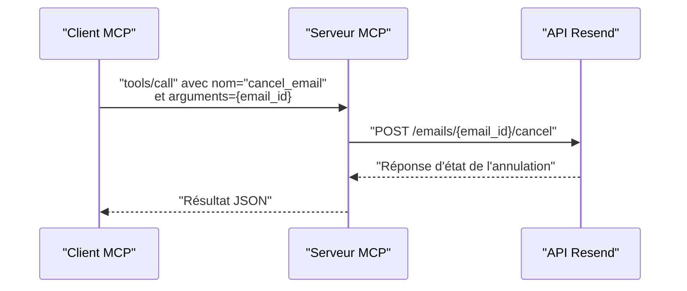

# Outil cancel_email

<cite>
**Fichiers référencés dans ce document**
- [README.md](file://README.md)
- [package.json](file://package.json)
- [src/index.ts](file://src/index.ts)
</cite>

## Sommaire
1. [Introduction](#introduction)
2. [Objectif de l’outil](#objectif-de-loutil)
3. [Conditions d’annulation](#conditions-dannulation)
4. [Délais applicables](#délais-applicables)
5. [Retours d’état](#retours-detat)
6. [Implications sur les quotas](#implications-sur-les-quotas)
7. [Exemples d’utilisation](#exemples-dutilisation)
8. [Architecture technique](#architecture-technique)
9. [Gestion des erreurs](#gestion-des-erreurs)
10. [Conclusion](#conclusion)

## Introduction
L’outil cancel_email permet d’annuler un email planifié avant qu’il ne soit envoyé. Il s’agit d’un outil de la couche Emails de l’API Resend exposé via le Model Context Protocol (MCP). Ce document explique comment l’utiliser, les conditions, les délais, les retours attendus, ainsi que les implications sur les quotas. Des exemples concrets montrent comment l’appliquer dans des cas pratiques comme les envois accidentels, la gestion de campagnes temporaires, ou des logiques de contrôle de flux.

## Objectif de l’outil
- Annuler un email programmé (planifié) avant son envoi.
- Ne fonctionne que si l’email est dans un état planifié et non encore envoyé.
- Retourne un objet indiquant l’état de l’annulation.

**Section sources**
- [README.md](file://README.md#L15-L23)
- [src/index.ts](file://src/index.ts#L162-L172)

## Conditions d’annulation
- L’email doit être planifié (champ scheduled_at présent et dans le futur).
- L’annulation ne peut se faire que si l’email n’a pas encore été envoyé.
- L’outil nécessite l’identifiant unique de l’email (email_id).

**Section sources**
- [src/index.ts](file://src/index.ts#L162-L172)

## Délais applicables
- L’annulation est effectuée immédiatement au moment de l’appel de l’outil.
- Si l’email est déjà envoyé, l’annulation n’est plus possible.
- Le délai de disponibilité de l’annulation dépend de la disponibilité de l’email dans l’état planifié.

**Section sources**
- [src/index.ts](file://src/index.ts#L1048-L1054)

## Retours d’état
- Réussite : L’appel renvoie un objet contenant l’état de l’annulation (par exemple, un champ indiquant l’état mis à jour).
- Échec : Une erreur est renvoyée avec un message d’erreur détaillé (ex. : ressource introuvable, statut non applicable, erreur réseau).

**Section sources**
- [src/index.ts](file://src/index.ts#L1048-L1054)
- [src/index.ts](file://src/index.ts#L1519-L1522)

## Implications sur les quotas
- L’outil cancel_email effectue un appel HTTP vers l’API Resend pour annuler l’email.
- Le quota de requêtes de l’API Resend s’applique aux appels effectués (par exemple, 2 requêtes/seconde par défaut).
- L’annulation d’un email planifié ne consomme pas de crédit d’envoi car aucun email n’est réellement envoyé.

**Section sources**
- [README.md](file://README.md#L518-L527)

## Exemples d’utilisation

### Exemple 1 : Annuler un email accidentel
- Contexte : Un email a été planifié par erreur.
- Action : Appeler l’outil cancel_email avec l’email_id de l’email planifié.
- Résultat : L’email est annulé, il ne sera pas envoyé.

**Section sources**
- [src/index.ts](file://src/index.ts#L1048-L1054)

### Exemple 2 : Gérer des campagnes temporaires
- Contexte : Une campagne est planifiée mais doit être annulée avant l’envoi.
- Action : Identifier l’email_id de la campagne planifiée, puis appeler cancel_email.
- Résultat : La campagne est annulée, l’envoi est évité.

**Section sources**
- [src/index.ts](file://src/index.ts#L1048-L1054)

### Exemple 3 : Implémenter une logique de contrôle de flux
- Contexte : Une logique métier vérifie si un email planifié est toujours nécessaire.
- Action : Avant d’envoyer, appeler cancel_email si la condition n’est plus remplie.
- Résultat : Évite les envois inutiles et respecte les quotas.

**Section sources**
- [src/index.ts](file://src/index.ts#L1048-L1054)

## Architecture technique
L’outil cancel_email est implémenté comme suit :
- Définition de l’outil : Nom, description, schéma d’entrée (email_id obligatoire).
- Implémentation de l’appel : Envoi d’une requête POST vers l’URL de l’API Resend pour annuler l’email planifié.
- Gestion des erreurs : Intercepte les erreurs réseau, API, et renvoie un message structuré.

**Diagram sources**
- [src/index.ts](file://src/index.ts#L162-L172)
- [src/index.ts](file://src/index.ts#L1048-L1054)

**Section sources**
- [src/index.ts](file://src/index.ts#L162-L172)
- [src/index.ts](file://src/index.ts#L1048-L1054)

## Gestion des erreurs
- Erreur d’authentification : Vérifier la clé API.
- Erreur de ressource : L’email_id est incorrect ou l’email n’est plus planifié.
- Erreur réseau : Problème de connectivité ou dépassement de délai.
- Erreur de quota : Trop de requêtes en trop peu de temps.

**Section sources**
- [README.md](file://README.md#L528-L549)
- [src/index.ts](file://src/index.ts#L1519-L1522)

## Conclusion
L’outil cancel_email permet de contrôler précisément les envois planifiés. En l’utilisant dans des workflows de validation, de gestion de campagnes, ou de logique métier, vous pouvez éviter les envois inutiles, respecter les quotas, et améliorer la qualité de vos communications.