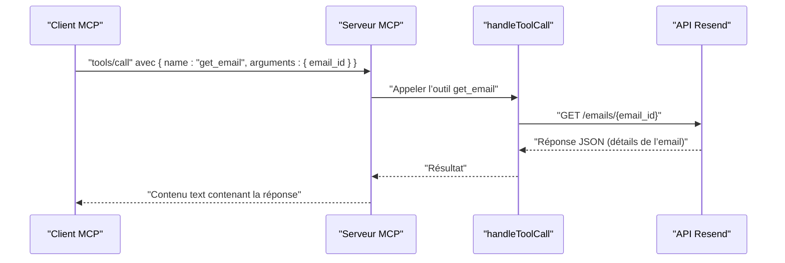

# Outil get_email

<cite>
**Fichiers référencés dans ce document**
- [README.md](file://README.md)
- [package.json](file://package.json)
- [src/index.ts](file://src/index.ts)
</cite>

## Sommaire
1. [Introduction](#introduction)
2. [Objectif de l’outil](#objectif-de-loutil)
3. [Prérequis et configuration](#prérequis-et-configuration)
4. [Description de l’outil](#description-de-loutil)
5. [Champs de la réponse](#champs-de-la-réponse)
6. [Exemples d’utilisation](#exemples-dutilisation)
7. [Intégration dans des systèmes de suivi](#intégration-dans-des-systèmes-de-suivi)
8. [Limitations d’accès et permissions](#limitations-daccès-et-permissions)
9. [Architecture technique](#architecture-technique)
10. [Dépendances](#dépendances)
11. [Conclusion](#conclusion)

## Introduction
Cet outil permet de récupérer les détails complets d’un email envoyé via l’API Resend, identifié par son ID. Il est intégré dans un serveur Model Context Protocol (MCP) qui expose l’ensemble des outils Resend, y compris la gestion des emails, des domaines, des audiences, des contacts, des modèles, des diffusions, des webhooks, des segments, des sujets et des propriétés de contact.

## Objectif de l’outil
Récupérer les informations détaillées d’un email spécifique (par son ID), notamment :
- Contenu HTML et texte
- En-têtes
- Pièces jointes
- Statuts d’envoi
- Métadonnées

Cela permet de :
- Afficher les détails de l’email
- Analyser les statistiques d’envoi
- Intégrer ces données dans des systèmes de suivi ou de reporting

## Prérequis et configuration
- Une clé API Resend valide
- Un client compatible MCP (par exemple Claude Desktop, Continue, Cline, etc.)
- Le serveur MCP démarré avec la bonne configuration

**Section sources**
- [README.md](file://README.md#L127-L210)
- [package.json](file://package.json#L1-L49)

## Description de l’outil
Nom de l’outil : get_email  
Module : Emails  
Description : Récupère les détails d’un email envoyé par son ID.

Paramètres requis
- email_id : Identifiant unique de l’email

Paramètres optionnels
- Aucun paramètre optionnel pour cet outil

**Section sources**
- [src/index.ts](file://src/index.ts#L140-L149)

## Champs de la réponse
La réponse de l’API Resend inclut plusieurs catégories d’informations. Voici les principaux champs disponibles (selon la documentation officielle de Resend) :

- Identifiants
  - id : Identifiant unique de l’email
  - batch_id : Identifiant du lot si l’email fait partie d’un envoi groupé
  - parent_id : Identifiant de l’email parent (cas de réponses/réexpéditions)

- Expéditeur et destinataire
  - from : Adresse expéditrice
  - to : Destinataire principal
  - cc : Destinataires en copie
  - bcc : Destinataires en copie cachée
  - subject : Sujet de l’email

- Contenu
  - html : Contenu HTML
  - text : Contenu texte brut
  - headers : En-têtes personnalisés

- Pièces jointes
  - attachments : Liste des pièces jointes associées

- Statuts d’envoi
  - created_at : Date de création de la demande d’envoi
  - delivered_at : Date de livraison confirmée
  - opened_at : Date de première ouverture
  - clicked_at : Date du premier clic
  - bounced_at : Date de rebond
  - complained_at : Date de signalement de spam
  - canceled_at : Date d’annulation

- Métadonnées
  - tags : Balises personnalisées
  - metadata : Informations supplémentaires fournies par l’utilisateur
  - region : Région utilisée pour l’envoi
  - status : État courant de l’envoi (par exemple : sent, delivered, bounce, complaint, scheduled, canceled)

Remarque : Certains champs peuvent être absents selon l’état de l’email (par exemple, opened_at ne sera présent que si l’email a été lu).

**Section sources**
- [README.md](file://README.md#L15-L23)

## Exemples d’utilisation
Voici quelques scénarios concrets d’utilisation de l’outil get_email :

- Affichage des détails de l’email
  - Utiliser l’outil get_email avec l’ID de l’email pour afficher toutes ses caractéristiques (contenu, destinataires, en-têtes, pièces jointes, statuts).
  - Ce mode d’emploi est utile pour les interfaces de suivi ou de debug.

- Analyse des statistiques
  - Identifier les emails ayant connu des rebonds (bounced_at) ou des signalements de spam (complained_at).
  - Suivre les taux d’ouverture et de clics via opened_at et clicked_at.

- Intégration dans des systèmes de suivi
  - Récupérer l’ID de l’email depuis un outil de liste (list_emails) puis appeler get_email pour enrichir un tableau de bord interne.
  - Stocker les statuts et métadonnées pour alimenter des rapports de performance.

- Gestion des erreurs
  - Si l’email_id est incorrect ou inexistant, l’appel échouera avec une erreur (généralement 404 Not Found).
  - Vérifier que la clé API est valide et autorisée à accéder aux emails.

**Section sources**
- [README.md](file://README.md#L266-L444)
- [src/index.ts](file://src/index.ts#L1034-L1037)

## Intégration dans des systèmes de suivi
- Flux de travail typique
  1. Obtenir la liste des emails (list_emails) pour identifier un email particulier.
  2. Appeler get_email avec l’email_id pour récupérer les détails complets.
  3. Mettre à jour un système de suivi avec les statuts (delivered_at, opened_at, clicked_at, bounced_at, complained_at) et les métadonnées (tags, metadata).

- Mise à jour dynamique
  - Pour suivre l’évolution d’un email, relancer périodiquement get_email tant que le statut n’est pas final (par exemple, en attente de livraison).
  - Utiliser created_at comme référence pour trier les emails récents.

- Sécurité et traçabilité
  - Ne jamais stocker le contenu complet des emails (HTML/text) dans des bases de données non sécurisées.
  - Journaliser les appels de l’outil get_email pour des raisons de traçabilité.

**Section sources**
- [README.md](file://README.md#L493-L517)
- [src/index.ts](file://src/index.ts#L1034-L1037)

## Limitations d’accès et permissions
- Clé API
  - Une clé API valide est nécessaire. Elle doit être configurée via la variable d’environnement RESEND_API_KEY.
  - La clé ne doit JAMAIS être partagée publiquement.

- Permissions
  - Pour accéder aux emails envoyés, la clé API doit avoir au moins les permissions nécessaires à la lecture des emails (en général, une clé avec accès en écriture suffit pour lire les emails envoyés).
  - Si vous utilisez des clés restreintes, vérifiez qu’elles permettent l’accès à l’opération de lecture de l’email.

- Erreurs fréquentes
  - 401 Unauthorized : Clé API manquante ou invalide.
  - 403 Forbidden : Permission insuffisante.
  - 404 Not Found : L’email_id est incorrect ou n’existe plus.
  - 429 Too Many Requests : Limite de débit atteinte.

**Section sources**
- [README.md](file://README.md#L528-L549)
- [README.md](file://README.md#L191-L207)

## Architecture technique
Le serveur MCP expose l’outil get_email via un appel HTTP à l’API Resend. Voici le flux de traitement :

- Entrée : Requête MCP contient le nom de l’outil (get_email) et l’argument email_id.
- Traitement : L’outil est géré dans la fonction handleToolCall, qui effectue un appel HTTP GET vers l’URL de l’API Resend pour l’email spécifié.
- Sortie : Réponse JSON contenant les détails de l’email, retournée sous forme de texte au client MCP.

**Diagram sources**
- [src/index.ts](file://src/index.ts#L1034-L1037)
- [src/index.ts](file://src/index.ts#L1536-L1564)

**Section sources**
- [src/index.ts](file://src/index.ts#L1008-L1522)

## Dépendances
- Dépendances principales
  - resench-sdk : Client Resend pour Node.js
  - dotenv : Chargement des variables d’environnement depuis un fichier .env

- Scripts
  - build : Compilation TypeScript
  - start : Démarrage du serveur compilé
  - dev : Mode développement avec rechargement automatique
  - postinstall : Post-installation pour installer le skill Resend Expert

**Section sources**
- [package.json](file://package.json#L32-L40)
- [package.json](file://package.json#L10-L14)

## Conclusion
L’outil get_email permet de récupérer de manière fiable et complète les détails d’un email envoyé via l’API Resend. Grâce à sa simplicité d’utilisation, il s’intègre facilement dans des flux de suivi, d’analyse et de reporting. En respectant les bonnes pratiques de sécurité (stockage minimal de données sensibles, utilisation de clés API restreintes) et en gérant les erreurs possibles (clés invalides, accès refusé, limite de débit), vous pouvez tirer pleinement parti de cet outil pour améliorer votre expérience utilisateur et optimiser vos campagnes d’emailing.