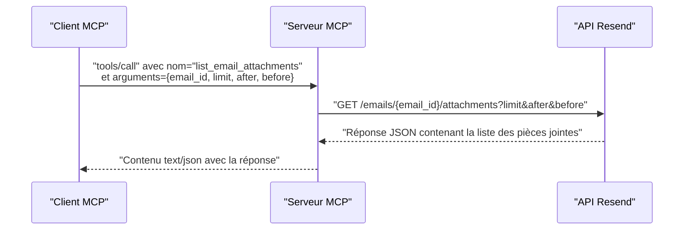

# Outil list_email_attachments

<cite>
**Fichiers référencés dans ce document**
- [README.md](file://README.md)
- [package.json](file://package.json)
- [src/index.ts](file://src/index.ts)
</cite>

## Sommaire
1. [Introduction](#introduction)
2. [Objectif de l’outil](#objectif-de-loutil)
3. [Paramètres de l’outil](#paramètres-de-loutil)
4. [Réponse de l’outil](#réponse-de-loutil)
5. [Exemples d’utilisation](#exemples-dutilisation)
6. [Architecture technique](#architecture-technique)
7. [Gestion des erreurs](#gestion-des-erreurs)
8. [Bonnes pratiques](#bonnes-pratiques)
9. [Conclusion](#conclusion)

## Introduction
Cet outil permet de récupérer la liste des pièces jointes associées à un email envoyé via l’API Resend. Il est intégré dans un serveur Model Context Protocol (MCP) qui expose l’ensemble des fonctionnalités de l’API Resend sous forme d’outils invocables. L’outil list_email_attachments prend en charge la pagination pour gérer efficacement les grands volumes de pièces jointes.

## Objectif de l’outil
Récupérer la liste des pièces jointes d’un email envoyé, avec possibilité de filtrage et de pagination. Cela permet aux applications d’afficher les pièces jointes dans une interface utilisateur, de gérer leur téléchargement, et de suivre leur utilisation.

## Paramètres de l’outil
L’outil accepte les paramètres suivants :

- email_id (obligatoire)
  - Description : Identifiant de l'email dont on souhaite récupérer les pièces jointes.
  - Type : Chaîne de caractères.
  - Exemple : "email_id_exemple".

- limit (optionnel)
  - Description : Nombre maximal de pièces jointes à retourner.
  - Type : Entier.
  - Valeur par défaut : Définie par l’API Resend.
  - Exemple : 50.

- after (optionnel)
  - Description : Curseur pour récupérer les éléments après cette position (pagination).
  - Type : Chaîne de caractères.
  - Exemple : "cursor_après".

- before (optionnel)
  - Description : Curseur pour récupérer les éléments avant cette position (pagination).
  - Type : Chaîne de caractères.
  - Exemple : "cursor_avant".

**Section sources**
- [src/index.ts](file://src/index.ts#L174-L186)

## Réponse de l’outil
La réponse de l’outil est au format JSON. Elle contient la liste des pièces jointes associées à l'email spécifié. Chaque élément de la liste représente une pièce jointe et inclut les informations suivantes (selon l’API Resend) :

- id : Identifiant unique de la pièce jointe.
- filename : Nom du fichier joint.
- content_type : Type MIME du contenu.
- size : Taille de la pièce jointe en octets.
- created_at : Date de création de la pièce jointe.

La réponse peut également inclure des métadonnées de pagination si l’API le supporte (comme des curseurs pour naviguer entre les pages).

**Section sources**
- [src/index.ts](file://src/index.ts#L1056-L1063)

## Exemples d’utilisation

### Afficher les pièces jointes dans une interface utilisateur
- Étape 1 : Appeler l’outil list_email_attachments avec l’identifiant de l’email.
- Étape 2 : Recevoir la liste des pièces jointes au format JSON.
- Étape 3 : Itérer sur la liste pour afficher les noms de fichiers, les tailles, et les types MIME.
- Étape 4 : Proposer un lien de téléchargement pour chaque pièce jointe.

### Gérer le téléchargement des pièces jointes
- Étape 1 : Utiliser l’outil list_email_attachments pour obtenir la liste des pièces jointes.
- Étape 2 : Pour chaque pièce jointe, appeler l’outil get_email_attachment avec l’email_id et l’attachment_id pour récupérer le contenu.
- Étape 3 : Stocker ou afficher le contenu selon les besoins de l’application.

### Implémenter un système de suivi des pièces jointes
- Étape 1 : Récupérer la liste des pièces jointes pour un email donné.
- Étape 2 : Enregistrer les informations de chaque pièce jointe (nom, taille, type MIME) dans un système de suivi.
- Étape 3 : Mettre à jour le suivi lors des opérations de téléchargement ou de suppression.

**Section sources**
- [src/index.ts](file://src/index.ts#L1056-L1068)

## Architecture technique
L’outil list_email_attachments est implémenté comme suit dans le serveur MCP Resend :

- Définition de l’outil : Le schéma d’entrée de l’outil est défini dans la liste des outils du serveur. Il précise les paramètres attendus (email_id, limit, after, before) et leurs types.
- Gestion de l’appel : Lorsqu’un client MCP invoque l’outil, le serveur appelle la fonction handleToolCall qui effectue la requête HTTP vers l’API Resend.
- Pagination : Les paramètres limit, after, before sont transmis sous forme de paramètres de requête à l’API Resend.
- Récupération des données : La réponse de l’API Resend est renvoyée au client MCP au format JSON.

**Diagram sources**
- [src/index.ts](file://src/index.ts#L1056-L1063)

**Section sources**
- [src/index.ts](file://src/index.ts#L1008-L1068)

## Gestion des erreurs
Le serveur MCP gère les erreurs de manière centralisée dans la fonction handleToolCall. Voici les cas courants liés à l’outil list_email_attachments :

- Paramètre manquant : Si l’email_id est absent, l’outil ne peut pas être exécuté.
- Erreur réseau : Si la requête vers l’API Resend échoue, une erreur est renvoyée au client MCP.
- Erreur d’authentification : Si la clé API Resend est invalide ou absente, l’API peut renvoyer une erreur 401.
- Erreur de ressource : Si l’email_id est incorrect ou inexistant, l’API peut renvoyer une erreur 404.

Le serveur MCP renvoie toujours une réponse structurée au format JSON, même en cas d’erreur.

**Section sources**
- [src/index.ts](file://src/index.ts#L1519-L1522)
- [README.md](file://README.md#L528-L549)

## Bonnes pratiques
- Utilisez la pagination : Pour éviter de surcharger la mémoire, utilisez les paramètres limit, after, before pour itérer progressivement sur les pièces jointes.
- Validez les identifiants : Vérifiez que l’email_id est bien celui de l’email envoyé, afin d’éviter les erreurs 404.
- Gérez les erreurs : Implémentez un traitement d’erreur robuste pour gérer les cas où l’API est indisponible ou lorsque l’email n’a pas de pièces jointes.
- Sécurité : Ne stockez pas les clés API Resend dans des endroits publics. Utilisez des variables d’environnement.

## Conclusion
L’outil list_email_attachments permet de récupérer facilement la liste des pièces jointes associées à un email envoyé. Grâce à la pagination, il est possible de gérer efficacement de grandes quantités de données. En combinant cet outil avec get_email_attachment, vous pouvez construire des interfaces utilisateur puissantes pour afficher, télécharger et suivre les pièces jointes.