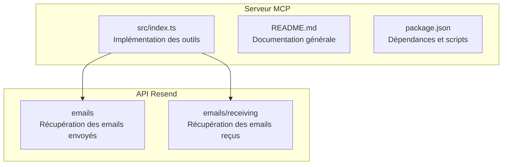
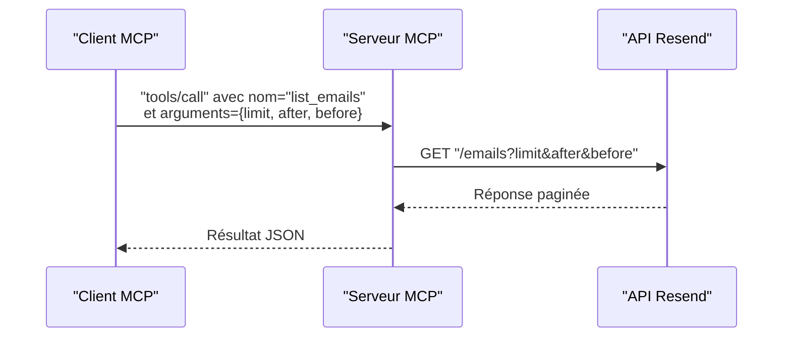
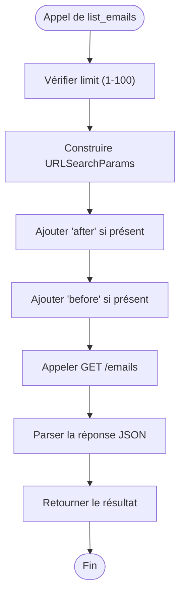
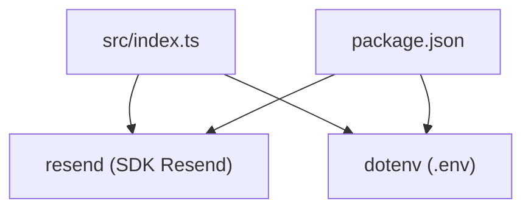

# Outil list_emails

<cite>
**Fichiers référencés dans ce document**
- [src/index.ts](file://src/index.ts)
- [README.md](file://README.md)
- [package.json](file://package.json)
</cite>

## Sommaire
1. [Introduction](#introduction)
2. [Structure du projet](#structure-du-projet)
3. [Composants principaux](#composants-principaux)
4. [Aperçu de l’architecture](#aperçu-de-larchitecture)
5. [Analyse détaillée des composants](#analyse-détaillée-des-composants)
6. [Analyse des dépendances](#analyse-des-dépendances)
7. [Considérations de performance](#considérations-de-performance)
8. [Guide de dépannage](#guide-de-dépannage)
9. [Conclusion](#conclusion)

## Introduction
Cet outil permet de récupérer la liste des emails envoyés via l’API Resend, avec un support complet de la pagination avancée. Il expose trois paramètres de pagination : limit (1 à 100), after (curseur pour la pagination avant), et before (curseur pour la pagination après). Le serveur MCP implémente cette fonctionnalité en tant qu’outil list_emails, qui appelle directement l’API Resend pour obtenir les résultats paginés.

## Structure du projet
Le projet est un serveur Model Context Protocol (MCP) qui expose 70+ outils couvrant l’ensemble de l’API Resend. L’outil list_emails fait partie de la section “Emails” comprenant 8 outils.

**Diagramme sources**
- [src/index.ts](file://src/index.ts#L1017-L1032)
- [README.md](file://README.md#L15-L23)

**Section sources**
- [src/index.ts](file://src/index.ts#L1017-L1032)
- [README.md](file://README.md#L15-L23)

## Composants principaux
- Définition de l’outil list_emails : nom, description, schéma d’entrée incluant limit, after, before.
- Implémentation de l’appel API : construction des paramètres de requête, appel à l’API Resend, retour au format JSON.

**Section sources**
- [src/index.ts](file://src/index.ts#L127-L138)
- [src/index.ts](file://src/index.ts#L1025-L1032)

## Aperçu de l’architecture
L’outil list_emails est exécuté comme un outil MCP. Lors de l’appel, le serveur construit une requête HTTP vers l’API Resend avec les paramètres de pagination fournis.

**Diagramme sources**
- [src/index.ts](file://src/index.ts#L1017-L1032)

## Analyse détaillée des composants

### Définition de l’outil list_emails
- Nom : list_emails
- Description : Récupère la liste des emails envoyés avec support de la pagination.
- Schéma d’entrée :
  - limit : nombre d’éléments à retourner (entier entre 1 et 100)
  - after : curseur pour la pagination avant
  - before : curseur pour la pagination après

**Section sources**
- [src/index.ts](file://src/index.ts#L127-L138)

### Implémentation de l’appel API
- Construction des paramètres de requête via URLSearchParams.
- Appel HTTP GET à l’URL de l’API Resend pour les emails envoyés.
- Retour de la réponse au format JSON.

**Diagramme sources**
- [src/index.ts](file://src/index.ts#L1025-L1032)

**Section sources**
- [src/index.ts](file://src/index.ts#L1025-L1032)

### Paramètres de pagination
- limit : nombre d’enregistrements à récupérer (1 à 100). Utilisé pour contrôler la taille de page.
- after : curseur indiquant le point de départ pour la pagination avant (ordre croissant).
- before : curseur indiquant la limite pour la pagination après (ordre décroissant).

**Section sources**
- [src/index.ts](file://src/index.ts#L133-L135)

### Exemples d’utilisation

#### Pagination descendante (par défaut)
- Utiliser limit pour définir la taille de page.
- Ne pas fournir after ni before pour obtenir les plus récents.
- Exemple de requête : limit=50

**Section sources**
- [src/index.ts](file://src/index.ts#L1025-L1032)

#### Pagination ascendante
- Utiliser before pour définir la borne supérieure de la pagination.
- Utiliser limit pour limiter le nombre de résultats.
- Exemple de requête : before=<curseur>, limit=50

**Section sources**
- [src/index.ts](file://src/index.ts#L1025-L1032)

#### Recherche paginée
- Utiliser after pour obtenir les résultats suivants dans l’ordre chronologique.
- Utiliser before pour obtenir les résultats précédents.
- Exemple de requête : after=<curseur>, limit=25

**Section sources**
- [src/index.ts](file://src/index.ts#L1025-L1032)

#### Intégration avec des interfaces utilisateur
- Affichage de la liste des emails dans un tableau.
- Boutons “Suivant” et “Précédent” basés sur les curseurs after/before.
- Gestion de la taille de page via limit.

[Ce paragraphe est conceptuel et ne référence pas de fichiers spécifiques]

### Champs retournés pour chaque email
- Les résultats sont au format JSON renvoyé directement par l’API Resend. Pour connaître les champs exacts, reportez-vous à la documentation officielle de l’API Resend.

**Section sources**
- [src/index.ts](file://src/index.ts#L1031)

### Performances de requête
- Le serveur MCP effectue des appels HTTP directs à l’API Resend.
- La gestion des limites de taux est gérée par l’API Resend elle-même.
- Pour de grands volumes d’emails, privilégiez des tailles de page raisonnables (ex. 50) et utilisez les curseurs after/before pour itérer efficacement.

**Section sources**
- [README.md](file://README.md#L518-L526)

### Bonnes pratiques pour gérer de grands volumes d’emails
- Limitez la taille de page (limit) à une valeur raisonnable (par exemple 50).
- Utilisez after/before pour itérer progressivement plutôt que de charger tout d’un coup.
- Respectez les limites de taux de l’API Resend.
- Mettez en place un mécanisme de mise en cache local si nécessaire pour éviter des appels redondants.

**Section sources**
- [README.md](file://README.md#L518-L526)

## Analyse des dépendances
- Dépendance principale : bibliothèque Resend pour l’authentification et les appels API.
- Utilisation de dotenv pour gérer les variables d’environnement.
- Scripts de build et démarrage via TypeScript/Node.js.

**Diagramme sources**
- [package.json](file://package.json#L32-L34)
- [src/index.ts](file://src/index.ts#L1-L7)

**Section sources**
- [package.json](file://package.json#L32-L34)
- [src/index.ts](file://src/index.ts#L1-L7)

## Considérations de performance
- La pagination avancée permet de traiter de grandes quantités de données sans surcharger la mémoire.
- Utiliser des curseurs after/before permet de naviguer efficacement dans l’historique des emails.
- En cas de volume très élevé, envisager un traitement par lots et un stockage temporaire des curseurs.

[Ce paragraphe est conceptuel et ne référence pas de fichiers spécifiques]

## Guide de dépannage
- Erreur d’authentification : vérifiez que la variable d’environnement RESEND_API_KEY est bien définie.
- Paramètres invalides : assurez-vous que limit est compris entre 1 et 100.
- Erreurs réseau : vérifiez la connectivité et les politiques de pare-feu.

**Section sources**
- [README.md](file://README.md#L553-L568)
- [src/index.ts](file://src/index.ts#L1571-L1577)

## Conclusion
L’outil list_emails du serveur MCP Resend offre une manière fiable de récupérer les emails envoyés avec une pagination avancée. Grâce aux paramètres limit, after et before, il est possible de naviguer de manière efficace dans de grands volumes d’emails, tout en respectant les limites de l’API Resend. Pour une utilisation optimale, combinez des tailles de page raisonnables avec l’utilisation des curseurs pour itérer progressivement.