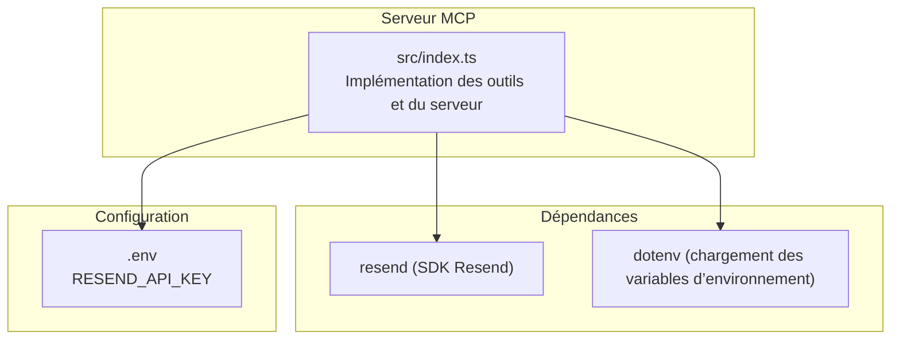
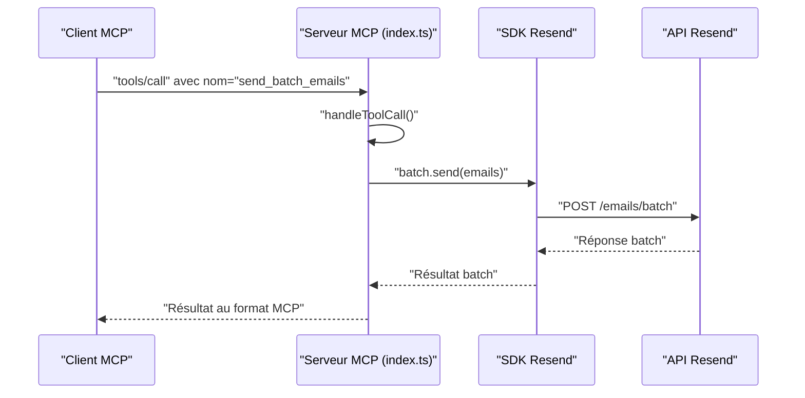
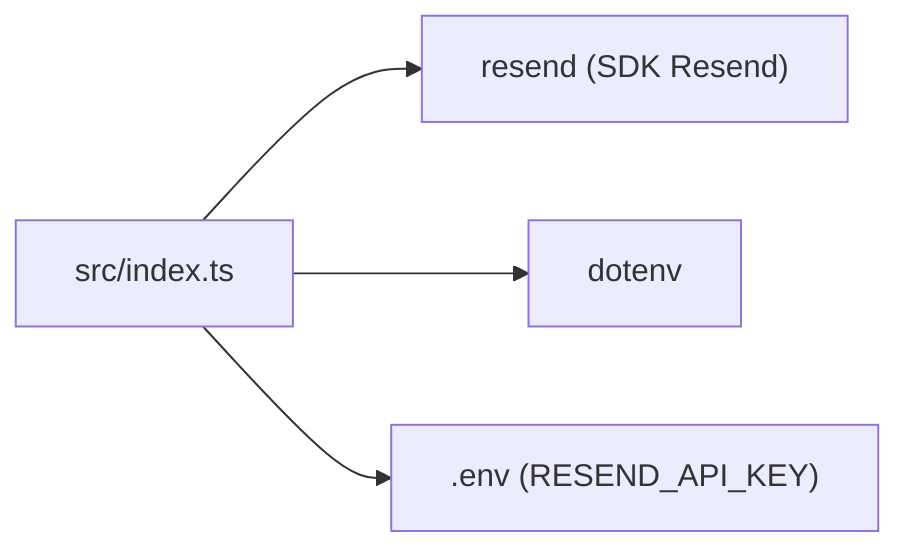

# Outil send_batch_emails

<cite>
**Fichiers référencés dans ce document**
- [README.md](file://README.md)
- [package.json](file://package.json)
- [src/index.ts](file://src/index.ts)
</cite>

## Sommaire
1. [Introduction](#introduction)
2. [Structure du projet](#structure-du-projet)
3. [Composants principaux](#composants-principaux)
4. [Aperçu de l’architecture](#aperçu-de-l’architecture)
5. [Analyse détaillée des composants](#analyse-détaillée-des-composants)
6. [Analyse des dépendances](#analyse-des-dépendances)
7. [Considérations sur les performances](#considérations-sur-les-performances)
8. [Guide de dépannage](#guide-de-dépannage)
9. [Conclusion](#conclusion)
10. [Annexes](#annexes)

## Introduction
Cet outil permet d’envoyer jusqu’à 100 e-mails simultanément via l’API Resend, en utilisant le MCP (Model Context Protocol). Le serveur expose un ensemble complet d’outils Resend, dont l’outil send_batch_emails, qui encapsule l’envoi par lot à travers le SDK Resend. Ce document explique la structure de l’objet email dans le tableau, les contraintes de validation, la gestion des erreurs partielles, les performances attendues, ainsi que des exemples d’utilisation pour des scénarios courants.

## Structure du projet
Le projet est un serveur MCP qui expose toutes les fonctionnalités de l’API Resend. L’outil send_batch_emails fait partie de la liste des outils de la catégorie Emails.

**Diagramme sources**
- [src/index.ts](file://src/index.ts#L1-L10)
- [package.json](file://package.json#L32-L34)

**Section sources**
- [README.md](file://README.md#L1-L10)
- [package.json](file://package.json#L1-L49)
- [src/index.ts](file://src/index.ts#L1-L10)

## Composants principaux
- Outil send_batch_emails : Envoie un tableau d’e-mails (jusqu’à 100) en un seul appel.
- Gestion des outils : Définitions des outils, schémas d’entrée, et implémentation des appels.
- Serveur MCP : Réception des requêtes, exécution des outils, réponse au format MCP.

**Section sources**
- [src/index.ts](file://src/index.ts#L1022-L1024)

## Aperçu de l’architecture
Le serveur MCP reçoit des appels d’outils, identifie l’outil demandé, puis appelle la méthode correspondante. Pour send_batch_emails, l’appel est effectué via le SDK Resend.

**Diagramme sources**
- [src/index.ts](file://src/index.ts#L1019-L1024)

## Analyse détaillée des composants

### Schéma d’entrée de send_batch_emails
- Nom de l’outil : send_batch_emails
- Description : Envoie jusqu’à 100 e-mails en un seul appel.
- Entrées attendues :
  - emails : tableau d’objets email
    - Chaque objet email contient :
      - from : chaîne de caractères
      - to : tableau de chaînes de caractères
      - subject : chaîne de caractères
      - html : chaîne de caractères (optionnel)
      - text : chaîne de caractères (optionnel)
    - Champs requis pour chaque email : from, to, subject

**Section sources**
- [src/index.ts](file://src/index.ts#L103-L126)

### Implémentation technique
- L’appel de l’outil est géré dans handleToolCall().
- Pour send_batch_emails, l’implémentation appelle directement resend.batch.send(args.emails).

**Section sources**
- [src/index.ts](file://src/index.ts#L1019-L1024)

### Gestion des erreurs
- Le serveur encapsule les appels dans un try/catch.
- En cas d’erreur, il renvoie un objet contenant le message d’erreur, le nom de l’outil, et les arguments fournis.
- Les erreurs de validation ou d’exécution sont remontées sous forme de message d’erreur structuré.

**Section sources**
- [src/index.ts](file://src/index.ts#L1519-L1522)
- [src/index.ts](file://src/index.ts#L1552-L1563)

### Exemples d’utilisation
Voici des scénarios courants illustrés dans la documentation du projet :

- Envoi de bienvenue à plusieurs nouveaux utilisateurs via un batch
- Envoi de newsletters hebdomadaires à un groupe de destinataires
- Envoi d’alertes système à plusieurs administrateurs
- Envoi de campagnes marketing ciblées

Ces exemples montrent l’utilisation de l’outil send_batch_emails pour envoyer plusieurs e-mails en un seul appel.

**Section sources**
- [README.md](file://README.md#L296-L330)

### Bonnes pratiques pour les envois groupés
- Limiter à 100 e-mails par batch (limite de l’API Resend).
- Valider les données avant l’envoi (adresse email valide, sujet non vide, contenu conforme).
- Utiliser des tags ou des en-têtes personnalisés pour tracer les envois.
- Configurer des webhooks pour recevoir les événements (livraison, clics, ouverture, etc.).

**Section sources**
- [README.md](file://README.md#L89-L98)
- [README.md](file://README.md#L119-L126)

### Gestion des échecs partiels
- L’API Resend peut accepter un batch même si certains e-mails échouent.
- Le serveur MCP renvoie un résultat structuré contenant les erreurs pour les e-mails invalides.
- Pour gérer les échecs, il est recommandé de :
  - Vérifier les codes d’erreur retournés
  - Réessayer les e-mails ayant échoué
  - Mettre à jour l’état des destinataires (par exemple, désabonnement si nécessaire)

**Section sources**
- [README.md](file://README.md#L528-L550)

## Analyse des dépendances
- Dépendance principale : SDK Resend pour l’envoi d’e-mails.
- Utilisation de dotenv pour charger la clé API depuis le fichier .env.
- Le serveur MCP est construit avec TypeScript et exécuté via Node.js.

**Diagramme sources**
- [src/index.ts](file://src/index.ts#L1-L10)
- [package.json](file://package.json#L32-L34)

**Section sources**
- [package.json](file://package.json#L32-L34)
- [src/index.ts](file://src/index.ts#L1-L10)

## Considérations sur les performances
- La limite de l’API Resend est de 100 e-mails par batch.
- Le serveur MCP respecte les limites de taux de l’API Resend (par défaut 2 requêtes/seconde).
- Pour des volumes élevés, diviser les envois en plusieurs batches et respecter les limites de taux.

**Section sources**
- [README.md](file://README.md#L518-L527)

## Guide de dépannage
- Erreur : Clé API manquante
  - Cause : Variable d’environnement RESEND_API_KEY non définie.
  - Solution : Créer un fichier .env avec la clé API Resend.
- Erreur : Outil inconnu
  - Cause : Nom d’outil incorrect.
  - Solution : Utiliser tools/list pour obtenir la liste des outils disponibles.
- Erreur : Paramètres invalides
  - Cause : Données manquantes ou incorrectes (ex. champ requis manquant).
  - Solution : Vérifier le schéma d’entrée de l’outil.

**Section sources**
- [README.md](file://README.md#L551-L573)
- [src/index.ts](file://src/index.ts#L1571-L1577)

## Conclusion
L’outil send_batch_emails permet d’envoyer jusqu’à 100 e-mails en un seul appel, en s’appuyant sur le SDK Resend. Grâce à la structure de schéma d’entrée claire, la gestion centralisée des erreurs et le respect des limites de l’API Resend, il est adapté aux scénarios de newsletter, d’alertes et de campagnes marketing. Pour des volumes importants, il est conseillé de découper les envois en plusieurs batches et de surveiller les événements via des webhooks.

## Annexes

### Références de schéma d’entrée de send_batch_emails
- Nom de l’outil : send_batch_emails
- Entrées attendues : tableau d’objets email
  - from : chaîne de caractères (requis)
  - to : tableau de chaînes de caractères (requis)
  - subject : chaîne de caractères (requis)
  - html : chaîne de caractères (optionnel)
  - text : chaîne de caractères (optionnel)

**Section sources**
- [src/index.ts](file://src/index.ts#L103-L126)