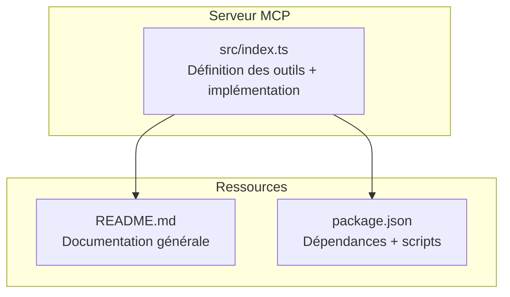
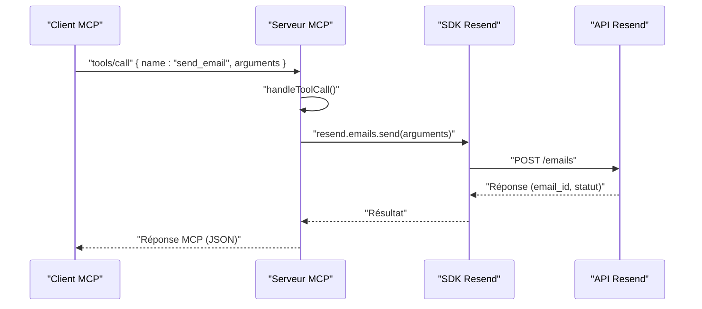
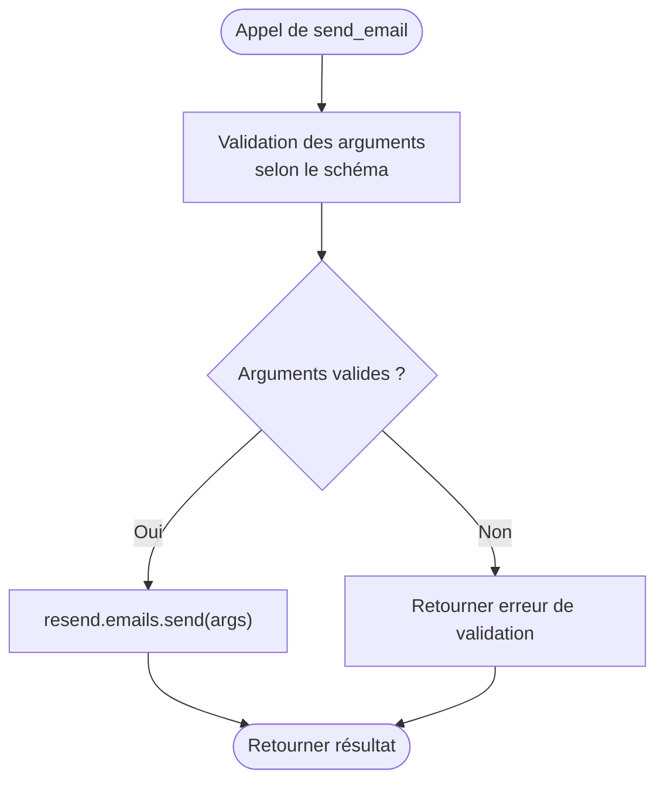
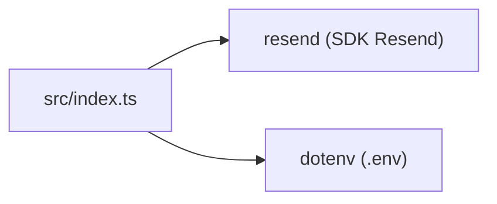

# Outil send_email

<cite>
**Fichiers référencés dans ce document**
- [src/index.ts](file://src/index.ts)
- [README.md](file://README.md)
- [package.json](file://package.json)
</cite>

## Sommaire
1. [Introduction](#introduction)
2. [Structure du projet](#structure-du-projet)
3. [Composants principaux](#composants-principaux)
4. [Aperçu de l’architecture](#aperçu-de-larchitecture)
5. [Analyse détaillée des composants](#analyse-détaillée-des-composants)
6. [Analyse des dépendances](#analyse-des-dépendances)
7. [Considérations sur les performances](#considérations-sur-les-performances)
8. [Guide de dépannage](#guide-de-dépannage)
9. [Conclusion](#conclusion)

## Introduction
Cet outil permet d’envoyer des emails uniques via l’API Resend à travers le protocole Model Context Protocol (MCP). Il prend en charge l’envoi d’un email avec contenu HTML et texte, la gestion de destinataires multiples (BCC, CC, jusqu’à 50 destinataires), l’ajout de pièces jointes (base64 ou fichiers locaux), la planification de l’envoi via scheduled_at, l’ajout de tags personnalisés, l’ajout de headers personnalisés, ainsi que la gestion de reply_to. Ce document explique comment utiliser l’outil send_email, ses contraintes, ses erreurs fréquentes, et propose des scénarios concrets d’appel.

## Structure du projet
Le projet est un serveur MCP qui expose l’ensemble de l’API Resend sous forme d’outils invocables. Le cœur de l’implémentation se trouve dans le fichier principal, qui définit les outils, leurs schémas d’entrée, et leur implémentation.

**Diagramme sources**
- [src/index.ts](file://src/index.ts#L1-L120)
- [README.md](file://README.md#L1-L120)
- [package.json](file://package.json#L1-L49)

**Section sources**
- [src/index.ts](file://src/index.ts#L1-L120)
- [README.md](file://README.md#L1-L120)
- [package.json](file://package.json#L1-L49)

## Composants principaux
- Définition de l’outil send_email : schéma d’entrée complet, champs requis, contraintes de validation.
- Implémentation de l’appel à l’API Resend via le SDK Node.
- Gestion des erreurs et des réponses via le protocole MCP.

**Section sources**
- [src/index.ts](file://src/index.ts#L42-L101)
- [src/index.ts](file://src/index.ts#L1019-L1021)

## Aperçu de l’architecture
Le serveur MCP reçoit des requêtes de type tools/list et tools/call. Pour l’outil send_email, il appelle directement la méthode emails.send du SDK Resend, en transmettant les arguments fournis par l’utilisateur.

**Diagramme sources**
- [src/index.ts](file://src/index.ts#L1019-L1021)
- [src/index.ts](file://src/index.ts#L1008-L1522)

## Analyse détaillée des composants

### Schéma d’entrée de l’outil send_email
L’outil send_email est décrit par un schéma d’entrée JSON qui précise tous les champs disponibles, leurs types, et les champs obligatoires.

- Champs obligatoires : from, to, subject
- Champs optionnels :
  - html : contenu HTML
  - text : contenu texte brut
  - bcc : tableau d’adresses
  - cc : tableau d’adresses
  - reply_to : tableau d’adresses
  - scheduled_at : date/heure au format ISO 8601
  - attachments : tableau d’objets contenant filename, content (base64), path, content_type
  - tags : tableau d’objets { name, value }
  - headers : objet de paires clé/valeur pour headers personnalisés

Contraintes de validation :
- Le tableau to peut contenir jusqu’à 50 adresses.
- Les tableaux bcc et cc peuvent être utilisés en complément de to.
- attachments peut inclure soit content (base64), soit path (fichier local), mais pas les deux en même temps selon les besoins de l’API Resend.

**Section sources**
- [src/index.ts](file://src/index.ts#L42-L101)

### Implémentation de l’outil send_email
L’exécution de l’outil se fait via un appel direct à resend.emails.send(args). Le serveur MCP ne modifie pas les données, il transmet simplement les arguments fournis par l’utilisateur.

**Diagramme sources**
- [src/index.ts](file://src/index.ts#L1019-L1021)
- [src/index.ts](file://src/index.ts#L1008-L1522)

**Section sources**
- [src/index.ts](file://src/index.ts#L1019-L1021)
- [src/index.ts](file://src/index.ts#L1008-L1522)

### Exemples concrets d’appels

Voici des scénarios concrets illustrant l’utilisation de l’outil send_email. Pour chaque exemple, indiquez le nom de l’outil, les arguments attendus, et les éléments clés de la configuration.

- Envoi simple (HTML + texte)
  - Nom de l’outil : send_email
  - Arguments essentiels : from, to (tableau de 1 adresse), subject
  - Contenu : html et/ou text
  - Exemple de structure : voir [Exemple d’envoi simple](file://README.md#L270-L294)

- Envoi avec pièces jointes (base64)
  - Ajouter attachments : tableau d’objets avec filename, content (base64), content_type
  - Exemple de structure : voir [Exemple d’envoi avec pièces jointes](file://README.md#L270-L294)

- Envoi planifié
  - Ajouter scheduled_at au format ISO 8601
  - Exemple de structure : voir [Exemple d’envoi planifié](file://README.md#L270-L294)

- Envoi avec plusieurs destinataires
  - to : tableau de 1 à 50 adresses
  - Optionnel : cc, bcc
  - Exemple de structure : voir [Exemple d’envoi avec plusieurs destinataires](file://README.md#L270-L294)

- Envoi avec headers personnalisés
  - Ajouter headers : objet de paires clé/valeur
  - Exemple de structure : voir [Exemple d’envoi avec headers](file://README.md#L270-L294)

- Envoi avec reply_to
  - Ajouter reply_to : tableau d’adresses
  - Exemple de structure : voir [Exemple d’envoi avec reply_to](file://README.md#L270-L294)

Remarque : Pour éviter de copier du contenu, reportez-vous aux liens ci-dessus pour les exemples complets.

**Section sources**
- [README.md](file://README.md#L270-L294)

### Contraintes de validation
- Champs requis : from, to, subject
- Limite de destinataires : to peut contenir jusqu’à 50 adresses
- Format de planification : scheduled_at doit être au format ISO 8601
- Pièces jointes : choisir entre content (base64) et path (fichier local) selon les attentes de l’API Resend

**Section sources**
- [src/index.ts](file://src/index.ts#L42-L101)

### Erreurs courantes et bonnes pratiques
- Erreurs fréquentes
  - Erreur d’authentification : clé API manquante ou invalide
  - Erreur de validation : paramètres manquants ou incorrects
  - Erreur de taux limite : dépassement de la limite de requêtes
  - Erreur de ressource : ressource inexistante ou conflit

- Bonnes pratiques
  - Utiliser des headers personnalisés avec prudence et conformément aux normes
  - Limiter le nombre de destinataires à 50 pour to
  - Planifier les envois via scheduled_at si nécessaire
  - Utiliser reply_to pour gérer les réponses
  - Ne pas stocker de données sensibles dans le serveur MCP

**Section sources**
- [README.md](file://README.md#L528-L568)

## Analyse des dépendances
Le projet dépend du SDK Resend pour effectuer les appels API, et de dotenv pour charger les variables d’environnement.

**Diagramme sources**
- [src/index.ts](file://src/index.ts#L1-L7)
- [package.json](file://package.json#L32-L35)

**Section sources**
- [src/index.ts](file://src/index.ts#L1-L7)
- [package.json](file://package.json#L32-L35)

## Considérations sur les performances
- Le serveur MCP respecte les limites de taux imposées par Resend (par défaut 2 requêtes/seconde).
- Pour des envois massifs, privilégier l’outil send_batch_emails plutôt que plusieurs appels successifs à send_email.

[Ce paragraphe fournit des conseils généraux sans analyse de fichiers spécifiques]

## Guide de dépannage
- Problème : la clé API n’est pas définie
  - Vérifier que la variable RESEND_API_KEY est présente dans le fichier .env
  - Voir [Configuration](file://README.md#L180-L210)

- Problème : erreur “Tool execution failed”
  - Vérifier les paramètres fournis
  - Vérifier la limite de taux
  - Voir [Erreurs courantes](file://README.md#L528-L568)

- Problème : outil inconnu
  - Utiliser tools/list pour vérifier la liste des outils disponibles
  - Voir [Liste des outils](file://README.md#L435-L444)

**Section sources**
- [README.md](file://README.md#L528-L568)
- [README.md](file://README.md#L180-L210)

## Conclusion
L’outil send_email du serveur MCP offre une interface complète pour envoyer des emails via l’API Resend, avec prise en charge de HTML/text, de destinataires multiples, de pièces jointes, de planification, de tags, de headers personnalisés, et de reply_to. Respectez les contraintes de validation, les bonnes pratiques de sécurité, et utilisez les outils complémentaires pour gérer les campagnes, les audiences, et les webhooks.