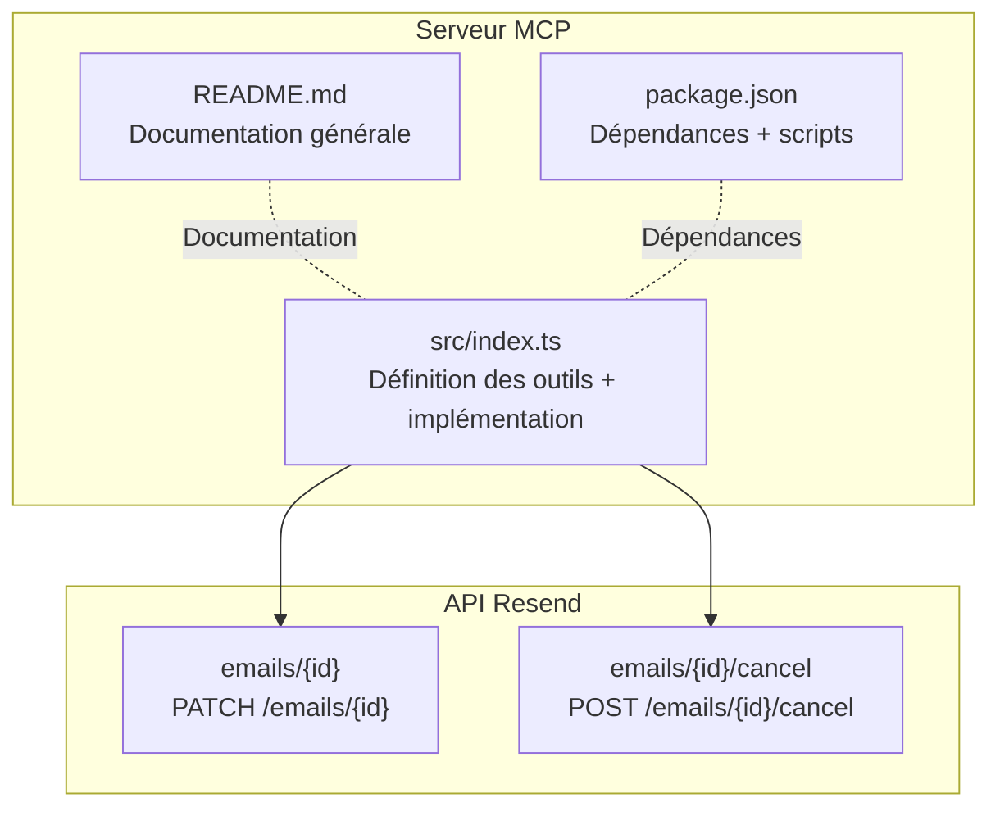
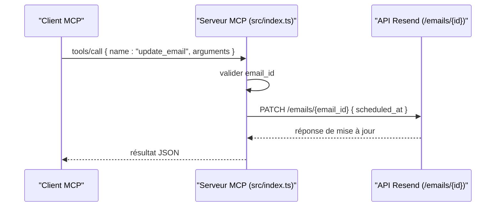

# Outil update_email

<cite>
**Fichiers référencés dans ce document**
- [README.md](file://README.md)
- [src/index.ts](file://src/index.ts)
- [package.json](file://package.json)
</cite>

## Sommaire
1. [Introduction](#introduction)
2. [Structure du projet](#structure-du-projet)
3. [Composants principaux](#composants-principaux)
4. [Aperçu de l’architecture](#aperçu-de-larchitecture)
5. [Analyse détaillée des composants](#analyse-détaillée-des-composants)
6. [Analyse des dépendances](#analyse-des-dépendances)
7. [Considérations sur les performances](#considérations-sur-les-performances)
8. [Guide de dépannage](#guide-de-dépannage)
9. [Conclusion](#conclusion)

## Introduction
Cet outil permet de modifier un email planifié (rescheduling) ou de mettre à jour ses propriétés avant qu’il ne soit envoyé. Il s’agit de l’outil update_email de l’API Resend exposé via le Model Context Protocol (MCP). Ce document explique comment utiliser cet outil, les contraintes liées au champ scheduled_at, les limitations temporelles, et les effets sur les destinataires.

## Structure du projet
Le projet est un serveur MCP qui expose l’intégralité de l’API Resend sous forme d’outils invocables. Le cœur de l’implémentation se trouve dans le fichier principal, qui définit les outils, leurs schémas d’entrée, et leur implémentation.

**Diagramme sources**
- [src/index.ts](file://src/index.ts#L1039-L1046)
- [src/index.ts](file://src/index.ts#L1048-L1054)
- [README.md](file://README.md#L15-L23)

**Section sources**
- [README.md](file://README.md#L1-L120)
- [package.json](file://package.json#L1-L49)

## Composants principaux
- Outil update_email : Permet de repogrammer un email planifié en modifiant le champ scheduled_at.
- Implémentation interne : Utilise un appel PATCH vers l’API Resend pour mettre à jour le champ scheduled_at d’un email identifié par son email_id.

**Section sources**
- [src/index.ts](file://src/index.ts#L150-L161)
- [src/index.ts](file://src/index.ts#L1039-L1046)

## Aperçu de l’architecture
L’outil update_email est implémenté comme suit :
- Définition de l’outil avec son schéma d’entrée (email_id, scheduled_at).
- Implémentation de la méthode handleToolCall qui effectue un PATCH sur l’endpoint /emails/{id} avec le champ scheduled_at fourni.

**Diagramme sources**
- [src/index.ts](file://src/index.ts#L1039-L1046)
- [src/index.ts](file://src/index.ts#L1536-L1564)

## Analyse détaillée des composants

### Schéma d’entrée de l’outil update_email
- email_id : Identifiant de l'email à modifier (obligatoire).
- scheduled_at : Nouvelle date et heure de planification au format ISO 8601 (optionnel). Si omis, seul l’email_id est requis.

**Section sources**
- [src/index.ts](file://src/index.ts#L150-L161)

### Implémentation technique
- Méthode : PATCH
- Endpoint cible : /emails/{email_id}
- Corps de requête : { scheduled_at }
- Gestion des erreurs : En cas d’échec, le serveur renvoie un message d’erreur contenant le nom de l’outil et ses arguments.

**Section sources**
- [src/index.ts](file://src/index.ts#L1039-L1046)
- [src/index.ts](file://src/index.ts#L1516-L1522)

### Contraintes et limitations
- Champ scheduled_at : Doit être au format ISO 8601. La valeur indique la nouvelle date de planification. Si l’email n’est pas planifié, le champ peut être utilisé pour le planifier.
- L’outil ne prend en compte que le champ scheduled_at. Toute autre modification de contenu (sujet, corps, destinataires) n’est pas prise en charge par cet outil.
- L’outil ne peut pas annuler un email planifié ; pour cela, utilisez l’outil cancel_email.

**Section sources**
- [src/index.ts](file://src/index.ts#L150-L161)
- [src/index.ts](file://src/index.ts#L1039-L1046)

### Effets sur les destinataires
- Reprogrammation : Si l’email était déjà planifié, sa nouvelle date d’envoi sera mise à jour. Les destinataires recevront l’email à la nouvelle date spécifiée.
- Aucune modification de contenu : L’outil ne modifie pas le sujet, le texte, le HTML, ni les destinataires. Seul scheduled_at change.

**Section sources**
- [src/index.ts](file://src/index.ts#L150-L161)

### Exemples d’utilisation

#### Reporter un email planifié
- Objectif : Modifier la date de planification d’un email.
- Étapes :
  1. Identifier l’email_id de l’email planifié.
  2. Spécifier le nouveau scheduled_at au format ISO 8601.
  3. Appeler l’outil update_email.

Résultat attendu : L’email est repogamé à la nouvelle date. Aucun changement de contenu n’est effectué.

**Section sources**
- [src/index.ts](file://src/index.ts#L150-L161)
- [src/index.ts](file://src/index.ts#L1039-L1046)

#### Modifier l’horaire d’un email planifié
- Objectif : Déplacer l’envoi d’un email à une heure différente le même jour.
- Étapes :
  1. Obtenir l’email_id de l’email planifié.
  2. Définir scheduled_at avec la nouvelle heure (toujours au format ISO 8601).
  3. Appeler l’outil update_email.

Résultat : L’email est repogamé à la nouvelle heure. Les destinataires reçoivent l’email à cette heure-là.

**Section sources**
- [src/index.ts](file://src/index.ts#L150-L161)
- [src/index.ts](file://src/index.ts#L1039-L1046)

#### Gérer les mises à jour de contenu planifiées
- Objectif : Mettre à jour le contenu d’un email planifié.
- Méthode recommandée : Utiliser l’outil update_email pour repogrammer, puis envoyer un nouvel email avec le contenu mis à jour. L’outil update_email ne permet pas de modifier le contenu de l’email.
- Alternative : Si vous avez besoin de modifier le contenu, créez un nouvel email planifié avec le nouveau contenu et annulez l’ancien si nécessaire.

**Section sources**
- [src/index.ts](file://src/index.ts#L150-L161)
- [src/index.ts](file://src/index.ts#L1039-L1046)
- [src/index.ts](file://src/index.ts#L1048-L1054)

## Analyse des dépendances
- Dépendance principale : Package Resend (SDK Node.js) pour l’authentification et la gestion des appels API.
- Autres dépendances : dotenv pour la gestion des variables d’environnement.
- Scripts : build, start, dev, postinstall.

**Section sources**
- [package.json](file://package.json#L32-L40)
- [package.json](file://package.json#L10-L14)

## Considérations sur les performances
- Le serveur MCP traite chaque appel de manière synchrone via stdin/stdout.
- Aucune logique de mise en cache n’est implémentée dans le code actuel.
- Pour des volumes élevés de mises à jour de planification, envisager de regrouper les appels ou d’ajouter des mécanismes de backoff en amont.

[Ce paragraphe fournit des conseils généraux sans analyser des fichiers spécifiques]

## Guide de dépannage
- Erreur d’authentification : Vérifiez que la variable d’environnement RESEND_API_KEY est définie.
- Paramètres manquants : L’outil nécessite email_id. Assurez-vous qu’il est fourni.
- Erreurs réseau : Le serveur renvoie un message d’erreur détaillé contenant le nom de l’outil et ses arguments.

**Section sources**
- [src/index.ts](file://src/index.ts#L1571-L1577)
- [src/index.ts](file://src/index.ts#L1552-L1563)

## Conclusion
L’outil update_email permet de repogrammer un email planifié en modifiant simplement le champ scheduled_at. Il ne permet pas de modifier le contenu de l’email ni de l’annuler ; pour ces opérations, utilisez les outils dédiés. Respectez le format ISO 8601 pour scheduled_at et veillez à fournir l’email_id correct.