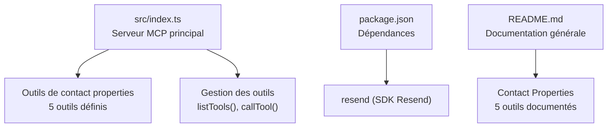
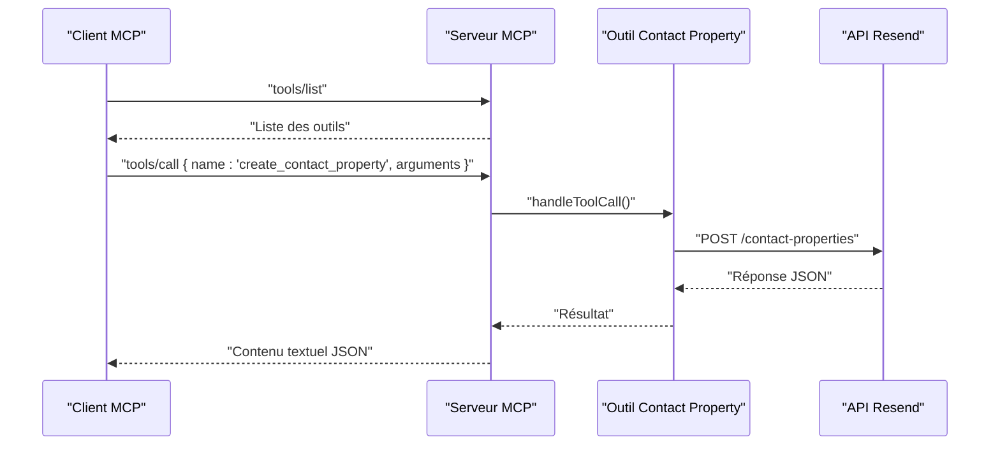
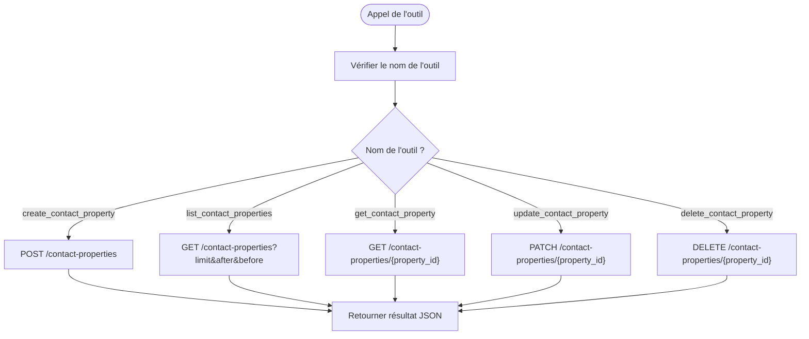
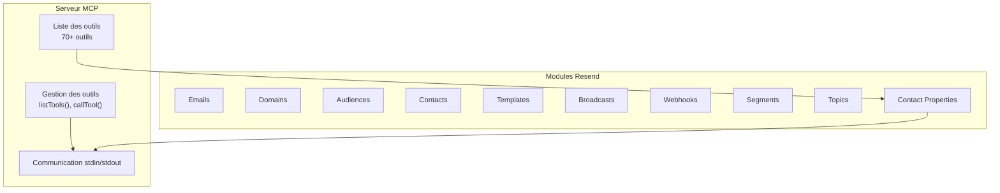
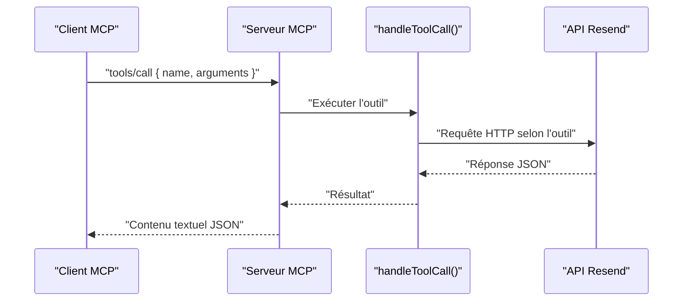

# Module Propriétés de Contact

<cite>
**Fichiers référencés dans ce document**
- [README.md](file://README.md)
- [package.json](file://package.json)
- [src/index.ts](file://src/index.ts)
</cite>

## Sommaire
1. [Introduction](#introduction)
2. [Structure du projet](#structure-du-projet)
3. [Composants principaux](#composants-principaux)
4. [Aperçu de l'architecture](#aperçu-de-larchitecture)
5. [Analyse détaillée des composants](#analyse-détaillée-des-composants)
6. [Analyse des dépendances](#analyse-des-dépendances)
7. [Considérations sur les performances](#considérations-sur-les-performances)
8. [Guide de dépannage](#guide-de-dépannage)
9. [Conclusion](#conclusion)

## Introduction
Ce document fournit une documentation complète du module Propriétés de Contact de l’API Resend, tel qu’exposé via le serveur Model Context Protocol (MCP) développé dans ce dépôt. Le module permet de gérer les propriétés personnalisées des contacts au sein des audiences, notamment la création, la liste, la consultation, la mise à jour et la suppression de ces propriétés. Ces données peuvent ensuite être utilisées pour personnaliser les campagnes d’emailing, notamment les diffusions (broadcasts) et les modèles.

Le serveur MCP expose 70+ outils couvrant l’ensemble de l’API Resend, dont le sous-module Contact Properties comprend 5 outils spécifiques à la gestion des propriétés de contact.

## Structure du projet
Le projet est un serveur MCP écrit en TypeScript qui expose des outils pour interagir avec l’API Resend. La structure principale est la suivante :
- src/index.ts : Implémentation principale du serveur MCP, incluant la définition des outils et leur exécution
- package.json : Dépendances et scripts du projet
- README.md : Documentation générale du projet

**Diagramme sources**
- [src/index.ts](file://src/index.ts#L941-L1002)
- [package.json](file://package.json#L32-L34)
- [README.md](file://README.md#L112-L118)

**Section sources**
- [README.md](file://README.md#L472-L491)
- [package.json](file://package.json#L1-L49)

## Composants principaux
Le module Contact Properties comprend 5 outils, chacun avec un schéma d’entrée défini pour valider les paramètres requis. Voici un aperçu des outils et leurs rôles respectifs :

- create_contact_property : Crée une nouvelle propriété personnalisée de contact
- list_contact_properties : Liste toutes les propriétés de contact
- get_contact_property : Récupère les détails d’une propriété spécifique
- update_contact_property : Met à jour le nom et/ou la description d’une propriété
- delete_contact_property : Supprime une propriété personnalisée

Chaque outil possède un schéma d’entrée JSON Schema qui décrit les champs attendus, leurs types et s’ils sont obligatoires.

**Section sources**
- [src/index.ts](file://src/index.ts#L941-L1002)

## Aperçu de l'architecture
Le serveur MCP implémente un protocole basé sur stdin/stdout pour recevoir les appels d’outils et renvoyer des réponses. L’architecture se compose de trois parties principales :
- Définition des outils : Une liste de 70+ outils, dont les 5 outils de Contact Properties
- Gestion des outils : Méthodes listTools() et callTool() pour lister et exécuter les outils
- Exécution des outils : Implémentation de la logique d’appel à l’API Resend ou à des endpoints spécifiques

**Diagramme sources**
- [src/index.ts](file://src/index.ts#L1532-L1565)
- [src/index.ts](file://src/index.ts#L1474-L1514)

## Analyse détaillée des composants

### Schémas d’entrée des outils de Contact Properties
Chacun des 5 outils de Contact Properties dispose d’un schéma d’entrée JSON Schema qui précise les champs attendus. Voici les caractéristiques générales de ces schémas :

- create_contact_property
  - Champs : name (chaîne), type (chaîne), description (optionnel)
  - Obligatoire : name, type
  - Types de données disponibles pour le champ type : string, number, boolean, date

- list_contact_properties
  - Champs : limit (nombre), after (chaîne), before (chaîne)
  - Obligatoire : aucun

- get_contact_property
  - Champs : property_id (chaîne)
  - Obligatoire : property_id

- update_contact_property
  - Champs : property_id (chaîne), name (optionnel), description (optionnel)
  - Obligatoire : property_id

- delete_contact_property
  - Champs : property_id (chaîne)
  - Obligatoire : property_id

Ces schémas garantissent que les appels d’outils sont validés avant exécution, ce qui améliore la robustesse de l’interaction.

**Section sources**
- [src/index.ts](file://src/index.ts#L941-L1002)

### Implémentation des appels API
Les outils de Contact Properties sont implémentés dans la fonction handleToolCall(). Pour chaque outil, le serveur effectue une requête HTTP vers l’API Resend avec les bons endpoints et méthodes HTTP. Voici comment cela se passe pour chaque outil :

- create_contact_property
  - Méthode : POST
  - Endpoint : /contact-properties
  - Corps : Arguments fournis par l’utilisateur

- list_contact_properties
  - Méthode : GET
  - Endpoint : /contact-properties
  - Paramètres de requête : limit, after, before

- get_contact_property
  - Méthode : GET
  - Endpoint : /contact-properties/{property_id}

- update_contact_property
  - Méthode : PATCH
  - Endpoint : /contact-properties/{property_id}
  - Corps : name, description (si fourni)

- delete_contact_property
  - Méthode : DELETE
  - Endpoint : /contact-properties/{property_id}

**Diagramme sources**
- [src/index.ts](file://src/index.ts#L1474-L1514)

**Section sources**
- [src/index.ts](file://src/index.ts#L1008-L1522)

### Bonnes pratiques pour structurer les données de contact
Voici des recommandations générales pour structurer les données de contact et les propriétés personnalisées, basées sur l’implémentation actuelle de l’outil create_contact_property :

- Choisissez un type approprié pour chaque propriété
  - Utilisez string pour les identifiants, noms, prénoms, villes, pays
  - Utilisez number pour les âges, montants, quantités
  - Utilisez boolean pour les préférences (ex : newsletter_subscribed)
  - Utilisez date pour les événements (ex : date_dernier_achat)

- Nommez les propriétés de manière claire et cohérente
  - Utilisez des noms en anglais
  - Évitez les espaces et caractères spéciaux
  - Soyez cohérent entre les audiences

- Documentez les propriétés
  - Ajoutez une description pour faciliter l’usage par d’autres développeurs
  - Indiquez les valeurs possibles si pertinent

- Évitez les conflits de nom
  - Ne dupliquez pas des noms de propriétés déjà existants
  - Utilisez des préfixes ou des namespaces si nécessaire

- Maintenez la cohérence des données
  - Vérifiez que les données saisies correspondent au type choisi
  - Nettoyez les données (suppression des espaces, normalisation)

Ces bonnes pratiques s’appliquent à l’ensemble du module Contact Properties et influencent directement la qualité des données utilisées dans les campagnes personnalisées.

**Section sources**
- [src/index.ts](file://src/index.ts#L941-L1002)

### Utilisation dans les campagnes personnalisées
Une fois les propriétés de contact créées, elles peuvent être utilisées pour personnaliser les contenus des diffusions (broadcasts) et des modèles. Par exemple, vous pouvez insérer dynamiquement des valeurs de propriété dans le contenu HTML ou le texte brut des emails. Cela permet de créer des expériences plus ciblées et pertinentes pour vos abonnés.

Pour cela, il est essentiel de :
- Créer des propriétés représentatives des segments d’intérêt
- Alimenter régulièrement les valeurs de ces propriétés
- Utiliser les balises de substitution appropriées dans les contenus

[Note : Cette section décrit l’utilisation conceptuelle des données de contact. Elle ne fait pas référence à des fichiers spécifiques.]

## Aperçu de l'architecture
Le serveur MCP est composé de plusieurs modules, dont le module Contact Properties. Voici un aperçu global de l’architecture du serveur :

**Diagramme sources**
- [README.md](file://README.md#L11-L126)
- [src/index.ts](file://src/index.ts#L1532-L1565)

**Section sources**
- [README.md](file://README.md#L11-L126)

## Analyse détaillée des composants

### Schéma de données pour create_contact_property
Le schéma d’entrée de l’outil create_contact_property précise les champs attendus et leurs contraintes. Voici les éléments clés :

- name : Chaîne de caractères, obligatoire
- type : Chaîne de caractères, obligatoire, parmi : string, number, boolean, date
- description : Chaîne de caractères, optionnelle

Ces contraintes garantissent que la propriété est bien définie dès sa création.

**Section sources**
- [src/index.ts](file://src/index.ts#L941-L1002)

### Implémentation de la gestion des outils
La méthode listTools() retourne la liste complète des outils, y compris les 5 outils de Contact Properties. La méthode callTool() gère l’exécution de chaque outil via handleToolCall(), qui effectue les appels HTTP vers l’API Resend.

**Diagramme sources**
- [src/index.ts](file://src/index.ts#L1532-L1565)
- [src/index.ts](file://src/index.ts#L1008-L1522)

**Section sources**
- [src/index.ts](file://src/index.ts#L1532-L1565)
- [src/index.ts](file://src/index.ts#L1008-L1522)

### Sécurité et validation
Le serveur MCP inclut des mécanismes de validation et de gestion des erreurs. Les erreurs sont capturées et renvoyées sous forme de réponse JSON avec un message d’erreur, le nom de l’outil et ses arguments. Cela permet de diagnostiquer rapidement les problèmes liés aux appels d’outils.

**Section sources**
- [src/index.ts](file://src/index.ts#L1516-L1522)

## Analyse des dépendances
Le projet dépend de deux bibliothèques principales :
- resend : SDK officiel Resend utilisé pour les opérations directement couvertes par le SDK
- dotenv : Permet de charger les variables d’environnement depuis un fichier .env

Le package.json indique également les versions minimales de Node.js et les scripts de développement.

**Section sources**
- [package.json](file://package.json#L32-L43)

## Considérations sur les performances
- Le serveur MCP gère les appels d’outils de manière synchrone via stdin/stdout. Pour des volumes élevés de requêtes, envisagez de mettre en place des mécanismes de mise en cache ou de traitement par lots.
- Respectez les limites de taux imposées par l’API Resend pour éviter les erreurs 429 Too Many Requests.
- Lors de l’utilisation de list_contact_properties, utilisez les paramètres limit, after et before pour itérer de manière paginée.

[Note : Cette section fournit des conseils généraux. Elle ne fait pas référence à des fichiers spécifiques.]

## Guide de dépannage
Voici quelques cas courants et leurs solutions :

- Erreur : "RESEND_API_KEY environment variable is not set"
  - Solution : Créez un fichier .env avec votre clé API Resend et redémarrez le serveur.

- Erreur : "Unknown tool"
  - Solution : Utilisez l’outil tools/list pour obtenir la liste complète des outils disponibles.

- Erreur : "Tool execution failed"
  - Causes possibles : clé API invalide, paramètres manquants, dépassement de limite de taux, problèmes réseau
  - Solution : Vérifiez le message d’erreur détaillé et les paramètres transmis.

**Section sources**
- [src/index.ts](file://src/index.ts#L1571-L1577)
- [README.md](file://README.md#L551-L573)

## Conclusion
Le module Propriétés de Contact de l’API Resend, exposé via le serveur MCP, offre un ensemble complet d’outils pour gérer les propriétés personnalisées des contacts. Grâce à des schémas d’entrée stricts, à une implémentation robuste des appels API et à des bonnes pratiques de structuration des données, il permet de construire des campagnes d’emailing hautement personnalisées. En respectant les limites de taux et en maintenant des données cohérentes, vous pouvez tirer pleinement parti de ces propriétés pour améliorer l’expérience de vos abonnés.