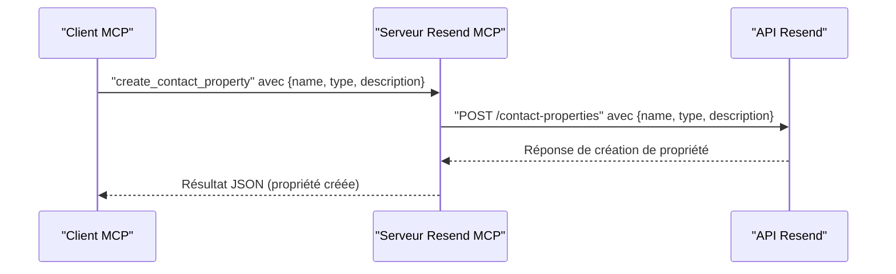

# Outil : create_contact_property

<cite>
**Fichiers référencés dans ce document**
- [README.md](file://README.md)
- [package.json](file://package.json)
- [src/index.ts](file://src/index.ts)
- [skills/resend-expert/SKILL.md](file://skills/resend-expert/SKILL.md)
</cite>

## Sommaire
1. [Introduction](#introduction)
2. [Objectif de l’outil](#objectif-de-loutil)
3. [Paramètres d’entrée](#paramètres-dentrée)
4. [Exemples concrets de création de propriétés](#exemples-concrets-de-création-de-propriétés)
5. [Limites et bonnes pratiques](#limites-et-bonnes-pratiques)
6. [Intégration dans les campagnes personnalisées](#intégration-dans-les-campagnes-personnalisées)
7. [Architecture technique](#architecture-technique)
8. [Conclusion](#conclusion)

## Introduction
L’outil create_contact_property permet de créer de nouvelles propriétés personnalisées pour les contacts dans Resend. Ces propriétés sont des champs de données supplémentaires que vous pouvez associer à vos contacts pour enrichir leurs profils, les segmenter, ou les utiliser dans des campagnes personnalisées. Elles s’intègrent parfaitement avec les audiences, segments, et thèmes de Resend.

## Objectif de l’outil
Créer une nouvelle propriété de contact personnalisée avec un nom et un type de données. Une fois créée, la propriété peut être utilisée pour stocker des informations supplémentaires sur les contacts (par exemple, préférences de contact, données de profil, ou attributs de segmentation).

## Paramètres d’entrée
Voici les paramètres requis pour appeler l’outil create_contact_property :

- name (chaîne de caractères) : Nom unique de la propriété. Doit respecter les règles de nommage décrites ci-après.
- type (chaîne de caractères) : Type de données de la propriété. Valeurs autorisées : string, number, boolean, date.
- description (optionnel) : Description de la propriété pour aider à son utilisation.

**Section sources**
- [src/index.ts](file://src/index.ts#L941-L954)

## Exemples concrets de création de propriétés
Voici quelques cas d’utilisation courants avec des noms de propriétés suggérés :

- Préférences de contact
  - name : “newsletter_opt_in”
  - type : boolean
  - description : “Indique si le contact souhaite recevoir la newsletter”

  - name : “marketing_emails”
  - type : boolean
  - description : “Préférence pour les emails marketing”

  - name : “sms_opt_in”
  - type : boolean
  - description : “Autorisation d’envoi de SMS”

- Données de profil
  - name : “age”
  - type : number
  - description : “Âge du contact”

  - name : “city”
  - type : string
  - description : “Ville du contact”

  - name : “registration_date”
  - type : date
  - description : “Date d’inscription du contact”

- Segmentation avancée
  - name : “subscription_tier”
  - type : string
  - description : “Niveau de souscription (Premium, Standard, Gratuit)”

  - name : “last_purchase_amount”
  - type : number
  - description : “Montant de la dernière commande”

  - name : “last_login”
  - type : date
  - description : “Date du dernier accès au site”

**Section sources**
- [src/index.ts](file://src/index.ts#L941-L954)

## Limites et bonnes pratiques
Limites de nommage
- Le nom de la propriété doit être unique au sein de votre compte Resend.
- Le type de données ne peut être changé après création. Choisissez le type adapté dès la création.

Bonnes pratiques
- Utilisez des noms de propriété clairs et cohérents (camelCase ou snake_case selon votre convention).
- Limitez le nombre de propriétés pour éviter la surcharge de données.
- Documentez chaque propriété avec une description concise.
- Évitez de stocker des données sensibles directement dans les propriétés de contact (respectez la confidentialité).
- Utilisez des valeurs par défaut ou des validations côté application si nécessaire.

**Section sources**
- [src/index.ts](file://src/index.ts#L941-L954)

## Intégration dans les campagnes personnalisées
Une fois les propriétés créées, vous pouvez les utiliser pour :
- Filtrer et segmenter les audiences (par exemple, “contacts ayant subscription_tier = Premium”).
- Personnaliser le contenu des emails (par exemple, inclure le prénom via le champ prédéfini, ou des données enrichies via les propriétés).
- Alimenter des thèmes de souscription (topics) en fonction de préférences (par exemple, “marketing_emails”).
- Créer des segments dynamiques basés sur des dates, nombres ou booléens.

Remarque : Les propriétés personnalisées sont gérées indépendamment des champs prédéfinis (nom, prénom, etc.). Elles ne sont pas automatiquement affichées dans les templates, mais peuvent être utilisées dans les filtres et les segments.

**Section sources**
- [README.md](file://README.md#L112-L118)
- [src/index.ts](file://src/index.ts#L941-L954)

## Architecture technique
L’outil create_contact_property est implémenté comme suit dans le serveur MCP Resend :

- Définition de l’outil : L’outil est décrit dans la liste des outils avec son schéma d’entrée (name, type, description) et ses champs requis (name, type).
- Appel de l’API : Lors de l’exécution, l’outil effectue un appel HTTP POST vers l’API Resend pour créer la propriété de contact.
- Gestion des erreurs : Les erreurs sont capturées et renvoyées sous forme de réponse structurée.

**Diagramme sources**
- [src/index.ts](file://src/index.ts#L941-L954)
- [src/index.ts](file://src/index.ts#L1474-L1514)

**Section sources**
- [src/index.ts](file://src/index.ts#L941-L954)
- [src/index.ts](file://src/index.ts#L1474-L1514)

## Conclusion
L’outil create_contact_property vous permet de structurer et d’enrichir les données de vos contacts Resend. En choisissant judicieusement les types de données et en appliquant des bonnes pratiques de nommage, vous pouvez améliorer la précision de vos segments, la pertinence de vos campagnes, et la qualité de l’expérience client.