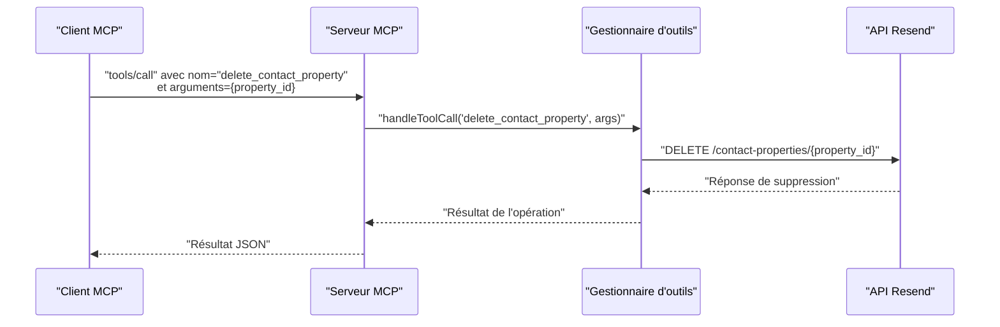
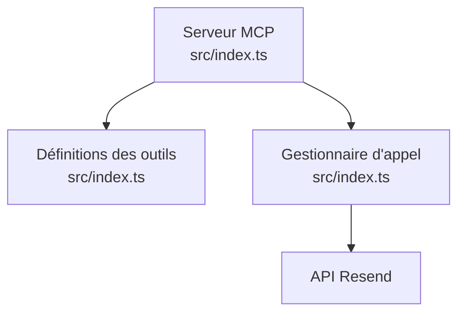

# Outil : delete_contact_property

<cite>
**Fichiers référencés dans ce document**
- [README.md](file://README.md)
- [package.json](file://package.json)
- [src/index.ts](file://src/index.ts)
</cite>

## Sommaire
1. [Introduction](#introduction)
2. [Projet](#projet)
3. [Composants principaux](#composants-principaux)
4. [Aperçu de l’architecture](#aperçu-de-larchitecture)
5. [Analyse détaillée des composants](#analyse-détaillée-des-composants)
6. [Analyse des dépendances](#analyse-des-dépendances)
7. [Considérations sur les performances](#considérations-sur-les-performances)
8. [Guide de dépannage](#guide-de-dépannage)
9. [Conclusion](#conclusion)

## Introduction
Cet outil permet de supprimer une propriété personnalisée de contact existante au sein d’un compte Resend. La suppression d’une propriété personnalisée est un changement de configuration qui affecte la structure des données de contact. Il est donc crucial de comprendre les implications de cette action, notamment sur les données existantes, les règles de validation, et les impacts sur les rapports et analyses.

## Projet
Le serveur MCP expose l’ensemble de l’API Resend sous forme d’outils invocables. L’outil delete_contact_property fait partie de la famille des outils liés aux propriétés de contact, qui inclut également la création, la liste, la lecture, la mise à jour et la suppression de ces propriétés.

- Nom de l’outil : delete_contact_property
- Description : Supprime une propriété personnalisée de contact
- Module : Propriétés de contact
- Schéma d’entrée : Propriété requise
  - property_id : identifiant de la propriété à supprimer

**Section sources**
- [README.md](file://README.md#L112-L118)
- [src/index.ts](file://src/index.ts#L992-L1001)

## Composants principaux
- Définition de l’outil : l’outil est décrit dans la liste des outils MCP avec son nom, sa description et son schéma d’entrée.
- Gestionnaire d’appel : le gestionnaire d’appel effectue l’appel à l’API Resend pour supprimer la propriété personnalisée de contact.

**Section sources**
- [src/index.ts](file://src/index.ts#L992-L1001)
- [src/index.ts](file://src/index.ts#L1508-L1514)

## Aperçu de l’architecture
L’outil delete_contact_property est intégré dans le serveur MCP qui expose les outils via stdin/stdout. Le flux de travail suit le schéma suivant :
- L’appel de l’outil est reçu via la méthode tools/call.
- Le serveur route l’appel vers le gestionnaire spécifique de l’outil.
- Le gestionnaire exécute l’appel à l’API Resend pour supprimer la propriété personnalisée de contact.
- Le résultat de l’opération est retourné au client MCP.

**Diagram sources**
- [src/index.ts](file://src/index.ts#L1536-L1564)
- [src/index.ts](file://src/index.ts#L1508-L1514)

## Analyse détaillée des composants

### Définition de l’outil delete_contact_property
- Nom : delete_contact_property
- Description : Supprime une propriété personnalisée de contact
- Entrées attendues : property_id (identifiant de la propriété)
- Validation : L’identifiant de la propriété est requis

**Section sources**
- [src/index.ts](file://src/index.ts#L992-L1001)

### Implémentation du gestionnaire d’appel
- Le gestionnaire d’appel route l’appel de l’outil vers l’API Resend.
- Pour delete_contact_property, il effectue une requête HTTP DELETE sur l’URL de suppression de la propriété personnalisée de contact.
- En cas d’erreur, le gestionnaire renvoie un message d’erreur structuré.

**Section sources**
- [src/index.ts](file://src/index.ts#L1508-L1522)
- [src/index.ts](file://src/index.ts#L1508-L1514)

### Implications de la suppression sur les données de contact existantes
- Suppression physique : Lorsque vous supprimez une propriété personnalisée, l’API Resend supprime physiquement la définition de la propriété. Cela signifie que toutes les valeurs associées à cette propriété dans les contacts sont retirées de la base de données.
- Impact immédiat : Les contacts ne contiennent plus de valeur pour cette propriété. Si des rapports ou analyses se basaient sur cette propriété, ils seront affectés.
- Avertissement : Avant de supprimer, il est recommandé de vérifier si des rapports, des segments, ou des formulaires de saisie dépendent de cette propriété.

**Section sources**
- [README.md](file://README.md#L112-L118)

### Règles de validation
- Identifiant requis : L’identifiant de la propriété est obligatoire. Une erreur sera retournée si cet identifiant est manquant.
- Existence de la propriété : L’API peut retourner une erreur si la propriété n’existe pas.
- Permissions : L’utilisateur doit disposer des autorisations nécessaires pour effectuer la suppression.

**Section sources**
- [src/index.ts](file://src/index.ts#L992-L1001)

### Précautions à prendre avant la suppression
- Sauvegarde des données : Exportez les données de contact pour conserver une copie avant la suppression.
- Vérification des dépendances : Vérifiez si des segments, des rapports, ou des formulaires de saisie utilisent cette propriété.
- Communication interne : Informez les équipes concernées (marketing, développement, analyse) de la suppression programmée.

**Section sources**
- [README.md](file://README.md#L112-L118)

### Exemples de suppression sécurisée
- Étape 1 : Identifier la propriété à supprimer en consultant la liste des propriétés de contact.
- Étape 2 : Exporter les données de contact pour sauvegarder les valeurs de la propriété.
- Étape 3 : Mettre à jour les segments et rapports pour éviter toute dépendance à la propriété supprimée.
- Étape 4 : Effectuer la suppression de la propriété personnalisée.
- Étape 5 : Valider que les contacts n’ont plus de valeur pour cette propriété.

**Section sources**
- [src/index.ts](file://src/index.ts#L992-L1001)

### Nettoyage des données associées
- Nettoyage des contacts : Après suppression de la propriété, les contacts ne contiennent plus de valeur pour cette propriété. Aucun nettoyage supplémentaire n’est nécessaire côté serveur, car la suppression est physique.
- Mise à jour des rapports : Mettez à jour les rapports pour ne plus s’appuyer sur cette propriété.
- Mise à jour des formulaires de saisie : Retirez les champs liés à cette propriété des formulaires.

**Section sources**
- [README.md](file://README.md#L112-L118)

### Différences entre suppression physique et désactivation logique
- Suppression physique : La propriété est supprimée de la base de données. Elle n’existe plus pour aucun contact. Cette opération est irréversible sans restauration depuis une sauvegarde.
- Désactivation logique : Certaines plateformes offrent une option de désactivation logique, permettant de marquer la propriété comme inactive sans la supprimer. Cela permet de conserver les données tout en empêchant leur utilisation. Cependant, cette fonctionnalité n’est pas documentée pour l’outil delete_contact_property dans ce dépôt.

**Section sources**
- [README.md](file://README.md#L112-L118)

### Impact sur les rapports et analyses
- Disparition des données : Les rapports et analyses qui s’appuyaient sur cette propriété seront affectés car les données associées auront été supprimées.
- Mise à jour des rapports : Mettez à jour vos rapports pour ne plus inclure cette propriété.
- Analyse des impacts : Effectuez une analyse des impacts sur les segments et les campagnes qui utilisaient cette propriété.

**Section sources**
- [README.md](file://README.md#L112-L118)

## Analyse des dépendances
- Dépendances externes : Le serveur utilise la bibliothèque Resend pour communiquer avec l’API Resend.
- Dépendances internes : L’outil delete_contact_property dépend de la couche de gestion des outils MCP et de la couche d’appel à l’API Resend.

**Diagram sources**
- [src/index.ts](file://src/index.ts#L1528-L1565)
- [src/index.ts](file://src/index.ts#L1008-L1522)

**Section sources**
- [package.json](file://package.json#L32-L35)
- [src/index.ts](file://src/index.ts#L1008-L1522)

## Considérations sur les performances
- L’appel à l’API Resend pour supprimer une propriété personnalisée est une opération simple et rapide.
- Aucune opération de traitement de données importante n’est impliquée côté serveur.

## Guide de dépannage
- Erreur d’authentification : Vérifiez que la clé API Resend est correctement configurée.
- Erreur de validation : Assurez-vous que l’identifiant de la propriété est fourni.
- Erreur de ressource introuvable : Vérifiez que la propriété existe avant de tenter sa suppression.
- Erreur de taux limite : Respectez les limites de taux d’appels de l’API Resend.

**Section sources**
- [README.md](file://README.md#L528-L549)
- [src/index.ts](file://src/index.ts#L1519-L1522)

## Conclusion
L’outil delete_contact_property permet de supprimer de manière physique une propriété personnalisée de contact. Cette suppression retire la définition de la propriété ainsi que toutes ses valeurs associées des contacts. Pour minimiser les impacts, il est essentiel de sauvegarder les données, de mettre à jour les rapports et formulaires, et de communiquer les changements. La suppression physique est irréversible sans restauration depuis une sauvegarde.