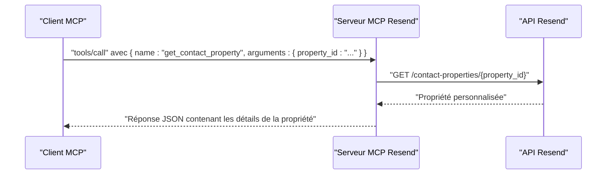
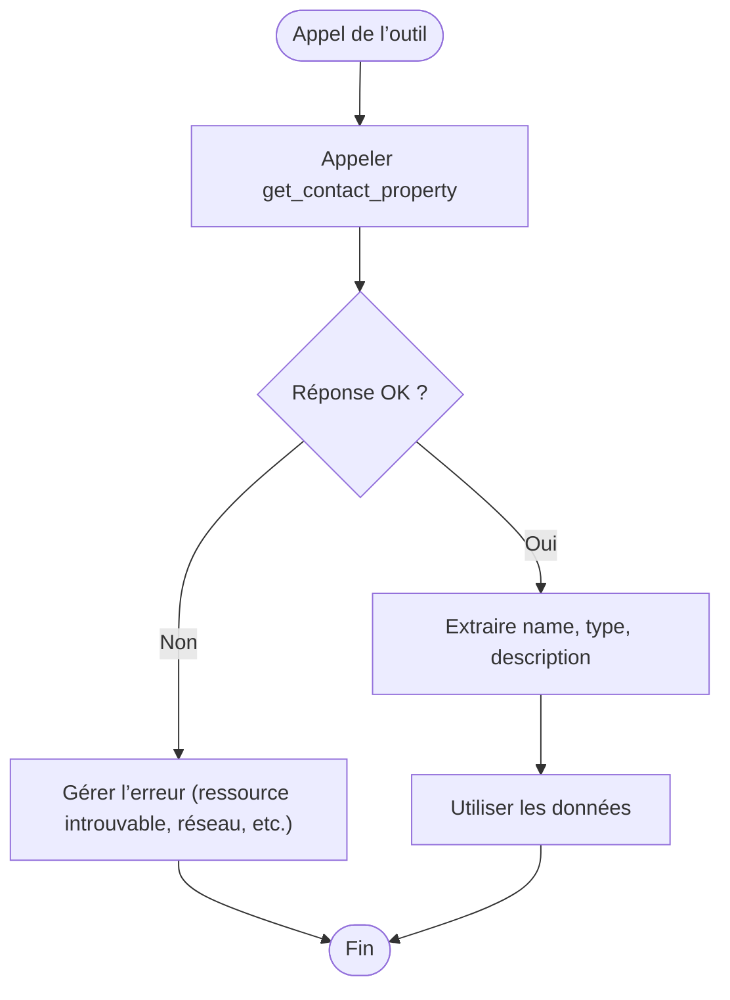
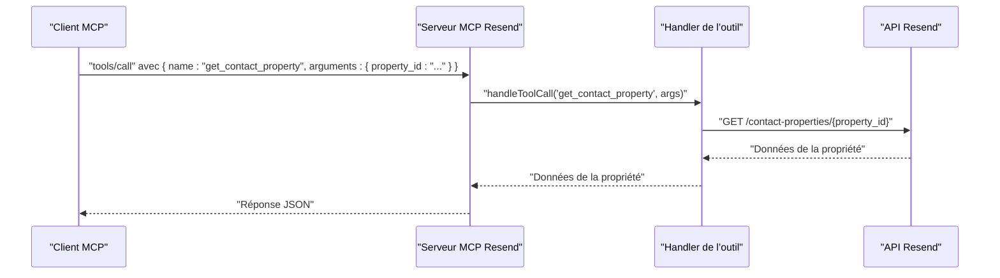

# Outil : get_contact_property

<cite>
**Fichiers référencés dans ce document**
- [README.md](file://README.md)
- [package.json](file://package.json)
- [src/index.ts](file://src/index.ts)
</cite>

## Sommaire
1. [Introduction](#introduction)
2. [Objectif de l’outil](#objectif-de-loutil)
3. [Paramètres d’entrée](#paramètres-dentrée)
4. [Structure de la réponse](#structure-de-la-réponse)
5. [Cas d’utilisation courants](#cas-dutilisation-courants)
6. [Gestion des erreurs](#gestion-des-erreurs)
7. [Exemples de flux](#exemples-de-flux)
8. [Architecture et implémentation](#architecture-et-implémentation)
9. [Conclusion](#conclusion)

## Introduction
Cet outil permet de récupérer les détails spécifiques d’une propriété personnalisée de contact à partir de son identifiant. Il fait partie de l’ensemble des outils de gestion des propriétés de contact fournis par le serveur MCP Resend, qui expose l’intégralité de l’API Resend sous forme d’outils invocables.

## Objectif de l’outil
Récupérer les informations détaillées d’une propriété personnalisée de contact identifiée par son identifiant technique. Cela inclut notamment le nom, le type, la description, et toute autre métadonnée associée à cette propriété.

## Paramètres d’entrée
- property_id (chaîne de caractères, requis)
  - Identifiant unique de la propriété personnalisée de contact à récupérer.

**Section sources**
- [src/index.ts](file://src/index.ts#L967-L977)

## Structure de la réponse
La réponse est un objet JSON contenant les détails de la propriété personnalisée de contact. Elle inclut au minimum :
- id (chaîne de caractères)
  - Identifiant technique de la propriété.
- name (chaîne de caractères)
  - Nom de la propriété.
- type (chaîne de caractères)
  - Type de la propriété (par exemple : chaîne de caractères, nombre, booléen, date).
- description (chaîne de caractères, optionnel)
  - Description de la propriété si elle a été définie.

**Section sources**
- [src/index.ts](file://src/index.ts#L1493-L1496)

## Cas d’utilisation courants
- Validation de données : Vérifier qu’une propriété personnalisée existe avant de l’utiliser dans des opérations ultérieures (ajout de contacts, mises à jour, filtres).
- Affichage dans des interfaces utilisateur : Utiliser les informations de la propriété pour présenter des formulaires dynamiques ou des colonnes de tableaux personnalisés.
- Intégration dans des workflows automatisés : S’assurer que les données des contacts sont structurées selon les types attendus par les outils tiers.

## Gestion des erreurs
Lorsque la propriété n’existe pas, le serveur retourne une erreur indiquant que la ressource est introuvable. Le client doit gérer ce cas en vérifiant le code d’état de la réponse et en affichant un message approprié à l’utilisateur ou en redirigeant vers un traitement alternatif.

Exemples de scénarios d’erreur :
- Propriété inexistante : La requête échoue avec un code d’erreur indiquant que la ressource demandée n’existe pas.
- Erreur réseau ou serveur : La requête ne peut être traitée en raison d’un problème temporaire.

**Section sources**
- [src/index.ts](file://src/index.ts#L1519-L1522)

## Exemples de flux
### Récupération d’une propriété personnalisée
- Étape 1 : Identifier l’identifiant de la propriété personnalisée (par exemple, depuis la liste des propriétés).
- Étape 2 : Appeler l’outil get_contact_property avec le paramètre property_id.
- Étape 3 : Traiter la réponse pour extraire name, type, description, etc.
- Étape 4 : Utiliser ces informations pour valider des données, afficher des interfaces ou alimenter des workflows.

**Diagram sources**
- [src/index.ts](file://src/index.ts#L1493-L1496)

### Flux de gestion d’erreur
- Étape 1 : Appeler l’outil get_contact_property.
- Étape 2 : Si la réponse contient une erreur, interpréter le code d’erreur.
- Étape 3 : Informer l’utilisateur ou rediriger vers un traitement alternatif (par exemple, créer la propriété si elle n’existe pas).

**Diagram sources**
- [src/index.ts](file://src/index.ts#L1519-L1522)

## Architecture et implémentation
L’outil est implémenté comme un outil MCP dont la définition figure dans la liste des outils disponibles. L’appel de l’outil déclenche un handler qui effectue une requête HTTP vers l’API Resend pour récupérer les détails de la propriété personnalisée.

- Définition de l’outil : L’outil est décrit dans la liste des outils avec son schéma d’entrée (property_id requis).
- Handler de l’outil : Le handler exécute une requête GET sur l’URL de l’API Resend correspondante à la propriété personnalisée.
- Réponse : Le serveur renvoie la réponse de l’API Resend sous forme de texte JSON.

**Diagram sources**
- [src/index.ts](file://src/index.ts#L967-L977)
- [src/index.ts](file://src/index.ts#L1493-L1496)

**Section sources**
- [src/index.ts](file://src/index.ts#L967-L977)
- [src/index.ts](file://src/index.ts#L1493-L1496)

## Conclusion
L’outil get_contact_property permet de récupérer facilement les détails d’une propriété personnalisée de contact à partir de son identifiant. En intégrant ce comportement dans des workflows automatisés, des interfaces utilisateur ou des processus de validation de données, vous pouvez garantir une meilleure cohérence et fiabilité de vos opérations de gestion des contacts.