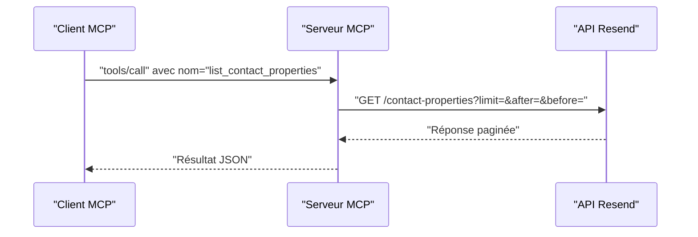

# Outil : list_contact_properties

<cite>
**Fichiers référencés dans ce document**
- [README.md](file://README.md)
- [package.json](file://package.json)
- [src/index.ts](file://src/index.ts)
</cite>

## Sommaire
1. [Introduction](#introduction)
2. [Objectif de l’outil](#objectif-de-loutil)
3. [Paramètres de l’outil](#paramètres-de-loutil)
4. [Structure de la réponse](#structure-de-la-réponse)
5. [Pagination](#pagination)
6. [Exemples d’utilisation](#exemples-dutilisation)
7. [Cas d’usage avancés](#cas-dusage-avancés)
8. [Architecture technique](#architecture-technique)
9. [Conclusion](#conclusion)

## Introduction
Cet outil permet de récupérer toutes les propriétés personnalisées de contact disponibles dans un compte Resend. Il fait partie de la gamme d’outils de gestion des contacts et des audiences, et s’intègre parfaitement dans des flux de personnalisation, de validation de données, et de génération de formulaires dynamiques.

## Objectif de l’outil
- Récupérer la liste complète des propriétés personnalisées de contact configurées dans le compte Resend.
- Offrir un accès paginé aux propriétés pour gérer efficacement de grands volumes de données.
- Fournir un point d’entrée pour alimenter des formulaires de saisie dynamiques, valider les données entrantes, ou documenter les champs disponibles pour les outils de personnalisation.

**Section sources**
- [README.md](file://README.md#L112-L118)
- [src/index.ts](file://src/index.ts#L955-L966)

## Paramètres de l’outil
L’outil ne prend aucun paramètre obligatoire. Ses seuls paramètres optionnels sont ceux de pagination.

- Aucun paramètre requis
- Paramètres optionnels (tous optionnels) :
  - limit : nombre maximal d’éléments à retourner
  - after : curseur pour obtenir les éléments suivants
  - before : curseur pour obtenir les éléments précédents

**Section sources**
- [src/index.ts](file://src/index.ts#L955-L966)

## Structure de la réponse
La réponse est au format JSON. Elle contient la liste des propriétés personnalisées de contact, chacune décrite par ses attributs fondamentaux. Le format de base suit le schéma de pagination utilisé par l’API Resend.

- Contenu principal : tableau de propriétés
- Chaque propriété personnalisée inclut au minimum :
  - id : identifiant unique de la propriété
  - name : nom de la propriété
  - type : type de la propriété (par exemple : chaîne de caractères, nombre, booléen, date)
  - description : description facultative de la propriété
  - created_at : horodatage de création
  - updated_at : horodatage de dernière mise à jour

Remarque : le schéma ci-dessus est basé sur le comportement typique des ressources de type “contact properties” dans l’écosystème Resend. Pour des détails précis, consultez la documentation officielle de l’API Resend.

**Section sources**
- [src/index.ts](file://src/index.ts#L1484-L1491)

## Pagination
L’outil supporte la pagination standardisée de l’API Resend. Vous pouvez contrôler la quantité de résultats retournés et naviguer entre les pages à l’aide de curseurs.

- limit : fixe le nombre d’éléments retournés (par défaut, l’API impose des limites)
- after : curseur pour obtenir les éléments suivants
- before : curseur pour obtenir les éléments précédents

Le serveur MCP construit automatiquement la requête avec ces paramètres et appelle l’API Resend pour récupérer les données paginées.

**Section sources**
- [src/index.ts](file://src/index.ts#L1484-L1491)

## Exemples d’utilisation
Voici quelques cas d’usage courants pour lister les propriétés personnalisées de contact.

- Obtenir la liste complète des propriétés personnalisées
  - Utilisez un appel sans paramètre supplémentaire pour récupérer toutes les propriétés.
  - Utile pour documenter les champs disponibles ou alimenter un formulaire de sélection.

- Limiter le nombre de résultats
  - Ajoutez le paramètre limit pour limiter le nombre de propriétés retournées.
  - Utile pour les interfaces où l’espace est restreint.

- Naviguer entre les pages
  - Utilisez after et before pour parcourir les résultats paginés.
  - Utile lorsque le nombre de propriétés est important.

- Intégration dans un workflow de validation
  - Utilisez la liste pour valider que les données envoyées correspondent aux types attendus (chaîne, nombre, booléen, date).
  - Permet de détecter les erreurs de format avant traitement.

- Génération de formulaires dynamiques
  - Utilisez la liste pour générer automatiquement des champs de formulaire adaptés au type de chaque propriété.
  - Facilite l’ajout de contraintes de saisie (ex. : format de date, valeurs booléennes).

**Section sources**
- [src/index.ts](file://src/index.ts#L955-L966)
- [src/index.ts](file://src/index.ts#L1484-L1491)

## Cas d’usage avancés
- Personnalisation de l’expérience utilisateur
  - Afficher dynamiquement les champs de formulaire en fonction des propriétés personnalisées actives.
  - Adapter les validations en temps réel selon le type de chaque champ.

- Documentation automatisée
  - Générer automatiquement la documentation des champs de contact personnalisés à partir de la liste des propriétés.
  - Mettre à jour la documentation lors des modifications de configuration.

- Intégration avec des outils de segmentation
  - Utiliser les propriétés pour créer des filtres de segmentation ou des règles de ciblage.
  - Permettre des campagnes plus ciblées en s’appuyant sur les données disponibles.

- Audit et conformité
  - Surveiller les changements de propriétés au fil du temps (création, modification, suppression).
  - Garantir la traçabilité des données personnelles dans le respect des réglementations.

[Ce paragraphe fournit des conseils généraux d’utilisation basés sur le rôle de l’outil. Aucune source spécifique n’est ajoutée car il ne s’agit pas d’une analyse de code spécifique.]

## Architecture technique
L’outil list_contact_properties est implémenté comme un outil MCP. Voici comment il fonctionne dans l’architecture globale du serveur.

- Définition de l’outil
  - L’outil est décrit dans la liste des outils MCP avec son nom, sa description, et son schéma d’entrée.
  - Le schéma d’entrée ne comporte que les paramètres de pagination.

- Traitement de l’appel
  - Lorsqu’un client MCP appelle l’outil, le serveur construit une requête HTTP vers l’API Resend avec les paramètres de pagination.
  - La réponse de l’API Resend est renvoyée telle quelle au client MCP.

- Intégration
  - L’outil fait partie de la section “Contact Properties” de l’ensemble des outils MCP.
  - Il est disponible via la méthode tools/call avec le nom de l’outil.

**Diagram sources**
- [src/index.ts](file://src/index.ts#L955-L966)
- [src/index.ts](file://src/index.ts#L1484-L1491)

**Section sources**
- [src/index.ts](file://src/index.ts#L955-L966)
- [src/index.ts](file://src/index.ts#L1484-L1491)

## Conclusion
L’outil list_contact_properties permet de récupérer de manière paginée toutes les propriétés personnalisées de contact disponibles dans un compte Resend. Grâce à ses paramètres simples, il s’intègre facilement dans des workflows de personnalisation, de validation de données, et de génération de formulaires dynamiques. Sa mise en œuvre dans le serveur MCP garantit une intégration fluide avec des clients compatibles.

[Ce paragraphe est une synthèse. Aucune source spécifique n’est ajoutée.]