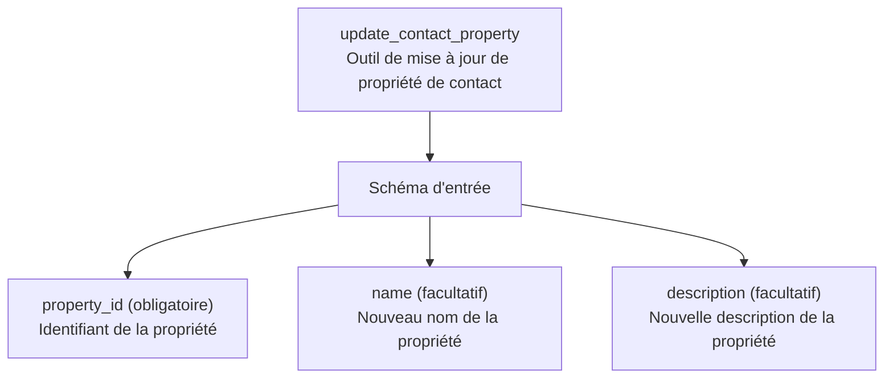
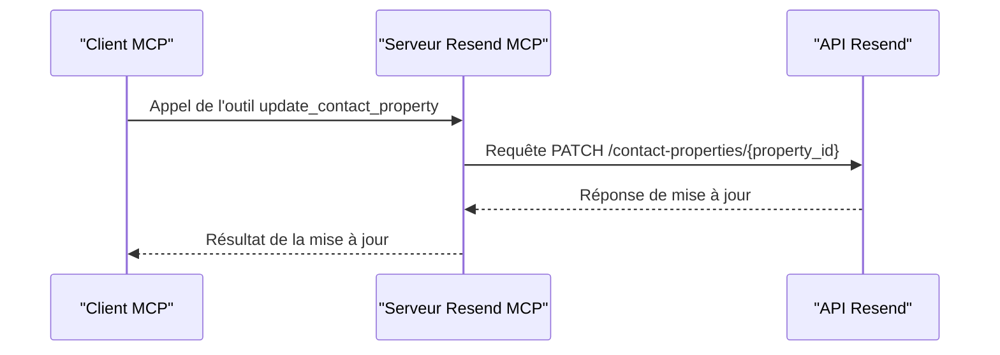

# Outil : update_contact_property

<cite>
**Fichiers référencés dans ce document**
- [README.md](file://README.md)
- [package.json](file://package.json)
- [src/index.ts](file://src/index.ts)
</cite>

## Sommaire
1. [Introduction](#introduction)
2. [Objectif de l’outil](#objectif-de-loutil)
3. [Champs modifiables](#champs-modifiables)
4. [Exemples d’utilisation](#exemples-dutilisation)
5. [Implications des modifications](#implications-des-modifications)
6. [Gestion des conversions de données](#gestion-des-conversions-de-données)
7. [Architecture technique](#architecture-technique)
8. [Conclusion](#conclusion)

## Introduction
Cet outil permet de modifier les attributs d’une propriété personnalisée de contact existante au sein d’un compte Resend. Il fait partie de l’ensemble des outils de gestion des propriétés de contact, qui incluent la création, la liste, la consultation, la mise à jour et la suppression de ces propriétés.

## Objectif de l’outil
L’outil update_contact_property permet de mettre à jour les attributs suivants d’une propriété personnalisée de contact :
- Le nom de la propriété
- La description de la propriété

Il est important de noter que l’outil ne permet pas de modifier le type de données d’une propriété existante. Pour cela, il faut créer une nouvelle propriété avec le nouveau type et migrer les données si nécessaire.

## Champs modifiables
Voici les champs disponibles pour la mise à jour d’une propriété de contact :

- property_id (obligatoire)
  - Description : Identifiant unique de la propriété de contact à mettre à jour
  - Type : Chaîne de caractères

- name (facultatif)
  - Description : Nouveau nom de la propriété
  - Type : Chaîne de caractères

- description (facultatif)
  - Description : Nouvelle description de la propriété
  - Type : Chaîne de caractères

Remarque importante : Le type de données d’une propriété de contact ne peut pas être modifié via cet outil. Si vous souhaitez changer le type de données d’une propriété existante, vous devez créer une nouvelle propriété avec le nouveau type de données et migrer manuellement les données existantes.

## Exemples d’utilisation
Voici quelques scénarios courants d’utilisation de l’outil update_contact_property :

### Exemple 1 : Modifier le nom d’une propriété
- Utilité : Renommer une propriété pour améliorer la lisibilité ou la cohérence
- Cas d’usage : Vous avez une propriété nommée "age" et vous souhaitez la renommer en "année_de_naissance"
- Implication : Aucune donnée existante n’est affectée, mais tous les usages futurs de cette propriété doivent utiliser le nouveau nom

### Exemple 2 : Mettre à jour la description d’une propriété
- Utilité : Améliorer la documentation interne ou fournir plus de contexte
- Cas d’usage : Ajouter des précisions sur le format attendu ou l’origine des données
- Implication : Aucune donnée existante n’est affectée

### Exemple 3 : Modifier à la fois le nom et la description
- Utilité : Réorganiser la structure de vos métadonnées de contact
- Cas d’usage : Renommer et enrichir la description d’une propriété existante
- Implication : Aucune donnée existante n’est affectée

## Implications des modifications
Lorsque vous mettez à jour une propriété de contact, voici les implications à prendre en compte :

### Impact immédiat
- Aucune donnée de contact existante n’est modifiée
- Seuls les attributs de la propriété (nom et description) sont mis à jour
- Les contacts qui utilisent cette propriété conservent leurs valeurs actuelles

### Impact à long terme
- Tous les outils et scripts qui font référence à la propriété doivent être mis à jour pour utiliser le nouveau nom
- Les rapports et analyses basés sur cette propriété doivent être mis à jour
- Les formulaires et interfaces qui affichent cette propriété doivent refléter le nouveau nom

### Gestion des conflits
- Si vous renommez une propriété, veillez à ce qu’aucun conflit de nommage ne se produise avec d’autres propriétés
- Vérifiez que les noms choisis respectent les contraintes de format définies par Resend

## Gestion des conversions de données
L’outil update_contact_property ne permet pas de modifier le type de données d’une propriété. Voici comment gérer les conversions de données lorsque vous changez le type de données d’une propriété existante :

### Scénario : Passer d’un type string à number
1. Créer une nouvelle propriété de type number
2. Migrer les données existantes en convertissant les valeurs de string vers number
3. Mettre à jour tous les outils et scripts pour utiliser la nouvelle propriété
4. Supprimer l’ancienne propriété

### Scénario : Passer d’un type boolean à string
1. Créer une nouvelle propriété de type string
2. Migrer les données existantes en convertissant les valeurs de boolean vers string
3. Mettre à jour tous les outils et scripts pour utiliser la nouvelle propriété
4. Supprimer l’ancienne propriété

### Scénario : Passer d’un type date à string
1. Créer une nouvelle propriété de type string
2. Migrer les données existantes en formatant les dates selon un format spécifique
3. Mettre à jour tous les outils et scripts pour utiliser la nouvelle propriété
4. Supprimer l’ancienne propriété

## Architecture technique
L’outil update_contact_property est implémenté comme suit dans le serveur MCP Resend :

### Définition de l’outil
L’outil est défini dans la liste des outils disponibles avec son schéma d’entrée JSON :

**Diagramme sources**
- [src/index.ts](file://src/index.ts#L979-L989)

### Implémentation de la logique
L’implémentation de l’outil utilise un appel HTTP PATCH vers l’API Resend pour mettre à jour la propriété de contact :

**Diagramme sources**
- [src/index.ts](file://src/index.ts#L1498-L1506)

### Contraintes de validation
Le schéma d’entrée de l’outil impose les contraintes suivantes :
- property_id est obligatoire
- name et description sont optionnels
- Le type de données de la propriété ne peut pas être modifié

**Section sources**
- [src/index.ts](file://src/index.ts#L979-L989)

## Conclusion
L’outil update_contact_property offre une manière simple et sécurisée de mettre à jour les attributs d’une propriété de contact existante. Grâce à sa conception basée sur des schémas d’entrée stricts, il garantit la cohérence des données tout en maintenant la flexibilité nécessaire pour gérer les métadonnées de vos contacts.

Pour les modifications de type de données, il est recommandé de créer de nouvelles propriétés et de migrer les données de manière planifiée, en veillant à maintenir la traçabilité de toutes les modifications effectuées.