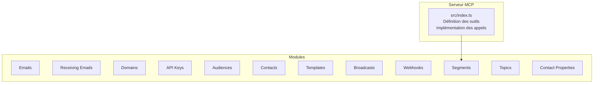
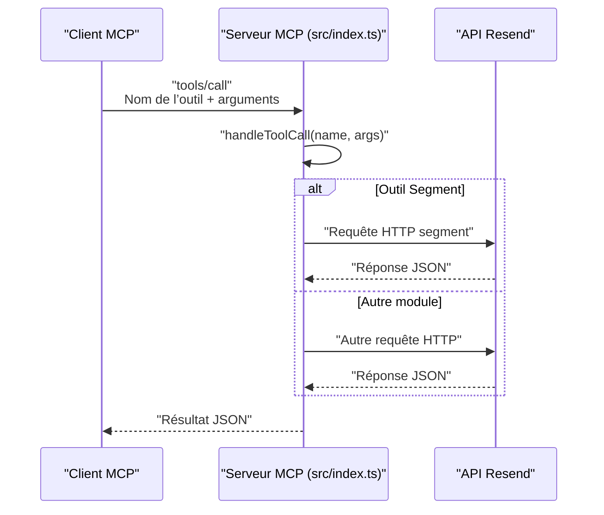
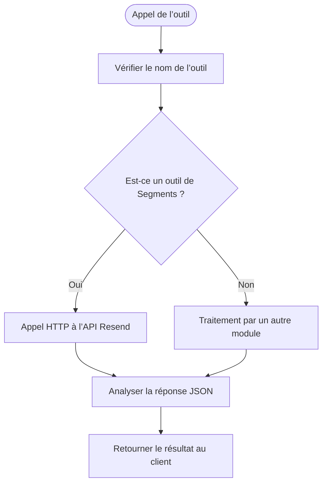

# Module Segments

<cite>
**Fichiers référencés dans ce document**
- [README.md](file://README.md)
- [package.json](file://package.json)
- [src/index.ts](file://src/index.ts)
</cite>

## Sommaire
1. [Introduction](#introduction)
2. [Structure du projet](#structure-du-projet)
3. [Composants principaux](#composants-principaux)
4. [Aperçu de l’architecture](#aperçu-de-larchitecture)
5. [Analyse détaillée des composants](#analyse-détaillée-des-composants)
6. [Analyse des dépendances](#analyse-des-dépendances)
7. [Considérations sur les performances](#considérations-sur-les-performances)
8. [Guide de dépannage](#guide-de-dépannage)
9. [Conclusion](#conclusion)
10. [Annexes](#annexes)

## Introduction
Le module Segments de l’API Resend permet de gérer des sous-ensembles de contacts au sein d’une audience, afin de cibler précisément les envois de courriels. Ce document documente les quatre outils associés : create_segment, list_segments, get_segment, delete_segment. Il explique comment créer des segments basés sur des critères spécifiques, comment les lister, les récupérer, les supprimer, ainsi que leur rôle dans la gestion des audiences et l’exécution de campagnes ciblées. Des bonnes pratiques sont également fournies pour structurer ses segments et les utiliser efficacement dans des campagnes.

## Structure du projet
Le projet est un serveur MCP qui expose l’intégralité de l’API Resend sous forme d’outils invocables. Le module Segments fait partie de l’ensemble des 12 modules couverts, chacun avec ses outils spécifiques.

**Diagramme sources**
- [src/index.ts](file://src/index.ts#L42-L1002)

**Section sources**
- [README.md](file://README.md#L1-L721)
- [package.json](file://package.json#L1-L49)

## Composants principaux
Le module Segments comprend quatre outils :
- create_segment : crée un nouveau segment au sein d’une audience
- list_segments : liste tous les segments
- get_segment : récupère les détails d’un segment spécifique
- delete_segment : supprime un segment

Ces outils sont définis dans la liste des outils du serveur MCP et implémentent des appels directs à l’API Resend via des requêtes HTTP.

**Section sources**
- [src/index.ts](file://src/index.ts#L832-L879)

## Aperçu de l’architecture
Le serveur MCP expose les outils comme des méthodes invocables. Pour le module Segments, chaque outil correspond à un appel HTTP vers l’API Resend. Le schéma suivant montre le flux de traitement pour un appel d’outil de segmentation.

**Diagramme sources**
- [src/index.ts](file://src/index.ts#L1008-L1522)

## Analyse détaillée des composants

### Outils de segmentation

#### create_segment
- Rôle : créer un segment au sein d’une audience
- Entrées attendues (selon le schéma de l’outil) :
  - name : nom du segment
  - audience_id : identifiant de l’audience
  - filter : objet contenant les conditions de filtrage (structure non spécifiée ici, mais fournie par le schéma de l’outil)
- Sortie : réponse de l’API Resend contenant les détails du segment créé
- Implémentation : appel HTTP POST à l’API Resend pour créer le segment

**Section sources**
- [src/index.ts](file://src/index.ts#L832-L845)

#### list_segments
- Rôle : lister tous les segments
- Entrées attendues (selon le schéma de l’outil) :
  - limit : nombre maximum d’éléments à retourner
  - after : curseur pour pagination avant
  - before : curseur pour pagination après
- Sortie : réponse de l’API Resend contenant la liste des segments
- Implémentation : appel HTTP GET à l’API Resend avec paramètres de pagination

**Section sources**
- [src/index.ts](file://src/index.ts#L846-L857)

#### get_segment
- Rôle : récupérer les détails d’un segment spécifique
- Entrées attendues (selon le schéma de l’outil) :
  - segment_id : identifiant du segment
- Sortie : réponse de l’API Resend contenant les détails du segment
- Implémentation : appel HTTP GET à l’API Resend pour obtenir le segment

**Section sources**
- [src/index.ts](file://src/index.ts#L858-L868)

#### delete_segment
- Rôle : supprimer un segment
- Entrées attendues (selon le schéma de l’outil) :
  - segment_id : identifiant du segment à supprimer
- Sortie : réponse de l’API Resend indiquant la suppression réussie
- Implémentation : appel HTTP DELETE à l’API Resend pour supprimer le segment

**Section sources**
- [src/index.ts](file://src/index.ts#L869-L879)

### Flux de traitement des appels d’outils
Le serveur MCP traite les appels d’outils via la fonction handleToolCall. Pour le module Segments, cela se traduit par des appels HTTP directs à l’API Resend.

**Diagramme sources**
- [src/index.ts](file://src/index.ts#L1008-L1522)

**Section sources**
- [src/index.ts](file://src/index.ts#L1400-L1431)

## Analyse des dépendances
- Dépendance principale : le client Resend est utilisé pour exécuter certains outils (par exemple, les opérations de type emails, audiences, contacts, etc.). Pour les outils de segmentation, le serveur effectue directement des appels HTTP car ils ne sont pas couverts par le SDK Resend dans cette implémentation.
- Environnement : le serveur lit la clé API depuis les variables d’environnement et s’assure qu’elle est présente avant de démarrer.

**Section sources**
- [src/index.ts](file://src/index.ts#L1-L7)
- [src/index.ts](file://src/index.ts#L1571-L1577)

## Bonnes pratiques pour structurer les segments et les utiliser dans les campagnes ciblées
- Nommer les segments de manière descriptive et cohérente (ex. : “Abonnés Premium”, “Clients de moins de 30 ans”).
- Utiliser des filtres pertinents pour limiter le volume de contacts et améliorer la pertinence des envois.
- Éviter les segments trop similaires pour réduire la duplication de contacts.
- Intégrer les segments dans des campagnes diffusées via des outils de diffusion (broadcasts) en utilisant le segment_id comme cible.
- Mettre à jour régulièrement les segments en fonction des données des contacts (ajout/suppression de contacts, modifications de propriétés).
- Tester les segments avant de les utiliser dans des envois massifs.

[Ce paragraphe fournit des conseils généraux sans analyser de fichiers spécifiques]

## Guide de dépannage
- Erreur d’authentification : si la clé API n’est pas définie, le serveur affiche un message d’erreur et s’arrête. Vérifiez que la variable RESEND_API_KEY est présente dans votre environnement.
- Erreur d’outil inconnu : si le nom de l’outil est incorrect, le serveur renvoie une erreur. Utilisez tools/list pour obtenir la liste complète des outils disponibles.
- Erreurs réseau ou API : les appels HTTP peuvent échouer en raison de problèmes réseau ou de limitations de l’API Resend. Le serveur renvoie un message d’erreur détaillé.

**Section sources**
- [src/index.ts](file://src/index.ts#L1571-L1577)
- [src/index.ts](file://src/index.ts#L1516-L1522)

## Conclusion
Le module Segments permet de structurer ses audiences en segments ciblés, facilitant des campagnes plus pertinentes. Grâce aux quatre outils documentés, il est possible de créer, lister, récupérer et supprimer des segments. En adoptant des bonnes pratiques de structuration et en les intégrant dans des campagnes ciblées, vous pouvez améliorer l’efficacité de vos envois et la satisfaction de vos abonnés.

[Ce paragraphe résume sans analyser de fichiers spécifiques]

## Annexes
- Références aux outils de segmentation dans la documentation du projet : consultez la section Modules > Segments pour les descriptions et exemples d’utilisation.

**Section sources**
- [README.md](file://README.md#L99-L104)